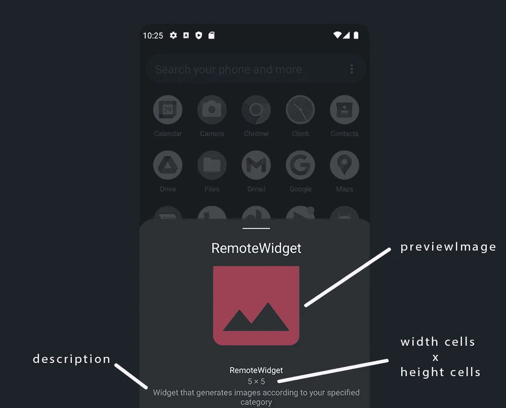
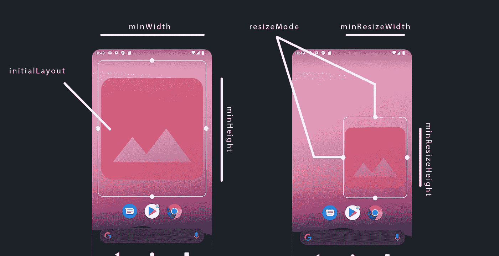
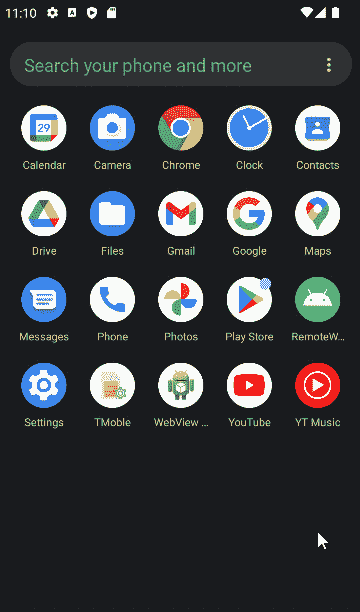
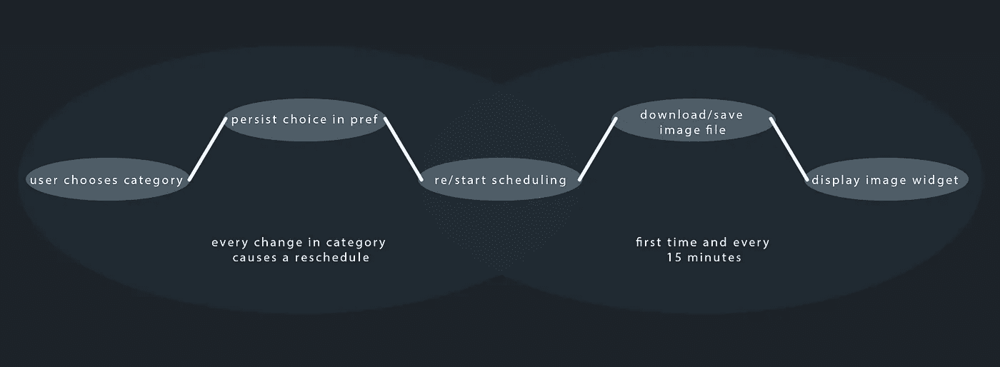
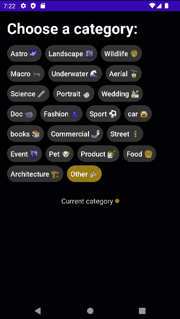

# 使用工作管理器 API 在 Glance 小部件中安排图像显示

> 原文：<https://itnext.io/schedule-image-displaying-in-glance-widget-with-work-manager-api-cc474ed8571c?source=collection_archive---------1----------------------->


**Glance** 加速创建不同表面的应用小部件，如主屏幕、键盘等。因为它提供了一些 API 来帮助我们构建 **Jetpack Compose 风格的小部件。**

# 先决条件🤔

在阅读本文之前，您至少需要熟悉一些概念。

*   **喷气背包作曲**
*   **首选项数据存储**
*   **改装**
*   **视图模型**
*   **工作经理**

# 项目设置😃

现在让我们开始编码，创建一个新项目，并在 **build.gradle** (模块)中添加以下依赖项

> 旁注:源代码可以在文章末尾找到。

在我们忘记之前，在 AndroidManifest.xml 文件中添加 internet 权限。

```
<uses-permission android:name="android.permission.INTERNET" />
```

首先，我们将创建一个简单的小部件，看看我们如何构建一个，然后我们将它与 **WorkManager** 连接，开始调度。

要创建一个小部件，我们需要做以下工作:

*   创建一个继承自 **GlanceAppWidget** 的类
*   创建一个从**GlanceAppWidgetReceiver**继承的接收器类
*   注册我们的接收器并提供我们的部件元数据。

一旦你实现了 **GlanceAppWidget** ，你就需要覆盖一个叫做 **Content** 的可组合函数，在这里你可以编写你的小部件 UI 看起来是什么样子。这里我使用 Image composable 来显示来自 drawable 资源的图像。值得一提的是，我们在**内容** composable 中使用的大多数与 Jetpack compose 相关的代码都是从 **androidx.glance** 中导入的。你还会注意到，我们为可合成的图像使用了一个 **ImageProvider** ，而不是普通可合成函数中的 painter(**painter resource**)以及修改器，这里我们使用了一个 **GlanceModifier** 而不是普通的合成修改器。

创建小部件接收器后，您必须通过实现属性 **glanceAppWidget** 将接收器连接到小部件。

```
<receiver
    android:name=".extra.RemoteWidgetReceiver"
    android:enabled="true"
    android:exported="false">

    <intent-filter>
        <action android:name="android.appwidget.action.APPWIDGET_UPDATE" />
    </intent-filter>

    <meta-data
        android:name="android.appwidget.provider"
        android:resource="@xml/widget_provider" />

</receiver>
```

最后，在您的 AndoirdManifest.xml 文件中，在您的**应用程序**标签中注册您的接收器，并为小部件添加意图过滤器和元数据。

虽然我们的小部件是用 compose 编写的，但是我们需要创建一些 XML 文件，比如小部件最初的样子以及与小部件相关的一些属性和配置。所有这些配置都存储在 **widget_provider.xml** 文件中。

正如你在 widget_provider.xml 中看到的，我们定义了一些关于我们的小部件的信息。在我们解释这些属性之前，这里是文件**widget _ initial _ layout . XML**的代码

在下图中，我们可以看到这些属性是如何使用的。



图 1



图 2

您还可以在这里查看 appwidget-provider [的所有可能属性。现在让我们运行应用程序，看看我们目前的结果。](https://developer.android.com/guide/topics/appwidgets)



了解了如何设置小部件之后，是时候学习如何为小部件安排图像了。值得一提的是，glance widget 使用**偏好数据存储库**来保存数据。

我们要做的就是让用户选择一个类别，根据这个选择，我们将每 15 分钟获得一个随机图像，并在小部件中显示它。



调度过程

现在让我们从层次结构的底层(数据)开始编写程序

两个函数，一个用于获取图像对象，另一个用于从图像对象获取图像原始字节。

我们的首选项数据存储类，用于获取和设置首选项中的用户类别索引。

在检查我们的工人类之前，让我们看看我们的 **MainScreenViewModel** 类。

我们在 viewModel 实例化上监视对我们的首选项的更改，并且在每次更新时，我们调用 **setWork** 函数开始调度我们的 RemoteImageWorker 类，使其每 15 分钟运行一次。此外，我们为我们的工作人员设置了一个限制，即网络是让工作人员入队所必需的。最后，我们还将初始数据传递给 worker 类，这是我们首选类别的索引。

有太多事情发生了吗？完全相反，在 glance 中，我们既没有来自 coil 的 rememberAsyncImagePainter，也没有来自 glide 的 rememberGlidePainter 或其他任何库，所以我们必须自己处理图像 url。在我的方法中，我们从视图模型中获得了**输入数据**(类别)。然后我们查询 API 以根据我们的类别获得一个随机的图像对象，然后我们从 **regular** 属性下载该图像，该属性保存了一个具有常规大小的图像的 url。最后，我们将图像字节写入一个文件，并从任何旧的调度中清除任何以前的图像。一旦我们完成了这个过程，我们调用**updateremoteimagwidget**函数并传递图像文件的路径来查询从 **RemoteWidget** 派生的每个小部件，并更新小部件首选项中的图像文件路径。最后，更新小部件的每个实例状态，这将使小部件重新加载一个新的图像文件。

现在我们应该对我们的小部件做一些修改，以反映来自工人的那些更新

**currentState** inline 函数允许我们检索包含我们在小部件首选项中保存的数据的状态。正如我们已经看到的，glance 小部件使用首选项数据存储来保存数据。因此，我们从 worker 类提交的对 **filePathString** 的每一次修改都会导致用新路径和新图像对我们的小部件进行**重组**。

一旦你选择了小部件并开始拖动它，你在 **Content** 函数中看到的所有代码都会被执行。因此，我们的 worker 类中的所有更新功能仅适用于附加到表面的小部件。但是，如果我们在没有任何小部件的情况下第一次运行应用程序，会发生什么呢？是的，图像被下载了，但是 **filePathString** 是空的，因为小部件的数据存储文件仅在小部件被创建时产生。因此，我创建了一个简单的函数来从文件路径中检索位图，如果文件路径为空(这只会在我们第一次添加小部件时发生),我们就从 fileDir 加载 jpg 文件。

每次创建同一小部件的实例时，都会创建一个新的数据存储文件。想象一下，如果我们有一个小部件，然后我们试图添加一个新的，第一个会得到图像，但第二个不会。为此，我们创建了**CustomGlanceStateDefinition**来向小部件的每个实例传递相同的数据存储文件。**CustomGlanceStateDefinition**的代码可能是一个样板文件，所以当您想要将相同的数据存储文件传递给每个小部件时，您总是需要相同的代码。只是不要忘记覆盖 **stateDefinition** 属性，并传递您的**customglancestatediation。**

最后，您可以在 **GlanceAppWidget** 构造函数中看到，它采用了一个可选参数，即小部件错误状态的 XML 布局，当设置小部件时出现错误时，该布局就会出现。

现在让我们看一眼我们的结果(明白了吗？😁).根据我们的类别，小工具图像每 15 分钟改变一次，或者一旦我们改变类别。



决赛成绩

本文到此为止，下面是完整的[源代码](https://github.com/Astroa7m/RemoteWidget)。如果你喜欢它，别忘了给知识库一个 star⭐和掌声👏🏻对于这篇文章。