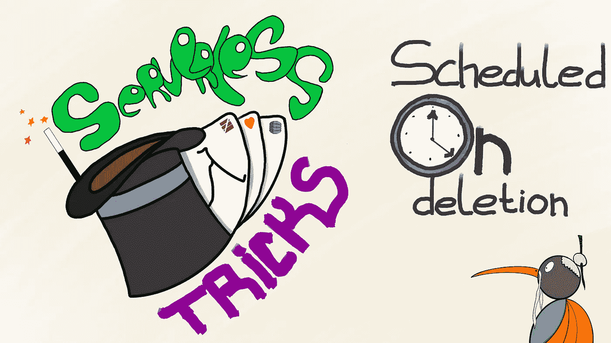
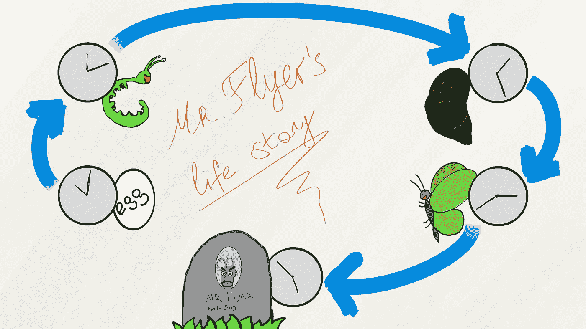

# 无服务器技巧—计划删除

> 原文：<https://itnext.io/scheduled-on-deletion-3f82ca159830?source=collection_archive---------2----------------------->

我想把它做成一个系列，但是我们会看到

我亲爱的读者们。今天我要讲一些相当小众的东西。当我前一段时间做这个“东西”的时候，我觉得它有点有趣。它涉及 DynamoDB 流、生存时间和调度事件，这些事件应该由 Lambda 函数在一天的某个时间拾取和处理。这些听起来像是你感兴趣的事情吗？那你可能真的会喜欢这趟旅程。或者不是。你会明白的。

## 问题是

假设你有一个有生命周期的实体。只是这个生命周期大多是预先确定的。比方说，在创建后的某个时刻，您的实体将更改状态，然后再次更改它，稍后它可以被删除或标记为死亡。让我们假设，你正在试图模拟一只蝴蝶，开始是一个卵，然后变成幼虫，然后是茧，然后是蝴蝶，最后它在美丽但相当短的时间内飞来飞去，看起来令人难以置信和华丽后死去。我最喜欢蝴蝶。我们确切地知道这个过程应该如何进行——每次转变的确切时间，以及不可避免地进入昆虫来世的时刻。我希望你能好好想象一下。因此，我们需要解决一个问题——假设我们对每个阶段都有一个转换函数，我们如何为系统中的每个蝴蝶安排这些函数的执行？别担心，我有一个答案给你。如果你仍然热衷于使用 DynamoDB…

一个非常专业的图表，展示了我们正在努力实现的东西

让我们从日程安排开始，好吗？

## 调度位

让我们先从日程安排部分开始。我们如何记录关于实体生命周期中计划变更的信息，以及当时间到来时，我们如何让系统知道变更？DynamoDB 有一个特性叫做离开时间(TTL)。此功能允许您在记录中配置一个字段，作为指示记录何时应被删除的标志。该字段必须包含一个纪元格式时间戳。DynamoDB 将自动删除所有 TTL 小于当前时间戳的记录。通常，该功能用于自动删除长期不需要的记录，例如聊天消息或多人游戏中的动作。然而，我们将以一种非常非正统的方式利用 TTL。回到我们的蝴蝶生命周期问题(我相信这是非常普遍的现实问题)。每当我们向数据库中添加一个新的 butterfly 单元的记录时，我们还会添加三个记录，每个记录都表明 butterfly 的状态发生了变化。看看这个片段:

我相信这段代码总体上是正确的，但我从未测试过它😬运行风险自担！

现在看看我们放入每个状态更改记录的 TTL 字段中的值。这是我们的蝴蝶应该从当前状态转换到给定状态的时间戳。这就是我们安排状态转换操作的方式。

## 处理位

既然我们知道了什么时候必须处理我们的记录，那么是时候讨论我们实际上如何处理它们了。"有没有一种简单而优雅的方法可以做到这一点？"—你问。嗯，自从我们使用 TTLs 来安排我们的状态操作，这里实际上是一个！你看，DynamoDB 有另一个有用的特性，我们可以用它来捕获所有由于 TTL 值过期而被删除的记录。这个特性的名字叫 DynamoDB stream。DynamoDB 流的工作方式类似于一个流系统，其中一条消息表示一个创建、修改或删除记录的图像。DynamoDB 流也可以用作 Lambda 函数触发器。因此，如果你是一个无服务器爱好者(我当然是一个)，你可以实现这样一个处理程序:

我相信这段代码总体上是正确的，但我从未测试过它😬运行风险自担！

这个 Lambda 函数捕获添加到流中的任何内容，获取某一类型的所有记录，这些记录有旧图像，没有新图像(我们知道这些是已删除的记录)，并基于保存在项目的`details`字段中的信息发布新的 Kinesis 消息。我假设下游某处有一个实际的处理程序来处理 Kinesis 事件，因为我懒得实现它，而且它似乎超出了这篇博文的主题。

就这样了！我们非常简单的调度机制。现在，我们知道了它是如何工作的，让我们来谈谈这种方法的利弊。

## 评估事物

让我们从积极方面开始，因为这是人们通常从积极方面开始的，对吗？

## 好东西

这真的取决于你的栈，但是如果你已经严重依赖 DynamoDB 和 Lambdas，那么我会说简单是这里最大的优势。这种方法只涉及很少的代码，代价是 DynamoDB 表上的两个额外设置导致了一些操作开销。您只需要创建一个处理程序来处理您的调度作业，而实际的调度和触发部分由基础设施来处理。

## 不好的东西

首先，这个实现只有在您已经在使用 DynamoDB 的情况下才有意义(很明显)。如果你正在使用 Lambdas，或者至少不介意开始使用它，那就更有意义了。所有这些仍然可以使用不同的堆栈来实现，这可能意味着编写更多的代码(因此没有获得该解决方案的主要好处)。其次，如果 DynamoDB 和 Lambdas 已经是你的堆栈的一部分，你可能仍然会遇到 TTL 的技术限制之一。也就是说，一条记录在 TTL 过期后不会立即被处理。AWS 自己的[文档](https://docs.aws.amazon.com/amazondynamodb/latest/developerguide/howitworks-ttl.html)上写着:“DynamoDB 一般会在过期 48 小时内删除过期的项目”。如果需要接近实时的性能，或者即使 48 小时对您来说太长了，这也是一个令人失望的等待(尽管老实说，对我来说从来没有超过几秒钟)。为了最小化长时间处理的风险，您可以实现自己的垃圾收集机制，查询过时的项目(这就是为什么我们在排序关键字中包含 TTL 日期)并删除它们。在我的公司里，我们已经通过一个相当简单的 lambda cron 工作做到了这一点。然而，正如我已经说过的，您需要额外的垃圾收集器的可能性有点小。您可能不喜欢这种解决方案的最后一个原因是它需要一些文档。根据我的经验，人们不能简单地从源代码中获取它。

## 还有什么？

没什么。我希望你喜欢这本书。在我结束之前，我想强调的是，您日常使用的工具中可能存在许多功能。这些功能可以用一种你还没有想到的方式来利用。我不是在谈论一些众所周知的工具的深奥用法，而是一些可以让你(和你的同事)的生活变得更轻松的技巧。知道这些黑客是什么吗？

如果你愿意，请思考并让我知道。下次见！