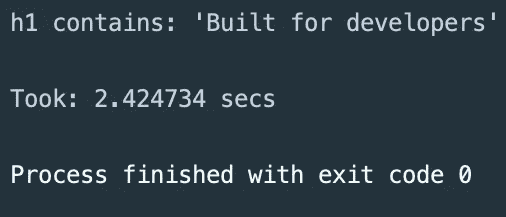

# 使用 Chromedp 更快地浏览网页

> 原文：<https://itnext.io/scrape-the-web-faster-in-go-with-chromedp-c94e43f116ce?source=collection_archive---------0----------------------->

## 无头铬合金

## 一种在 Go 中与支持 Chrome DevTools 协议的浏览器进行交互的快速而简单的方法。


照片由 [NASA](https://unsplash.com/@nasa?utm_source=medium&utm_medium=referral) 在 [Unsplash](https://unsplash.com?utm_source=medium&utm_medium=referral) 拍摄

> 一个简单的，高性能的网页抓取器，爬虫，预渲染解决方案，或截屏工具

# Chromedp 是什么？

Chromedp 是一种**快速、更简单的**方式来与 [Chrome DevTools 协议](https://chromedevtools.github.io/devtools-protocol/)进行交互，没有任何外部依赖性，例如 selenium 或 phantomjs，这在其他实现中是可以找到的。

这是一个轻量级的 Go 实现。

你只需要安装 Chrome。

[](https://www.google.com/intl/en_uk/chrome/) [## 谷歌浏览器-从谷歌下载快速、安全的浏览器

### 下载 Chrome 下载后按照说明安装。适用于 Windows 10/8.1/8/7 32 位。对于 Windows…

www.google.com](https://www.google.com/intl/en_uk/chrome/) 

## 为什么要用 chromedp？

*   前置放大器
*   抓取数据
*   截屏

为了向您展示它是如何工作的，**我们将使用它来抓取 github.com**并从页面上的元素中检索一些文本。

## 关于 chromedp 你应该知道的事情

*   通过**默认**，Chrome 以无头模式运行
*   您可以使用`DefaultExecAllocatorOptions`**覆盖默认选项**。
*   如果你想在**无头环境**中运行 chromedp，可以使用下面的 docker 镜像。

 [## 码头枢纽

### Chrome 无头外壳的最小容器

hub.docker.com](https://hub.docker.com/r/chromedp/headless-shell/) 

## 覆盖默认浏览器选项的示例

 [## 包装 chromedp

### 导入“github.com/chromedp/chromedp”包 chromedp 是一个高级的 Chrome DevTools 协议客户端，可以简化…

godoc.org](https://godoc.org/github.com/chromedp/chromedp#example-ExecAllocator) 

在这个例子中，我们将使用默认选项。

# 我们的依赖

只有一个外部依赖…

## Chromedp

[](https://github.com/chromedp/chromedp) [## chromedp/chromedp

### 包 chromedp 是一种更快、更简单的方式来驱动浏览器在 Go 中支持 Chrome DevTools 协议，而无需…

github.com](https://github.com/chromedp/chromedp) 

**那么让我们开始吧……**

# 1)安装 Chromedp

在项目根目录下，在终端中运行这个命令，从 Github 获取并安装 chromedp。

```
**$** go get -u github.com/chromedp/chromedp
```

> 我假设 go 已经在你的系统上正确安装了，如果没有，请到 https://golang.org/doc/install 的[按照说明安装 Go。](https://golang.org/doc/install)

# 2)导入我们的依赖性

像往常一样，在文件的顶部导入我们所有的依赖项。

导入 chromedp 以及其他依赖项

> 依赖关系`context`、`fmt`、`log`和`time`都是**标准库**的一部分。

# 3)初始化浏览器上下文

## 创建 Chrome 实例上下文

我们的第一步是初始化浏览器上下文。

用第一个选项卡初始化浏览器上下文。

这将创建一个**新浏览器**，在**的第一个**标签上。

我们将把`cancel()`调用推迟到主函数结束时。

## 添加超时

我们不希望我们的 scraper 永远挂起，所以**让我们添加 15 秒的超时。**

我们将`defer`调用取消超时，这样它就发生在程序退出之前。

创建浏览器上下文

# 4)概述浏览器步骤

让我们列出浏览器应该采取的步骤。

1.  **覆盖**用户代理(我们将使用定制的用户代理)
2.  **导航**到网址(github.com)
3.  向下滚动页面(我们将使用页脚)
4.  等待直到页面的重要部分可见(我们需要的元素数据)
5.  **抓取**重要数据(元素文本)

这些步骤涵盖了自动化浏览器将采取的所有动作。

> 在这个演练的最后，**我会向你展示一些额外的动作**，你可以对那些想要**预渲染**或者拍摄**截图**的人采取这些动作。

# 5)将每个步骤写成 Go 代码

这些步骤中的每一步都将作为一个数组包含到`chrome.Run()`函数中。

让我们通过分别为每个任务编写代码来分解任务。我们将在下一步合并任务。

## 覆盖用户代理

让我们使用一个定制的用户代理，这样我们的 scraper 就可以在服务器上被识别。

覆盖用户代理

我们需要使用 chromedp 的仿真包来帮助解决这个问题。

## 导航到该 URL

我们将使用 github.com 的主页。

导航到 github.com

## 向下滚动页面

让我们向下滚动到页脚，以确保页面已经完全呈现。

> **如果页面的部分是延迟加载的，这很有用，**比如在 SPA 应用程序中，比如用 Angular、React 或 Vue 创建的应用程序。

## 等到一个重要的部分可见

我们需要浏览器等待，直到页脚已经呈现。

我们将一直等到`<footer>`元素中的第一个`<div>`

## 搜集数据

我们将只获取`h1`标签(主标题)中的文本。

字符串`res`将是一个变量，用来存储这个`.Text()`查询的结果。

我们将使用`ByQuery`选项，这样我们可以通过标签名搜索`h1`标签。

> 有许多其他选项可以搜索页面上的元素。

您可以在此处找到其他选项的**列表来搜索元素[。](https://godoc.org/github.com/chromedp/chromedp)**

# 6)合并我们的连续浏览器任务

通过`.Run`功能中的可变参数组合任务。

我们将传递上下文`ctx`作为第一个参数，后面是我们的步骤。

浏览器任务的运行功能

这是我们 scraper 代码的最后一步。

我们现在需要做的就是打印`res`变量，看看我们的 scraper 找到了什么，你可以在下面的**完整代码中看到。**

# 完整的网络刮刀代码

这是我们的完整代码，所有的步骤都合并到一个函数中。

与更复杂的 scraper 实现不同，我们的 scraper 任务非常简单，因此它可以放入一个文件中，但这样我们可以很容易地看到 chromedp 中抓取 web 所需的步骤。

完整的 Github scraper 代码

## 结果…



> **刮擦成功🎉**

在 **2.4 秒内完成**

# 额外收获——预先呈现 DOM🚀

使用该功能作为`.Run()`的最后一步。

以字符串形式获取 DOM 作为预渲染解决方案非常有用

# 奖励——截图📸

您可以使用`.Screenshot()`功能对页面上的元素进行截图。

你可以把这个功能作为浏览器的最后一个动作。

获取页面上某个元素的屏幕截图

你需要在`.Run()`完成后把截图写到一个文件里。

## 想了解更多？查看 chromedp 文档！

 [## 包装 chromedp

### 导入“github.com/chromedp/chromedp”包 chromedp 是一个高级的 Chrome DevTools 协议客户端，可以简化…

godoc.org](https://godoc.org/github.com/chromedp/chromedp) 

## 感谢阅读！有任何问题，请在评论中告诉我。