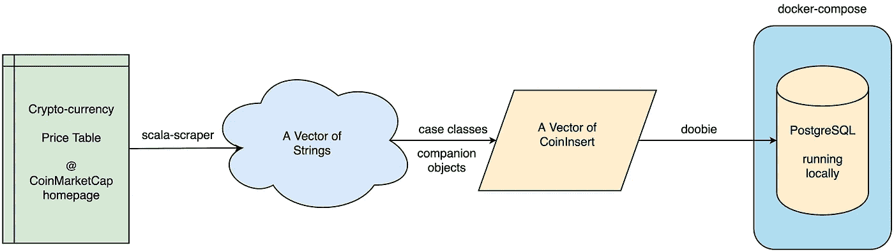
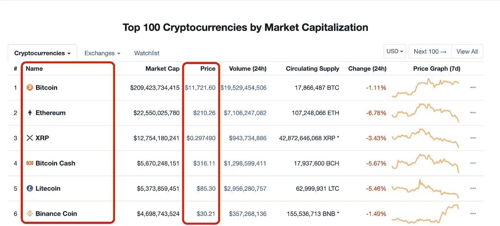

# 用 Scala 和 PostgreSQL 抓取和存储加密货币价格

> 原文：<https://itnext.io/scraping-and-storing-crypto-currency-prices-with-scala-and-postgresql-a6bb86a66f74?source=collection_archive---------3----------------------->

**简介**

网络抓取大多涉及文本密集型任务，如产品评论抓取、收集房地产列表，甚至跟踪在线声誉和存在。当一个应用程序只抓取字符串数据类型进行定性分析时，它可能不需要类型安全。然而，如果 web 抓取的最终目标是对价格或天气预报进行定量分析，使用类型安全语言可能会非常方便。

在本文中，我们的目标是给出一个有趣的小例子，通过使用 Scala 并将其存储到 PostgreSQL 数据库中来获取加密货币的价格。为了降低价格，我们选择使用 CoinMarketCap [主页](https://coinmarketcap.com/)。这是一个加密货币知识网站，也提供关于市场资本化(相对市场规模)、流通供应量和交易量的信息。尽管把所有这些信息放在一起看很有趣，但为了简单起见，我们将只讨论价格。

这篇文章可能被认为是一个教程，它需要 docker-compose 和 Scala 的基础知识。

本教程使用的管道的摘要

**工具和步骤**

在 Scala 中进行 web 抓取时，我们将使用一个名为 scala-scraper 的 HTML 解析库和 **JSoup** 。接下来，我们将使用一个名为 **doobie** 的功能性 JDBC 工具，将刮出的价格插入 PostgreSQL 数据库。

尽管我们提到了一些花哨的库和工具名称，但真正的魔力发生在 case 类中。对于对 CoinMarketCap 主页的每次调用，我们的目标是检索具有类型安全的长加密货币表。为此，我们创建了 CoinCreate 和 CoinInsert case 类以及配套对象。

我们将首先解释 case 类及其伴随对象，因为我们的目标是在创建它们的同时对数据建模。然后，我们将解释从主页检索更新的价格表的简单函数。最后，我们将解释如何将表记录插入到本地运行的 PostgreSQL 数据库中。我们可以用这个简单的 [docker-compose 文件](https://github.com/nazliander/scrape-insert-postgresql/blob/master/simple-tutorial/docker-compose-setup/docker-compose.yml)来驱动数据库。在 docker-compose 文件中，我们用名称`dev`、用户名`admin`和密码`admin`初始化了一个 PostgreSQL 数据库。

本教程中介绍的步骤显示在上面的管道中。

**案例类和伴随对象**

尽管可能有不同的方法来建模数据，我们可以从创建两个 case 类开始，分别是 *CoinCreate* 和 *CoinInsert* 。这些将帮助我们在抓取价格表并插入数据库时保持数据类型的安全。

来自 CoinMarketCap 主页价格表的视图

`CoinCreate`旨在安全地键入一对加密货币代码及其当前价格。因此，它有两个参数`code`(指货币代码)和`price`(美元现价)。然而，在考虑它的伴随对象时，我们需要考虑每行中价格记录的形状。例如，如果我们只考虑在我们的 case 类中使用硬币名称和价格，在一组记录中它们的索引将是`1`和`3`。这非常类似于表的列索引。

通过观察价格表(您可以从主页上找到一个截图)，我们决定使用一个伴随对象来拥有一个 apply 方法，用于将 String List 的输入函数转换为`CoinCreate`。虽然这种转换并不那么简单，但是我们可以使用 helper 函数只获取硬币代码(`getCoinCode`)并将美元价格字符串转换为 double ( `numberStringToDouble`)。

CoinCreate case 类及其伴随对象

`CoinInsert`旨在安全地键入一对加密货币代码、其当前价格和用于插入时间记录的日志时间戳。我们可以在 PostgreSQL 中插入一个向量`CoinCreate`时使用这个 case 类。由于它的参数与`CoinCreate`非常相似，我们可以创建一个简单的伴随对象来将`CoinCreate`转换为`CoinInsert`。这个对象的 apply 方法可以自然地将当前时间戳添加到一个`CoinCreate`中以获得一个`CoinInsert`。

因此，`CoinCreate`案例类和`CoinInsert`案例类之间的唯一区别是当前的`Timestamp`，标记为`logTimestamp`参数。

CoinInsert case 类及其配套对象

**刮削功能**

用 **scala-scraper** 和 **JSoup** 刮相当容易。首先，我们需要通过创建一个新的 **JSoup** 浏览器来获得对主页的请求。一个新的浏览器可以从网上获取 HTML。因为我们只需要 HTML 解析 **JSoup** 就足够了，对于使用页面的 Javascript，可以使用其他浏览器选项。

获取请求功能

通过使用 GET 请求，我们需要找到主表并将其存储为字符串向量。幸运的是，当我们指定要寻找一个表格元素时， **scala-scraper** 的`table`方法为我们完成了所有工作。

表格刮擦功能

最后，我们需要对向量进行切片，从第二个索引开始直到最后几行，因为第一行包含列名(标题)。产生的切片向量仍将包含 HTML 元素为字符串的表行。因此，我们可以从函数式编程中受益，映射所有的表行(向量元素)，同时提取元素中的文本，然后转换为`CoinCreate`(使用定制的 apply 函数很舒服)。

**插入功能**

doobie 是 Scala 的一个令人惊叹的函数式 JDBC 层。它提供了一种编写任何 JDBC 程序的函数式方法。在本教程中，我们将保持简单，只编写一个连接`Transactor`来连接本地 PostgreSQL 数据库，并编写一个插入函数来进行类型安全的事务。

为了连接到数据库，我们需要使用一个`Transactor`来声明驱动程序的类型(在我们的例子中是 PostgreSQL 驱动程序)、连接的 URL、用户名、密码和执行上下文(EC)。交易者需要一个隐式的 val 来定义 EC。对于非阻塞操作 **doobie** 的`Transactor`使用`contextShift`。为了测试我们的代码，doobie 文档推荐使用同步 EC。

用于建立 JDBC 连接器的处理器

为了编写逐行插入函数，我们可以使用 SQL 插值。该函数有一个输入`CoinInsert`和一个输出`Update0`(表示参数已知的参数化语句)。

用 doobie 进行 SQL 插值

最后，我们可以通过使用`getCoinUpdatedTable`函数来请求主页。这将返回一个字符串向量。

因此，我们可以使用这个向量(`coinTable`)将`CoinCreate`转换为`CoinInsert` case 类，并执行我们在上一步中准备的 insert 语句。

完成所有抓取和插入工作的几行代码

**遗言**

多亏了 **doobie** ，只需几行代码，我们就能从 CoinMarketCap 获取加密货币的价格，并将其插入本地 PostgreSQL 数据库。虽然代码完成了它的工作，但是现在，源代码可以用异常处理和监控来扩展。整个主类可以在下面找到。你可以在 Github 仓库中找到整个项目。

在这篇短文中，我们旨在向 web 抓取介绍一些 Scala 概念。要了解更多关于数据工程的知识，你可以选择参加[训练营](https://www.linkit.nl/vacatures/data-engineering/0007529/data-engineering-apprenticeship-starts-feb-1st-2020)进行实践培训，做更多项目，阅读和分享更多内容。