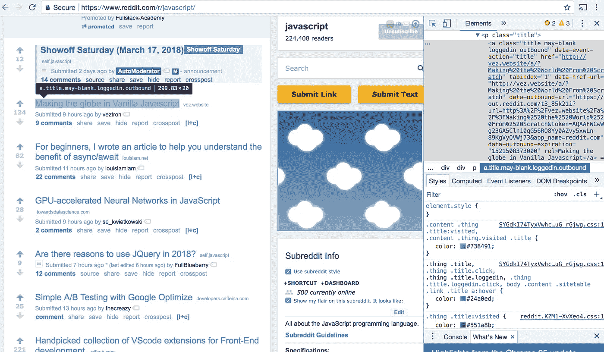

# 用 Cheerio 从 Reddit 抓取数据

> 原文：<https://itnext.io/scraping-data-from-reddit-with-cheerio-be97cde63470?source=collection_archive---------6----------------------->

Reddit 代表了当今最大的，也许是最著名的在线社区之一。Reddit 在全球读者总数中一直排名前十，已经成为无数讨论领域的基石，从参与政治辩论到分享小猫照片，以及其他一切。每个 Reddit 页面都通过帖子、评论、karma 分数和其他标识符表示大量数据，通过一个简单的 Javascript 程序，我们可以提取这些信息，并按照我们想要的方式处理数据。


资料来源:knowyourmeme.com

在这篇文章中，我将展示一种使用 web 抓取来获取给定子编辑的顶部帖子的标题和 karma 分数的技术。我希望读者能够对使用 Cheerio 执行抓取功能有一个基本的了解。

为此，我们将使用 Cheerio，一种用于搜索和管理 HTML 标记结构的轻量级灵活 API。Cheerio 建立在核心 jQuery 的子集上，让用户可以简单地直接进入 web 抓取。

我们将使用 2 个包，Cheerio(当然)和 request，这是一个用于进行 HTTP 调用的简单模块。请求可以从给定的 URL 快速返回原始的 HTML 正文。

首先，我们将任何 URL 传入请求调用。请求还可以接受一个回调函数来处理结果体。在这个回调中，我们将标记加载到 cheerio:

```
const request = require('request');
const cheerio = require('cheerio');request('[https://www.reddit.com/r/javascript/](https://www.reddit.com/r/javascript/)', (err, res, body) => {
//Load HTML body into cheerio
const $ = cheerio.load(body);//Cheerio functions})
```

现在有趣的部分来了:刮！我们的目标是分析我们站点的 HTML 主体，并推断出哪些元素和属性与我们正在寻找的数据相对应。从这里开始，我们使用 Cheerio 的类似 jQuery 的语法来定位所需的元素，并将它们解析回我们的 Javascript 程序。

对于这个例子，我们将深入到**Javascript**subred dit(【https://www.reddit.com/r/javascript/】T2)。我将使用 Chrome 的 inspect 工具(快捷键 Cmd + Shift + C)来查找哪些元素代表我们希望检索的数据。例如，为了定位表示给定帖子分数的元素，我们发现每个分数都用一个包含类 **score** 和 **unvoted** 的 **div** 元素来表示。此外，我们看到我们正在寻找的分数存储在属性 **title** 下:


注意左边的黑色注释气泡和右边突出显示的 div 元素。div 包括一个带有相应分数的 title 属性。

有了这些信息，我们通过称为**提取器**的函数告诉 Cheerio 遍历 HTML 主体并获取某些元素。继续我们的例子，我们添加一个提取器来提取每一个具有类**分数**的元素(我们不需要**未保存的**，**分数**足够具体)。从这里开始，我们将另一种称为**属性函数**的函数连接在一起，以提取标题属性的值，并将每个值放入预定义的数组中:

```
const request = require('request');
const cheerio = require('cheerio');let scoreArr = titleArr = [];request('[https://www.reddit.com/r/javascript/](https://www.reddit.com/r/javascript/)', (err, res, body) => {
  //Load HTML body into cheerio
  const $ = cheerio.load(body); //Scrape karma scores
  $(`.score`).attr(`title`, (i, val) => {
    scoreArr.push(val);
  });
});console.log(scoreArr)
//[12, 134, ...] Scores of top posts of r/Javascript at time of writing
```

让我们继续提取标题。从下面的图片中，我们看到每个标题都是一个包含 4 个类的**和**(超链接)元素。这一次，我们寻找的标题不在属性中，而是在元素的内部 HTML 中:



在这里，我们看到标题是具有 4 个类的“a”元素

为了提取内部 HTML，我们使用。text()函数。我们不能使用回调函数，所以我们使用。forEach()添加给定的标题，如下所示:

```
const request = require('request');
const cheerio = require('cheerio');let scoreArr = titleArr = [];request('[https://www.reddit.com/r/javascript/](https://www.reddit.com/r/javascript/)', (err, res, body) => {
  //Load HTML body into cheerio
  const $ = cheerio.load(body); //Scrape karma scores
  $(`.score`).attr(`title`, (i, val) => {
    scoreArr.push(val);
  }); //Scrape post titles
  $(`a.title`).forEach((el) => {
    titleArr.push(el.text());
  });});console.log(scoreArr);
//[12, 134, ...] Scores of top posts of r/movies at time of writing
console.log(titleArr);
//["Showoff Saturday...", "Making the globe...", ...]
```

我个人把刮痧比作侦探工作。因为没有两个页面是相同的，所以我们需要使用不同的提取器和属性函数来解析我们想要的信息。这通常需要反复试验来获得你想要的准确信息。

这个例子提供了一个简单的结构来实现基本的 Cheerio 函数。Cheerio 包含了大量更复杂的遍历 DOM 的方法。继续尝试网络抓取您最喜爱的网站！