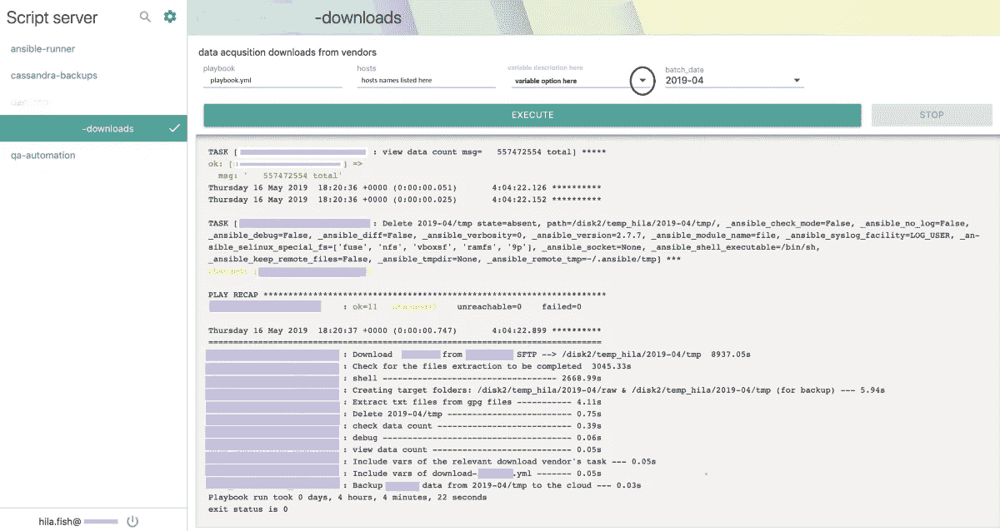

# 脚本服务器:每个人都应该使用(或者至少了解)的开源工具

> 原文：<https://itnext.io/script-server-the-open-source-tool-everyone-should-use-or-at-least-know-about-41f28a1191c3?source=collection_archive---------3----------------------->



人人都爱开源:)

为什么？因为它是免费的。很有帮助。它很灵活。有时这是唯一有效的方法，仅仅是因为开发开源解决方案的社区已经遇到了您刚刚遇到的问题，许多优秀的人才聚集在一起，利用开源的力量创建了一个非常好的定制解决方案。

在这篇博文中，我将讨论一个具体的开源工具，这个工具并不为很多技术人员所知，由 [Bugy](https://github.com/bugy) 开发的名为 [Script-Server](https://github.com/bugy/script-server) 。

# 这是什么？

Script-Server 是一个智能的 Web-UI(也可以通过命令行运行),其中您可以在一个用户友好的设置中公开脚本/Ansible 行动手册。您不需要修改脚本——您只需将每个脚本的配置添加到脚本服务器中，它会负责适当的 UI、验证、执行等。意思是-每个人都可以使用它并运行脚本(见[演示](https://script-server.net/))，不需要任何技术知识，也不需要任何权限，因为脚本运行的权限设置在后端，与最终用户权限无关。

# 这是给谁的？

如果你有剧本，翻译剧本等。，并且您希望让您公司的非技术人员也能使用它们，从而减少他们对您的 IT/系统/DevOps 团队的依赖——这个工具就是为您准备的。

# 我是怎么开始用的？

一位来自非技术团队的同事(让我们称她为 Betty)每月有一项任务(不在固定日期),从外部位置下载 [zip](https://en.wikipedia.org/wiki/Zip_%28file_format%29) 文件，在特定服务器上解压缩，分析文件的统计数据和散列值，并向 Betty 发回一份报告。

作为一名 DevOps 工程师，我的信条之一是将简单的事情自动化。我将 Betty 的重复任务确定为自动化的一个很好的候选，并创建了一个可行的剧本来执行这个流程。

但是每个月贝蒂都会开一张吉拉票，让我的团队去运行它，因为她没有权限在她那端运行 Ansible playbook。

大约在那个时候，一个团队成员分享了他使用“脚本服务器”的经历，这是一个为非技术人员提供服务的工具；我很快意识到，这个工具可能是一个很好的方式，可以让 Betty 独立地获得她的报告，并减少对我的团队的不必要的依赖。

作为解决方案的一部分，我给贝蒂提供了一个脚本服务器的链接(托管在我这边的一个服务器上)，并授予她登录权限，这给了她运行这个过程所需的独立性(并最小化了她打开的吉拉门票的数量)😉).

参见上面 Betty 登录并输入她需要的特定脚本后所看到的截图(在封面照片中点击“执行”后的输出)。

# 那么…是什么让这个工具如此伟大呢？

毫无疑问，脚本服务器的主要价值在于它以定制的方式包装了脚本/剧本，允许暴露变量/参数下拉列表、复选框、文本等。(Ansible 中的额外变量，常规脚本中的参数)。从用户体验的角度来看，这意味着在 UI 中动态地请求脚本参数/变量(从而消除了查看脚本本身以查看它期望获得哪些参数的需要)。

例如，上面的截图显示了一个名为“batch _ date”(2019–04)的变量。“batch_date”实际上是在 Ansible 剧本“playbook.yml”中定义的额外的 var，并且通过 Ansible 中的变量名到具有配置脚本的 UI 中的变量名的映射定义链接到脚本服务器。

为了举例说明这是如何工作的，请参见下面的脚本:

```
{
 "name": "Very parameterized",
 "script_path": "scripts/parameterized.sh",
 "working_directory": "./samples",
 "description": "This script does nothing except accepting a lot of parameters and printing them",
 "allowed_users": [
 "*"
 ],
 "include": "${Simple Text}.json",
 "parameters": [
 {
 "name": "Simple Int",
 "param": " - simple_int",
 "type": "int"
 },
 {
 "name": "Simple Boolean",
 "param": " - simple_bool",
 "no_value": true,
 "description": "Boolean One"
 },
 {
 "name": "Multiple selection",
 "param": " - multiselect",
 "type": "multiselect",
 "description": "Multiselect list",
 "values": [
 "Black cat",
 "Brown dog",
 "Green parrot",
 "Red fox"
 ]
 }
 ]
}
```

在本例中，我们有一个调用执行脚本“scripts/parametered . sh”的配置脚本，该配置脚本为执行脚本定义参数和变量。

本质上，脚本服务器的工作方式是，如果您的执行脚本需要参数，您必须使用配置脚本来运行它——如果它只是执行没有任何参数的命令，您可以直接从脚本服务器运行它(在演示站点中,“colortest”就是一个例子)。

完整的文件可以在[这里](https://github.com/bugy/script-server/blob/master/samples/configs/parameterized.json)找到。

# 脚本服务器支持哪些脚本？

脚本服务器是语言无关的——它可以运行从 Perl 到 PHP 到 Python 的任何语言的脚本；Ansible 行动手册也可以运行(需要包装一下，但这是为收益付出的小小代价)。它支持您在配置脚本中定义的多种类型的输入或“参数”(列表/自由文本/硬编码)，以允许脚本使用的灵活性(无论通过命令行需要什么参数，都可以通过脚本服务器 UI 提供)。

# 用户管理

Script-Server 还支持身份验证( [Gmail SAML](https://support.google.com/a/answer/6087519?hl=en) )和授权，通过定义哪些用户/组可以访问每个“域”(域是您运行脚本的区域——如果您愿意，它可以是单个脚本或 ansible-playbooks 的整个文件夹)。来自[演示](https://script-server.net/)的示例—定义用户 X 能够运行“计算器”，但不能运行“井字游戏”。

# 会话中执行

在浏览器中运行脚本-服务器会话是防弹的——它基于最终用户的会话，因此即使最终用户关闭浏览器并重新打开它——他/她也会看到会话保持不变，并且运行没有被中止。

# 脚本服务器作为开源的力量

即使你还没有弄清楚如何在你的公司中使用这个工具，或者你在你的终端上实现它时遇到了一些限制，这个工具的创建者是非常敏感的，所以你可以打开 GitHub 问题，你会得到快速有效的响应(我可以从个人经验证明，当我错过一个特定的功能时，我在 GitHub [脚本服务器](https://github.com/bugy/script-server)仓库上打开一个问题， [Bugy](https://github.com/bugy) 对我的问题做出了响应，甚至按照我的建议添加了我要求的特性/功能)。您也可以为这个项目做出贡献，让这个工具变得更加强大，与更多的用例相关联。

# 综上

开源社区正在成长。甚至蓝色巨人在最近收购 Red Hat 时也认识到了开源的力量。随着越来越多的人测试和修复代码，这种增长只会让开源项目变得更好、更安全。开源社区的发展在技术层面上对我们的职业生涯产生了积极的影响——通过提供各种各样的解决方案来实现；在个人层面上，通过提供一种回馈社区的方式。

Script-Server 是一个非常强大和灵活的工具，允许从一个中心位置运行脚本和剧本，具有“简单易懂”的外观，不需要权限或预先了解脚本如何工作，我强烈建议您查看一下。

**资源:**

"[脚本服务器](https://github.com/bugy/script-server) "-链接到脚本服务器 GitHub 存储库页面。

[Bugy](https://github.com/bugy) —链接到脚本服务器创建者的 Github 页面。

感谢 [Dalya Gartzman](https://medium.com/u/8cb8e88c4f51?source=post_page-----9777051d384f----------------------) 和 [Shifra Goldberg](https://medium.com/u/763aa8dba8a8?source=post_page-----9777051d384f----------------------) 帮助编辑本文。