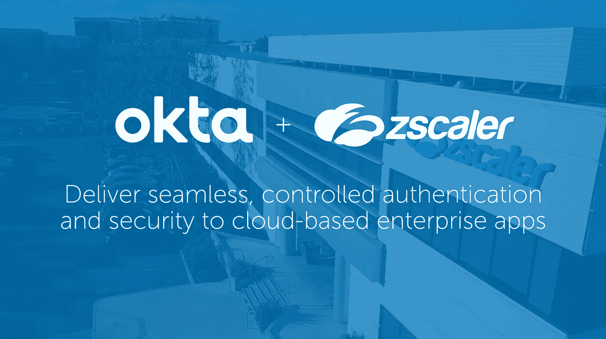

# 使用 Curl 的脚本化 OKTA / ZScaler 认证

> 原文：<https://itnext.io/scripted-okta-zscaler-authentication-with-curl-84c93df74652?source=collection_archive---------5----------------------->

最近，我不得不编写一个 shell 脚本，仅使用命令行工具通过 [OKTA](https://okta.com) 向 [ZScaler](https://www.zscaler.com/) 认证用户。似乎 SSO 登录协议主要是为浏览器开发的。关于如何通过脚本实现这一点的相关信息很难找到，坦率地说，这花费了我比我希望的更长的时间。

简而言之，很多解决方案都求助于无头浏览器来模拟登录，就像人们交互操作一样。对我来说，这听起来像一个黑客，毕竟，浏览器重定向和认证协议只不过是一些 HTTP 重定向，同时在 cookie 中传递重要的令牌。

如果其他人遇到这个问题，下面是解决方法:

## 1.向 OKTA 认证用户

第一步是向 OKTA 认证用户。您的公司或应用程序将拥有自己专用的 OKTA URL，例如[https://acme.okta.com](https://acme_org.okta.com)。这里您要做的是使用 OKTA authn API，如下所示:

这里需要注意的重要一点是传递给`curl.` 的 cookie 标志。cookie 允许在连续调用之间传递重要的 SAML 令牌信息。

最后，从身份验证响应中，我们可以检索这个令牌需要被交换为会话 cookie 的`SESSION_TOKEN.`。

## 2.获取会话 Cookie

下一步是通过调用以下 API 将会话令牌交换为会话 cookie。

## 3.获取 SAML 请求重定向 URL

现在我们有了会话 cookie，我们需要获得 SAML 请求有效负载。为此，我们调用您希望连接的 ZScaler 端点的 URL，如下所示:

从 ZScaler 的角度来看，这个 HTML 页面返回一个隐藏的表单，该表单会触发浏览器中的重定向。我们从这个表单中需要的只是重定向位置，因为 SAML 请求会自动存储在 cookie 中。

## 4.获取 SAML 响应有效负载

上面的 URL 很可能会发出一系列重定向。幸运的是，有了`-L` 标志，`curl`将重定向到正确的 OKTA URL，在那里我们可以检索 SAML 响应有效负载，如下所示:

在第 1 行，我们检索 SAML 响应有效负载。在第 2 行和第 3 行，我们使用一些命令行实用程序来提取响应本身以及 SAML 重定向 URL 到 ZScaler。

我们还必须确保对有效载荷进行解码，以获得原始的、非 url 编码的有效载荷，因此调用了`recode.`

## 4.登录 ZScaler

最后一步是将经过身份验证的用户重定向回 ZScaler。cookie 现在包含允许 ZScaler 将用户登录到应用程序的断言。

在这最后一步之后，可以使用 cookie 对 ZScaler 中运行的应用程序执行其他与脚本相关的操作。

## 把所有的放在一起

# 结论

在这个例子中，我成功地通过 OKTA 向 ZScaler 应用程序验证了一个用户。希望这能在将来帮助其他人。

如果你从这篇文章中受益，请考虑关注我，这是在媒体上建立追随者基础并确保我的努力到达目标受众的唯一方法。