# Scrum 和 OutSystems:为企业带来价值的完美结合

> 原文：<https://itnext.io/scrum-and-outsystems-the-perfect-combination-to-bring-value-do-the-business-5a316f2d34a?source=collection_archive---------0----------------------->

Scrum 和 OutSystems 工具增加了 IT 开发人员交付客户期望质量的产品的可能性。这种结合为利益相关者提供了更容易的项目时间和预算管理。

[点击这里在 LinkedIn 上分享这篇文章](https://www.linkedin.com/cws/share?url=https%3A%2F%2Fitnext.io%2Fscrum-and-outsystems-the-perfect-combination-to-bring-value-do-the-business-5a316f2d34a)

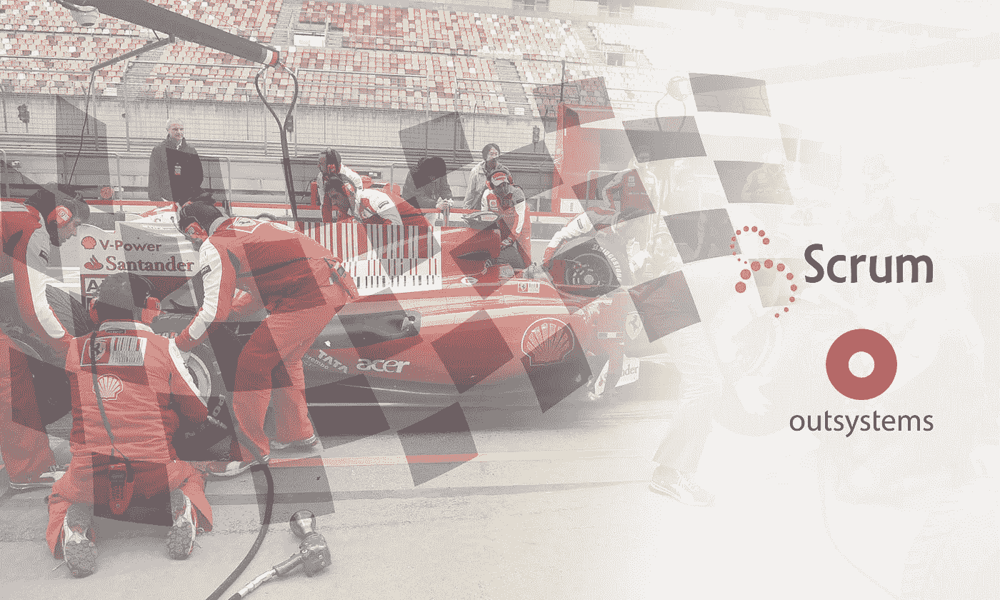

作为一名 IT 开发人员，我们的使命是为企业带来价值，创造新的流程和工具来节省成本，并通过使用我们的服务为客户提供更好的体验。不断改进也是相当重要的。

通过使用更好的工具和方法，更有可能准确地交付客户想要的东西。因为我们是有感情的人，在这种条件下工作会产生一种不是在工作而是在玩游戏的感觉。这对你和你的客户来说都很好。

受此激励，并有机会与优秀的人一起工作，使用像 OutSystems 这样的快速应用程序开发工具和像 Scrum 这样的敏捷方法，我决定分享我的经验。

本文的重点主要放在 Scrum 框架上，因为像我这样的开发人员陷入了这种“敏捷浪潮”，这是我在荷兰农业信贷银行消费金融中心的最后一个项目中经历的事情，它激励我学习更多关于它的知识并与你分享。

我创建了下面的金字塔，它指出了我们在企业中创造价值所需要的基础。为了达到这个目标，你需要一个优秀的团队、优秀的工具和框架(流程)。

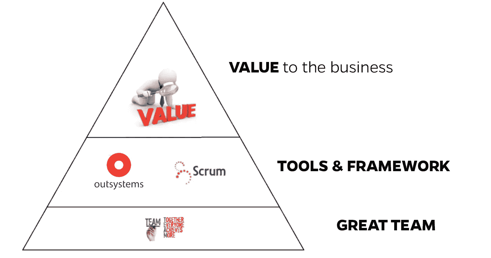

**伟大的团队**

拥有一个伟大的团队是起点。如今，在复杂的 IT 环境中工作意味着公司需要一个能够快速适应客户不断变化的需求的动态业务。即使是你，作为一个明星，你也需要一个伟大的团队与你合作来赢得和取得成功。

我将在后面描述 scrum 的价值:在一个 scrum 团队中需要什么技能。

例如，在一个不断“奔跑”以实现目标的 Scrum 团队中，每个人都在互相帮助。一个又一个进球，全队都在一起庆祝胜利。在这种环境下，我们在团队成员中营造了良好的氛围。

**OutSystems 是一个伟大的工具:**

我在项目管理课程中发现了 OutSystems。在 OutSystems 的一次演示中，我们被介绍到这个快速应用程序开发工具。

听到同事们的伟大经历激励我开始学习它。我有机会使用它，它是我过去三年一直使用的 RAD 工具。感觉太棒了！

一个为开发人员提供最简单的方法来创建应用程序并为业务带来价值的工具，听起来真不错！

开发人员有机会更多地参与到业务中，并且有更多的时间去了解 T2 确切的需求。他们将有时间思考和创造最聪明的方法来实现目标(功能增加)。

当需求明确时，开发人员会开发得更快，因为他们有像 OutSystems 这样的合适工具来帮助他们。

**注意:**对于一个公司来说，拥有一个好的、稳定的外部系统开发方法，能够更容易地与项目中新的外部系统资源集成，并且更容易维护是很重要的。

**Scrum 一个好的框架:**

Scrum 诞生于 1994 年，创始人是 Ken Schwaber 和 Jeff Sutherland，并在 2008 年因经济危机而出名。

**在哪里应用 Scrum？**

在我们处理不确定性的开发和维护复杂产品中应用 scrum 是很好的。

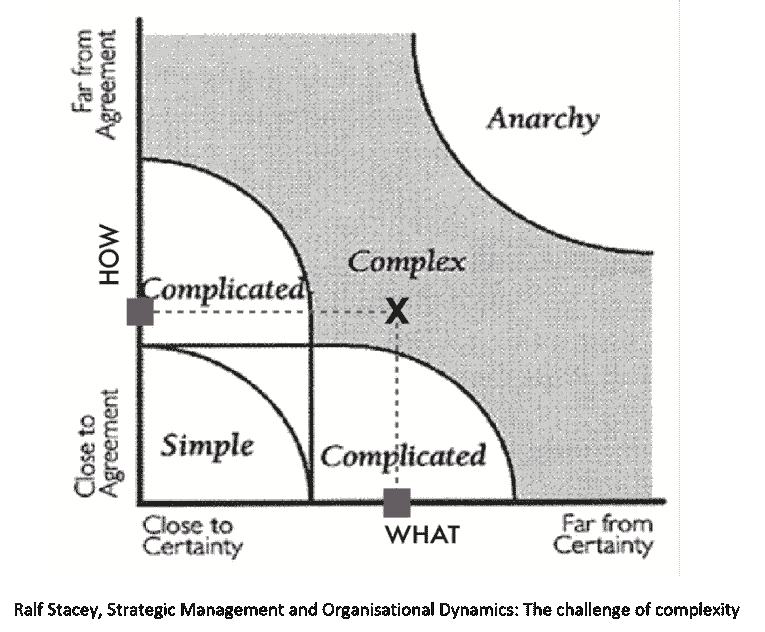

不确定性是当你有一个愿景，但你不知道所有的产品功能和你将使用的技术。但是您仍然知道您可以在短时间内创建一些功能性增量，这些增量代表了业务的直接价值。

**为什么要应用 Scrum？**

要回答这个问题，请看下面这张与斯坦迪什集团研究相关的图片。

想象你正在一个大项目中工作。在这个项目中，所有的团队成员都遵循一个在开始时定义的计划。你在预算和时间内交付产品。然后你意识到你创造的 64%的功能是“从不使用或很少使用”的。你感觉如何？感觉不太好吧！

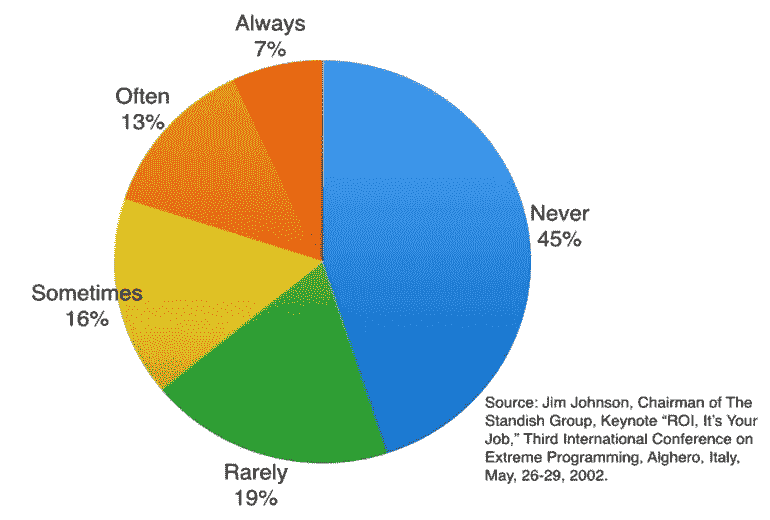

Scrum 可以帮助我们避免上述问题。因为 20%的功能更常用，这些功能将首先交付。这些功能对企业来说更有价值。使用 Scrum，我们构建不被使用的功能的风险会更小(64%)。

敏捷方法自然地“推动”业务人员更接近开发团队，因为他们可以几乎实时地看到在生产中被认为更重要的功能。

在项目过程中，scrum 团队不断学习，产品积压得到维护。

**Scrum 柱子**

Scrum 的支柱如下图所示:

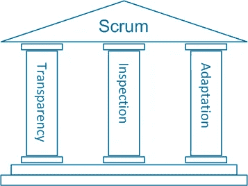

Scrum 创造了所有透明的条件。这种透明度为更多的**检查创造了机会**如果我们偏离了轨道，我们总能**适应。**

**将敏捷宣言的价值观与 Scrum 联系起来**

敏捷宣言的价值观是:

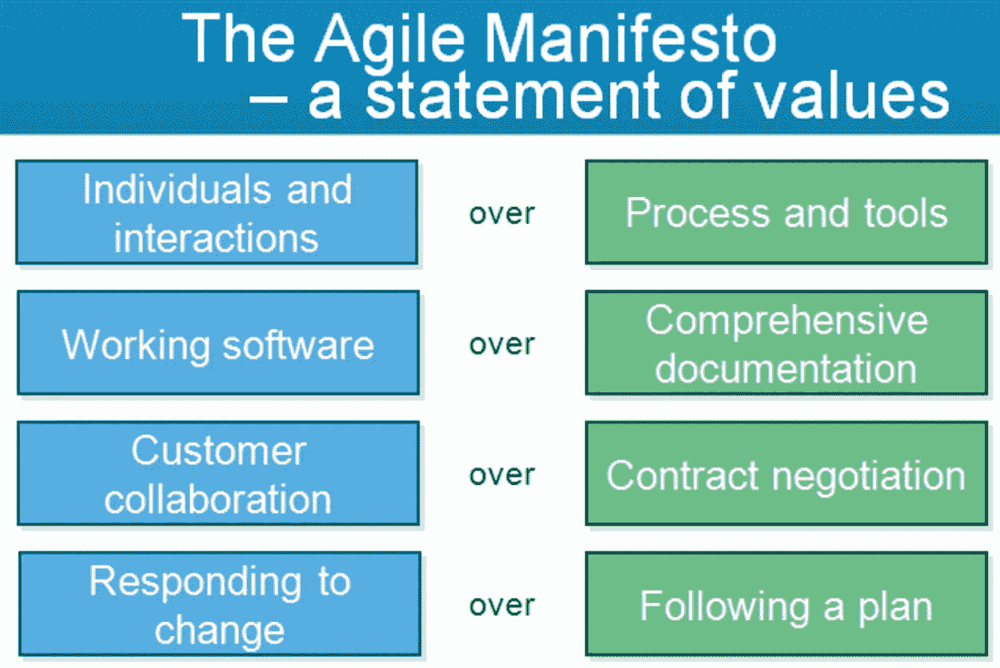

虽然正确的项目有价值，但敏捷宣言更重视左边的项目:

1)Scrum 不会有“沉重”的过程和工具，它会给我们提供机会进行良好的聊天，促进交流。

2)我们同意，与其有大量的文档，解释我们将做什么，不如创建一些能立即创造价值的功能，给我们一个检查的机会。

3)不要把客户锁在合同里，他才是确切知道什么更有价值的人。让他和开发团队一起工作。开发团队会更好地理解需求是什么，客户管理也会更容易。

4) Scrum 会给我们在项目过程中适应的机会。例如，如果业务现实发生变化，您可以适应，而不是遵循预先定义的计划。

**Scrum 框架**

Scrum 框架由 5 个小组组成。您可以根据您公司的实际情况调整这个框架。

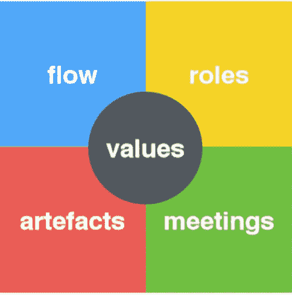

**值**

我们从拥有一个“优秀团队”的重要性开始了这次谈话。当我们在 scrum 环境中工作时，我们希望我们的团队拥有的价值观是:

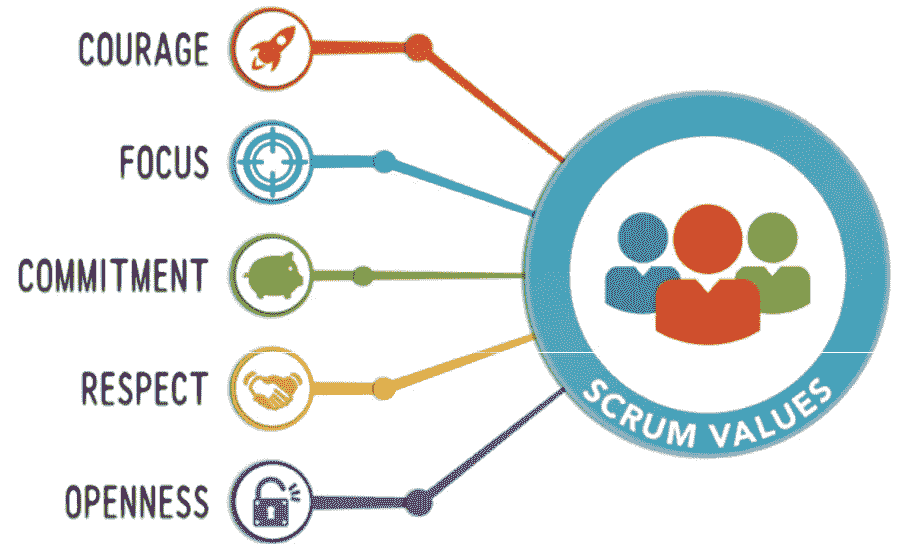

**角色**

scrum 团队中的角色是:

*   产品所有者
*   Scrum 大师
*   开发团队成员

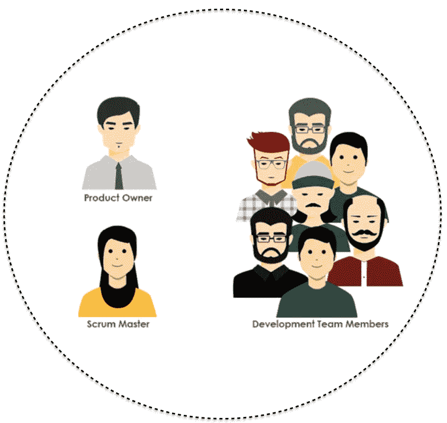

在一次 Scrum 培训中，有人提出了一个问题:“既是 Scrum 大师又是开发团队的一员可以吗？”

有可能，但不推荐。

不建议在多个项目中担任 Scrum 高手或产品负责人。

做多任务是浪费时间，所以完美的场景是每个项目有一个全职的产品负责人和 Scrum Master。

**每个角色的义务**

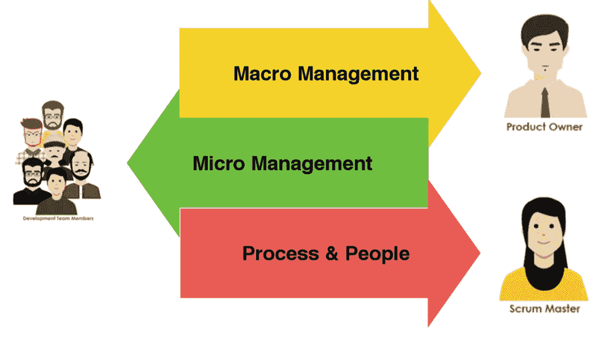

**产品负责人**

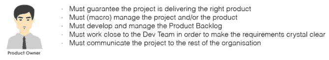

**开发团队**

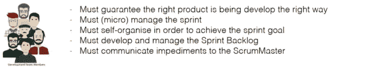

**Scrum Master**

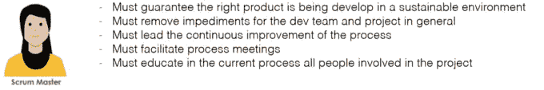

**产品积压(人工制品)**

产品积压由产品所有者管理，是产品日志项目的列表。最上面的项目是最重要的(更有价值)。每个产品待办事项都代表了一项可以使用的功能。

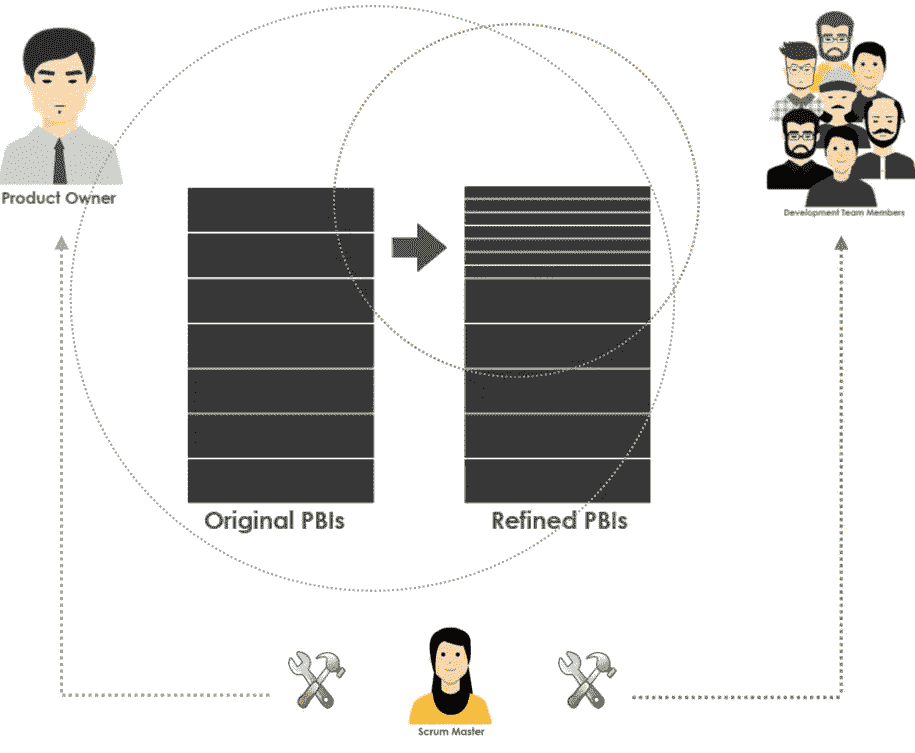

**Scrum 流程**

如下图所示，Scrum 流给你机会变得透明，检查，如果必要的话，适应。它确保 scrum 团队总是致力于为企业创造高价值。

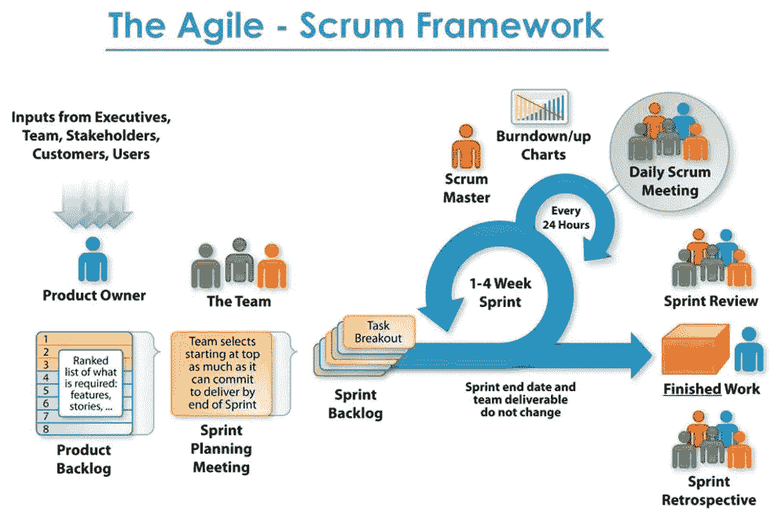

**冲刺**

Sprint 是一个 4 周或更少(不少于 1 周)的时间盒。每个新的冲刺在前一个冲刺结束后立即开始。冲刺的持续时间是一致的。Sprint 的目标是交付“完成的”、可用的和潜在可发布的产品待定项(PBI)

在冲刺阶段:

不应有任何可能危及目标的变化

目标的质量不能降低，但是范围可以在产品所有者和开发团队之间澄清和重新协商

**人工制品——冲刺积压**

为了管理 sprint backlog，Scrum 团队可以使用白板来透明地与外部和内部团队成员交流 sprint 的状态。

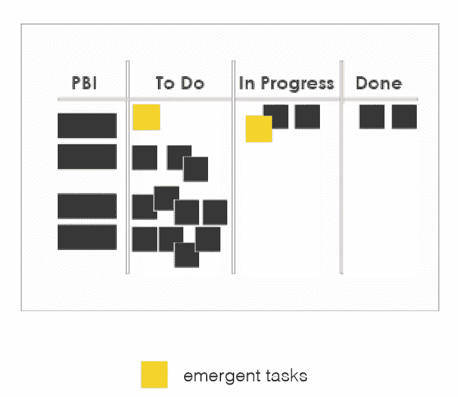

**会议**

在 Scrum 流程中，我们有以下会议:

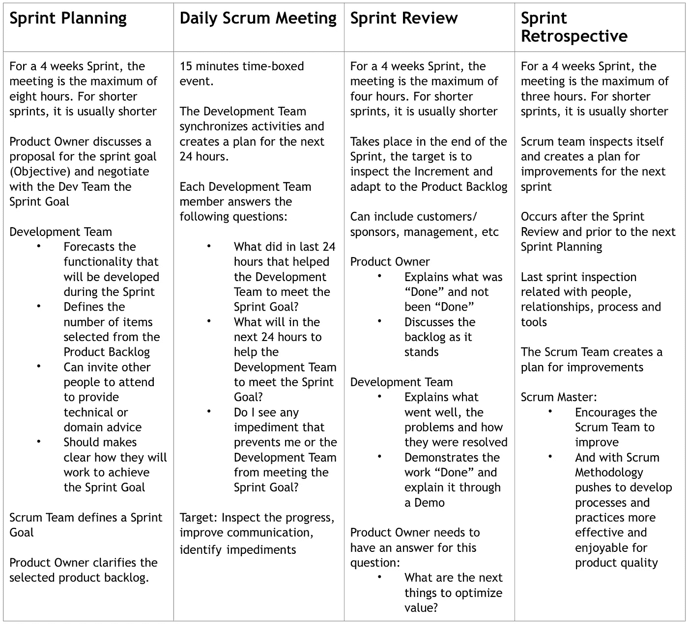

**结论**

我们可以有伟大的工具和伟大的方法，但我们总是需要伟大的人来带来价值

我们可以拥有最好的工具，比如 OutSystems，以及一个伟大的团队。但是如果我们在一个复杂项目的开始就计划好一切，没有清楚地了解所有的细节，我们就不能在项目过程中适应。因此，在最终测试中，很可能会遇到用户的以下意见:

*   我们不会使用这些功能，它们没有意义
*   这不是我问的
*   这不是那样的

因此，客户认为我们没有能力，而我们在项目中尽了最大努力。这是不公平的情况！

伟大的团队，伟大的工具(如 OutSystems)，伟大的工作方法(如 Scrum Framework)将为我们提供一个美好的场景来实现它！