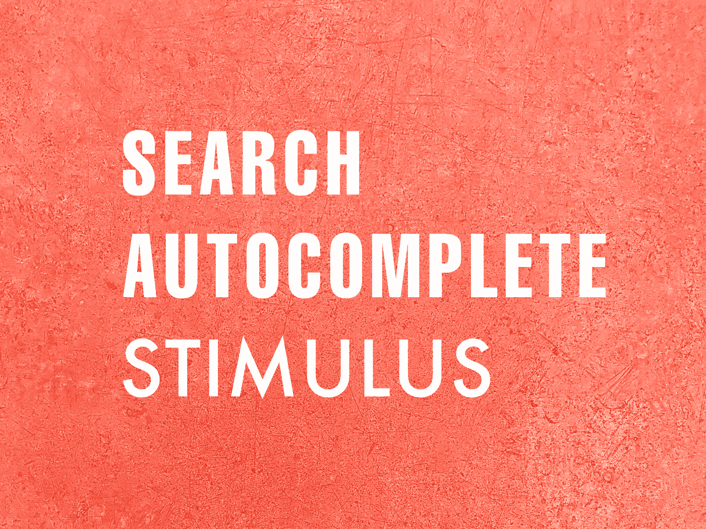
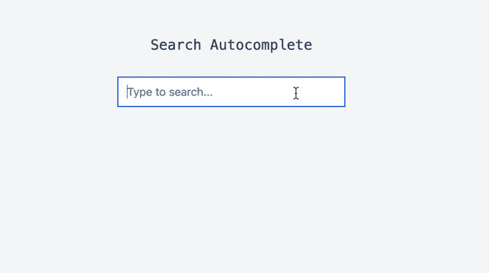
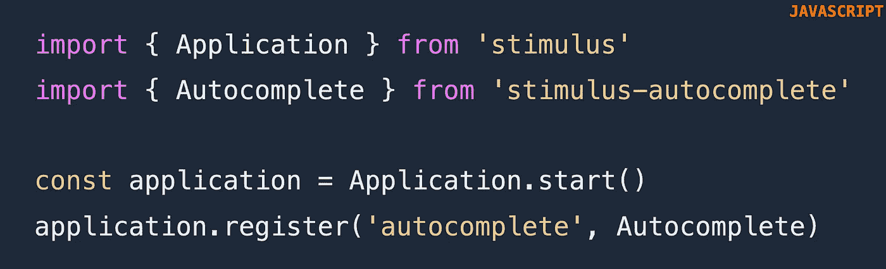
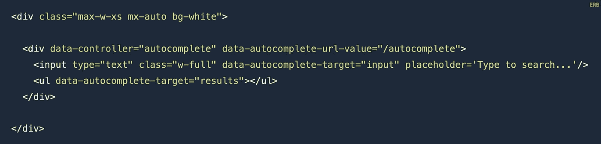
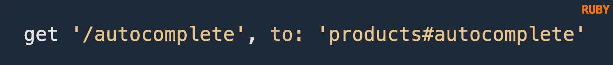
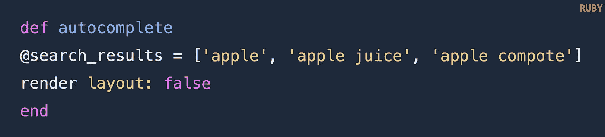
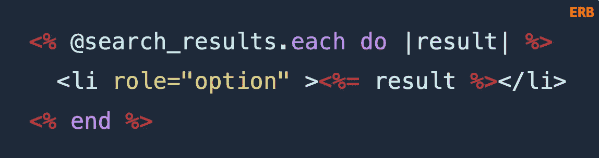

# 搜索自动完成刺激

> 原文：<https://itnext.io/search-autocomplete-stimulus-4e941df54d39?source=collection_archive---------6----------------------->

在下拉列表中查看搜索结果

作者图片

# 介绍

了解如何设置刺激搜索自动完成。用户在输入字段中键入内容后，可以看到查询结果。刺激自动完成库是一个刺激控制器，为自动完成提供了一个简单的解决方案。

# 开始之前

确保你安装了刺激装置。检查 package.json 文件或运行`yarn why stimulus`。如果尚未安装刺激装置，请遵循[文档](https://stimulus.hotwire.dev/handbook/installing)。

# 1.安装软件包

将[刺激自动完成](https://github.com/afcapel/stimulus-autocomplete)添加到您的项目
`yarn add stimulus-autocomplete`

# 2.导入库

添加到 **index.js** 文件

# 3.添加基本 HTML 布局

让我们添加一个包装器来缩小输入字段和搜索结果。

*   **data-controller = " autocomplete "**将导入的控制器作用于 div
*   **数据-自动完成-URL-值**设置获取搜索结果的路径
*   **data-autocomplete-target = " input "**监听键盘变化并读取输入字段
*   **data-autocomplete-target = " results "**是用于注入结果列表项的包装器

# 4.创建路线

`get '/autocomplete' , to: 'products#autocomplete'`

获取应该在用户类型中显示的 HTML 搜索结果

# 5.创建控制器方法

Layout false 确保只返回普通的 HTML。不包括头和元数据。准确地说，搜索结果应该只显示文本。

# 6.创建结果视图

在与创建的路线
*产品/_autocomplete.html.erb* 相匹配的 HTML 视图中显示搜索结果

# 结论

Stimulus 通过在页面上散布 JavaScript 来证明它的价值，不需要太多定制的 JavaScript。利用预构建组件，开发人员可以很容易地为 HTML 主导的 web 应用程序带来交互性。

这篇文章对你有帮助吗？你可能也会喜欢我的其他刺激文章:

*   [用刺激组件建造一个光廊](/build-a-light-gallery-with-stimulus-components-84ba56f3cee9?sk=927f8f7753ae4f073be84feaa8ac313e)
*   [用刺激组件搭建一个旋转木马](https://medium.com/better-programming/build-a-carousel-with-ruby-on-rails-and-the-stimulus-components-library-22b1b5e1e682?sk=50c1b58f427632b403f8db8e7cad2aed)