# 搜索和最小-最大:114 C++算法系列

> 原文：<https://itnext.io/searching-and-min-max-the-114-c-algorithms-series-8a6ed951ad40?source=collection_archive---------0----------------------->

欢迎来到 114 C++算法系列的第八部分。今天，我们将讨论查找特定元素或计算匹配元素数量的搜索算法和最小-最大算法。

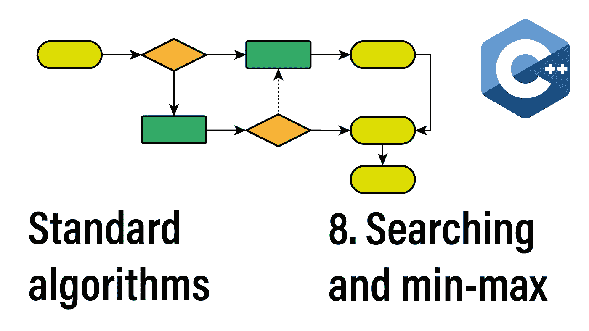

# 该系列:

*   [简介](/the-114-standard-c-algorithms-introduction-2a75a2df4300)
*   [排序和分割算法](/sorting-partitioning-the-114-c-algorithms-series-6503ad41cede)
*   [对排序或分区范围进行操作的算法](/divide-conquer-and-sets-the-114-c-algorithms-series-d0085a38046e)
*   [转换算法](/transformations-the-114-c-algorithms-series-deacdbd4c373)
*   [左侧折叠和其他缩减](/left-folds-and-other-reductions-the-114-c-algorithms-series-6195724d324)
*   [生成器、复制和移动](/generators-copies-and-moves-the-114-c-algorithms-series-1d0774472877)
*   [堆和堆](/heap-and-heap-the-114-c-algorithms-series-1d4215ae9f0d)
*   搜索和最小值-最大值
*   结论(即将发布)

我们今天将讨论的搜索和最小-最大算法都是线性运算，复杂度为 *O(n)* (在单个范围上运算时)或 *O(m*n)* (在两个范围上运算时)。我们已经在第三篇文章中介绍了更快的查找算法。

# 找，找 _ 如果，找 _ 如果 _ 不

std::find 算法提供了一个基本的线性搜索。该标准提供了三种变体，一种是按值搜索，另两种是使用谓词的变体。

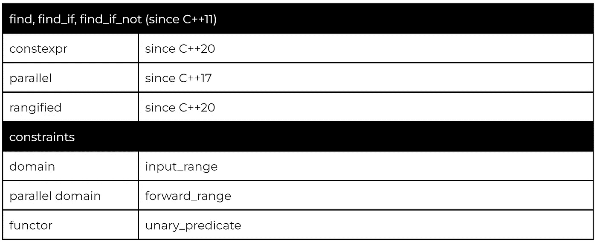

按值搜索的典型示例是查找分隔符:

因为 *std::find_if* 和 *std::find_if_not* 使用谓词比较元素，所以我们可以搜索值的类别。在这个例子中，我们使用 *std::find_if_not* 从任意方向查找第一个非空白字符:

# 相邻 _ 查找，搜索 _n

顾名思义， *std::adjacent_find* 在范围内搜索相邻元素。

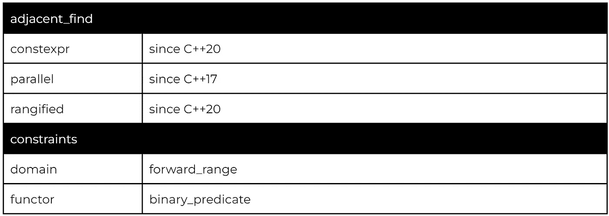

基本版本使用*操作符==* 或二元谓词(如果提供的话)搜索一对相邻的元素。在任何一种情况下，迭代器都会将该对返回到两个元素中的第一个。

如果要搜索两个以上连续相等的元素，可以使用 *std::search_n* 。

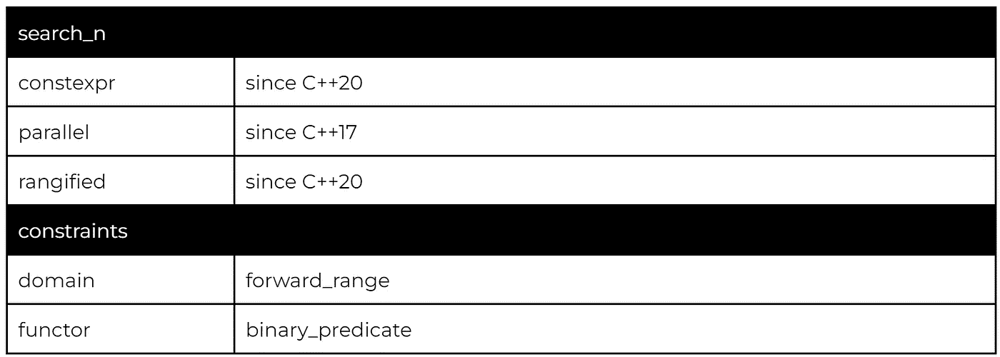

该算法接受所需的实例数和要比较的值。如果找到，使用迭代器将序列返回到序列的第一个元素。

请注意， *std::search_n* 的行为不符合典型的命名。范围仍然完全使用一个*开始*和*结束*迭代器来指定。 *_n* 表示实例的数量。

# find_first_of

使用 *std::find_if，*我们可以很容易地搜索一类元素。然而，有时更方便的是详尽地列出我们正在寻找的元素。

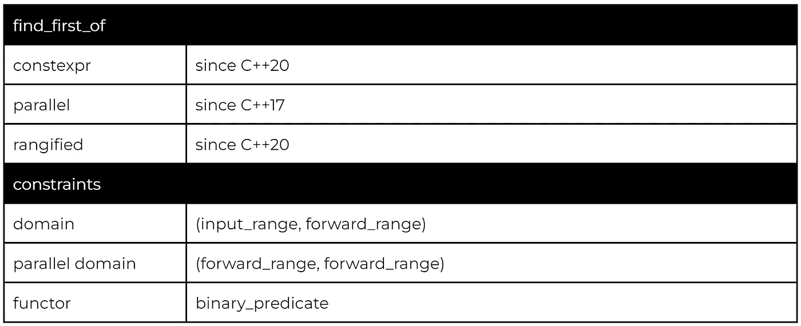

请注意，我们正在从线性搜索转移到 *O(m*n)* 时间复杂度，因为对于第一范围的每个元素，我们需要将其与第二范围中的所有元素进行比较(最坏情况)。

# 搜索，查找 _ 结束

最后，我们得出在序列中搜索子序列的算法。

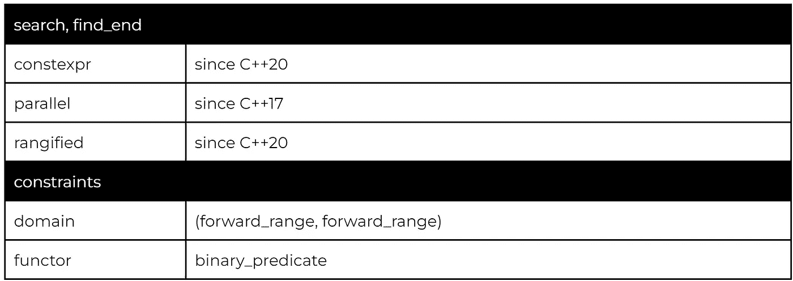

*std::search* 返回子序列的第一个实例，而 *std::find_end* 返回子序列的最后一个实例。

## 搜索者

从 C++17 开始，我们也可以为搜索算法指定自定义的搜索器。除了基本的一个，标准实现了 Boyer-Moore 和 Boyer-Moore-Horspool 字符串搜索器，提供不同的最佳情况、最差情况和平均复杂性。

# 计数，count_if

*std::count* 和 *std::count_if* 算法计算匹配元素的数量。

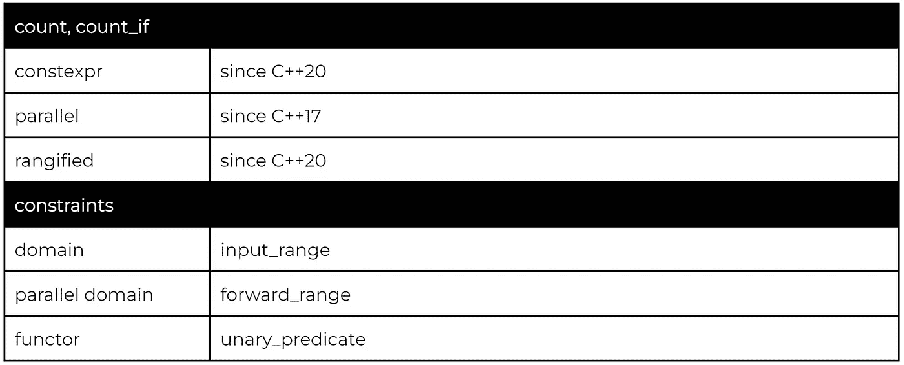

可以使用值或谓词指定要搜索的元素。

# 相等，不匹配

在[之前的一篇文章](/sorting-partitioning-the-114-c-algorithms-series-6503ad41cede)中，我们使用*STD::lexicordial _ compare*和*STD::lexicordial _ compare _ three _ way*讨论了词典比较。 *std::equal* 和 *std::mismatch* 算法提供了一个更简单的等式比较，其中 *std::equal* 返回一个简单的布尔值，而 *std::mismatch* 返回一对表示不匹配元素的迭代器。

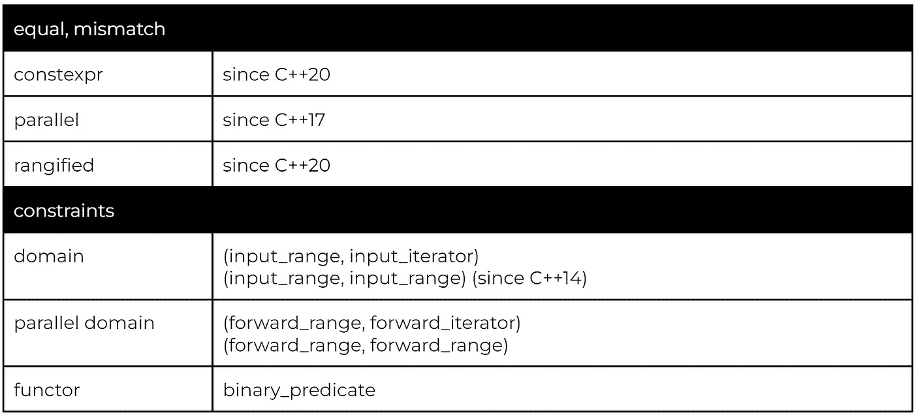

默认的*操作符==* 可以被两种算法的二元谓词所取代。

*std::mismatch* 算法返回一对底层元素不匹配的迭代器。

*std::equal* 和 *std::mismatch* 都提供了指定第二范围的两个变量。这里的区别很重要。如果我们使用迭代器指定第二个范围，我们无法检测到范围大小的不匹配。

# 夹子

*std::clamp* 算法是少数不在范围内操作的算法之一。

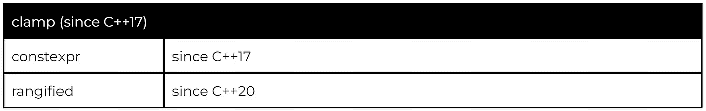

箝位算法将给定值箝位在提供的最小值和最大值之间:

*   如果*值<最小值*，则 *std::clamp* 返回最小值
*   如果*最大值<值*， *std::clamp* 返回最大值
*   否则， *std::clamp* 返回值

# 最小，最大，最小最大

第一组最小-最大算法也不对范围进行操作(C++20 范围变量除外)。

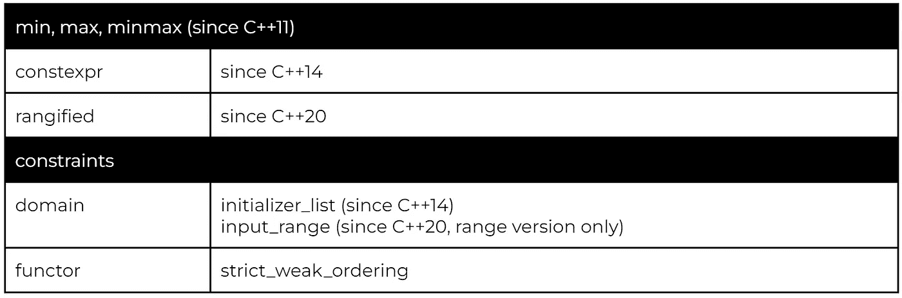

直到 C++14，唯一可用的变体只对两个元素进行操作，返回一个 const-reference。然后，C++14 标准引入了一个在初始化列表上操作的变体，它通过值返回。最后，C++20 引入了一个范围变量，它对输入范围进行操作，并按值返回。

# 最小元素，最大元素，最小最大元素

最小-最大算法的元素版本在范围上操作，而不是通过常量引用或值返回，返回最小或最大元素的迭代器。

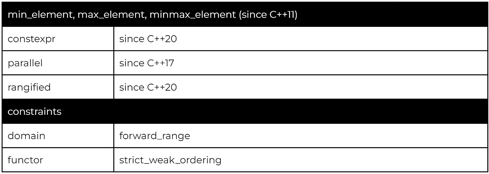

所有变量都需要 *forward_range* ，因为它们将迭代器返回给最小-最大元素，而不是一个值。

# 感谢您的阅读

本系列还会有一篇文章介绍 C++未来版本的特性，所以不要忘了继续关注。

我也在 YouTube 上发布视频。你有问题吗？在 Twitter 或 LinkedIn 上联系我。