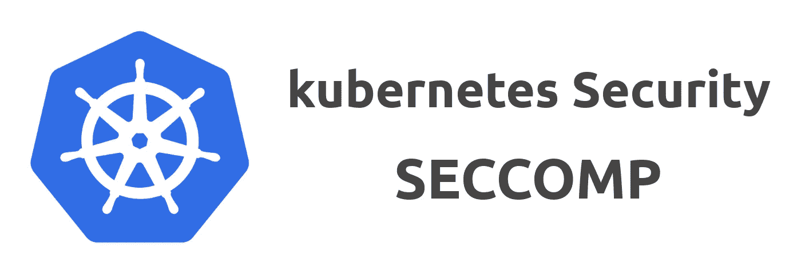
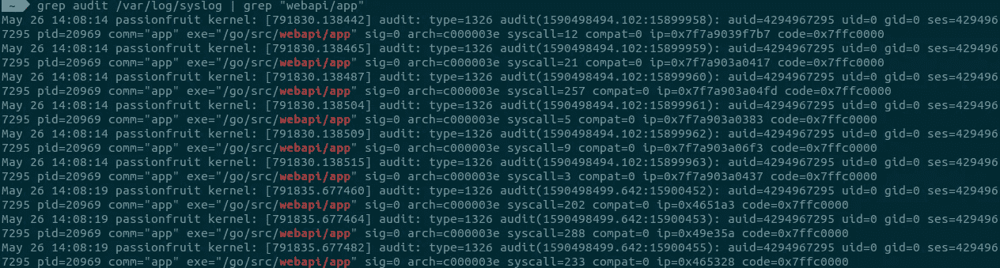
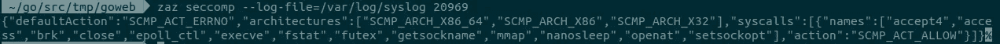
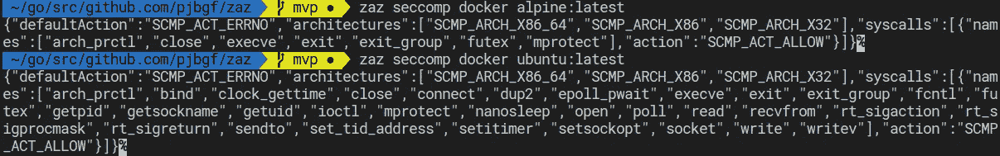

# Kubernetes 中的 Seccomp—第 2 部分:为您的应用程序制作定制的 sec comp 配置文件

> 原文：<https://itnext.io/seccomp-in-kubernetes-part-2-crafting-custom-seccomp-profiles-for-your-applications-c28c658f676e?source=collection_archive---------0----------------------->



## 这是关于如何在不诉诸魔法或巫术的情况下为您的工作负载获得出色的 seccomp 配置文件的系列文章中的第二篇。这次要亲自动手了！

在本系列第 1 部分的[之后，我们应该能够切换齿轮并开始创建一些 seccomp 配置文件。提醒一下，如果您关注最低权限、范围良好的概要文件，您可能会关注在容器级别应用它们。否则，你可能会以更大的轮廓告终，正如我在本期](/seccomp-in-kubernetes-part-i-7-things-you-should-know-before-you-even-start-97502ad6b6d6)的[中强调的那样。](https://github.com/kubernetes/kubernetes/issues/84623)

# 我该从何说起呢？

seccomp 配置文件只不过是一个系统调用的列表，这些系统调用具有与之相关的操作，这可以有效地将它列为黑名单或白名单，后者是推荐的方法。

获取应用程序在幕后进行的所有系统调用的列表是问题所在。主要原因是:

*   您的应用程序中可能有很少执行的边缘场景，这可能需要非常具体的系统调用。只有在评估整个执行路径时，才能检测到这些系统调用。
*   您的依赖项也可能会进行系统调用。从与应用程序相关的依赖项中精确地枚举执行路径可能不是一件小事。
*   在“投诉模式”(即使用动作`SCMP_ACT_LOG`)下运行您的配置文件可能不会记录所有系统调用。
*   使用 seccomp 配置文件运行且没有任何错误的容器，*可能仍会*阻止合法调用，这可能会导致长时间运行时出现问题。

# 好吧，但是我该怎么做呢？

有几种不同的方法可以帮助列出应用程序的系统调用。没有一个是完美的，但结合起来就足够好了。下面是我偶然发现的一些例子:

# 1.通过跟踪或 BPF 附加到进程

像`strace`这样的工具允许你执行一个命令并理解它发出的所有系统调用。如果您要创建一个配置文件来允许一个容器对一个网站执行 ping 操作，那么`strace`命令应该是这样的:

```
strace -fqc ping -c 20 [www.google.com](http://www.google.com)% time     seconds  usecs/call     calls    errors syscall
------ ----------- ----------- --------- --------- ----------------
 29.55    0.000078           4        20        11 openat
 14.02    0.000037           9         4         4 socket
 11.74    0.000031           3        12           mprotect
  6.06    0.000016           2         7           read
  5.68    0.000015           1        17           mmap
  5.68    0.000015           3         5           capget
  4.92    0.000013          13         1           munmap
  3.79    0.000010           1         9           fstat
  3.41    0.000009           9         1           write
  3.41    0.000009           1         9           close
  2.65    0.000007           2         3           brk
  2.65    0.000007           4         2           prctl
  2.27    0.000006           3         2           getuid
  1.52    0.000004           4         1           setuid
  1.52    0.000004           4         1           capset
  1.14    0.000003           3         1           geteuid
  0.00    0.000000           0         9         9 access
  0.00    0.000000           0         1           execve
  0.00    0.000000           0         3           fcntl
  0.00    0.000000           0         1           arch_prctl
------ ----------- ----------- --------- --------- ----------------
100.00    0.000264                   109        24 total
```

这不会产生非常精确的结果。例如，`capset`和`setuid`并不是容器执行该命令的必要系统调用，我们将在后面看到。

类似的方法是使用 [OCI 赛康 BPF 钩](https://github.com/containers/oci-seccomp-bpf-hook)，它将通过 OCI 钩触发，使用 BPF 检查您的集装箱。当你在运行容器的时候有一堆测试用例时，这是非常有用的。

但是，我不建议在生产环境中运行这个来生成您的 seccomp 概要文件。这是因为为了检查您的工作负载而给予第三方容器高权限(即`CAP_SYS_ADMIN`)会产生相反的效果，因此您可以使用最低特权配置文件运行自己的应用程序。

当您的用例非常具体时(例如`ping`)，这两种方法都会很有帮助。但是后者可能更适合复杂的应用程序。

# 2.检查代码/中间语言

另一种方法是检查应用程序的代码或其程序集，试图枚举所有正在进行的系统调用。不过，我不建议手动这么做。

我为 golang 二进制文件创建了一个简单的应用程序,结果如下:

```
$ **zaz seccomp main**
{
    "defaultAction": "SCMP_ACT_ERRNO",
    "architectures": [
        "SCMP_ARCH_X86_64",
        "SCMP_ARCH_X86",
        "SCMP_ARCH_X32"
    ],
    "syscalls": [
        {
            "names": [
                "arch_prctl",
                "bind",
                "close",
                "epoll_ctl",
                "exit_group",
                "fcntl",
                "fstat",
                "futex",
                "getpgrp",
                "getpid",
                "gettid",
                "madvise",
                "mmap",
                "openat",
                "read",
                "readlinkat",
                "rt_sigaction",
                "rt_sigprocmask",
                "sched_yield",
                "setsockopt",
                "tgkill",
                "write"
            ],
            "action": "SCMP_ACT_ALLOW"
        }
    ]
}
```

该应用代码是:

```
package mainimport (
        "fmt"
        "net/http"
        "os"
)func main() {
        val := os.Getenv("test")
        fmt.Printf("contents of $test: %s\n", val)fs := http.FileServer(http.Dir("."))
        http.Handle("/fs/", http.StripPrefix("/fs/", fs))
        http.HandleFunc("/", rootHandler)fmt.Println("server started at port 8088")
        err := http.ListenAndServe(":8088", nil)
        if err != nil {
                panic(err)
        }
}func rootHandler(w http.ResponseWriter, r *http.Request) {
        fmt.Fprintf(w, "Hello...")
}
```

稍后我将在容器中使用它。作为参考，下面是我使用的 Dockerfile:

```
FROM golang:1.14 as build
WORKDIR /go/src/webapiADD . .
RUN go build -o app main.goFROM golang:1.14
WORKDIR /go/src/webapiENV test=somevalue
COPY --from=build /go/src/webapi/app .CMD ["/go/src/webapi/app"]
```

回到我们的例子，`zaz`遍历了应用程序及其依赖项的“执行路径”。对于依赖项，它只考虑了将由您的执行路径执行的代码部分。

结果似乎是一个良好的开端，然而，这并不是全貌。对于您的最终概要文件，您可能还需要添加运行基本映像所需的系统调用，我将在“制作 seccomp 概要文件”一节中介绍。

# 3.抱怨模式

Seccomp 还支持“抱怨模式”，在这种模式下，它记录被调用的系统调用，而不是阻塞它们。

尝试从该模式获取配置文件的一个常见问题是，默认情况下它是节流的。为了最大限度地利用它，我建议调整日志节流，这样您可以获得比平时更多的调用。在 Ubuntu 上，您可以使用以下命令检查/调整节流:

```
**# List existing configuration**
$ sudo sysctl -a | grep net.core.message
net.core.message_burst = 10
net.core.message_cost = 5**# Set burst and cost to zero**
sudo sysctl -w net.core.message_burst=0
sudo sysctl -w net.core.message_cost=0
```

在这种情况下，只需定义默认操作即可创建“投诉模式”seccomp 配置文件:

```
{
    "defaultAction": "SCMP_ACT_LOG"
}
```

请注意，不阻止高风险呼叫，可能会使您的主机容易受到恶意容器的攻击。因此，请谨慎使用。一个潜在的方法是阻止高风险的呼叫，同时记录所有其他内容。

使用“抱怨模式”查找系统调用的过程是:

**A .使用配置文件运行容器:**

```
docker run --rm --security-opt=**seccomp=complain-mode.json** --security-opt=**no-new-privileges** --expose 8088 --**cap-drop=ALL** sampleweb:latest
```

请注意，在上面的例子中，我是用 no-new-privileges 运行的，放弃了所有功能，并使用先前创建的概要文件。您的工作负载可能需要一些功能，如果不需要，请养成总是放弃它们的习惯。

**B .对应用程序运行测试:**

```
curl [http://172.17.0.2:8088](http://172.17.0.2:8088)
curl [http://172.17.0.2:8088/fs/](http://172.17.0.2:8088/fs/)
```

在这里，我只是评估我的两个端点。

**C .评估记录的呼叫:**

```
grep audit /var/log/syslog | grep "webapi/app"
```

结果应该是这样的:



要轻松提取所有这些系统调用 ID，您可以通过使用您在 syslog 上找到的 PID 来使用`zaz`:



**D .修改配置文件:**

使用 allow 操作将找到的所有系统调用添加到一个节中:

```
{
    "defaultAction": "SCMP_ACT_LOG",
    "architectures": [
        "SCMP_ARCH_X86_64",
        "SCMP_ARCH_X86",
        "SCMP_ARCH_X32"
    ],
    "syscalls": [
        {
            "names": [
                "accept4",
                "access",
                "brk",
                "close",
                "epoll_ctl",
                "execve",
                "fstat",
                "futex",
                "getsockname",
                "mmap",
                "nanosleep",
                "openat",
                "setsockopt"
            ],
            "action": "SCMP_ACT_ALLOW"
        }
    ]
}
```

这将确保 seccomp 只记录不在您的允许列表中的呼叫。

**E .从步骤 A 重新开始:**

不幸的是，在使用“抱怨模式”时，并不是所有的系统调用都会被一次记录下来。因此，您可能需要多次重复此过程，直到 syslog 上不再记录新条目。

此时，您可以将日志限制设置恢复为其原始值:

```
**# Reset burst and cost to original values**
sudo sysctl -w net.core.message_burst=10
sudo sysctl -w net.core.message_cost=5
```

值得注意的是，没有记录条目并不意味着您捕获了应用程序所依赖的所有系统调用，这就是这种方法本身并不完美的原因。

# 4.强力

使用前三种方法有时不足以制作赛康公司简介。考虑到这一点，我在`[zaz](https://github.com/pjbgf/zaz)`上创建了一个模块，它使用蛮力来达到给定工作负载所需的最小系统调用。

在执行过程中，它将尝试使用所有允许的系统调用运行容器，除了被评估的系统调用。如果它出错，`zaz`会将它标记为一个必要的调用，并在结束时返回。

它最有用的例子是当试图获得基本图像的最小轮廓时:



像`ubuntu`或`alpine`这样的基础映像可能有不同的 seccomp 需求。

它还支持在映像内部执行给定的命令:


但是为命令生成的配置文件可能不如简单基本映像那样准确。当这个[问题](https://github.com/pjbgf/zaz/issues/7)解决后，这种情况可能会改变。

# 制作 Seccomp 档案——将它们混合在一起

要获得细粒度的 seccomp 配置文件，您必须将上述几种方法结合起来。下面是我上面提到的应用程序的一个例子:

1.  **应用分析**

使用`zaz seccomp BINARY`对应用进行概要分析:

```
{"defaultAction":"SCMP_ACT_ERRNO","architectures":["SCMP_ARCH_X86_64","SCMP_ARCH_X86","SCMP_ARCH_X32"],"syscalls":[{"names":["arch_prctl","bind","close","epoll_ctl","exit_group","fcntl","fstat","futex","getpgrp","getpid","gettid","madvise","mmap","openat","read","readlinkat","rt_sigaction","rt_sigprocmask","sched_yield","setsockopt","tgkill","write"],"action":"SCMP_ACT_ALLOW"}]}
```

尝试使用生成的概要文件执行容器。它会失败，并显示以下错误:

```
$ docker run --rm --security-opt=**seccomp=webapp.json** --security-opt=**no-new-privileges** --expose 8088 --**cap-drop=ALL** sampleweb:lateststandard_init_linux.go:211: exec user process caused “operation not permitted”
```

**2。基础图像分析**

获取基础映像所需的系统调用，在本例中是 golang:1.14: `zaz seccomp docker golang:1.14`:

```
{"defaultAction":"SCMP_ACT_ERRNO","architectures":["SCMP_ARCH_X86_64","SCMP_ARCH_X86","SCMP_ARCH_X32"],"syscalls":[{"names":["arch_prctl","bind","clock_gettime","close","connect","dup2","epoll_pwait","execve","exit","exit_group","fcntl","futex","getpid","getsockname","getuid","ioctl","mprotect","nanosleep","open","poll","read","recvfrom","rt_sigaction","rt_sigprocmask","rt_sigreturn","sendto","set_tid_address","setitimer","setsockopt","socket","write","writev"],"action":"SCMP_ACT_ALLOW"}]}
```

将它们添加到现有的配置文件中。再次运行应用程序仍然会产生错误:

```
$ docker run --rm --security-opt=**seccomp=webapp.json** --security-opt=**no-new-privileges** --expose 8088 --**cap-drop=ALL** sampleweb:latestfatal error: uname failed
runtime: panic before malloc heap initializedruntime stack:
runtime.throw(0x6fd6de, 0xc)
        /usr/local/go/src/runtime/panic.go:1116 +0x72...
```

**3。以投诉模式运行**

将配置文件的默认操作更改为`SCMP_ACT_LOG`，并再次运行应用程序。对应用程序运行一些请求并获取进程 ID:

```
curl [http://172.17.0.6:8088](http://172.17.0.6:8088)
curl [http://172.17.0.6:8088/fs/](http://172.17.0.6:8088/fs/)
grep audit /var/log/syslog | grep "webapi/app"
```

运行`zaz seccomp --log-file=/var/log/syslog PID`产生几个更多的调用:

```
{"defaultAction":"SCMP_ACT_ERRNO","architectures":["SCMP_ARCH_X86_64","SCMP_ARCH_X86","SCMP_ARCH_X32"],"syscalls":[{"names":["accept4","getdents64","newfstatat"],"action":"SCMP_ACT_ALLOW"}]}
```

将新呼叫添加到配置文件中，然后再次运行应用程序。这个过程会持续几次，对我来说是两次:

```
# First result
{"defaultAction":"SCMP_ACT_ERRNO","architectures":["SCMP_ARCH_X86_64","SCMP_ARCH_X86","SCMP_ARCH_X32"],"syscalls":[{"names":["access","brk","mlock","munmap","prlimit64","sched_getaffinity","set_robust_list","uname"],"action":"SCMP_ACT_ALLOW"}]}# Second result
{"defaultAction":"SCMP_ACT_ERRNO","architectures":["SCMP_ARCH_X86_64","SCMP_ARCH_X86","SCMP_ARCH_X32"],"syscalls":[{"names":["clone","sigaltstack"],"action":"SCMP_ACT_ALLOW"}]}
```

将这些电话添加到配置文件中。重试时，syslog 上将不会出现新条目。

**4。处理未解决的错误**

将默认动作改为`SCMP_ACT_ERRNO`。再次运行应用程序，它仍然不工作。关于`epollcreate`的错误抱怨:

```
$ docker run --rm --security-opt=**seccomp=webapp.json** --security-opt=**no-new-privileges** --expose 8088 --**cap-drop=ALL** sampleweb:latestruntime: epollcreate failed with 1
fatal error: runtime: netpollinit failedgoroutine 1 [running]:
runtime.throw(0x70261e, 0x1b)
        /usr/local/go/src/runtime/panic.go:1116 +0x72...
```

将 syscalls `epoll_create`和`epoll_wait`添加到配置文件中，然后重试。出现了一个新错误:

```
$ docker run --rm --security-opt=**seccomp=webapp.json** --security-opt=**no-new-privileges** --expose 8088 --**cap-drop=ALL** sampleweb:latestruntime: pipe failed with 1
fatal error: runtime: pipe failedgoroutine 1 [running]:
runtime.throw(0x6fff05, 0x14)
        /usr/local/go/src/runtime/panic.go:1116 +0x72...
```

将`pipe`和`pipe2`添加到配置文件，然后重试。
这一次的错误报告了缺少监听套接字的权限:

```
$ docker run --rm --security-opt=**seccomp=webapp.json** --security-opt=**no-new-privileges** --expose 8088 --**cap-drop=ALL** sampleweb:latestpanic: listen tcp :8088: socket: operation not permittedgoroutine 1 [running]:
main.main()
        /go/src/webapi/main.go:20 +0x246
```

将`listen`和`socket`添加到配置文件，然后重试。终于成功了！

```
$ docker run --rm --security-opt=**seccomp=webapp.json** --security-opt=**no-new-privileges** --expose 8088 --**cap-drop=ALL** sampleweb:latestcontents of $test: somevalue
server started at port 8088
```

对我来说最后一秒钟是:

```
{
    "defaultAction": "SCMP_ACT_ERRNO",
    "architectures": [
        "SCMP_ARCH_X86_64",
        "SCMP_ARCH_X86",
        "SCMP_ARCH_X32"
    ],
    "syscalls": [
        {
            "names": [                "arch_prctl","bind","clock_gettime","close","connect","dup2","epoll_pwait","execve","exit","exit_group","fcntl","futex","getpid","getsockname","getuid","ioctl","mprotect","nanosleep","open","poll","read","recvfrom","rt_sigaction","rt_sigprocmask","rt_sigreturn","sendto","set_tid_address","setitimer","setsockopt","socket","write","writev","arch_prctl","bind","close","epoll_ctl","exit_group","fcntl","fstat","futex","getpgrp","getpid","gettid","madvise","mmap","openat","read","readlinkat","rt_sigaction","rt_sigprocmask","sched_yield","setsockopt","tgkill","write","accept4","getdents64","newfstatat",
                "access","brk","mlock","munmap","prlimit64","sched_getaffinity","set_robust_list","uname",
                "clone","sigaltstack",
                "epoll_create", "epoll_wait",
                "pipe", "pipe2",
                "listen", "socket"
            ],
            "action": "SCMP_ACT_ALLOW"
        }
    ]
}
```

我没有清理它以删除重复的调用，因为我想弄清楚哪些系统调用来自哪个交互，但是您可以在自己的界面上随意这么做。:)

这个例子关注一个简单的 web golang 应用程序，它不需要极高的特权。但是，同样的原则也可以用于其他特权更高的工作负载。

# 或者，使用通用配置文件模板:

在开发过程中不断地经历这个过程对于增加的安全性好处来说可能代价太高——比较非常严格的概要文件和比`runtime/default`更严格的通用概要文件。

如果您的应用程序正在积极开发中，或者您没有时间深入了解非常详细的配置文件，您可以使用基于您正在使用的应用程序类型的通用模板。如果您有几个类似的应用程序——具有相似依赖关系和行为的 web APIs，这可能特别有用。

为了更容易地创建这样的概要文件，我在`zaz`上添加了一个模块来返回 web 应用程序的通用概要文件:

```
zaz seccomp template web
```

这已经过 golang 应用程序的测试，运行良好。显然，一些工作负载可能需要额外的调用。如果你是这种情况，创建一个新的[问题](https://github.com/pjbgf/zaz/issues/new/choose)，我会确保它对社区来说足够通用。；)

如果情况变得更糟，您可以简单地使用`runtime/default`直到您的应用程序足够稳定，值得创建一个特定的 seccomp 概要文件。

# 关键要点

现在应该很清楚，构建 seccomp 配置文件不是一项简单的任务，但希望使用上面的不同工具会有所帮助。在此练习中，值得一提的要点是:

*   对于稳定的应用程序，最好使用粒度配置文件，否则您的工作负载可能会在生产中因边缘情况而中断。
*   当执行 seccomp 时，**无错误**或**无记录违规**，并不意味着没有调用系统调用。
*   当您的依赖关系发生变化时，您可能需要检查您的 seccomp 档案。
*   一些基本映像可能比其他映像需要更多的系统调用。

创建和维护您的 seccomp 配置文件是减少您的攻击面的方法之一。这可能有助于您检测您的[依赖项是否开始做它们不应该做的事情](/golang-stop-trusting-your-dependencies-a4c916533b04)。

# 下一步是什么…？

最近，我开始和一群热衷于让 seccomp 在 Kubernetes 上更容易使用的人一起工作。我们正在创建 seccomp-operator，这将使用户更容易管理他们的 seccomp 配置文件。如果你对此感兴趣，请加入 Kubernetes slack 频道: [seccomp-operator](https://kubernetes.slack.com/archives/C013FQNB0A2) 。

关于这个主题，我还想介绍很多，所以请继续关注。