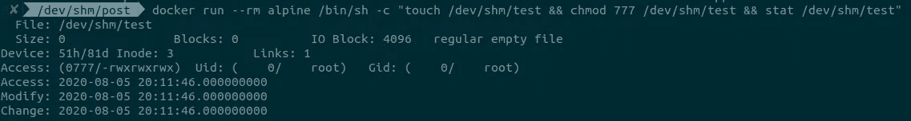
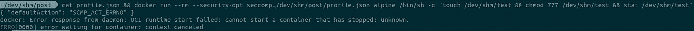
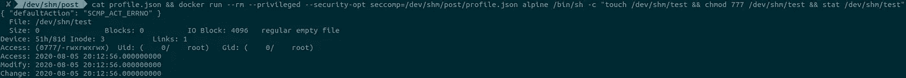

# Kubernetes 中的 Seccomp 第 3 部分:新语法和一些高级主题

> 原文：<https://itnext.io/seccomp-in-kubernetes-part-3-the-new-syntax-plus-some-advanced-topics-95dd3835263a?source=collection_archive---------3----------------------->


## 这是另一篇关于掌握为您的工作负载创建 seccomp 配置文件的技巧的文章，这次涵盖了新的 Seccomp GA 语法和其他一些高级主题。

在这一部分，我想覆盖几个孤立的点，希望它们一起能够给你的 seccomp 知识增加一点深度。

# Seccomp GA 终于…

早在 2016 年 [jessfrazz](https://github.com/jessfraz) [在 Kubernetes v1.3 中添加了 seccomp 支持](https://github.com/kubernetes/kubernetes/pull/25324)。它在 alpha 中停留了几年，尽管为此付出了大量不同的努力，直到它最终在本月的 v1.19 版本中正式发布——向参与这一旅程的所有人大声欢呼！

现有的基于注释的支持现已过时，将从 1.23 版的 Kubernetes 中删除。从现在起，您将能够在 Pod 或/和容器级别基于新字段`seccompProfile`添加 seccomp:

```
securityContext:
  seccompProfile:
    type: Localhost
    localhostProfile: my-seccomp-profile.json
```

`type`字段可以有三个值:`Localhost`、`Unconfined`和`RuntimeDefault`。字段`localhostProfile`允许从磁盘设置文件的路径。一些细节可以在[这里](https://kubernetes.io/docs/tasks/configure-pod-container/security-context/)找到。

# GA 来修复过去的问题

回到本系列的第一部分，我提到了我提出的一个 [bug](https://github.com/kubernetes/kubernetes/issues/84623) ,它表明在 pod 级别应用的 seccomp 概要文件总是比在容器级别实现的概要文件更贪婪。

这个问题现在已经解决了，解决方案是将一个默认的 seccomp 配置文件应用到沙盒容器中，它现在将总是与 seccomp 配置文件`RuntimeDefault`一起运行。

从 Kubernetes v1.19 开始，在 pod 或 container 级别定义 seccomp 配置文件几乎没有区别。现在，可以单独考虑其他因素来做出决定，比如您是否计划将边车添加到 pod，以及您想要对它们施加什么限制——如果有的话。

# 特权阶层没有特权！

我最近试图从 Weavework 为 [kured](https://github.com/weaveworks/kured) 创建一个 seccomp 配置文件。这种努力很快就停止了，因为我意识到特权容器总是忽略它的 seccomp 设置，当容器运行时是 docker 或 [CRI-O](https://github.com/cri-o/cri-o/blob/5a8632313b31ffb219695093e739e5263d54bed9/server/container_create_linux.go#L712) 时，它就作为`unconfined`运行(其他的也可能)。这与 AppArmor 的用法不一致，AppArmor 仍然可以在特权工作负载上应用定制的概要文件。

下面是一个简单的例子，当你试图创建一个文件，改变它的模式，然后测试结果。没有 seccomp 也能正常工作:



应用“block all”sec comp 会使容器失败，这是此处的预期行为:



然而，如果容器作为`--privileged`运行，则 seccomp 配置文件将被完全忽略:



这里要记住的关键点是，对特权容器要格外小心，因为你很少有安全控制来检查它们，这将总是使它们成为更大的目标—在威胁建模时要记住这一点。

# 通过功能控制系统调用

Seccomp 过滤器也可以由 Linux 功能来控制，只有当容器以给定的功能运行时，才会添加这些功能。例如，默认配置文件门`reboot`具有`CAP_SYS_BOOT`功能:

```
{
   "names": [
    "reboot"
   ],
   "action": "SCMP_ACT_ALLOW",
 **"includes": {
    "caps": [
     "CAP_SYS_BOOT"
    ]
   },**
   "excludes": {}
}
```

因此，尽管它被标记为允许，但只有当它也具有该功能时，该过滤器才会被添加到容器中。没有这种能力，呼叫将被阻塞。

# 结构

Seccomp 概要文件是使用 syscall 名称创建和部署的，这样更容易理解它们的意图。但是，它们是基于它们实际的 syscall**id**来应用的，这些 id 会根据运行的架构(x64、x86、arm、arm64 等)而有所不同。例如，系统调用`sys_reboot`对于架构有不同的 id:x64(169)和 ARM (88)和 ARM64 (142)。

如果定义 none，最终结果将取决于容器运行时选择如何实现 seccomp。为了获得跨运行时的更可预测的结果，总是要为您的概要文件定义目标架构。

# MinKernel

另一个强大的特性是只有在安全的情况下才允许系统调用。一个例子是在内核 4.8 之前容易被 seccomp 绕过的`ptrace`——一个 PoC 漏洞可以在[这里](https://gist.github.com/thejh/8346f47e359adecd1d53)找到。记住这一点，默认的 seccomp 配置文件只允许在高于该版本的内核上运行时使用`ptrace`:

```
{
   "names": [   "ptrace"   ],
   "action": "SCMP_ACT_ALLOW",
 **"includes": {
     "minKernel": "4.8"
   },**
   "excludes": {}  
},
```

当创建较小的 seccomp 配置文件时，一定要考虑到这一点，因为在较旧的内核上运行时，较小的 seccomp 可能会变得无用。

# 不同类型的行动

下面列出了所有不同类型的操作及其作用:

```
**SCMP_ACT_KILL_THREAD** (or **SCMP_ACT_KILL**)
Does not execute the syscall and terminate the thread that attempted making the call. Note that depending on the application being enforced (i.e. multi-threading) and its error handling, syscalls blocked using this action may do so silently which may result in side effects on the overall application.**SCMP_ACT_TRAP** Does not execute the syscall. The kernel will send a *thread-directed* SIGSYS signal to the thread that attempted making the call.**SCMP_ACT_ERRNO** Does not execute the syscall, returns error instead. Note that depending on the error handling of the application being enforced, syscalls blocked using this action may do so silently which may result in side effects on the overall application.**SCMP_ACT_TRACE** The decision on whether or not to execute the syscall will come from a tracer. If no tracer is present behaves like **SECCOMP_RET_ERRNO**.
This can be used to automate profile generation and also can be used to change the syscall being made. Not recommended when trying to enforce seccomp to line of business applications.**SCMP_ACT_ALLOW** Executes the syscall.**SCMP_ACT_LOG** (since Linux 4.14)
Executes the syscall. Useful for running seccomp in "complain-mode", logging the syscalls that are mapped (or catch-all) and not blocking their execution. It can be used together with other action types to provide an allow and deny list approach.**SCMP_ACT_KILL_PROCESS** (since Linux 4.14)
Does not execute the syscall and terminates the entire process with a core dump. Very useful when automating the profile generation.
```

**SCMP_ACT_ALLOW** 和 **SCMP_ACT_ERRNO** 都是对最终轮廓最有用的动作。而 **SCMP_ACT_KILL_PROCESS** 和 **SCMP_ACT_LOG** 在自动生成 seccomp 配置文件时会更有用。

今天就到这里吧，伙计们！:)

参考资料:

[https://github . com/Moby/Moby/blob/master/profiles/sec comp/default . JSON](https://github.com/moby/moby/blob/master/profiles/seccomp/default.json)