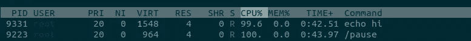
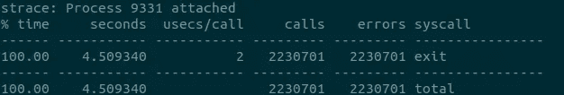

# Kubernetes 中的 Seccomp 第一部分:开始之前你应该知道的 7 件事！

> 原文：<https://itnext.io/seccomp-in-kubernetes-part-i-7-things-you-should-know-before-you-even-start-97502ad6b6d6?source=collection_archive---------0----------------------->


## 这是关于如何在不使用魔法或巫术的情况下以 SecDevOpsy 方式获得优秀 seccomp 个人资料的系列文章中的第一篇。在第一部分中，我将介绍 Kubernetes seccomp 实现的基础和内部原理。

Kubernetes 生态系统有相当多的安全特性来保持你的容器安全和隔离。在这里，我将讨论安全计算模式(又名 **seccomp** )特性，它主要限制容器能够执行的系统调用。

为什么这很重要？嗯，容器实际上只是一个在给定机器内部运行的进程。它与所有其他应用程序共享内核。如果所有容器都能够进行任何系统调用，那么恶意程序很快就会绕过容器隔离并影响其他应用程序—窃听信息、更改系统级设置等。

您的 seccomp 配置文件定义了应该允许或阻止哪些系统调用，容器运行时将在容器启动时应用，以便内核可以强制执行。一旦应用，您就有效地减少了您的攻击面，并限制了在您的容器内的任何东西(即，您的依赖项，或它们的依赖项……)开始做它们不应该被允许做的事情时的损害。

# 了解基本情况

一个基本秒钟有三个关键要素:第`defaultAction`、`architectures`(或`archMap`)和`syscalls`:

`defaultAction`定义了对于没有在`syscalls`部分列出的任何系统调用，默认情况下会发生什么。为了简单起见，让我们把重点放在您将使用的两个主要值上:`SCMP_ACT_ERRNO`将阻止系统调用的执行，而`SCMP_ACT_ALLOW`执行它在 tin 中所说的内容。

元素`architectures`定义了你的目标架构。这很重要，因为在内核级应用的实际过滤器是基于系统调用 id，而不是您在配置文件中定义的名称。容器运行时会在应用它之前将其转换成 id。这一点的重要性在于，系统调用可能有不同的 id，这取决于它们运行的架构。例如，用于从套接字接收信息的系统调用`recvfrom`在 x64 系统中是 id `45`，而在 x86 系统中是 id `517`。[这里的](https://github.com/torvalds/linux/blob/master/arch/x86/entry/syscalls/syscall_64.tbl)是 x86-x64 的所有系统调用的列表。

`syscalls`是您列出所有系统调用和与它们相关的动作的地方。例如，您可以通过将`defaultAction`设置为`SCMP_ACT_ERRNO`并将 syscalls 部分中的动作设置为`SCMP_ACT_ALLOW`来创建一个白名单。通过这种方式，你可以将所有你列举的呼叫列入白名单，并阻止其他所有呼叫。对于黑名单方法，恢复`defaultAction`和`action`的值。

现在让我们换个话题，讨论一下那些可能不太明显的部分。但是在此之前，请注意下面的建议假设您正在将业务线应用程序部署到 Kubernetes 中，并且以最小特权运行对您来说非常重要。

# 1.AllowPrivilegeEscalation = false

在容器的 SecurityContext 中有一个名为 AllowPrivilegeEscalation 的设置。当这个设置为`false`时，你的容器将使用 [no_new_priv](https://www.kernel.org/doc/Documentation/prctl/no_new_privs.txt) 位`on`运行。这有效地做了它在 tin 中所说的，它阻止容器跨越比它自己有更多特权的新进程。

当这个设置为`true`(默认设置)时的另一个副作用是，容器运行时将在容器启动过程的早期应用您的 seccomp 概要文件。因此，运行时内部流程运行所需的所有系统调用，比如设置容器用户/组 id 和删除功能，都必须在您的配置文件中加入白名单。

所以对于一个简单执行`echo hi`的容器，你需要这样:

而不是这个:

不过话说回来，为什么这是个问题？嗯，我个人会避免将这些系统调用列入白名单，如果我不使用它们的话:`capset`、`set_tid_address`、`setgid`、`setgroups`和`setuid`。然而，真正的问题是需要将您完全无法控制的进程列入白名单，将您的概要文件与容器运行时实现联系起来。也就是说，您(或者很可能是您的云提供商)更新了您的容器运行时，突然之间您的容器不能再启动了。

**专业提示#1** :使用`AllowPrivilegeEscaltion=false`运行容器。这将使您的 seccomp 概要文件变得更小，受容器运行时变化影响的可能性更小。

# 2.在容器级别设置 seccomp 配置文件

设置 seccomp 配置文件时，您可以选择在 pod 级别进行设置:

```
annotations:
  seccomp.security.alpha.kubernetes.io/pod: "localhost/profile.json"
```

或者在容器级别:

```
annotations:
  container.security.alpha.kubernetes.io/<container-name>: "localhost/profile.json"
```

*请注意，当 Kubernetes sec comp*[*变成 GA*](https://github.com/kubernetes/enhancements/pull/1148) *时，上面的语法会发生变化。*

一件不太为人所知的事情是，历史上 Kubernetes 总是有一个[错误](https://github.com/kubernetes/kubernetes/issues/84623)，它迫使 seccomp 配置文件应用于[暂停容器](https://www.ianlewis.org/en/almighty-pause-container)。虽然这被运行时抽象掉了，但是您的 pod 确实有这个容器，因为它是用来设置 pod 基础设施的。

问题是，这个容器总是用`AllowPrivilegeEscalation=true`来执行，这导致了我们在第一点上讨论过的同样的问题，你没有办法改变这一点。

通过在容器级别设置您的 seccomp，您可以避免这个陷阱，并且能够创建一个主要关注您的容器的概要文件。在 bug 被修复并推出新版本(可能是 1.18？)广泛提供给用户。

**Pro tip #2** :在容器级别设置您的 seccomp 配置文件。

根据经验，这一点通常是对以下问题的一个很好的回答:“为什么我的 seccomp 概要文件可以与`docker run`一起工作，但在部署到 Kubernetes 集群中时却不能？”

# 3.使用运行时/默认作为最后手段

Kubernetes 目前有两个内置概要文件选项:`runtime/default`和`docker/default`。两者都是由容器运行时实现的，而不是由 Kubernetes 实现的。因此，它们可能会根据您使用的运行时/版本而有所不同。

因此，通过简单地改变运行时，你的容器可能有一组不同的系统调用，它可能使用也可能不使用。docker [实现](https://github.com/moby/moby/blob/master/profiles/seccomp/default.json)是大多数运行时使用的，如果你想使用这个概要文件，确保你对它所包含的内容感到满意。

从 Kubernetes 1.11 开始，不推荐使用概要文件`docker/default`，所以请避免使用它。

在我看来，`runtime/default`概要文件对于它的创建目的来说是很棒的:保护用户在他们自己的机器上运行`docker run`命令，并潜在地危害他们的机器。然而，当涉及到在 Kubernetes 集群中运行的业务线应用程序时，我认为这种配置文件过于开放，开发人员应该专注于创建特定于应用程序(或应用程序类型)的配置文件。

**Pro tip #3** :创建特定应用的 seccomp 配置文件。如果做不到这一点，可以使用应用程序类型 seccomp 配置文件，例如创建一个包含所有 golang web api 应用程序的超集配置文件。万不得已使用`runtime/default`。

在以后的文章中，我将介绍如何以一种 SecDevOpsy 的方式创建 seccomp 概要文件，并通过您的管道自动化和测试它们。这样你就没有借口不去找特定应用的资料了。；)

# 4.不受限制不应该是一个选项

Kubernetes 的第一次安全审计发现的一件事是 [seccomp 默认被禁用](https://github.com/kubernetes/kubernetes/issues/81115)。这意味着，除非您创建一个 [PodSecurityPolicy](https://raw.githubusercontent.com/kubernetes/website/master/content/en/examples/policy/restricted-psp.yaml) 在您的集群中启用它，否则所有未指定 seccomp 配置文件的 pods 将自动与`seccomp=unconfined`一起运行。

在这种模式下运行意味着保护集群的隔离层减少了一层，安全社区建议不要这样做。

**Pro tip #4** :集群中的任何容器都不应该作为`seccomp=unconfined`运行，特别是在生产环境中。

# 5."审计模式"

这一点并不是 Kubernetes 独有的，但它属于“你甚至在开始之前就应该知道的事情”。:)

从历史上看，创建 seccomp 配置文件是一件痛苦的事情，而且很大程度上是基于反复试验。这并不是说它发生了很大的变化，而是您根本没有办法在生产环境中测试它而不冒破坏您的应用程序的风险。

从 linux 内核 4.14 开始，现在可以定义部分配置文件在*审计模式*下运行，将所有需要的系统调用记录到系统日志中，而不会阻塞它们。为此，您可以使用动作`SCMT_ACT_LOG`:

> **SCMP _ 行为 _ 日志:**如果不匹配任何已配置的 seccomp
> 过滤器规则，seccomp 过滤器将不会对调用
> 系统调用的线程产生影响，但是系统调用将被记录。

使用它的一个好策略是:

1.  允许您知道需要的系统调用。
2.  阻止您知道不需要的系统调用。
3.  记录其他一切。

一个简单的例子是这样的:

但是请记住，您必须阻止所有您知道不会使用并且可能会对您的集群造成潜在危害的调用。一个很好的列表来源是官方 docker [文档](https://docs.docker.com/engine/security/seccomp/)，其中他们解释了在默认配置文件中阻塞了哪些系统调用以及为什么阻塞。

但是有一个问题！虽然`SCMT_ACT_LOG`从 2017 年的 ebd 开始就得到 kernel 的支持，但直到最近才进入 Kubernetes 生态系统。所以要使用它，你至少需要运行 Linux 内核 4.14 和 runC 版本 [v1.0.0-rc9](https://github.com/opencontainers/runc/releases/tag/v1.0.0-rc9) 。

**Pro tip #5** :通过混合黑名单和白名单并记录所有异常，创建审计模式配置文件以在生产中进行测试。

# 6.首选白名单

白名单在这个过程中增加了额外的工作，因为您需要识别您的应用程序可能执行的每个系统调用，以便获得您的配置文件，但它确实增加了额外的安全层:

> 强烈建议尽可能使用白名单方法，因为这种方法更加可靠和简单。每当添加一个潜在危险的系统调用(或者一个危险的标志或选项，如果它们被列入黑名单的话)时，黑名单就必须被更新，并且通常可以改变一个值的表示而不改变它的含义，从而导致绕过黑名单。

对于 go 应用程序，我开发了一个工具来遍历执行路径，并提取所有的系统调用。对于下面的应用:

通过运行`gosystract`来反对它:

以下是您得到的结果:

```
"sched_yield",
"futex",
"write",
"mmap",
"exit_group",
"madvise",
"rt_sigprocmask",
"getpid",
"gettid",
"tgkill",
"rt_sigaction",
"read",
"getpgrp",
"arch_prctl",
```

我将在后面介绍更多的工具，这只是一个开始。:)

**专业提示#6** :允许你知道你需要的系统调用，阻止其他任何调用。

# 7.做好基本工作，否则将面临意想不到的行为

无论您在 seccomp 配置文件中定义什么，内核都会执行它。即使这不是你想要的。例如，如果您阻止对诸如`exit`或`exit_group`之类的调用的访问，您的容器可能无法退出，简单的“echo hi”可能会使容器无限期地陷入[退出循环](https://github.com/kubernetes/kubernetes/issues/85191)。导致集群的高 CPU 使用率:



在这种情况下，`strace`可以派上用场，会向你展示问题可能是什么:



sudo strace -c -p 9331

确保您的配置文件很好地反映了应用程序执行路径中的所有系统调用。

专业提示#7 :要全面，确保所有的基本系统调用都被列入白名单。

这是关于以 SecDevOpsy 方式在 Kubernetes 中实现 seccomp 的第一部分，请继续关注以了解更多关于“为什么这很重要？”以及如何自动化这个过程。