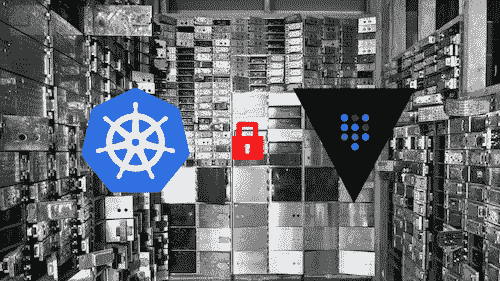

# 在运行时将秘密从外部库注入到 Kubernetes-POC

> 原文：<https://itnext.io/secrets-injection-from-external-vault-into-kubernetes-poc-83a52c8cf5cb?source=collection_archive---------4----------------------->



当您在多云环境中工作时，您不能总是使用 AWS secrets manager 来存储您的所有秘密。Hashicorp Vault 是存储和管理秘密的绝佳解决方案。在这个概念验证中，我将展示如何通过[https://github.com/hashicorp/vault-k8s](https://github.com/hashicorp/vault-k8s)轻松直接地将秘密注入到你的豆荚中。许多教程演示了如何在集群中运行 vault 时使用它，但这里我们将使用外部运行 vault。

# 理解数据流

在深入研究代码之前，最重要的事情是理解 vault 集成是如何与 Kubernetes 完成的，组件是做什么的，以及它们是如何一起工作的。

## 库伯内特一侧

流动始于你想要注入秘密的容器。此 pod 使用服务帐户运行(例如:sa-awesome-app)。这个 SA 登录到默认服务器，并请求承担一个角色(awesome-app)。如果角色被允许读取机密，它将被返回给 k8s，并作为一个文件注入到 pod 中挂载的卷中。

## 拱顶侧

最初，Vault 从 sa-awesome-app 接收 JWT。为了验证此 JWT 是否正确，Vault 要求 k8s 验证令牌。Vault 配置为将 k8s 服务帐户与角色绑定。这个角色有一个策略，授予它读取秘密路径(secret/my-awesome-app/config)的权限。

为了让 k8s 能够验证令牌，我们需要另一个 ClusterRole 类型的服务帐户(sa-vault-auth)来委托身份验证。

# 亲自动手

现在我们对 vault 如何集成到 kubernetes 有了更好的了解，让我们来构建我们的组件。github 上有这个 POC:[https://github.com/sylwit/vault_injection_k8s_poc](https://github.com/sylwit/vault_injection_k8s_poc)。

**如果不想再等了，就克隆 repo，打开 Makefile，按顺序运行每个目标。**

## 先决条件

*   库伯内特星团。这里我将使用 minikube 和 docker 驱动程序。
*   库贝特尔
*   舵
*   Docker(我真的需要详细说明吗)
*   docker-撰写

## 准备我们的 k8s 环境

TL；博士:`make k8s`

启动我们的集群，创建一个名称空间“demo”来部署我们的 awesome 应用程序，将其设置为默认名称空间。

```
kubectl create namespace demo
kubectl config set-context --current --namespace=demo
```

使用其密码创建服务帐户 sa-vault-auth，并将其绑定到 cluster role system:auth-delegator。保管库将使用此 SA 来验证 JWT 令牌。

```
kubectl apply -f k8s.yaml
```

通过官方舵图安装哈希公司金库。我们需要将 injector.externalVaultAddr 设置为 vault 服务器，并且必须可以从您的集群访问该 URL。我正在获取 makefile 中的 IP

```
GATEWAY_IP=$(shell minikube ssh "grep host.minikube.internal /etc/hosts" | awk '{print $$1}')helm repo add hashicorp https://helm.releases.hashicorp.com
helm install vault hashicorp/vault \
  --set "injector.externalVaultAddr=http://${GATEWAY_IP}:8200"
```

## 准备我们的金库

TL；博士:`make vault`

Vault 将使用 docker-compose 启动，需要一个. env 文件。(`make .env`)

```
echo "TOKEN_REVIEW_JWT=`kubectl get secret vault-auth -o go-template='{{ .data.token }}' | base64 --decode)}`" > .env
echo "KUBE_CA_CERT_B64=`kubectl config view --raw --minify --flatten -o jsonpath='{.clusters[].cluster.certificate-authority-data}'`" >> .env
echo "KUBE_HOST=https://`minikube ip`:8443" >> .env
docker-compose run -d vault
```

如果想访问 Vault UI，导航到 [http://localhost:8200](http://localhost:8200) ，令牌为:root。它是在 docker-compose 中硬编码的，否则您可以从`docker-compose logs vault`开始读取它

vault 运行后，我们创建一个密码，然后启用和配置 kubernetes 身份验证。

```
vault login root
vault kv put secret/my-awesone-app/config username='my_user' password='my_pwd'
vault auth enable kubernetesecho $KUBE_CA_CERT_B64 > .cert.pem
base64 -d .cert.pem > cert.pem
rm .cert.pem

vault write auth/kubernetes/config \
        token_reviewer_jwt="$TOKEN_REVIEW_JWT" \
        kubernetes_host="$KUBE_HOST" \
        kubernetes_ca_cert=@cert.pem
```

我们现在编写策略，允许读取这个秘密，并将其绑定到 SA sa-awesome-app。

```
vault policy write my-awesome-app - <<**EOF** path "secret/data/my-awesome-app/config" {
  capabilities = ["read"]
}
**EOF** vault write auth/kubernetes/role/awesome-app \
        bound_service_account_names=sa-awesome-app \
        bound_service_account_namespaces=demo \
        policies=my-awesome-app \
        ttl=24h
```

我将所有这些设置打包在一个 vault-init.sh 脚本中，并在运行的 vault 容器上执行它

```
VAULT_INIT=`cat ./vault-init.sh`
docker-compose exec vault sh -c "${VAULT_INIT}"
```

## 部署我们的应用

TL；博士:`make app`

该应用程序是一个简单的 HTTP 服务器，它读取文件并提供其内容。回购可在此:【https://github.com/sylwit/http_filereader】T4

我们还通过在端口 30100 上运行的服务来公开我们的优秀应用程序。

该文件中提供了完整的代码:[https://github . com/syl wit/vault _ injection _ k8s _ POC/blob/main/app . YAML](https://github.com/sylwit/vault_injection_k8s_poc/blob/main/app.yaml)

神奇的事情发生在这些注释中

```
annotations:
  vault.hashicorp.com/agent-inject: "true"
  vault.hashicorp.com/role: "awesome-app"
  vault.hashicorp.com/agent-inject-secret-credentials.txt: "secret/my-awesome-app/config"
  vault.hashicorp.com/agent-inject-template-credentials.txt: |
    {{- with secret "secret/my-awesome-app/config" -}}
    username: {{ .Data.data.username }}
    password: {{ .Data.data.password }}
    {{ end -}}
```

*   角色定义了我们在 vault 中承担的角色
*   agent-inject-secret-credentials . txt 定义了“secret/my-awesome-app/config”的内容将被写入的文件名。vault-k8s 将在/vault/secrets 处挂载一个卷，这样就可以在/vault/secrets/credentials.txt 处访问最终文件
*   agent-inject-template-credentials . txt 格式化文件的内容
*   我们将 FILEREADER_CHROOT 环境变量设置为/vault/secrets 作为我们的基本文件夹

```
kubectl apply -f app.yaml
```

等待几分钟，然后导航到 [http://`minikube ip`:30100？file=credentials.txt](/`minikube ip`:30100?file=credentials.txt) 瞧。

# 初始容器和副容器

k8s-vault 集成可以通过 init 和 side 容器来完成。

在应用程序启动之前，init 容器将获取这个秘密，并把它注入到前面提到的/vault/secrets 卷中。

该卷安装在应用程序容器中，因此可以立即访问。

一个侧容器也开始了，每 5 分钟，它检查是否秘密已经改变，如果需要，为我们更新卷。

# 结论

我真的很喜欢这样一个事实:当秘密改变时，侧面容器避免了新的发布。一开始配置所有的资源看起来有点乏味，但是一旦完成并编写脚本，就变得非常容易和可重用了。