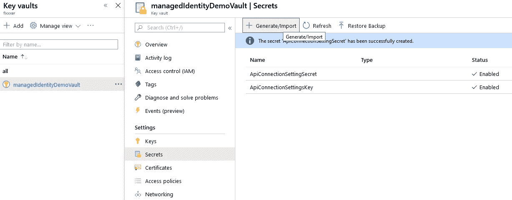
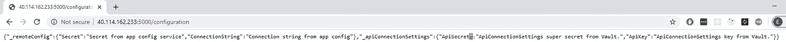

# 使用应用程序配置、密钥库和托管身份在 Azure 中为 Kubernetes 进行秘密管理

> 原文：<https://itnext.io/secrets-management-in-azure-for-kubernetes-with-app-configuration-key-vault-and-managed-identity-261cee3eb490?source=collection_archive---------1----------------------->


在构建云应用程序时，一个常见的挑战是如何管理您的代码中的凭据、连接字符串和其他秘密，以便向云服务进行身份验证？这一直是一个相当大的挑战，有这么多不同的策略如何保持您的凭证安全。理想情况下，秘密永远不会被签入源代码控制，也不会出现在开发人员的机器上。几年前，Azure Key Vault 推出，似乎是一个非常好的解决方案，除了…我们仍然需要对 Key Vault 进行身份验证，并考虑在哪里存储这些凭据。

Azure 资源的托管身份、应用配置服务和密钥库的组合为我们解决了这个问题。 [Azure App Configuration](https://docs.microsoft.com/en-us/azure/azure-app-configuration/overview) 是一项令人惊叹的服务，它允许您集中管理应用程序设置和功能标志，它与 [Azure Key Vault](https://docs.microsoft.com/en-us/azure/key-vault/general/overview) 完全兼容，是分布式环境的完美解决方案，我们现在在每个角落都有。


虽然任何应用程序都可以使用这种组合，但以下示例是以最明显的方式受益于它的应用程序类型:

*   在 Azure Kubernetes Service、Azure Service Fabric 或其他部署在不同地区的容器化应用上托管的微服务
*   无服务器应用
*   持续部署管道

但最美妙的部分是，我们在代码中需要的只是一个托管身份 Id，仅此而已。Azure 将自动向必要的资源验证我们的应用程序，并获取所有必要的配置/机密。

现在，让我们动手做一些编码工作。对于这个例子，我们将创建 Azure Kubernetes 集群，在那里我们将托管我们的容器化 ASP.NET 核心应用程序，该应用程序将从 Azure 应用程序配置服务和 Azure 密钥库提取所有设置和秘密。我们将 Kubernetes 的网络和所有安全基础设施排除在本文范围之外。

[有两种类型](https://docs.microsoft.com/en-us/azure/active-directory/managed-identities-azure-resources/overview#how-does-the-managed-identities-for-azure-resources-work)的托管身份:**系统分配的托管身份**和**用户分配的托管身份**。让我们为本文选择用户分配的身份，以使事情更加明显和可追溯。这些资源中的大部分都可以通过 Azure portal 和 Azure cli 创建。

假设我们安装了 Azure cli，让我们登录 Azure，切换到我们的订阅，然后继续。首先，我们为演示创建资源组，并在其中管理身份。

```
az group create -l westeurope -n "managedidentitydemo"
az identity create -g "managedidentitydemogroup" -n "managedidentitydemo"
```

在执行`az identity create`之后，我们将得到一个 json 输出，它描述了创建的身份，看起来像这样:

az 身份创建输出

保存好`clientId`、`id`和`principalId`，我们以后会用到它们。

然后，我们需要 Azure 应用配置服务，我们将在那里存储我们的非秘密设置和我们对 Azure Key Vault 的引用，我们将在那里保存我们的秘密。

然后，我们需要 Azure 应用配置服务，我们将在那里存储我们的非秘密设置和我们对 Azure Key Vault 的引用，我们将在那里保存我们的秘密。

```
az appconfig create --name "managedidentitydemoconfig" --location westeurope --resource-group "managedidentitydemogroup" --query hostName --sku free -o tsvaz keyvault create --location westeurope --name managedIdentityDemoVault --resource-group managedidentitydemogroup
```

创建资源后，我们必须在那里添加一些设置和秘密——为此我将使用 Azure portal。我们进入我们的密钥库->秘密->生成/导入并创建我们的秘密。我创建了两个秘密:ApiConnectionSettingsSecret 和 ApiConnectionSettingsKey。



然后，我们转到我们的应用程序配置服务，并在那里创建一些设置和密钥库引用。


如你所见，我们添加了两个非秘密设置和两个对 Azure key vault 的引用。我们还用 ManagedDemoServiceApi 标签对它们进行了标记。当您有多个微服务使用一个应用服务配置时，标记非常有用，因为这样您就可以仅获取属于您的微服务并由特定标签标记的设置。让我们创建密钥库策略，允许每个使用我们身份的应用程序获取和列出机密。

```
az keyvault set-policy -n managedIdentityDemoVault --spn <managed-identity-clientId> --secret-permissions get list
```

我们还希望将用户分配的身份添加到我们的应用配置服务中。当应用程序配置服务将从密钥库中提取密钥时，它将使用该身份，并将拥有`get`和`list`权限来检索密钥。我们还必须为我们的托管身份添加访问角色“应用程序配置数据读取器”，以便能够读取配置设置。

```
az appconfig identity assign -g managedidentitydemogroup -n managedidentitydemoconfig --identities "<managed-identity-id>"az role assignment create --assignee-object-id <managed-identity-principalId> --role "App Configuration Data Reader"
```

现在让我们创建我们的 Azure Kubernetes 集群。如果你还没有 Azure container registry 的话，我们还会附上我的订阅中已经有的 Azure container registry 通过门户创建一个不成问题。最后，我们需要将托管身份分配给集群的虚拟机扩展集。这很重要，因为我们所有的授权请求都将来自这些虚拟机。

```
az aks create -n managedidentitycluster -g managedidentitydemogroup --generate-ssh-keys --attach-acr crgmanaged az vmss identity assign -g <virtual-machines-scale-set-resource-group> -n <vmss-name> --identities <your-managed-identity-id>
```

> 请注意，虚拟机扩展集是在自己的资源组中创建的，具有某种随机名称。你可以通过 Azure portal 轻松找到所有这些。

集群准备就绪后，我们需要获取其凭据并切换活动上下文。kube/config 文件，这样我们就可以使用我们的 AKS 集群。

```
az aks Get-Credentials --resource-group managedidentitydemogroup --name managedidentitycluster
```

这就是了——我们准备好了！为了测试我们的设置，我准备了一个简单的。NET 核心应用程序，它只是从 Azure 应用程序配置中获取配置设置并显示它们。在你的应用中添加和使用 Azure App Config 和托管身份非常简单——你只需要添加掘金包，然后在 Program.cs 文件中包含一小段代码，之后 CreateHostBuilder()方法将类似于下面的代码:

> 我真的很喜欢它可以通过标签拉设置，这是超级整洁。`.Select(KeyFilter.Any, “ManagedDemoServiceApi”)`

测试应用程序和 Kubernetes 部署。yaml 可以在我的 [GitHub 库](https://github.com/f1xxxer/managedIdentity)中获得。因此，当我们部署或应用到集群和触发器/配置端点时，我们会看到来自应用配置服务和 Azure Key Vault 的值。



我们实际上需要在 appsettings.json 中保留的唯一设置是 Azure 应用配置服务的 url 和托管身份 Id。是不是很酷？

## 但是这种用户分配的托管身份是如何工作的呢？

基本上，我们的管理者身份是 Azure 服务主体的包装器，它是在订阅信任的 Azure AD 租户中创建的。当我们将托管身份分配给 Azure 资源时，我们也分配了授予该身份的所有权限和角色。在此 Azure 资源上运行的代码可以从 Azure 实例元数据服务身份端点`[http://169.254.169.254/metadata/identity/oauth2/token](http://169.254.169.254/metadata/identity/oauth2/token)`请求身份验证令牌，该身份端点只能从 Azure 内部访问。收到令牌后，它将用于调用支持 Azure AD 身份验证的服务。

## 如果我想自动管理用户分配给我的身份，该怎么办？

这是一个非常好的问题，尤其是对于托管 30+或 50+或 100+微服务的环境。在如此大的基础设施中，保持分配的身份列表总是最新的，即使不是不可能，也是非常困难的。幸运的是，有针对 Kubernetes 应用程序的 [Azure Active Directory 标识](https://github.com/Azure/aad-pod-identity) —这是一个开源项目，允许我们在检测到 pod 发生变化时，为底层虚拟机/VMSS 分配/移除一个标识。具体来说，当计划或删除 pod 时。当`AzureIdentity`或`AzureIdentityBinding`被创建或删除时，采取类似的动作。请看看并做一些实验——这很方便。

**GL & HF。**

