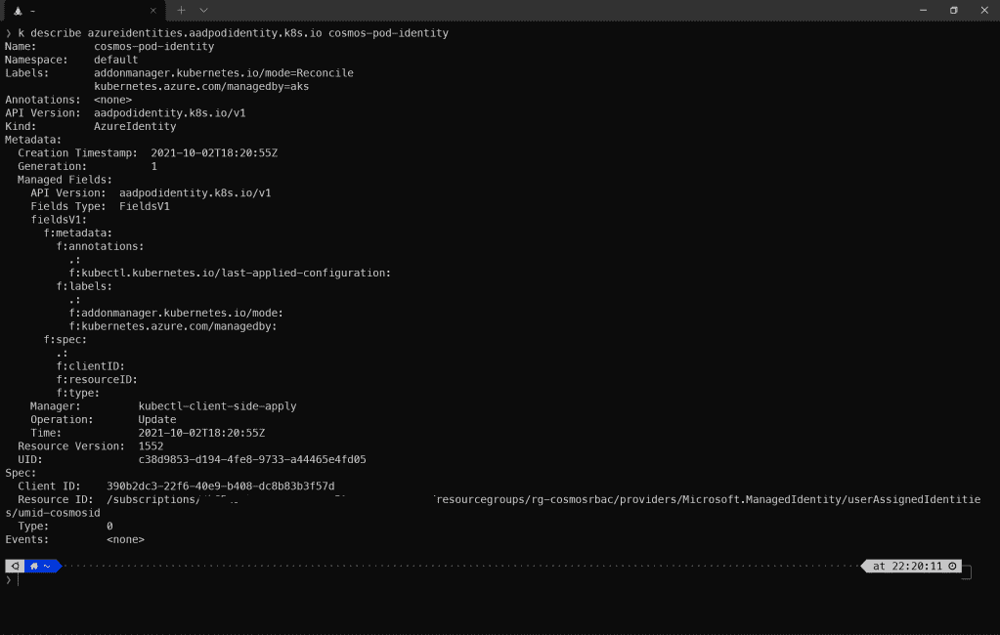
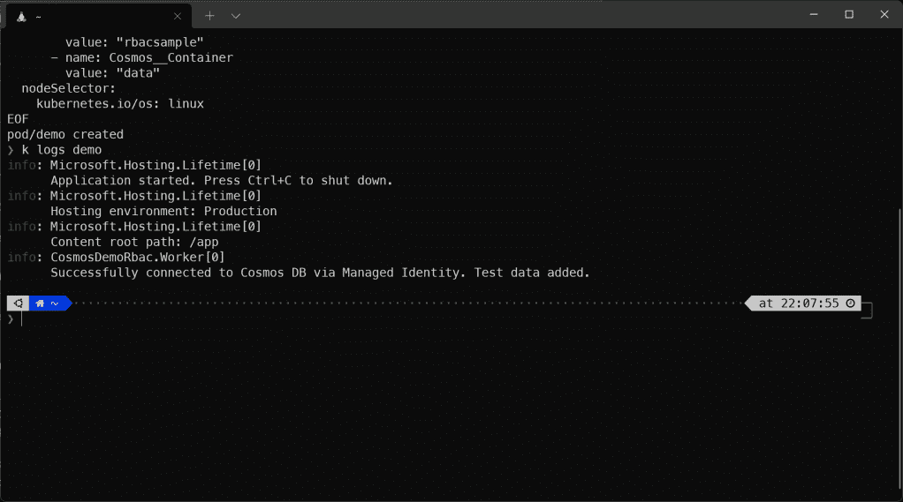
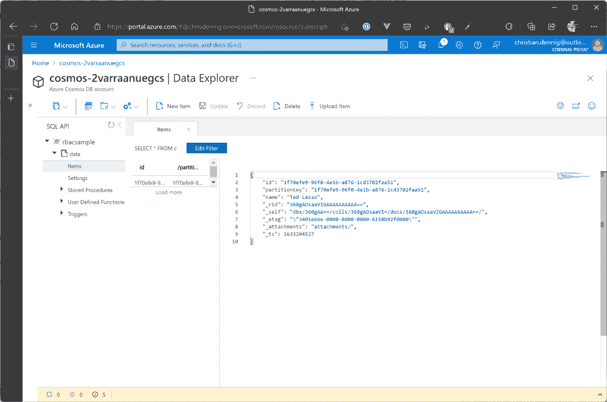
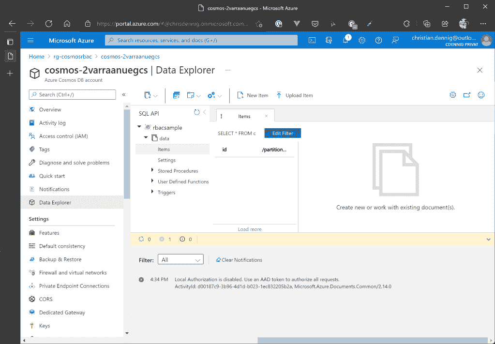

# 通过使用 Azure 托管身份保护 Azure Cosmos DB 访问

> 原文：<https://itnext.io/secure-azure-cosmos-db-access-by-using-azure-managed-identities-55f9fdf48fda?source=collection_archive---------4----------------------->


了解如何使用 Azure RBAC 连接到 Cosmos DB，并通过使用 Azure 托管身份来提高应用程序的安全性。

几个月前，Azure Cosmos DB 团队发布了一个新功能，使开发人员能够使用 Azure 主体(AAD 用户、服务主体等)。)和 Azure RBAC 来连接数据库服务。特性**极大地提高了安全性**，并且可以完全取代应用程序中连接字符串和密钥的使用——通常情况下，您应该不时地轮换这些东西，以最小化暴露凭证的风险。此外，您可以在帐户、数据库和容器级别对这些主体应用细粒度的授权规则，并控制每个“用户”能够做什么。

为了在你的服务中完全摆脱密码和密钥，微软鼓励开发者使用“管理身份”。托管身份为连接到支持 AAD 身份验证的 Azure 资源时要使用的应用程序和服务提供身份。有两种受管身份:

*   **系统分配的身份**:由 Azure 在服务级别自动创建(例如 Azure AppService)，并与 it 的生命周期相关联。然后，只有该特定 Azure 资源可以使用该身份来请求令牌，并且当删除服务时，该身份将被自动移除
*   用户分配的身份:独立于 Azure 服务创建，作为订阅中的独立资源。身份可以分配给多个资源，并且不依赖于特定 Azure 资源的生命周期

添加托管身份时，Azure 还会创建一个专用证书，用于在 Azure Active Directory 的令牌提供者处请求令牌。当您最终想要访问支持 AAD 的服务(如 Cosmos DB 或 Azure KeyVault)时，您只需调用本地元数据端点(底层服务/Azure VM—[http://169 . 254 . 169 . 254/metadata/identity/oauth 2/token](http://169.254.169.254/metadata/identity/oauth2/token))来请求令牌，然后使用该令牌对服务进行身份验证—无需使用密码，因为分配的托管身份的证书正用于身份验证。BTW，证书过期前自动为你轮换，完全不需要你操心。这是使用托管身份优于服务主体的一大优势，在服务主体中，您需要自己处理过期的密码。

# 样品

*如果你想跟随教程，从我的个人 GitHub 账户克隆示例库:*[*【https://github.com/cdennig/cosmos-managed-identity】*](https://github.com/cdennig/cosmos-managed-identity)

要查看受管身份和 Cosmos DB RBAC 功能的运行情况，我们将首先创建一个用户分配的身份和一个数据库，并为该身份添加和分配一个自定义 Cosmos DB 角色。

我们将使用 Azure Bicep 和 Azure CLI 的组合。首先，让我们创建一个资源组和受管身份:

```
$ az group create -n rg-cosmosrbac -l westeurope $ az identity create --name umid-cosmosid --resource-group rg-cosmosrbac --location westeurope
```

之后，让我们看看如何创建 Cosmos DB 帐户、数据库和数据容器。为了创建这些资源，我们将使用 Azure Bicep 模板。让我们来看看它的不同部分。

这些资源的模板很简单:我们创建一个(无服务器的)Cosmos DB 帐户，带有一个名为`rbacsample`的数据库和一个`data`容器。这里没什么特别的。

接下来，该模板添加了一个 Cosmos DB 角色定义。因此，我们需要将之前创建的托管身份的主体 ID 注入到模板中。

您可以在模板中看到，您可以确定角色定义的范围(属性`assignableScopes`)，这意味着角色可以被分配到哪个级别。在此示例中，它的范围是帐户级别。但是你也可以选择“数据库”或者“容器”级别(更多信息在[官方文档](https://docs.microsoft.com/en-us/azure/cosmos-db/how-to-setup-rbac)中)。

在权限/动作方面，Cosmos DB 提供了细粒度的选项，您可以在定义自定义角色时使用这些选项。您甚至可以使用通配符，我们在当前示例中使用了通配符。让我们来看看一些预定义的操作:

*   *Microsoft.DocumentDB/databaseAccounts/readMetadata*:读取账户元数据
*   *微软。document db/database accounts/SQL databases/containers/items/create*:创建项目
*   微软。document db/database accounts/SQL databases/containers/items/read:读取项目
*   *微软。document db/database accounts/SQL databases/containers/items/delete*:删除项目
*   微软。document db/database accounts/SQL databases/containers/readchangeed:读取变更提要

如果你想获得更多关于权限模型和可用动作的信息，那么[文档](https://docs.microsoft.com/en-us/azure/cosmos-db/how-to-setup-rbac#permission-model)会提供更多细节。现在，让我们继续我们的示例，分配自定义角色:

最后，我们将部署整个模板(您可以在 git 存储库的根文件夹中找到该模板):

```
$ MI_PRINID=$(az identity show -n umid-cosmosid -g rg-cosmosrbac --query "principalId" -o tsv) $ az deployment group create -f deploy.bicep -g rg-cosmosrbac --parameters principalId=$MI_PRINID -o none
```

成功部署模板后，让我们创建一个示例应用程序，它使用托管身份来访问 Cosmos DB 数据库。

# 应用

让我们创建一个使用托管身份访问 Cosmos DB 的基本应用程序，并在`data` 容器中创建一个文档用于演示。幸运的是，当使用 Cosmos DB SDK 时，对于开发人员来说，事情再简单不过了。您只需要使用来自`Azure.Identity`包( [API 引用](https://docs.microsoft.com/en-us/dotnet/api/azure.identity.defaultazurecredential?view=azure-dotnet))的`DefaultAzureCredential`类的一个实例，所有“繁重”的工作，比如准备和向本地元数据端点发出请求，以及使用生成的令牌，都会自动为您完成。让我们看看应用程序的相关部分:

# 在 Azure 中使用应用程序

到目前为止，我们已经为使用托管身份连接到 Azure Cosmos DB 做好了一切准备:我们创建了一个用户分配的身份、一个 Cosmos DB 数据库和一个绑定到该身份的自定义角色。我们还有一个基本的应用程序，它通过 Azure RBAC 连接到数据库，并在容器中创建一个文档。现在让我们创建一个托管和运行应用程序的服务。

当然，我们可以使用 Azure AppService 或 Azure 函数，但让我们在这里稍微夸张一下，创建一个启用了 Pod 身份插件的 Azure Kubernetes 服务集群。该插件允许您将预定义的托管身份分配给集群中的 pod，并透明地使用底层 Azure VM 的本地令牌端点(请注意，在撰写本文时，该插件仍处于预览阶段)。

如果您尚未使用该功能，您必须首先在订阅中注册它，并下载 Azure CLI extension for AKS preview 功能:

```
$ az feature register --name EnablePodIdentityPreview --namespace Microsoft.ContainerService $ az extension add --name aks-preview
```

特征注册需要一些时间。您可以通过以下命令检查状态。继续之前，注册状态应为“已注册”:

```
$ az feature show --name EnablePodIdentityPreview --namespace Microsoft.ContainerService -o table
```

现在，创建 Kubernetes 集群。为了保持简单和廉价，我们只需向群集中添加一个节点:

```
$ az aks create -g rg-cosmosrbac -n cosmosrbac --enable-pod-identity --network-plugin azure -c 1 --generate-ssh-keys # after the cluster has been created, download the credentials 
$ az aks get-credentials -g rg-cosmosrbac -n cosmosrbac
```

现在，要使用受管身份并将其绑定到集群虚拟机，我们需要为我们的受管身份分配一个名为`Virtual Machine Contributor`的特殊角色。

```
$ MI_APPID=$(az identity show -n umid-cosmosid -g rg-cosmosrbac --query "clientId" -o tsv) 
$ NODE_GROUP=$(az aks show -g rg-cosmosrbac -n cosmosrbac --query nodeResourceGroup -o tsv) 
$ NODES_RESOURCE_ID=$(az group show -n $NODE_GROUP -o tsv --query "id") # assign the role 
$ az role assignment create --role "Virtual Machine Contributor" --assignee "$MI_APPID" --scope $NODES_RESOURCE_ID
```

最后，我们能够创建一个 Pod 身份，并为其分配我们的托管身份:

```
$ MI_ID=$(az identity show -n umid-cosmosid -g rg-cosmosrbac --query "id" -o tsv) $ az aks pod-identity add --resource-group rg-cosmosrbac --cluster-name cosmosrbac --namespace default --name "cosmos-pod-identity" --identity-resource-id $MI_ID
```

让我们看看我们的群集，看看创建了什么:

```
$ kubectl get azureidentities.aadpodidentity.k8s.io

NAME                AGE 
cosmos-pod-identity 2m34s
```



现在，我们在集群中有了可用的 pod 标识，并准备好部署示例应用程序。如果您想自己创建 Docker 映像，您可以使用位于存储库的`CosmosDemoRbac\CosmosDemoRbac`文件夹中的`Dockerfile`。为了您的方便，Docker Hub 上已经有一个预先构建/预先发布的图像。我们现在可以创建 pod 清单:

这里最重要的部分是第 7 行，在这里我们将之前创建的 pod 身份绑定到我们的 pod。这将使 pod 中的应用程序容器能够调用集群 VM 上的本地元数据端点来请求一个访问令牌，该令牌最终用于对 Cosmos DB 进行身份验证。让我们部署它(你会在根文件夹中找到`pod.yaml`文件)。

```
$ kubectl apply -f pod.yaml
```

当 pod 启动时，容器会将一些信息记录到`stdout`，指示与 Cosmos DB 的连接是否成功。因此，让我们查询日志:

您应该会看到这样的输出:



似乎一切都像预期的那样。在 Azure 门户中打开你的数据库，看看`data`容器。您应该会看到一个条目:



# 额外收获:不再有主键！

到目前为止，我们可以通过用户分配的 Azure 托管身份连接到 Cosmos DB。为了进一步提高这种场景的安全性，您现在可以**完全禁止使用连接字符串和 Cosmos DB 帐户密钥**，防止任何人使用这种信息访问您的帐户。

为此，打开`deploy.bicep`文件，并将第 31 行的参数`disableLocalAuth`设置为`true`(我们现在这样做，因为它——当然——也禁止通过门户访问数据库)。现在，重新应用模板并尝试再次打开 Azure 门户中的数据浏览器。您将看到您无法再访问您的数据，因为门户使用了幕后的 Cosmos DB 连接字符串/帐户密钥。



# 摘要

在访问 Azure 服务时摆脱密码(或连接字符串/密钥),转而使用受管身份是增加 Azure 中运行的工作负载的安全性的一种非常好的方式。这个示例演示了如何将这种方法与 Cosmos DB 和 Azure Kubernetes 服务(Pod 身份特性)结合使用。当然，它不仅限于这些资源。你可以将这种技术用于其他 Azure 服务，如 Azure KeyVault、Azure 存储帐户、Azure SQL 数据库等。微软甚至鼓励您应用这种方法来消除云计算中最常用的攻击媒介:暴露的密码(例如，通过错误配置、代码库中泄露的凭证等。).

我希望这篇教程可以向你展示，应用这种方法是多么容易，并激励你在下一个项目中使用它。黑客快乐，朋友🖖

你可以在我的私人 GitHub 账号上找到源代码:[https://github.com/cdennig/cosmos-managed-identity](https://github.com/cdennig/cosmos-managed-identity)

顺便说一句，如果你喜欢这个内容，请在 Twitter 上关注我👇

[克里斯蒂安·丹尼格·🖖🇪🇺(@克里斯·丹尼格)/推特](https://twitter.com/chrisdennig)

标题图片来源:【https://unsplash.com/@markuswinkler 

*原载于 2021 年 10 月 3 日*[*http://partly cloudy . blog*](https://partlycloudy.blog/2021/10/03/secure-azure-cosmos-db-access-by-using-azure-managed-identities/)*。*