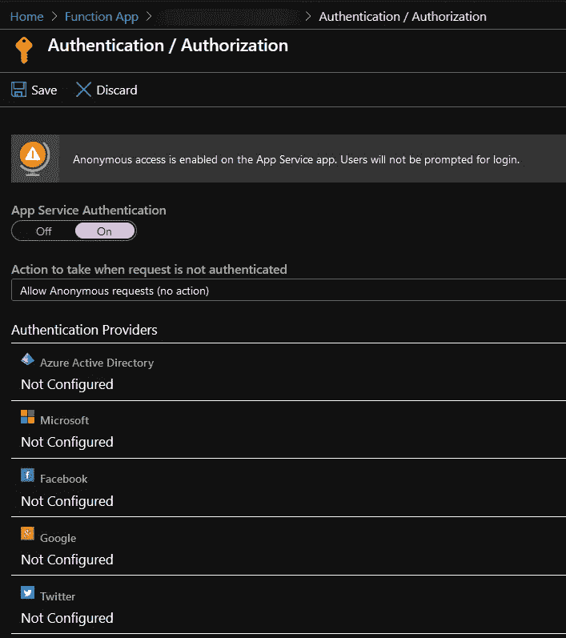
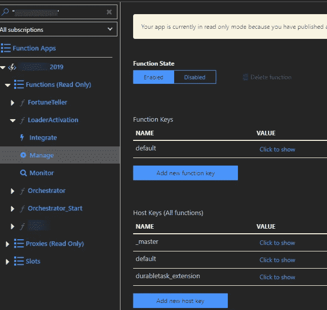
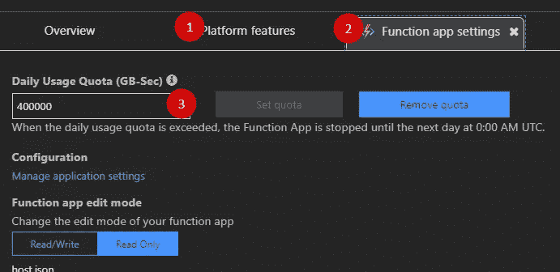

# 如何用 IdentityServer4 保护 Azure Functions API？

> 原文：<https://itnext.io/secure-function-with-identityserver-3f414a28c92f?source=collection_archive---------1----------------------->

## 有自定义处理程序，没有 Azure API 管理。

来自[像素](https://www.pexels.com/photo/antique-close-up-equipment-hanging-615350/?utm_content=attributionCopyText&utm_medium=referral&utm_source=pexels)的[摄影记者](https://www.pexels.com/@skitterphoto?utm_content=attributionCopyText&utm_medium=referral&utm_source=pexels)的照片。

Azure 函数在安全性和身份验证方面有丰富的功能，但自定义身份验证的选项有限。并且您必须创建自己的 JWT 令牌处理程序，以便与基于 Identity Server 4 的提供者一起工作。网上有几篇关于这个主题的文章，但是没有一篇完全符合我的需求，所以我决定也分享一下我的解决方案。

> TLDR；我将解释如何验证由 Identity Server 4 发布的承载令牌。我将分享一个处理程序的代码示例，该处理程序通过 JWKS 端点或本地键值来验证令牌签名和受众。

我想强调的是，验证请求的正确且昂贵的方法是使用 Azure API 管理外观。虽然有一个无服务器的 API 管理层，但它在功能和冷启动方面有很大的局限性。

更新 2020–06–05:我对这篇文章有一个跟进:[用 API 管理和身份服务器保护 Azure 函数 4](https://medium.com/microsoftazure/secure-functions-apim-identityserver4-4b6f62d773b0)

## Azure 应用服务中的身份验证选项

平台选项包括 Azure AD 和四个 EasyAuth 提供商，如脸书、谷歌、Twitter 和一个微软账户。它们可以通过 Azure 门户应用服务配置进行身份验证/授权。

> 有一种通过自定义 Azure AD 对话框添加 Identity Server 4 端点的简单方法，但我强烈建议不要这样做。平台行为随时可能改变，这是一条通向灾难的高速公路。

应用服务支持的身份验证提供程序。

## 功能级身份验证选项

功能代码级别有几种可用的授权级别。

*   匿名-接受所有请求。
*   函数-函数代码应该通过请求参数传递。
*   Admin -任何主机密钥都必须通过请求参数传递。
*   系统-主密钥必须通过请求参数传递。

带有认证密钥的功能管理页面。

## 身份服务器。

Identity Server 4 完全实现了 OIDC 规范，通常有中间件为您验证令牌，但函数不是这样。因此，让我们回忆一下需要检查什么——不记名令牌签名、发行者和受众。该信息可以从任何 OIDC 兼容提供商的发现端点获得。

> 发现端点可用于检索关于您的身份服务器的元数据—它返回诸如发布者名称、密钥材料、支持的范围等信息。[举例](https://login.microsoftonline.com/common/v2.0/.well-known/openid-configuration)。

当您访问该端点时，可以找到各种信息，但最重要的是到 JWKS 端点的链接。因为您可以在那里找到 RSA 密钥的开放部分，它用于令牌加密。

> JSON Web 密钥集(JWKS)是一组包含公钥的密钥，应该使用这些公钥来验证由授权服务器发布的任何 JSON Web 令牌(JWT)。[举例](https://login.microsoftonline.com/common/discovery/v2.0/keys)。

最后要回忆的是，为什么需要进行受众检查，因为不同的应用程序可以在同一个 Identity Server 上注册。因此，有必要检查客户端是否有权访问这个特定的应用程序。

> 代币的受众是代币的预期接收者。

## 解决方案。

行动步骤非常简单。

*   在函数中启用匿名身份验证。
*   从 JWKS 端点或本地配置中检索证书签名。
*   为令牌验证添加自定义处理程序。
*   通过邮递员在本地测试解决方案，并进行试运行。
*   在功能 App 上设置每日记忆时间配额。

具有匿名授权级别的 Azure 函数。

请注意，功能授权级别是匿名的，因此您应该**将每日内存时间配额**设置为功能 App 的预计 GB/s 值。并为过度的应用程序使用创建警报。否认钱包攻击是真事。

通过平台功能设置配额= >功能 app 设置。

您可以使用 Azure CLI 进行每日内存配额设置。

设置配额的 Azure CLI 命令。

所以，让我们从依赖注入开始。令牌签名可以通过 JWKS endpoint 公开获得，因此您可以将它嵌入到应用程序配置中，以避免额外的 HTTP 请求。而且最好把所有秘密都放在 Azure KeyVault 里，方便轮换和安全。

让我们继续使用一个密钥检索器助手。

上面的方法有问题。当您向 KeyVault 添加签名密钥时，您可能会错过将来更新密钥的时刻。为了避免这个问题，下面的方法将通过 HTTP 请求从 JWKS 端点获取数据。

令牌验证的功能代码。

## 结论。

这是一个混合袋解决方案，但它会做到这一点。我将在下一篇文章中继续身份验证主题，通过 Azure API 管理来讨论不记名令牌验证。

**就这些，感谢阅读。干杯！**

PS。还有更多选项，如 OIDC 发现端点处理程序和下面的参考 tokes - links。

**有用的链接。**

*   [使用手动验证 JWT。Jerrie Pelser 的 NET](https://www.jerriepelser.com/blog/manually-validating-rs256-jwt-dotnet/) 。
*   [Azure Functions 中的自定义令牌认证](https://www.ben-morris.com/custom-token-authentication-in-azure-functions-using-bindings/)Ben Morris。
*   [保护 HTTP 触发的 Azure 功能](https://blog.wille-zone.de/post/protecting-http-triggered-azure-functions/)。
*   Shawn Meyer 的 RS256 和 JWKS 导航。
*   [Azure 功能和 App 服务认证](https://blogs.msdn.microsoft.com/stuartleeks/2018/02/19/azure-functions-and-app-service-authentication/)。
*   文森特-菲利普·劳宗著 [Azure Functions HTTP —授权级别。](https://vincentlauzon.com/2017/12/04/azure-functions-http-authorization-levels/)
*   [发现端点上的身份模型文档](https://identitymodel.readthedocs.io/en/latest/client/discovery.html)。
*   [参考令牌文档](http://docs.identityserver.io/en/latest/topics/reference_tokens.html)。