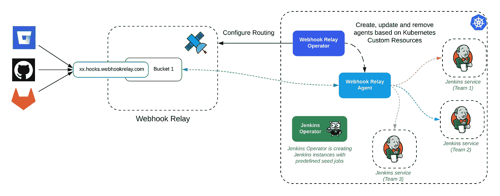
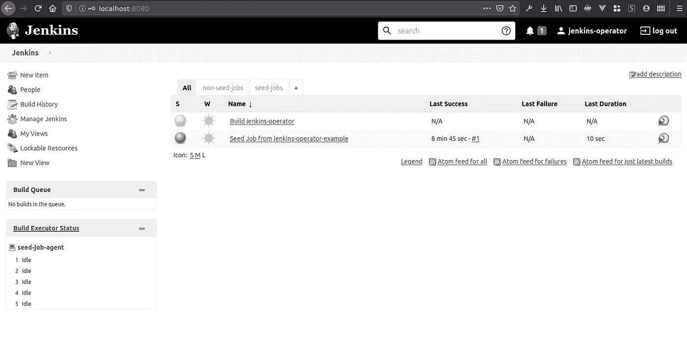
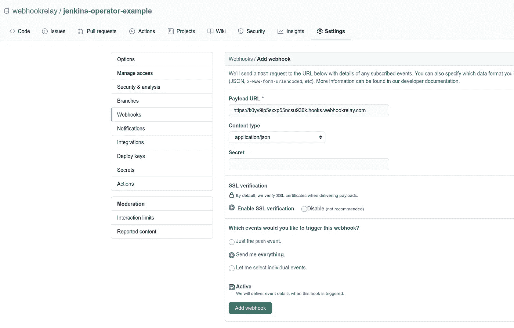
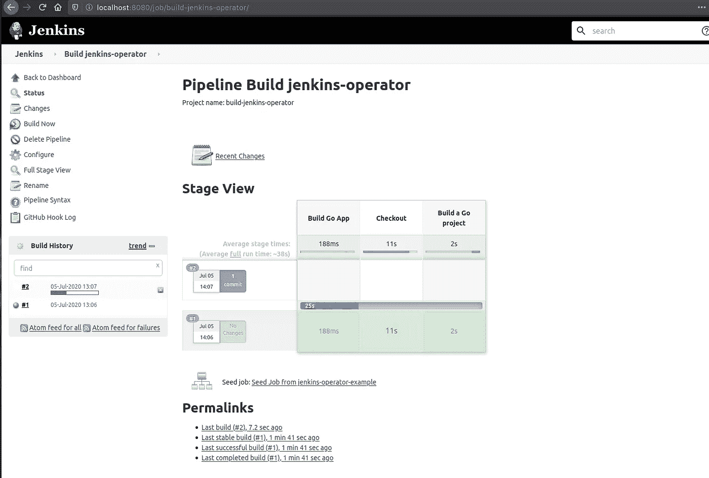

# 通过 Kubernetes 上的 Webhook 中继保护 Jenkins 运营商管道

> 原文：<https://itnext.io/secure-jenkins-operator-pipelines-with-webhook-relay-on-kubernetes-4e40028efa30?source=collection_archive---------4----------------------->

在本教程中，我们将在 Kubernetes 上配置一个利用 Jenkins 和 Webhook 中继操作符的 Jenkins 管道。Jenkins Kubernetes 操作员将使用预定义的种子作业创建 Jenkins 实例。Webhook 中继运营商将确保推送事件上的 GitHub webhooks 触发新的 Jenkins 版本，以实现快速高效的 CI/CD 体验。



詹金斯和 Webhook 中继运营商

这种设置的优点:

*   您的 Jenkins 实例只能通过 kubectl port-forward 访问，同时保持从公共目的地接收 webhooks 的能力。
*   Jenkins 管道配置存储在 Git 中。
*   Webhook 中继路由配置存储在 Git 中，与 Jenkins 本身相同。

您可以在 [Kubernetes 文档](https://kubernetes.io/docs/concepts/extend-kubernetes/operator/)中阅读关于操作符模式的内容。

# 先决条件

先决条件:

*   [掌舵](https://docs.helm.sh/using_helm/#installing-helm)
*   [Webhook 中继账号](https://my.webhookrelay.com)
*   [Kubernetes](https://kubernetes.io/) 环境，Minikube，k3s，GKE，AKS 等。都很好。
*   已配置的 kubectl
*   饭桶

# 装置

安装将包括几个步骤:

*   安装 Jenkins 操作员
*   安装 Webhook 继电器操作器

# 创建新的名称空间

让我们从创建一个新的名称空间开始，在这里我们将放置 Jenkins 实例并运行构建。我会叫它“詹金斯”,但你可以选择任何其他的名字:

```
kubectl create namespace jenkins
```

然后切换到它:

```
kubectl config set-context $(kubectl config current-context) --namespace=jenkins
```

# 詹金斯算子

我们将使用头盔安装詹金斯操作员。首先，添加存储库:

```
helm repo add jenkins https://raw.githubusercontent.com/jenkinsci/kubernetes-operator/master/chart
helm repo update
```

添加存储库后，安装它:

```
helm install jenkins-operator jenkins/jenkins-operator
```

官方文档可以在这里找到:[https://jenkinsci . github . io/kubernetes-operator/docs/installation/](https://jenkinsci.github.io/kubernetes-operator/docs/installation/)。操作者不是 Jenkins 本身，所以要获得我们的 Jenkins 实例，我们必须创建一个[自定义资源](https://kubernetes.io/docs/concepts/extend-kubernetes/api-extension/custom-resources/)。

> *自定义资源是 Kubernetes API 的扩展。本页讨论何时向 Kubernetes 集群添加自定义资源，以及何时使用独立服务。它描述了添加自定义资源的两种方法以及如何在它们之间进行选择。*

# 启动 Jenkins(使用自定义资源)

我们需要创建一个 CR。您可以使用 Jenkins Operator docs 来创建一个，也可以派生这个[https://github . com/webhook relay/Jenkins-Operator-example . git](https://github.com/webhookrelay/jenkins-operator-example.git)存储库并克隆它。然后:

1.  将 **jenkins_cr.yaml** [文件](https://github.com/webhookrelay/jenkins-operator-example/blob/master/jenkins_cr.yaml) `https://github.com/webhookrelay/jenkins-operator-example.git`更新到自己的库叉(一般会是`https://github.com/<your username or organization>/jenkins-operator-example.git`)。
2.  用 kubectl 创建它:

```
kubectl apply -f jenkins_cr.yaml
```

该文件与股票示例的主要区别在于:

*   添加了`github`插件，因为我们需要它来触发任务
*   种子作业也设置好了`githubPushTrigger: true`

创建此 PR 应该会产生两个额外的容器:

```
kubectl get pods
NAME                                      READY   STATUS    RESTARTS   AGE
jenkins-jenkins                           1/1     Running   0          7m11s
jenkins-operator-6dbbc458c9-gmx6p         1/1     Running   0          18m
seed-job-agent-jenkins-65cc4bc684-9ztr5   1/1     Running   0          6m21s
```

我们来连线詹金斯。首先，获取用户名和密码:

```
kubectl --namespace jenkins get secret jenkins-operator-credentials-jenkins -o 'jsonpath={.data.user}' | base64 -d
kubectl --namespace jenkins get secret jenkins-operator-credentials-jenkins -o 'jsonpath={.data.password}' | base64 -d
```

然后，在一个终端启动端口转发:

```
kubectl port-forward jenkins-jenkins 8080:8080
```

然后在浏览器中打开 [http://localhost:8080](http://localhost:8080) 。



管道

# Webhook 继电器

从[https://my.webhookrelay.com/tokens](https://my.webhookrelay.com/tokens)获取您的访问令牌密钥和秘密对，并将它们设置为环境变量:

```
export RELAY_KEY=xxxxxxxxxxxx
export RELAY_SECRET=xxxxx
```

添加 Webhook 中继操作员舵库并安装:

```
helm repo add webhookrelay https://charts.webhookrelay.com
helm repo update
helm upgrade --install webhookrelay-operator --namespace=jenkins webhookrelay/webhookrelay-operator \
  --set credentials.key=$RELAY_KEY --set credentials.secret=$RELAY_SECRET
```

> *操作员不会自己转发 webhooks。每个创建的 CR 将确保代理部署被配置为路由特定的存储桶。*

从[操作员示例库](https://github.com/webhookrelay/jenkins-operator-example/blob/master/webhookrelay_cr.yaml)中，我们需要创建 Webhook 中继定制资源:

```
kubectl apply -f webhookrelay_cr.yaml
```

> *请注意，如果您修改了 Jenkins CR 名称，您需要将 webhookrelay_cr.yaml“目的地”字段从* `*destination: http://jenkins-operator-http-jenkins:8080/github-webhook/*` *更新为您当前的 Jenkins 服务。通常，它的格式为* `*jenkins-operator-http-<CR name>*` *。*

# GitHub 配置

这一步可以通过让 Jenkins 自动配置 Github 存储库以转发到这个端点来实现自动化，但是为了简单起见，为了更清楚它是如何工作的，我们将手动添加这个 URL。

# 获取您的 Webhook 中继公共 URL

要获取您的公共端点，您可以访问[https://my.webhookrelay.com/buckets](https://my.webhookrelay.com/buckets)页面或通过 CR status 获取:

```
kubectl get webhookrelayforwards.forward.webhookrelay.com forward-to-jenkins -o 'jsonpath={.status.publicEndpoints[0]}'
```

结果应该类似于:

```
$ kubectl get webhookrelayforwards.forward.webhookrelay.com forward-to-jenkins -o 'jsonpath={.status.publicEndpoints[0]}'
https://k0yv9ip5sxxp55ncsu936k.hooks.webhookrelay.com
```

# 将公共 URL 添加到 GitHub 存储库设置

获取公共端点 URL 并将其添加到 GitHub 存储库中:



将您的 Webhook 中继公共 URL 添加到 GitHub 存储库 webhooks 设置

# 使用管道

首先，当创建管道时，手动触发构建。之后，任何对 GitHub 库的推送都会通过 webhook 中继将 Webhook 发送到运行在 Kubernetes 集群中的 Jenkins 实例:



*最初发表于*[T5【https://webhookrelay.com】](https://webhookrelay.com/v1/tutorials/webhooks-jenkins-operator-kubernetes.html)*。*