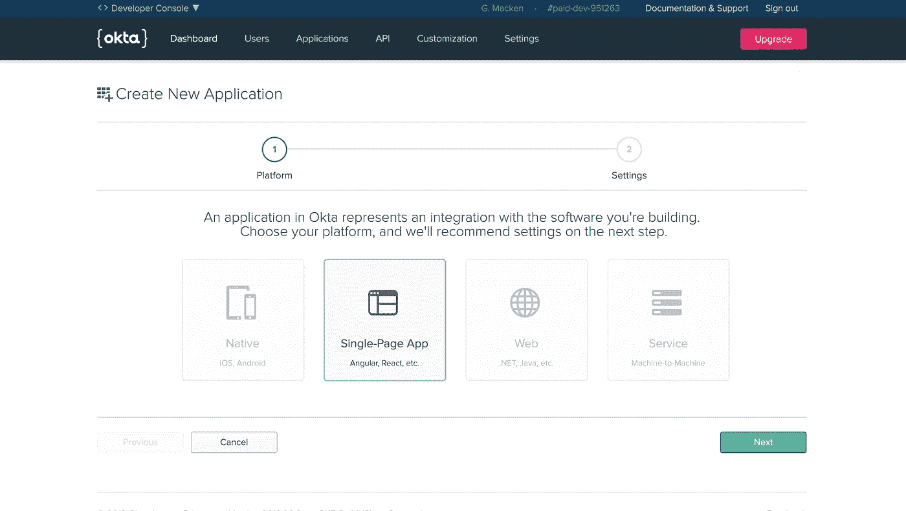
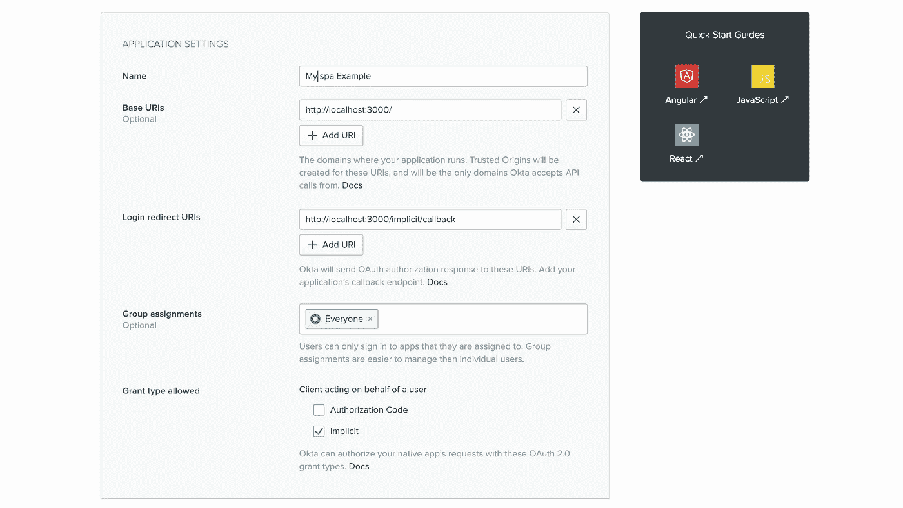

# 15 分钟内安全登录—太好了！

> 原文：<https://itnext.io/secure-log-in-feature-in-15-minutes-hells-yeah-f69b09502b?source=collection_archive---------3----------------------->


Web 应用程序是企业 IT 资产、功能和业务工作流的核心。在某种程度上，许多这样的 web 应用程序最终都有缺陷，比如跨站点脚本和 SQL 注入。

当然，这些都是必须考虑的。然而，还有其他一些经常被忽视的弱点，这些都与登录相关。

登录和注册漏洞包括:

*   不受加密保护的应用程序登录
*   弱密码要求
*   密码复杂性强制
*   缺少入侵者锁定
*   描述性的错误消息有时会帮助潜在的入侵者

构建考虑到这些漏洞的安全登录和注册功能可能是一项耗费大量资源的任务。幸运的是，让开发人员花费精力创建这样一个特性并不是唯一的解决方案。

有了 **Okta** ，你可以管理任何用户对任何应用或设备的访问。 **Okta** 运行在云上——在一个安全、可靠、经过广泛审核的平台上，该平台与内部应用程序、目录和身份管理系统深度集成。

最棒的是…它非常容易安装！

# 创建 React 应用程序

我们将构建一个简单的 React 登录。

让我们用 [create-react-app](https://github.com/facebook/create-react-app) 开始吧。有了 [create-react-app](https://github.com/facebook/create-react-app) ，开始一个新的 react 应用程序变得超级容易。它附带了许多不错的开箱即用的功能，例如预配置的 [Webpack](https://github.com/webpack/webpack) 和用于零构建配置的 Babel setup。

```
npx create-react-app my-spa-example
cd my-spa-example
npm start
```

**嘣！** React 应用程序已启动并运行。干得好！

# Okta 帐户设置

好的……现在让我们来设置 Okta 帐户。如果你还没有一个注册[这里](https://developer.okta.com/signup/)，登录到你的开发者控制台，导航到**应用**，然后点击**添加应用**。选择**单页 App** ，然后点击**下一步**。



不错！现在你只需要添加一些设置。我们将把重定向 URI 改为`localhost:3000`，因为这是 create-react-app 使用的端口。



# Okta 和 React 应用程序集成

太好了！因此，我们进行了大约 5 分钟，我们已经创建了我们的 Okta 帐户并运行了我们的 React 应用程序。现在，让我们让这两者一起工作。

Okta 将需要一些依赖。也就是说，我们将使用 Okta 登录小部件，它使登录变得非常简单。我们还将使用 Okta 的访问令牌来帮助管理我们的路线。接下来，在下面安装这些依赖项。

```
npm install @okta/okta-signin-widget @okta/okta-react react-router-dom --save
```

为了在 react 中呈现登录小部件，我们必须创建一个包装器，允许我们将其视为 React 组件。

因此，让我们在我们的`/src/directory`中创建一个名为`SignUpWidget.js`的文件。它看起来会像这样。

```
import React, { Component } from 'react';
import ReactDOM from 'react-dom';
import OktaSignIn from '@okta/okta-signin-widget';
import '@okta/okta-signin-widget/dist/css/okta-sign-in.min.css';
import '@okta/okta-signin-widget/dist/css/okta-theme.css';

export default class OktaSignInWidget extends Component {
    componentDidMount() {
        const el = ReactDOM.findDOMNode(this);
        this.widget = new OktaSignIn({
            baseUrl: this.props.baseUrl
        });
        this.widget.renderEl({el}, this.props.onSuccess, this.props.onError);
    }

    componentWillUnmount() {
        this.widget.remove();
    }

    render() {
        return <div />;
    }
};
```

有些路线需要验证才能渲染。通过从`@okta/okta-react`导入`SecureRoute`可以很容易地定义这些路线。让我们来看看这个例子需要哪些路线:

*   `/`:处理应用程序基本控制的默认页面
*   `/protected`:受`SecureRoute`保护的路线
*   `/login`:显示登录页面
*   `/implicit/callback`:重定向后解析令牌的路径

接下来，我们需要在`/src directory`中创建另一个文件，并将其命名为`Home.js`。

```
import React, { Component } from 'react';
import { Link } from 'react-router-dom';
import { withAuth } from '@okta/okta-react';

export default withAuth(class Home extends Component {
  constructor(props) {
    super(props);
    this.state = { authenticated: null };
    this.checkAuthentication = this.checkAuthentication.bind(this);
    this.login = this.login.bind(this);
    this.logout = this.logout.bind(this);
  }

  async checkAuthentication() {
    const authenticated = await this.props.auth.isAuthenticated();
    if (authenticated !== this.state.authenticated) {
      this.setState({ authenticated });
    }
  }

  async componentDidMount() {
    this.checkAuthentication();
  }

  async componentDidUpdate() {
    this.checkAuthentication();
  }

  async login() {
    this.props.auth.login('/');
  }

  async logout() {
    this.props.auth.logout('/');
  }

  render() {
    if (this.state.authenticated === null) return null;

    const button = this.state.authenticated ?
      <button onClick={this.logout}>Logout</button> :
      <button onClick={this.login}>Login</button>;

    return (
      <div>
        <Link to='/'>Home</Link><br/>
        <Link to='/protected'>Protected</Link><br/>
        {button}
      </div>
    );
  }
});
```

我们现在已经添加了一个路由到`/protected`的链接。该路线仅对拥有有效`accessToken`的用户可见。

然后，创建一个名为`Protected.js`的新组件。

```
import React from 'react';

export default () => <h3>Protected</h3>;
```

此路由将托管登录小部件以及已登录的重定向用户。如果用户来自受保护的页面，他们将被重定向回登录页面。

现在，我们将创建一个`Login.js`组件。

```
import React, { Component } from 'react';
import { Redirect } from 'react-router-dom';
import OktaSignInWidget from './SignInWidget';
import { withAuth } from '@okta/okta-react';

export default withAuth(class Login extends Component {
    constructor(props) {
        super(props);
        this.onSuccess = this.onSuccess.bind(this);
        this.onError = this.onError.bind(this);
        this.state = {
            authenticated: null
        };
        this.checkAuthentication();
    }

    async checkAuthentication() {
        const authenticated = await this.props.auth.isAuthenticated();
        if (authenticated !== this.state.authenticated) {
            this.setState({ authenticated });
        }
    }

    componentDidUpdate() {
        this.checkAuthentication();
    }

    onSuccess(res) {
        if (res.status === 'SUCCESS') {
            return this.props.auth.redirect({
                sessionToken: res.session.token
            });
        } else {
            // The user can be in another authentication state that requires further action.
            // For more information about these states, see:
            //   https://github.com/okta/okta-signin-widget#rendereloptions-success-error
        }
    }

    onError(err) {
        console.log('error logging in', err);
    }

    render() {
        if (this.state.authenticated === null) return null;
        return this.state.authenticated ?
    <Redirect to={{ pathname: '/' }}/> :
        <OktaSignInWidget
        baseUrl={this.props.baseUrl}
        onSuccess={this.onSuccess}
        onError={this.onError}/>;
    }
});
```

# 把所有的东西放在一起

在项目的根目录下，创建一个名为` . env.local '的文件，这个文件将安全地存储 Okta `CLIENT_ID`、`ORG_URL`和 API 访问令牌。

```
REACT_APP_OKTA_CLIENT_ID={yourClientId}
REACT_APP_OKTA_ORG_URL=https://{yourOktaDomain}
REACT_APP_OKTA_TOKEN={yourOktaAPIToken}
```

你的 Okta `ORG_URL`可以在你的 Okta 仪表盘右上角找到。

您的`CLIENT_ID`是基于每个应用程序创建的。如果你访问你的 Okta 账户，点击**应用程序，**，你会看到你的项目名称下面有`CLIENT_ID`。

Okta API 访问令牌可以通过访问 Okta 仪表板，点击 API 选项卡来创建。然后，您可以选择创建新令牌。

一旦您将所有这些项目放入您的`.env.local`中，我们将访问我们的`App.js`文件，并将整个应用程序包装在一个从`@okta/okta-react`导入的安全组件中。然后，这些密码被传递到该组件中，如下所示:

```
import React, { Component } from 'react';
import { BrowserRouter as Router, Route } from 'react-router-dom';
import { Security, SecureRoute, ImplicitCallback } from '@okta/okta-react';
import Home from './Home';
import Login from './Login';
import Protected from './Protected';

function onAuthRequired({history}) {
    history.push('/login');
}

class App extends Component {
    render() {
        return (
            <Router>
            <Security issuer=    {`${process.env.REACT_APP_OKTA_ORG_URL}/oauth2/default`}
                      redirect_uri={window.location.origin + '/implicit/callback'}
                      client_id={process.env.REACT_APP_OKTA_CLIENT_ID}
                      onAuthRequired={onAuthRequired} >
            <Route path='/' exact={true} component={Home} />
        <SecureRoute path='/protected' component={Protected} />
        <Route path='/login' render={() => <Login baseUrl='https://dev-951263.okta.com' />} />
        <Route path='/implicit/callback' component={ImplicitCallback} />
        </Security>
        </Router>
    );
    }
}

export default App;
```

**和…..瞧啊。！！！**

您现在已经成功通过 Okta 认证。

现在怎么办？有了用户的`id_token`，你对用户的身份有了基本的诉求。您可以通过修改`scopes`来检索关于用户的定制信息，从而扩展声明集。干得好！

这个项目及其文件可以在 [github](https://github.com/gavmac/15-min-OKTA-register) 上找到并下载。