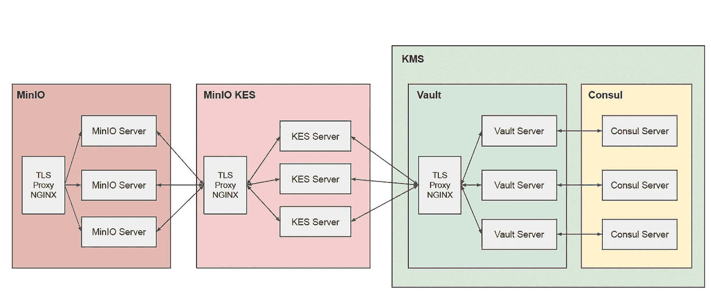

# 使用保险库保护静态 MinIO

> 原文：<https://itnext.io/secure-minio-at-rest-with-vault-ce319f8b6274?source=collection_archive---------3----------------------->


照片由 [Birger Strahl](https://unsplash.com/@bist31?utm_source=medium&utm_medium=referral) 在 [Unsplash](https://unsplash.com?utm_source=medium&utm_medium=referral) 上拍摄

如果您想使用 MinIO 公开 S3 服务，您应该考虑让 MinIO 数据在传输中和静态时都是安全的。在[上一篇文章](https://mykidong.medium.com/secure-minio-not-on-kubernetes-46dd90ccb1c)中，我谈到了保护传输中的 MinIO。在这篇文章中，我将展示如何使用 Vault 来保护 MinIO 的静态安全。

有许多密钥管理系统(KMS ),如 Hashicorp Vault、AWS Secrets Manager、GCP Secret Manager 和金雅拓 KeySecure 等。在外面。在这里，金库将被用作 KMS。

我们来看下图，看看如何用 vault 加密 MinIO 数据。


为了加密 MinIO 数据，我们需要一个 KMS，但不是直接访问 KMS，而是像 Vault 一样有`[KES](https://github.com/minio/kes)`作为 MinIO 服务器和 KMS 之间的桥梁。有了这个概念，KES 可以处理 KMS 的所有复杂问题，MinIO 可以轻松地通过 REST 访问 KES。这里用作 KMS 的 Vault 将通过类似 NGINX 的 TLS 代理访问，Hashicorp 的`Consul`将用作 Vault 的存储。

## 安装领事作为保险库的存储

如上图所示，在安装 Vault 之前，我们先安装 Consul cluster，用于 Vault 的存储。

要安装 consul 二进制文件，请运行以下命令。

```
# Install yum-config-manager to manage your repositories.
sudo yum install -y yum-utils;# Use yum-config-manager to add the official HashiCorp Linux repository.
sudo yum-config-manager --add-repo [https://rpm.releases.hashicorp.com/RHEL/hashicorp.repo](https://rpm.releases.hashicorp.com/RHEL/hashicorp.repo);# Find available versions to install.
yum --showduplicate list consul;# Install a specific version.
sudo yum install consul-1.9.3-1.x86_64 -y;# Verify the installation.
consul;
```

生成一个八卦加密密钥。

```
consul keygen;
+jqLwl3qx1FiOYS9+l1X4n8alHYXKy8ErTnpGiYs9gg=
```

并且，为 RPC 加密生成 TLS 证书。

```
## Create the Certificate Authority.
consul tls ca create;
==> Saved consul-agent-ca.pem
==> Saved consul-agent-ca-key.pem## Create the certificates.
consul tls cert create -server -dc dc1;
==> WARNING: Server Certificates grants authority to become a
    server and access all state in the cluster including root keys
    and all ACL tokens. Do not distribute them to production hosts
    that are not server nodes. Store them as securely as CA keys.
==> Using consul-agent-ca.pem and consul-agent-ca-key.pem
==> Saved dc1-server-consul-0.pem
==> Saved dc1-server-consul-0-key.pem
```

创建领事目录。

```
sudo mkdir -p /etc/consul.d /export/consul-data;
sudo chown -R consul:consul /etc/consul.d /export/consul-data;
sudo chmod 777 /etc/consul.d /export/consul-data;
```

将所有生成的证书复制到所有 consul 节点。

```
scp consul-agent-ca.pem consul-0:/etc/consul.d;
scp consul-agent-ca.pem consul-1:/etc/consul.d;
scp consul-agent-ca.pem consul-2:/etc/consul.d;scp dc1-server-consul-0.pem consul-0:/etc/consul.d
scp dc1-server-consul-0.pem consul-1:/etc/consul.d
scp dc1-server-consul-0.pem consul-2:/etc/consul.dscp dc1-server-consul-0-key.pem consul-0:/etc/consul.d
scp dc1-server-consul-0-key.pem consul-1:/etc/consul.d
scp dc1-server-consul-0-key.pem consul-2:/etc/consul.d
```

不要忘记允许防火墙上的端口。

```
sudo firewall-cmd  --add-port={8300,8301,8302,8400,8500,8600}/tcp --permanent
sudo firewall-cmd  --add-port={8301,8302,8600}/udp --permanent
sudo firewall-cmd --reload
```

接下来，创建 consul 服务器配置。

```
sudo su -;
cat <<EOF > /etc/consul.d/consul.hcl
datacenter = "dc1"
data_dir = "/export/consul-data"
encrypt = "+jqLwl3qx1FiOYS9+l1X4n8alHYXKy8ErTnpGiYs9gg="
ca_file = "/etc/consul.d/consul-agent-ca.pem"
cert_file = "/etc/consul.d/dc1-server-consul-0.pem"
key_file = "/etc/consul.d/dc1-server-consul-0-key.pem"
verify_incoming = true
verify_outgoing = true
verify_server_hostname = true
server = true
enable_syslog = true
bootstrap_expect = 3
client_addr = "0.0.0.0"
ui_config {
  enabled = true
}
performance {
  raft_multiplier = 1
}
acl = {
  enabled = true
  default_policy = "allow"
  enable_token_persistence = true
}
auto_encrypt {
  allow_tls = true
}
advertise_addr = "10.0.0.3"
bind_addr = "10.0.0.3"
retry_join = ["10.0.0.3", "10.0.0.4", "10.0.0.5"]
EOF
```

`advertise_addr`和`bind_addr`是运行领事节点的主机 ip。

可以验证配置。

```
consul validate /etc/consul.d/consul.hcl;
```

在每个节点上创建咨询服务。

```
# create consul service.
sudo su -;
cat <<EOF > /usr/lib/systemd/system/consul.service
[Unit]
Description="HashiCorp Consul - A service mesh solution"
Documentation=[https://www.consul.io/](https://www.consul.io/)
Requires=network-online.target
After=network-online.target
ConditionFileNotEmpty=/etc/consul.d/consul.hcl[Service]
Type=notify
User=consul
Group=consul
ExecStart=/usr/bin/consul agent -config-dir=/etc/consul.d/
ExecReload=/bin/kill --signal HUP $MAINPID
KillMode=process
KillSignal=SIGTERM
Restart=on-failure
LimitNOFILE=65536[Install]
WantedBy=multi-user.target
EOF
```

好，开始在所有节点上协商。

```
sudo systemctl enable consul;
sudo systemctl start consul;
sudo systemctl status consul;
```

检查领事成员。

```
# check consul members.
consul members;
Node     Address        Status  Type    Build  Protocol  DC   Segment
minio-0  10.0.0.3:8301  alive   server  1.9.3  2         dc1  <all>
minio-1  10.0.0.4:8301  alive   server  1.9.3  2         dc1  <all>
minio-2  10.0.0.5:8301  alive   server  1.9.3  2         dc1  <all>
```

如你所见，我们有三名执政官还活着。

查看更多细节。

```
consul members -detailed;
```

创建初始化。代币

```
consul acl bootstrap;
AccessorID:       6cf6d785-38ae-57df-0628-66ee28077880
SecretID:         2bf4d6a2-8249-1aa7-f0a3-7f85f80b2d8e
Description:      Bootstrap Token (Global Management)
Local:            false
Create Time:      2021-03-02 07:58:54.514032484 +0000 UTC
Policies:
   00000000-0000-0000-0000-000000000001 - global-management
```

例如，通过 Web 用户界面访问咨询。

```
http://<consul-node>:8500
```

到目前为止，我们已经在三个节点上安装了 Consul 集群。

## 将保管库安装为 KMS

Vault 可以在启用高可用性的模式下运行。在这里，Vault 将通过 TLS 代理 NGINX 安装 HA 支持。

比方说，我们有三个保险库节点。

```
vault-test.cloudchef-labs.com
vault-test1.cloudchef-labs.com
vault-test2.cloudchef-labs.com
```

我们需要 CA 证书，就像加密一样。在每个节点上生成证书。

```
# generate let's encrypt cert on vault node 0.
sudo certbot certonly --standalone -d vault-test.cloudchef-labs.com --staple-ocsp -m [mykidong@cloudchef-labs.com](mailto:mykidong@cloudchef-labs.com) --agree-tos;# generate let's encrypt cert on vault node 1.
sudo certbot certonly --standalone -d vault-test1.cloudchef-labs.com --staple-ocsp -m [mykidong@cloudchef-labs.com](mailto:mykidong@cloudchef-labs.com) --agree-tos;# generate let's encrypt cert on vault node 2.
sudo certbot certonly --standalone -d vault-test2.cloudchef-labs.com --staple-ocsp -m [mykidong@cloudchef-labs.com](mailto:mykidong@cloudchef-labs.com) --agree-tos;
```

现在，为 vault 节点 0 创建 vault 服务器配置。

```
######################## vault configuration for node-0.
sudo su -
cat <<EOF > /etc/vault.d/vault.hcl
storage "consul" {
  address = "127.0.0.1:8500"
  path    = "vault/"
  ha_enabled = "true"
  redirect_addr = "[https://vault-nginx-test.cloudchef-labs.com](https://vault-nginx-test.cloudchef-labs.com)"
  api_addr = "[https://vault-nginx-test.cloudchef-labs.com](https://vault-nginx-test.cloudchef-labs.com)"
  cluster_addr = "[http://vault-test.cloudchef-labs.com:8201](http://vault-test.cloudchef-labs.com:8201)"
}listener "tcp" {
  address = "0.0.0.0:8200"
  tls_cert_file = "/etc/letsencrypt/live/vault-test.cloudchef-labs.com/fullchain.pem"
  tls_key_file = "/etc/letsencrypt/live/vault-test.cloudchef-labs.com/privkey.pem"
}disable_mlock = true
EOF
```

看一看`storage "consul"`部分。`address`是领事地址。`redirect_addr`和`api_addr`是以后要安装的 NGINX 等 TLS 代理的地址。`cluster_addr`是正在运行的 vault 节点的主机 ip。

在`listener "tcp"`部分，`tls_cert_file`是由 Let's Encrypt 生成的证书的路径，`tls_key_file`是私钥的路径。

例如，为其他节点创建配置。

```
######################## vault configuration for node-1.
sudo su -
cat <<EOF > /etc/vault.d/vault.hcl
storage "consul" {
  address = "127.0.0.1:8500"
  path    = "vault/"
  ha_enabled = "true"
  redirect_addr = "[https://vault-nginx-test.cloudchef-labs.com](https://vault-nginx-test.cloudchef-labs.com)"
  api_addr = "[https://vault-nginx-test.cloudchef-labs.com](https://vault-nginx-test.cloudchef-labs.com)"
  cluster_addr = "[http://vault-test1.cloudchef-labs.com:8201](http://vault-test1.cloudchef-labs.com:8201)"
}listener "tcp" {
  address = "0.0.0.0:8200"
  tls_cert_file = "/etc/letsencrypt/live/vault-test1.cloudchef-labs.com/fullchain.pem"
  tls_key_file = "/etc/letsencrypt/live/vault-test1.cloudchef-labs.com/privkey.pem"
}disable_mlock = true
EOF######################## vault configuration for node-2.
sudo su -
cat <<EOF > /etc/vault.d/vault.hcl
storage "consul" {
  address = "127.0.0.1:8500"
  path    = "vault/"
  ha_enabled = "true"
  redirect_addr = "[https://vault-nginx-test.cloudchef-labs.com](https://vault-nginx-test.cloudchef-labs.com)"
  api_addr = "[https://vault-nginx-test.cloudchef-labs.com](https://vault-nginx-test.cloudchef-labs.com)"
  cluster_addr = "[http://vault-test2.cloudchef-labs.com:8201](http://vault-test2.cloudchef-labs.com:8201)"
}listener "tcp" {
  address = "0.0.0.0:8200"
  tls_cert_file = "/etc/letsencrypt/live/vault-test2.cloudchef-labs.com/fullchain.pem"
  tls_key_file = "/etc/letsencrypt/live/vault-test2.cloudchef-labs.com/privkey.pem"
}disable_mlock = true
EOF
```

在每个 vault 节点上运行 vault 服务器。

```
sudo nohup vault server -config /etc/vault.d/vault.hcl > vault.log &
```

初始化保险库。

```
# set vault env.
export VAULT_ADDR="[https://vault-test.cloudchef-labs.com:8200](https://vault-test.cloudchef-labs.com:8200)";
export VAULT_SKIP_VERIFY=true# init vault.
vault operator init;
Unseal Key 1: 4Jj3V/KLXFNLFnStJ0OzmLp0y7iQmZ31skyN9Uqgw9V4
Unseal Key 2: Fy/qPJTYA1CRYeZP/YVGlLg9ly8u/KOpr2vK7yKP/LHP
Unseal Key 3: lLIRESmYIvlF716SOyL0CW0m3jKm/hw1QuFlQtvd3aq0
Unseal Key 4: j7p5pnH/t/sSFPSLUzrymjUU/P63lb6UG6j9bVrKaYv+
Unseal Key 5: ri2WEmV2YX5WIby9hXOoeOGOeBIQkancYXfsQ3H3CdZIInitial Root Token: s.1ENJtfdmOUd8YCd9KRHbQfZz
...
```

解封所有 vault 服务器的 vault 服务器，例如 vault 服务器节点`vault-test.cloudchef-labs.com`。

```
export VAULT_ADDR="[https://vault-test.cloudchef-labs.com:8200](https://vault-test.cloudchef-labs.com:8200)";
export VAULT_SKIP_VERIFY=true 
export VAULT_TOKEN=s.1ENJtfdmOUd8YCd9KRHbQfZzvault operator unseal 4Jj3V/KLXFNLFnStJ0OzmLp0y7iQmZ31skyN9Uqgw9V4
vault operator unseal Fy/qPJTYA1CRYeZP/YVGlLg9ly8u/KOpr2vK7yKP/LHP
vault operator unseal lLIRESmYIvlF716SOyL0CW0m3jKm/hw1QuFlQtvd3aq0
```

随着`VAULT_ADDR`的改变，运行其他 vault 服务器的解封命令。

让我们测试跳马是否有效。

```
# set vault env.
export VAULT_ADDR="[https://vault-test.cloudchef-labs.com:8200](https://vault-test.cloudchef-labs.com:8200)";
export VAULT_SKIP_VERIFY=true 
export VAULT_TOKEN=s.1ENJtfdmOUd8YCd9KRHbQfZz# Enable the kv secrets engine at: secret/
vault secrets enable -path=secret/ kv# put kv with path 'secret/fakebank'
vault kv put secret/fakebank api_key=abc1234 api_secret=1a2b3c4d# get kv with path 'secret/fakebank'
vault kv get secret/fakebank;
======= Data =======
Key           Value
---           -----
api_key       abc1234
api_secret    1a2b3c4d
```

要使 Vault HA，我们需要类似 NGINX 的 TLS 代理。比方说，我们有一个 nginx 节点。

```
vault-nginx-test.cloudchef-labs.com
```

为我们的 Vault TLS 代理 NGINX 创建证书。

```
sudo certbot certonly --nginx -d vault-nginx-test.cloudchef-labs.com --staple-ocsp -m mykidong@cloudchef-labs.com --agree-tos;
```

现在，创建一个 NGINX 的反向代理配置。

```
sudo su -;
cat <<EOF > /etc/nginx/conf.d/vault-nginx-test.cloudchef-labs.com.conf
server {
    #listen 80 default_server;
    #listen [::]:80 default_server;
    root /var/www/html;
    server_name  vault-nginx-test.cloudchef-labs.com;# To allow special characters in headers
    ignore_invalid_headers off;
    # Allow any size file to be uploaded.
    # Set to a value such as 1000m; to restrict file size to a specific value
    client_max_body_size 0;
    # To disable buffering
    proxy_buffering off;listen 443 ssl; # managed by Certbot# RSA certificate
    ssl_certificate /etc/letsencrypt/live/vault-nginx-test.cloudchef-labs.com/fullchain.pem; # managed by Certbot
    ssl_certificate_key /etc/letsencrypt/live/vault-nginx-test.cloudchef-labs.com/privkey.pem; # managed by Certbotinclude /etc/letsencrypt/options-ssl-nginx.conf; # managed by Certbot# Redirect non-https traffic to https
    if (\$scheme != "https") {
        return 301 [https://](https://);
    } # managed by Certbotlocation / {
        proxy_set_header X-Real-IP \$remote_addr;
        proxy_set_header X-Forwarded-For \$proxy_add_x_forwarded_for;
        proxy_set_header X-Forwarded-Proto \$scheme;
        proxy_set_header Host \$http_host;proxy_connect_timeout 300;      
        proxy_http_version 1.1;
        proxy_set_header Connection "";
        chunked_transfer_encoding off;proxy_pass [https://vault](https://vault); 
   }
}
upstream vault {
    server vault-test.cloudchef-labs.com:8200;
    server vault-test1.cloudchef-labs.com:8200;
    server vault-test2.cloudchef-labs.com:8200;
}
EOF
```

现在，重新加载 NGINX 配置。

```
sudo nginx -t && sudo nginx -s reload;
```

要使用 TLS 代理 NGINX 访问 vault，让我们测试一下。

```
## test vault
export VAULT_ADDR="[https://vault-nginx-test.cloudchef-labs.com](https://vault-nginx-test.cloudchef-labs.com)";
export VAULT_SKIP_VERIFY=true 
export VAULT_TOKEN=s.1ENJtfdmOUd8YCd9KRHbQfZz# get value.
vault kv get secret/fakebank;
======= Data =======
Key           Value
---           -----
api_key       abc1234
api_secret    1a2b3c4d
```

看一下`VAULT_ADDR`，它是 TLS 代理 NGINX 的地址。正如所见，它工作正常。

## 安装迷你 KES

要允许米尼奥·KES 访问保险库，您必须运行以下命令。

```
export VAULT_ADDR="[https://vault-nginx-test.cloudchef-labs.com](https://vault-nginx-test.cloudchef-labs.com)";
export VAULT_SKIP_VERIFY=true 
export VAULT_TOKEN=s.1ENJtfdmOUd8YCd9KRHbQfZz## Enable Vault's K/V backend
vault secrets enable kv;## Enable AppRole authentication.
vault auth enable approle## Create an access policy for the K/V engine.
cat > kes-policy.hcl <<EOF
path "kv/*" {
     capabilities = [ "create", "read", "delete" ]
}
EOF### Then we upload the policy to Vault:
vault policy write kes-policy ./kes-policy.hcl;## Create an new AppRole ID and bind it to a policy.
vault write auth/approle/role/kes-role token_num_uses=0  secret_id_num_uses=0  period=5m;### Then we bind the kes-policy policy to the role:
vault write auth/approle/role/kes-role policies=kes-policy;### Finally, we request an AppRole role ID and secret ID from Vault.
### First, the role ID:
vault read auth/approle/role/kes-role/role-id;
Key        Value
---        -----
role_id    6fcc2761-2be9-1f89-2dec-899f27b7faa9### Then, the secret ID:
### We are only interested in the secret_id - not in the secret_id_accessor.
vault write -f auth/approle/role/kes-role/secret-id;
Key                   Value
---                   -----
secret_id             73e1d9ab-3b1a-cd83-10fd-d1ed49226c35
secret_id_accessor    bcb8150a-0e5b-1a8b-5345-ea94948a8e49
```

比如说，我们的 KES 节点是。

```
kes-test.cloudchef-labs.com
```

安装 KES 二进制文件。

```
wget https://github.com/minio/kes/releases/download/v0.13.5/kes_0.13.5_linux_amd64.rpm; *3*sudo rpm -Uvh ./kes_0.13.5_linux_amd64.rpm;
```

以避免以 root 用户身份运行 KES。

```
sudo setcap cap_ipc_lock=+ep $(readlink -f $(which kes));
```

从让我们加密生成证书。

```
sudo certbot certonly --standalone -d kes-test.cloudchef-labs.com --staple-ocsp -m mykidong@cloudchef-labs.com --agree-tos;
```

将生成的证书复制到 KES 主目录。

```
mkdir -p kes;
sudo cp /etc/letsencrypt/live/kes-test.cloudchef-labs.com/fullchain.pem /home/opc/kes/fullchain.pem
sudo cp /etc/letsencrypt/live/kes-test.cloudchef-labs.com/privkey.pem /home/opc/kes/privkey.pem
sudo chown opc:opc -R kes;
```

让我们使用 KES CLI 为应用程序创建私有证书。

```
kes tool identity new --key=app.key --cert=app.cert app;
```

从生成的`app.cert`中查看应用 ID。

```
kes tool identity of app.cert;Identity:  8c0e61377339ee7f770b40719b80c5939e68904a07f9282fe5f8754597ce4dbf
```

允许防火墙上的端口。

```
sudo firewall-cmd  --add-port=7373/tcp --permanent
sudo firewall-cmd --reload
```

让我们创建 KES 配置。

```
cat <<EOF > kes.yml
address: 0.0.0.0:7373
root:    disabled 
tls:
  key:  /home/opc/kes/privkey.pem
  cert: /home/opc/kes/fullchain.pem
policy:
  my-app:
    paths:
    - /v1/key/create/my-app*
    - /v1/key/generate/my-app*
    - /v1/key/decrypt/my-app*
    identities:
    - \${APP_IDENTITY}
keys:
  vault:
    endpoint: [https://vault-nginx-test.cloudchef-labs.com](https://vault-nginx-test.cloudchef-labs.com)
    approle:
      id:     "6fcc2761-2be9-1f89-2dec-899f27b7faa9" # Your AppRole ID
      secret: "73e1d9ab-3b1a-cd83-10fd-d1ed49226c35" # Your AppRole Secret ID
      retry:  15s
    status:
      ping: 10s  
EOF
```

看一下`keys.vault.endpoint` ，这是金库的 NGINX 代理的地址。

让我们运行 KES 服务器。

```
export APP_IDENTITY=$(kes tool identity of /home/opc/app.cert);
nohup kes server --mlock --config=kes.yml --auth=off > kes.log &
```

创建应用程序密钥。

```
export KES_SERVER=[https://kes-test.cloudchef-labs.com:7373](https://kes-test.cloudchef-labs.com:7373);
export KES_CLIENT_CERT=/home/opc/app.cert
export KES_CLIENT_KEY=/home/opc/app.keykes key create -k my-app-key;
```

您可以使用 vault cli 查看密钥。

```
export VAULT_ADDR="[https://vault-nginx-test.cloudchef-labs.com](https://vault-nginx-test.cloudchef-labs.com)";
export VAULT_SKIP_VERIFY=true 
export VAULT_TOKEN=s.1ENJtfdmOUd8YCd9KRHbQfZzvault kv list kv/;
Keys
----
my-app-key
```

让我们用 KES 命令行界面导出数据密钥。

```
kes key derive -k my-app-key;
{
  plaintext : AsVPauMZ1NTed4/fwybJJdJd3hWt+pI/NVrxLoj3nVw=
  ciphertext: eyJhZWFkIjoiQUVTLTI1Ni1HQ00tSE1BQy1TSEEtMjU2IiwiaXYiOiJuM1FXbDVVSGpHZ2NFbFVvVmRWRW1RPT0iLCJub25jZSI6IjBtZXVYc1hEMkI2aXlmYnIiLCJieXRlcyI6InhtUWcyOThmVjd3L2hLZzR5MnpsVGlHZjlNUkRtd3ZrQ2lTaHpvSzBtZUQxTlVhQ2UyekFYVUcxOXJramYzRE4ifQ==
}
```

像 NGINX 这样的 TLS 代理可以与 KES 服务器集成，你将在本文的最后一节看到这一点。

## 配置 MinIO

要安装 MinIO 服务器，可以看[之前的帖子](https://mykidong.medium.com/secure-minio-not-on-kubernetes-46dd90ccb1c)。

要从 MinIO 访问 KES 服务器，MinIO 服务器将使用在前面部分生成的私有证书和证书。将 KES CLI 生成的所有私有证书和证书复制到所有 MinIO 节点。

```
scp app.* minio-0:/home/opc;
scp app.* minio-1:/home/opc;
scp app.* minio-2:/home/opc;
```

添加环境。minio 节点上的 MinIO 变量。

```
export MINIO_KMS_KES_ENDPOINT=[https://kes-test.cloudchef-labs.com:7373](https://kes-test.cloudchef-labs.com:7373)
export MINIO_KMS_KES_KEY_FILE=/home/opc/app.key
export MINIO_KMS_KES_CERT_FILE=/home/opc/app.cert
export MINIO_KMS_KES_KEY_NAME=my-app-key
```

现在，重启所有的 MinIO 服务器。

将自动加密设置为 MinIO。

```
mc encrypt set sse-s3 minio-https/mykidong/
```

验证自动加密是否已启用。

```
mc encrypt info minio-https/mykidong/;
Auto encryption 'sse-s3' is enabled
```

让我们复制一个文件到 MinIO 来验证上传的文件是加密的。

```
# copy a file to minio.
mc cp server-config.yml minio-https/mykidong;
```

查看上传文件的对象信息。

```
mc stat minio-https/mykidong/server-config.yml;
Name      : server-config.yml
Date      : 2021-03-04 06:06:11 GMT
Size      : 643 B
ETag      : 003d229d1701812e4df983db83135cc1
Type      : file
Metadata  :
  Content-Type: text/yaml
Encrypted :
  X-Amz-Server-Side-Encryption: AES256
```

不出所料，上传的文件会自动加密！

## MinIO KES HA，带 TLS 代理 NGINX

MinIO KES 服务器是一个无状态的应用程序，可以通过集成 NGINX 代理向外扩展。



如图所示，NGINX 代理位于 KES 服务器的前面，充当 TLS 代理。

我们现在已经创建了一个 KES 服务器节点，让我们再添加两个 KES 服务器节点。

```
kes-test1.cloudchef-labs.com 
kes-test2.cloudchef-labs.com
```

您必须像以前一样在新的 KES 服务器节点上创建证书并打开端口。

```
## create certs from let's encrypt on node-1.
sudo certbot certonly --standalone -d kes-test1.cloudchef-labs.com --staple-ocsp -m [mykidong@cloudchef-labs.com](mailto:mykidong@cloudchef-labs.com) --agree-tos;## create certs from let's encrypt on node-2.
sudo certbot certonly --standalone -d kes-test2.cloudchef-labs.com --staple-ocsp -m [mykidong@cloudchef-labs.com](mailto:mykidong@cloudchef-labs.com) --agree-tos;## copy let's encrypt certs on node-1
mkdir -p kes;
sudo cp /etc/letsencrypt/live/kes-test1.cloudchef-labs.com/fullchain.pem /home/opc/kes/fullchain.pem
sudo cp /etc/letsencrypt/live/kes-test1.cloudchef-labs.com/privkey.pem /home/opc/kes/privkey.pem
sudo chown opc:opc -R kes;## copy let's encrypt certs on node-2
mkdir -p kes;
sudo cp /etc/letsencrypt/live/kes-test2.cloudchef-labs.com/fullchain.pem /home/opc/kes/fullchain.pem
sudo cp /etc/letsencrypt/live/kes-test2.cloudchef-labs.com/privkey.pem /home/opc/kes/privkey.pem
sudo chown opc:opc -R kes;## allow port on firewall on kes server nodes.
sudo firewall-cmd  --add-port=7373/tcp --permanent
sudo firewall-cmd --reload
```

将应用程序证书复制到新的 KES 服务器节点。

```
## copy app certs to new kes server nodes.
sudo scp app.* opc@kes-test1:/home/opc
sudo scp app.* opc@kes-test2:/home/opc
```

现在，为 NGINX 创建私有证书。

```
kes tool identity new --key=nginx.key --cert=nginx.cert nginx;
```

并将生成的证书复制到 NGINX conf 目录中。

```
sudo cp nginx.* /etc/nginx;
```

让我们打印 nginx 应用程序的 id。这个 NGINX 应用 ID 将在 KES 注册。

```
kes tool identity of nginx.cert;Identity:  8d5cbaa02b6ad70abefc03d52cd5f6d9945457cf9a1da0516438eb96d91add2d
```

并在所有 KES 服务器节点上创建新的 KES 配置。

```
cat <<EOF > kes.yml
address: 0.0.0.0:7373
root: disabled
tls:
  key: /home/opc/kes/privkey.pem
  cert: /home/opc/kes/fullchain.pem
  proxy:
    identities:
      - 8d5cbaa02b6ad70abefc03d52cd5f6d9945457cf9a1da0516438eb96d91add2d
    header:
      cert: X-Tls-Client-Cert
policy:
  my-app:
    paths:
    - /v1/key/create/my-app*
    - /v1/key/generate/my-app*
    - /v1/key/decrypt/my-app*
    identities:
    - \${APP_IDENTITY}
keys:
  vault:
    endpoint: [https://vault-nginx-test.cloudchef-labs.com](https://vault-nginx-test.cloudchef-labs.com)
    approle:
      id:     "6fcc2761-2be9-1f89-2dec-899f27b7faa9" # Your AppRole ID
      secret: "73e1d9ab-3b1a-cd83-10fd-d1ed49226c35" # Your AppRole Secret ID
      retry:  15s
    status:
      ping: 10s
log:
  error: on
  audit: on
EOF
```

看一下`tls`部分。

```
tls:
  key: /home/opc/kes/privkey.pem
  cert: /home/opc/kes/fullchain.pem
  proxy:
    identities:
      - 8d5cbaa02b6ad70abefc03d52cd5f6d9945457cf9a1da0516438eb96d91add2d
    header:
      cert: X-Tls-Client-Cert
```

之前打印的 NGINX 应用 ID 已添加到`identities`中，并添加了标题`cert`。

让我们启动或重启 KES 服务器。

```
export APP_IDENTITY=$(kes tool identity of /home/opc/app.cert);
nohup kes server --mlock --config=kes.yml --auth=off > kes.log &
```

现在，您已经部署了三台 KES 服务器。

让我们用 Let's Encrypt 为 NGINX 创建一个证书，服务器名为`kes-nginx-test.cloudchef-labs.com`，之前应该在公共 dns 中注册。

```
sudo certbot certonly --nginx -d kes-nginx-test.cloudchef-labs.com --staple-ocsp -m mykidong@cloudchef-labs.com --agree-tos;
```

创建一个 nginx 配置来代理 kes 服务器。

```
cat <<EOF > /etc/nginx/conf.d/kes-nginx-test.cloudchef-labs.com.conf
server {
    listen         443 ssl http2;
    server_name    kes-nginx-test.cloudchef-labs.com;
    proxy_buffering off;
    client_max_body_size 0;
    ssl_certificate /etc/letsencrypt/live/kes-nginx-test.cloudchef-labs.com/fullchain.pem;
    ssl_certificate_key /etc/letsencrypt/live/kes-nginx-test.cloudchef-labs.com/privkey.pem;
    ssl_verify_client   optional_no_ca;        
    location / {   
       grpc_pass             grpcs://kes;
       grpc_ssl_verify       off;
       grpc_ssl_protocols    TLSv1.3;
       grpc_ssl_certificate       /etc/nginx/nginx.cert;    
       grpc_ssl_certificate_key   /etc/nginx/nginx.key;
       grpc_set_header X-Tls-Client-Cert \$ssl_client_escaped_cert;
    }
}
upstream kes {
    server kes-test.cloudchef-labs.com:7373; 
 server kes-test1.cloudchef-labs.com:7373; 
 server kes-test2.cloudchef-labs.com:7373; 
}
EOF
```

确保`ssl_certificate`、`ssl_certificate_key`、`grpc_ssl_certifiate`和`grpc_ssl_certificate_key`的路径正确。`ssl_certificate`、`ssl_certificate_key`的值应该是 Let's Encrypt 生成的 nginx 证书的路径，`grpc_ssl_certifiate`、`grpc_ssl_certificate_key`的值应该是 kes 工具生成的 nginx 应用证书的路径。

测试并重新加载 nginx 配置。

```
sudo nginx -t && sudo nginx -s reload;
```

我们通过 NGINX 来检查 key，派生的 key 应该是这样的。

```
export KES_SERVER=https://kes-nginx-test.cloudchef-labs.com; 
export KES_CLIENT_CERT=/home/opc/app.cert 
export KES_CLIENT_KEY=/home/opc/app.key kes key derive -k my-app-key;{
  plaintext : LlMBd14j7y6o4Z0/6o7JeR5Sdl9gCMwSPSlrcSQud9s=
  ciphertext: eyJhZWFkIjoiQUVTLTI1Ni1HQ00tSE1BQy1TSEEtMjU2IiwiaXYiOiJHUStuSzg5WHNOZUowamkxS0RMcEZRPT0iLCJub25jZSI6Inp6bE01S21PUVpqSU90TDkiLCJieXRlcyI6ImFBWmhzUUlBQ28zZmNjNTA4NUg0OHBYM3hSblRGM0tTSDFPZzZsamdGQWZ2dTAvYWtueVhyanBrSHl5bVZYRzcifQ==
}
```

注意`KES_SERVER`被设置为 NGINX 的端点。

让我们修改`MINIO_KMS_KES_ENDPOINT`的环境变量并重启 MinIO。

```
export MINIO_KMS_KES_ENDPOINT=https://kes-nginx-test.cloudchef-labs.com
```

现在，MinIO 服务器将通过 TLS 代理 NGINX 连接 KES 服务器。

让我们再次验证数据加密。

```
# put an object.
mc cp server.pem minio-https/mykidong;# check object info.
mc stat minio-https/mykidong/server.pem;
Name      : server.pem
Date      : 2021-04-30 03:21:14 GMT
Size      : 753 B
ETag      : 5b2b43f1939ea001a9949515aa281446
Type      : file
Metadata  :
  Content-Type: application/x-x509-ca-cert
Encrypted :
  X-Amz-Server-Side-Encryption: AES256
```

对于 KES 服务器的 TLS 代理 NGINX，静态数据加密运行良好。

仅此而已。