# NATS 的安全酒吧/订阅

> 原文：<https://itnext.io/secure-pub-sub-with-nats-fcda983d0612?source=collection_archive---------2----------------------->

## 使用 TLS 和 authn/authz 设置 NATS 服务器


在本文中，我们将运行一个 NATS 服务器并保护它；因此，客户端的连接是 TLS 加密的，最终用户通过 JWT 认证，只允许对主题进行有限的访问。我们将使用 NATS 2.0 账户管理功能来隔离信息流。

本文分为几个部分:

*   一个简单用例的演示
*   服务器证书的创建
*   使用 TLS 运行 NATS 服务器
*   NATS 的认证/授权
*   设置操作员、帐户和用户
*   整个设置的测试

# 一个简单的发布/订阅用例

在之前的文章[NATS 入门](/getting-started-with-nats-b752cbb17f74)中，我们展示了 NATS 可用的模式。我们现在将关注发布/订阅。

假设我们有一个由几个客户使用的 web 应用程序。当客户使用浏览器访问应用程序时，它会自动订阅一个 WebSocket 来接收任何类型的事件通知。为了强化这个过程，并且不过度依赖 WebSockets，尤其是在生成大量事件的情况下，我们决定使用 NATS 消息传递系统来设置发布/订阅。要求非常简单:

*   与此系统的连接必须使用 TLS 来保护
*   所有连接到消息传递系统的用户都必须经过身份验证
*   该应用程序必须使用一个特殊的用户帐户，授权发布任何类型的消息
*   该应用程序在“*客户”上发布客户的相关事件。NAME.events"* NATS 的主题，名称为客户名称
*   一个客户只能订阅“ *customers.NAME. >* ”主题，这样才能接收发布在“*客户上的消息。NAME.events"* 还要将所有消息下发给"*客户。命名*“层次结构(以防将来需要)

下面的模式给出了由应用程序(*发布者*)生成的两条消息的示例。每条消息都发布在一个特定的主题上，包含与该消息相关的客户的名称。每个客户(模式底部的 3 个虚假公司名称)都订阅了一个专用主题，因此它只能接收通过该主题发送的消息。

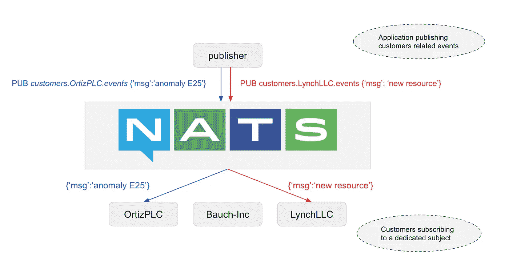

消息流隔离的发布/订阅示例

# 创建服务器证书

为了保护我们的 NATS 服务器，我们将创建一个 x509 证书。我们将使用我们自己的自签名证书颁发机构来签署此证书。

对于这个任务，我们使用 [cfssl](https://github.com/cloudflare/cfssl) ，一个来自 [Cloudflare](https://cloudflare.com) 的 TLS 工具包。

[](https://github.com/cloudflare/cfssl) [## cloudflare/cfssl

### CFSSL 是 CloudFlare 的 PKI/TLS 瑞士军刀。它既是一个命令行工具，也是一个 HTTP API 服务器，用于签名…

github.com](https://github.com/cloudflare/cfssl) 

注意:我们可以使用 [OpenSSL](https://www.openssl.org) 命令，但是 cfssl 工具更友好:)

## 认证机构

使用 cfssl，创建自签名 CA 很容易，因为它只需要一个如下所示的配置文件。

```
{
    "CN": "Techwhale CA",
    "key": {
        "algo": "rsa",
        "size": 2048
    },
    "names": [
        {
               "C": "FR",
               "L": "Antibes",
               "O": "Techwhale",
               "ST": "PACA"
        }
    ]
}
```

在这个文件中，我们提供了一个名为 Techwhale 的虚构公司的信息，该公司位于法国昂蒂布(顺便说一下，是一个伟大的城市:)。我们将这些内容保存在一个 *ca.json* 文件中，并创建 ca:

```
$ cfssl gencert -initca ca.json | cfssljson -bare ca
```

该命令创建了几个文件:

```
$ tree .
.
├── ca-key.pem
├── ca.csr
├── ca.json
└── ca.pem
```

我们将在下一部分使用 *ca.pem* 和 *ca-key.pem* 来签署服务器证书。

## 服务器证书

首先，在一个 *config.json* 配置文件中，我们定义我们想要创建的证书的概要文件。这里只定义了一个配置文件，因为我们将只为服务器创建一个证书。

```
{
    "signing": {
        "default": {
            "expiry": "43800h"
        },
        "profiles": {   
            "server": {
                "expiry": "43800h",
                "usages": [
                    "signing",
                    "digital signing",
                    "key encipherment",
                    "server auth"
                ]
            }
        }
    }
}
```

注意:可以设置 mTLS (mutual TLS)连接，这样服务器也可以验证客户端。但是有了 mTLS，认证撤销会变得很痛苦。我们将在下面看到，NATS 为基于 jwt 发布的客户端认证提供了一个很好的机制。

为了创建服务器的证书，我们首先定义一个 *server.json* 文件，列出我们希望服务器证书包含的域。在当前示例中，我们假设我们的 NATS 服务器在域*messaging . tech whale . io .*上可用

```
{
    "CN": "Server",
    "hosts": [
        "127.0.0.1",
        "messaging.techwhale.io"
    ]
}
```

接下来，我们生成服务器的证书，并用之前创建的 CA 对其进行签名。

```
$ cfssl gencert -ca=ca.pem -ca-key=ca-key.pem -config=config.json \
  -profile=server server.json | cfssljson -bare server
```

我们现在已经准备好了 CA 和服务器证书。

```
$ tree .
.
├── **ca-key.pem**
├── ca.csr
├── ca.json
├── **ca.pem**
├── config.json
├── **server-key.pem**
├── server.csr
├── server.json
└── **server.pem**
```

在下一部分中，我们将使用这些证书( **)。pem* 文件)来保护我们的 NATS 服务器。

# 使用 TLS 运行 NATS 服务器

当我们访问一个安全的网站时，我们习惯了 TLS。客户端(web 浏览器)有一个可信的证书颁发机构列表，其中一个用于签署服务器证书，因此它知道它可以信任服务器。

在这篇文章的例子中，我们将设置服务器，以便用它的证书和私钥来配置它。此外，我们将向客户端提供 CA，以便它可以对服务器进行身份验证。

## 服务器配置

我们将使用下面的 *server.conf* 文件来配置 NATS 服务器。

```
listen: 0.0.0.0:4222tls: {
  cert_file: "./certs/server.pem"
  key_file: "./certs/server-key.pem"
}
```

服务器在 TLS 握手期间发送其证书( *server.pem* ),以便客户端可以验证它已经由它知道的 CA 签名。

然后，我们可以运行服务器:

```
$ nats-server -c server.conf
```

## 客户端配置

Python 客户端的例子可以在[https://git lab . com/lucj/NATs-demo/blob/master/consumer-TLS . py](https://gitlab.com/lucj/nats-demo/blob/master/consumer-TLS.py)找到。

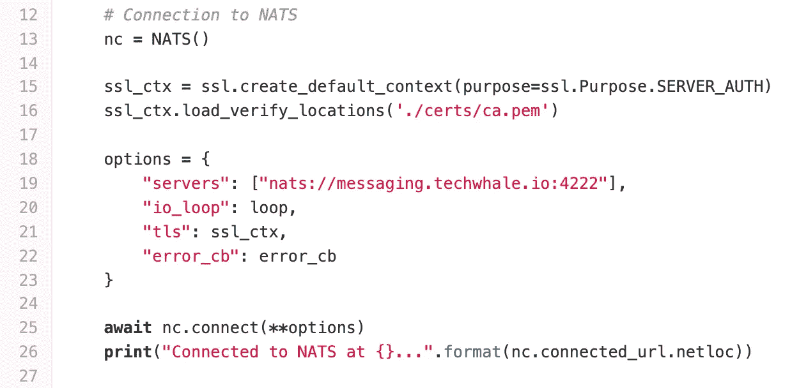

通过 TLS 连接到 NATS 服务器的示例应用程序代码

从这个片段中，我们可以看到:

*   客户端连接到位于 *messaging.techwhale.io* 上的 NATS 服务器
*   客户端被给予 CA ( *ca.pem)* 文件。在 TLS 握手期间，它可以验证服务器提供的证书，确保它已经由该 CA 签名

## 测试连接

我们现在可以运行 NATS 服务器，并通过 TLS 连接来连接客户端。

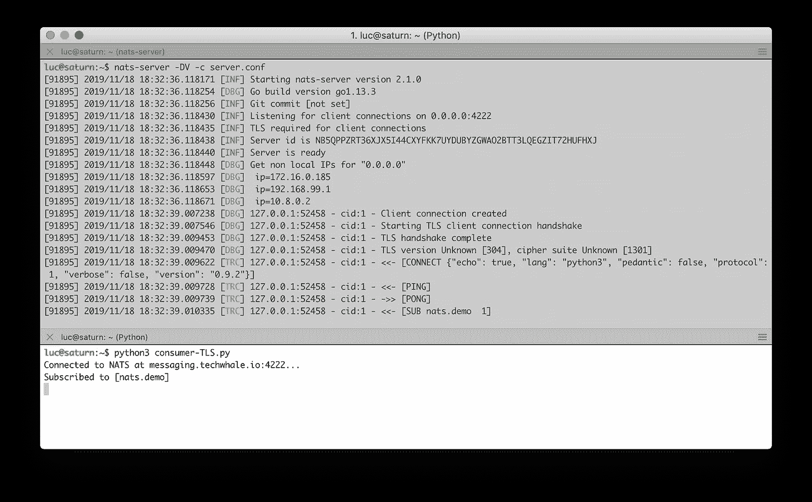

客户端通过 TLS 连接到 NATS 服务器

从上面的服务器日志中，我们可以看到:

*   服务器启动时会激活 TLS 选项(“客户端连接需要 TLS”)
*   客户端可以通过 TLS 连接(“TLS 手动检查完成”)并订阅 *nats.demo* 主题

通过这种设置，客户端和 NATS 服务器之间的通信是加密的。客户端可以对服务器进行身份验证，但是服务器还不能识别客户端。在下一步中，我们将使用 NATS 2.0 安全模型来设置客户端身份验证(因此服务器知道它可以信任客户端)和授权(因此客户端对它可以发布或订阅的主题具有受限的访问权限)。

# NATS 的认证/授权

NATS 2.0 采用了一种新的分散式安全模型，其中包含几个分层组织的实体:

*   一个**操作员**负责运行一个 NATS 集群，并签署账户 jwt。运营商有一个私钥和一个用该私钥签名的公共 JWT
*   一个**账户**是通信的隔离层。默认情况下，不同帐户的用户不能通信，但可以在帐户之间安全地共享消息流和服务。由运营商签署的作为公共 JWT 的账户
*   **用户**由一个账号发布。它定义了关于主题空间的使用和授权的限制。用户作为公共 JWT 由发行帐户签名。用户的 JWT 及其私钥保存在一个 creds(凭证)文件中，该文件是用户对 NATS 服务器进行身份验证所需要的全部内容

NATS 还提供了其他几种验证用户身份的方法:

*   令牌认证
*   用户名/密码凭据
*   TLS 证书
*   有挑战的 NKEY
*   帐目

注:如果你想知道更多关于如何使用每个配置选项的信息，你可以参考[NATS 官方文档](https://docs.nats.io/nats-server/configuration/securing_nats/auth_intro)

在这篇博文的例子中，我们将使用 JWT 方法来认证系统中的不同实体。那些在 NATS 被认为是公开的代币(更多信息见[https://jwt.io/](https://jwt.io/))是由 [NSC](https://docs.nats.io/nats-tools/nsc) 创造的。该工具简化了创建和管理身份和其他 JWT 工件的任务。默认情况下，jwt 保存在 *~/中。nsc* 和 *~/中的秘密。nkeys*

# 设置操作员、帐户和用户

首先，我们创建一个负责运行 NATS 服务器的操作员:

```
$ nsc add operator -n op
```

我们可以使用 NSC 来描述一个实体并获得额外的信息。

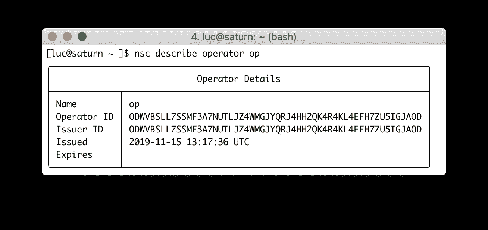

将负责 NATS 服务器的运营商的详细信息

这里需要注意的重要一点是，*操作者 ID* 与*发行者 ID* 相同，因为操作者已经自己签名。

接下来，我们创建一个名为 *admin* 的帐户，我们将使用这个帐户作为主要实体，稍后我们将在其中定义一个 admin 用户。

```
$ nsc add account -n admin
```

注意:nsc 也可以交互使用，提问各种设置，使用 *-i* / *- interactive* 标志。

```
luc@saturn:~$ nsc add account -i
? account name admin
? generate an account nkey Yes
? valid 0
? valid until (0 is always) 0
```

我们可以像描述操作员一样描述帐户。

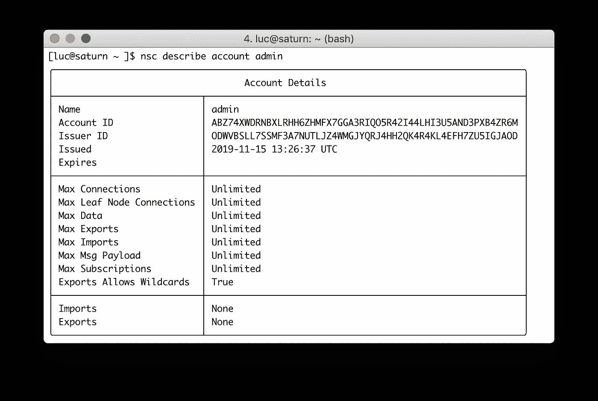

用于管理目的的帐户详细信息

在上面的输出中，我们可以看到*发行者 ID* 是*操作员 ID* ，因为帐户令牌已经由我们之前创建的操作员签名。从所有的*无限制*值中可以看出，在账户级别没有设置特殊配置。我们很快就会回到进口/出口部分。

接下来，我们在 admin 帐户中创建一个用户，并授予其发布和订阅“>”的权限。使用这个特殊的 char 赋予用户发布和订阅所有可能主题的权利。

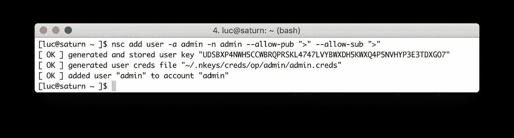

在管理员帐户中创建用户

创建用户时，出现一个*。creds* 文件被创建(正如我们在上面的命令结果中看到的)。用户将使用其凭据文件对 NATS 服务器进行身份验证。

描述用户，我们可以看到它已经由*管理员*帐户签名。我们还可以看到它可以发布和订阅的主题。

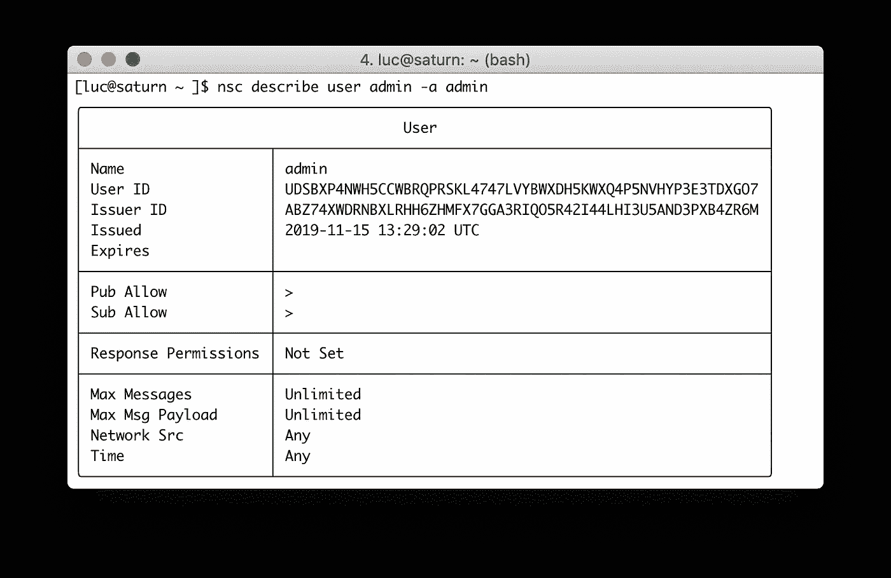

在管理员帐户中创建的管理员用户的详细信息

接下来，我们为客户创建一个帐户，让我们考虑一个名为 OrtizPLC 的虚假公司

```
$ nsc add account -n OrtizPLC
```

在这个帐户中，我们创建一个名为 *ortiz 的用户。*我们只希望这个用户能够订阅“*customers . Ortiz PLC .>”*subjects(*customers 下的所有 subjects)。OrtizPLC* 层级)。此外，它不应该有权发表任何主题。

```
$ nsc add user -a OrtizPLC -n ortiz \
  --deny-pub ">" \
  --allow-sub "customers.OrtizPLC.>"
```

注意:如果用户被拒绝发布任何主题，我们可以给它响应权限，这样它就可以发布到它已经被给予的回复主题(请求/回复模式)。

## 快速看一下 JWT 和恩基斯

在~/内。nsc 文件夹中，我们可以看到创建的所有 JWT，每个实体一个(1 个操作员，2 个帐户，每个帐户一个用户)。

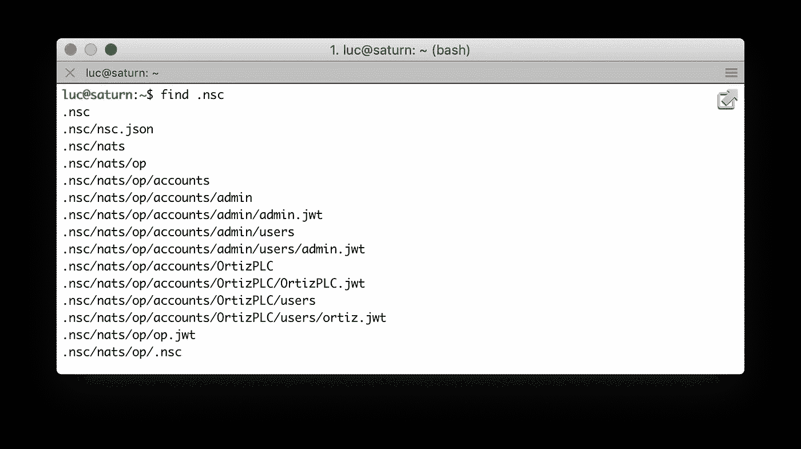

JWT 为每个实体创建了

让我们关注一下从 *OrtizPLC* 账户发出的为 *ortiz* 用户创建的 JWT。

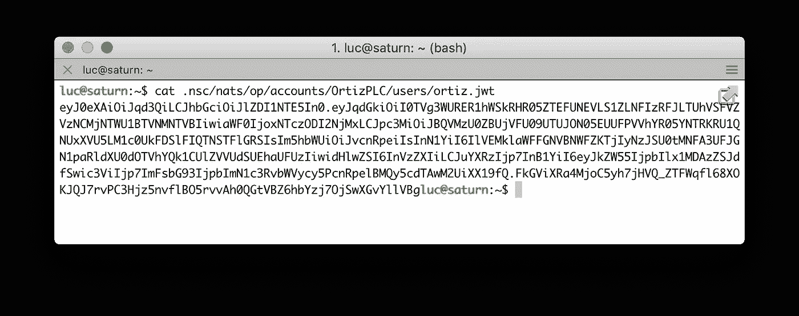

从 [JWT.io](https://jwt.io) 我们可以很容易地解码这个 JWT 的内容，并得到几个用户相关的信息，其中包括附加给用户的权限:

*   拒绝在' *>* '上发布
*   允许订阅' *customers.OrtizPLC. >* '

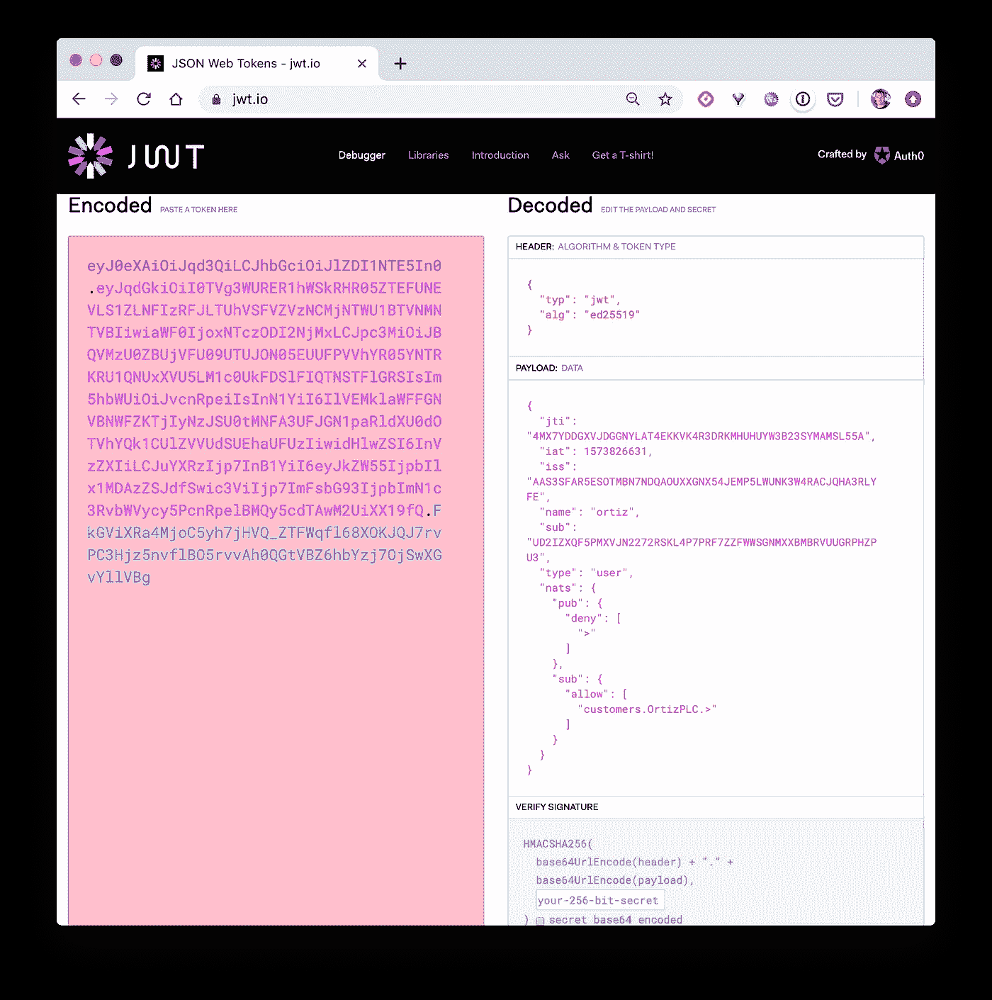

用户 ortiz 的 creds(凭证文件)

还有，来自 *~/。nkeys* 文件夹(其中的所有信息必须保密)我们可以看到为每个用户创建的 creds(凭证)文件。

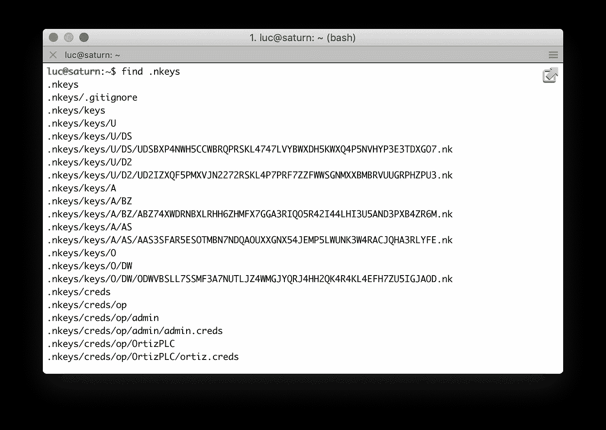

让我们仔细看看 *ortiz* 用户的 creds 文件的内容。

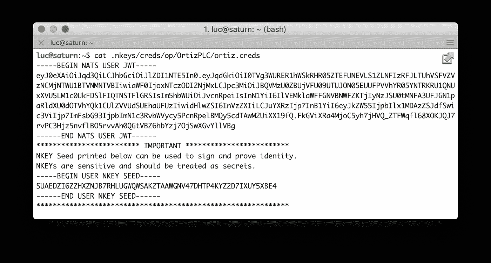

为 ortiz 用户创建的 creds(凭据)文件

正如我们所看到的，它包含了它的公共 JWT 密钥和相关的私有密钥。当用户连接到提供其 creds 文件的 NATS 服务器时，因为服务器是在知道运营商的 JWT 的情况下启动的，所以信任链得到验证。它一直从用户到签署 JWT 的账户，再到签署账户 JWT 的运营商。这个信任链允许服务器对用户进行身份验证，并确保它可以信任用户。

## 在帐户之间共享邮件

我们现在要确保 *ortiz* 用户可以订阅由 *admin* 用户在“*customers . Ortiz PLC .>*”主题上发布的消息。

为了在帐户之间共享消息，我们必须从 *admin* 帐户导出一个流，并将其导入 OrtizPLC 帐户。

*   创建导出

以下命令从 *admin* 帐户创建一个*导出*。它将允许导入它的帐户订阅“*customers . ortizplc .>*”主题。这个*出口*是不公开的。

```
$ nsc add export -a admin -n admin \
  -s "customers.OrtizPLC.>" --private
```

再次描述 admin 帐户，我们看到一个显示我们刚刚导出的私有流的表格。

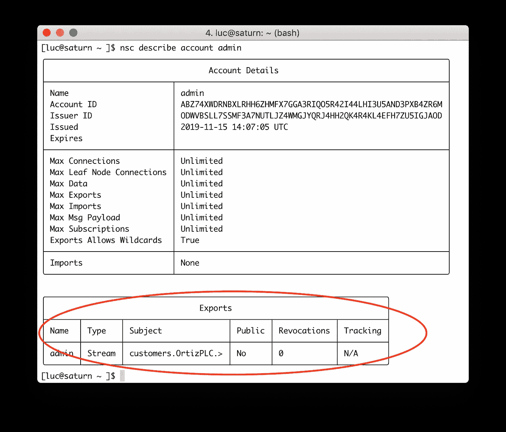

由管理员帐户导出流，以便邮件可以与其他帐户共享

接下来，我们将把这个流导入到 *OrtizPLC* 账户中。

我们首先需要获得 OrtizPLC 账户的 ID

```
$ export ID=$(nsc describe account OrtizPLC | grep "Account ID" | awk '{print $5}')
```

然后我们创建一个激活令牌来允许 OrtizPLC 账户导入流

```
$ nsc generate activation -o activation.jwt \
  --account admin \
  --target-account $ID \ 
  --subject "customers.OrtizPLC.>"
```

使用这个激活令牌，我们可以创建一个到 *OrtizPLC* 帐户的导入:

```
$ nsc add import -a OrtizPLC --token activation.jwt
```

描述 *OrtiZPLC* 账户，我们可以看到一个显示可用导入的表格。

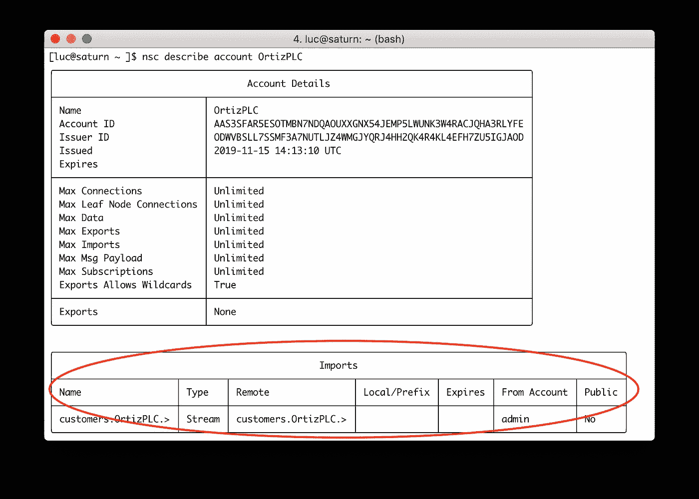

导入到 OrtizPLC 帐户的流

*OrtizPLC* 账户内的用户现在可以订阅*" customers . OrtizPLC .>"*主题，并接收管理员用户发布的消息。这是我们即将测试的内容。

## 使用 NATS 帐户服务器

[NATS 帐户服务器](https://github.com/nats-io/nats-account-server)是一个 HTTP 服务器，托管和服务用于 NATS 2.0 帐户认证的 jwt。它可以供应几家商店的 jwt:

*   目录
*   NSC 目录
*   内存(用于测试目的)

在下面，我们将运行一个 NATS 帐户服务器，并配置 NATS，以便它从该服务器获取 jwt。

注意:我们可以设置 NATS 服务器，使其直接从内存或目录中读取 jwt，但是在这种配置中，更新实体需要重新加载服务器。此外，还可以配置 NATS，以便在帐户/用户更新时，帐户服务器会自动通知它。

首先，我们使用以下命令检索帐户服务器:

```
$ go get github.com/nats-io/nats-account-server
```

接下来，我们运行它，为我们之前创建的操作符提供一条路径。

```
$ nats-account-server -nsc ~/.nsc/nats/op
```

注意:帐户服务器也可以从 [DockerHub](https://hub.docker.com/r/synadia/nats-account-server) 中的容器映像运行

接下来，为了让 NATS 服务器从帐户服务器读取 jwt，我们需要更新它的配置文件，提供:

*   对运算符 JWT 的引用
*   帐户服务器的 URL

```
listen: 0.0.0.0:4222**operator: /Users/luc/.nsc/nats/op/op.jwt
resolver: URL(http://localhost:9090/jwt/v1/accounts/)**tls: {
  cert_file: "./certs/server.pem"
  key_file: "./certs/server-key.pem"
}
```

然后，我们可以使用这个新配置启动 NATS 服务器。

```
$ nats-server -DV -c server.conf
```

在下面的截图中， *nats-server-account* 被启动(上图),一个 *nats-server* 被运行(下图),使用帐户服务器作为身份(JWTs)提供者。

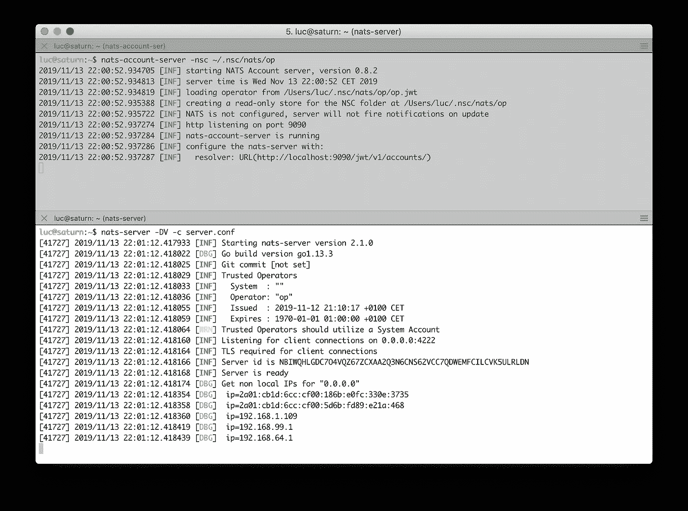

NATS 服务器从帐户服务器获取 jwt

# 测试整个设置

为了确保一切按预期运行，我们现在将:

*   使用用户 *ortiz* 进行连接，并订阅“客户。 *OrtizPLC* 。>“主题
*   使用用户 *admin* 进行连接，并发布主题为 *customers 的消息。OrtizPLC.events*
*   确保用户 *ortiz* 收到消息

用于本测试的示例 *consumer.py* 和 *producer.py* Python 客户端可在[https://gitlab.com/lucj/nats-demo](https://gitlab.com/lucj/nats-demo)资源库中获得。

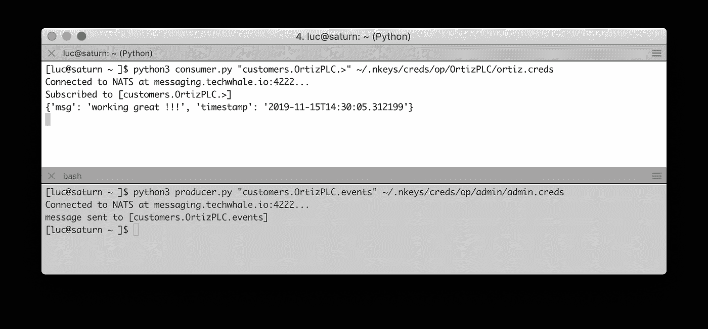

用户 ortiz 收到管理员用户发布的主题为 *customers 的消息。OrtizPLC.events*

用户 *ortiz* 只允许订阅一个主题下的*客户。OrtizPLC* "层级结构(例如:*客户。OrtizPLC.events* ，*客户。OrtizPLC.alerts* ，…)。下面的屏幕截图显示了当它试图订阅属于另一个客户(LynchLLC，可能是它的竞争对手之一)的主题时遇到的错误

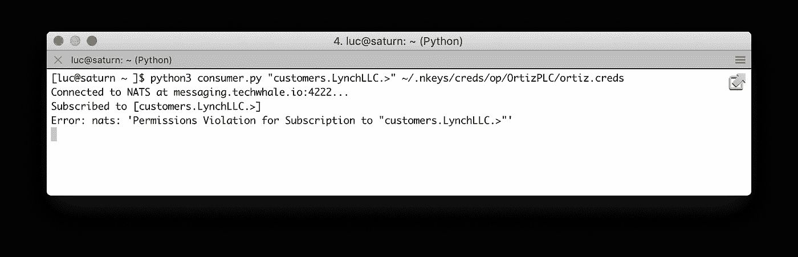

用户 ortiz 试图订阅与另一个客户相关的消息

# 摘要

我希望这个演练给你一些关于如何设置 NATS 的发布/订阅消息的见解。我们在本文中使用的方法被定义为“最多一次”传递，因为消息不被消息传递系统保存。在下一篇文章中，我们将关注 NATS 流，确保消息的持久性，以获得“至少一次”的传递。

鸣谢:感谢[德里克·科利森](https://medium.com/u/8bbe93befbfc?source=post_page-----fcda983d0612--------------------------------)审阅这篇文章，并帮助我更好地理解 NATS 的认证模型。