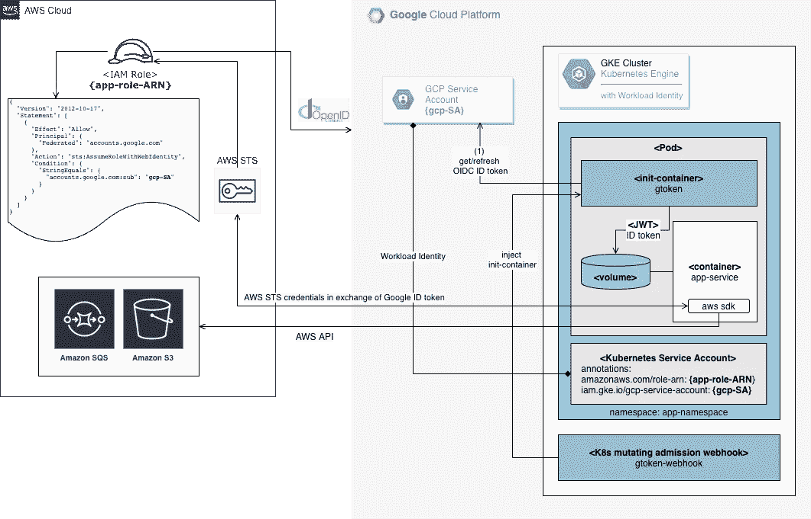

# 从 Google Kubernetes 引擎(GKE)安全地访问 AWS 服务

> 原文：<https://itnext.io/securely-access-aws-from-gke-dba1c6dbccba?source=collection_archive---------4----------------------->

运行在谷歌 Kubernetes 引擎( [GKE](https://cloud.google.com/kubernetes-engine) )上的应用程序需要访问亚马逊网络服务([AWS](https://aws.amazon.com/)API，这种情况并不少见。任何应用都有需求。也许它需要在亚马逊红移上运行分析查询，访问亚马逊 S3 桶中存储的数据，用亚马逊 Polly 将文本转换为语音或使用任何其他 AWS 服务。这种多云场景现在很常见，因为公司正在与多家云提供商合作。

跨云访问带来了新的挑战；如何管理从一个云提供商访问另一个云提供商的服务所需的云凭据。天真的方法，分发和保存云提供商的秘密不是最安全的方法；向需要访问 AWS 服务的每个服务分发长期凭证是一项管理挑战，也是一个潜在的安全风险。

## 当前解决方案

每种云都提供了自己独特的解决方案来应对这一挑战，如果您只与一家云提供商合作，这就足够了。

谷歌云宣布了一个[工作负载身份](https://cloud.google.com/kubernetes-engine/docs/how-to/workload-identity)，这是 GKE 应用认证和消费其他谷歌云服务的推荐方式。工作负载身份通过绑定 Kubernetes 服务帐户和云 IAM 服务帐户来工作，因此您可以使用 Kubernetes-native 概念来定义哪些工作负载以哪些身份运行，并允许您的工作负载自动访问其他 Google 云服务，而无需管理 Kubernetes 机密或 IAM 服务帐户密钥！阅读 DoiT [Kubernetes GKE 工作量身份](https://blog.doit-intl.com/kubernetes-gke-workload-identity-75fa197ff6bf)博客文章。

Amazon Web Services 支持类似的功能，具有服务帐户的 [IAM 角色](https://docs.aws.amazon.com/eks/latest/userguide/iam-roles-for-service-accounts.html)特性。通过 Amazon EKS 集群上服务帐户的 IAM 角色，您可以将 IAM 角色与 Kubernetes 服务帐户相关联。然后，该服务帐户可以向使用该服务帐户的任何 pod 中的容器提供 AWS 权限。有了这个特性，您不再需要为 worker node IAM 角色提供扩展权限，以便该节点上的 pod 可以调用 AWS APIs。

但是，如果您在 GKE 集群上运行应用程序工作负载，并且希望在不牺牲安全性的情况下访问 AWS 服务，该怎么办呢？

## 用例定义

让我们假设您已经拥有一个 AWS 帐户和一个 GKE 集群，并且您的公司已经决定在 GKE 集群上运行一个基于微服务的应用程序，但仍然希望使用 AWS 帐户中的资源(亚马逊 S3 和 SNS 服务)来与部署在 AWS 上的其他系统集成。

例如，*编排作业*(部署为 Kubernetes 作业)正在 GKE 集群中运行，需要将数据文件上传到 S3 桶中，并向 Amazon SNS 主题发送消息。等效的命令行可能是:

非常简单的例子。为了让这些命令成功，*编排作业*必须有可用的 AWS 凭证，并且这些凭证必须能够进行相关的 API 调用。

## 天真(且不安全)的方法:IAM 长期凭证

为一些 AWS IAM 用户导出 AWS 访问密钥和秘密密钥，并将 AWS 凭证作为凭证文件或环境变量注入到*编排作业*中。可能不是直接这么做，而是使用受 [RBAC 授权策略](https://kubernetes.io/docs/concepts/configuration/secret/#clients-that-use-the-secret-api)保护的 [Kubernetes Secrets](https://kubernetes.io/docs/concepts/configuration/secret/) 资源。

这里的风险是这些凭证永远不会过期。它们必须以某种方式从 AWS 环境转移到 GCP 环境，在大多数情况下，人们希望将它们存储在某个地方，以便在以后需要时可以用来重新创建*编排作业*。

当使用长期 AWS 凭证时，有多种方式可以危及您的 AWS 帐户的安全；无意中将 AWS 凭证提交到 GitHub 存储库中，将它们保存在 Wiki 系统中，为不同的服务和应用程序重用凭证，允许不受限制的访问等等。

虽然可以为颁发的 IAM 用户凭证设计一个适当的凭证管理解决方案，但是如果您从一开始就不创建这些长期凭证，就不需要这样做。

## 提议的方法

基本想法是将 [AWS IAM 角色](https://docs.aws.amazon.com/IAM/latest/UserGuide/id_roles.html)分配给 GKE Pod，类似于**工作负载身份**和**服务帐户**云特定功能的 EKS IAM 角色。

幸运的是，AWS 允许为 OpenID Connect Federation[OIDC](https://openid.net/connect/)身份提供者创建 IAM 角色，而不是 IAM 用户。另一方面，Google 实现了 OIDC 提供者，并通过**工作负载身份**特性将其与 GKE 紧密集成。向 GKE pod 提供有效的 OIDC 令牌，在链接到谷歌云服务帐户的 Kubernetes 服务帐户下运行。所有这些对于实现 GKE 到 AWS 的安全访问都可能派上用场。

## 将 OIDC 访问令牌交换为 ID 令牌

还缺一样东西，是完成拼图所必需的。通过正确设置**工作流身份**，GKE·波德获得了一个允许访问谷歌云服务的 OIDC **访问令牌**。为了从 AWS 安全令牌服务( [STS](https://docs.aws.amazon.com/STS/latest/APIReference/Welcome.html) )获得临时 AWS 凭证，您需要提供一个有效的 OIDC **ID 令牌**。

正确设置以下环境变量后，AWS SDK(和`aws-cli`工具)将自动向 STS 服务请求临时 AWS 凭证:

*   `AWS_WEB_IDENTITY_TOKEN_FILE`-web 身份令牌文件(OIDC ID 令牌)的路径
*   `AWS_ROLE_ARN`-[ARN](https://docs.aws.amazon.com/general/latest/gr/aws-arns-and-namespaces.html)的角色由吊舱容器来承担
*   `AWS_ROLE_SESSION_NAME` -应用于此承担角色会话的名称

这听起来可能有点复杂，但是我将提供一个分步指南和支持开源项目 [dointl/gtoken](https://github.com/doitintl/gtoken) 来简化设置。

## `gtoken-webhook` Kubernetes 变异录取网钩

`gtoken-webhook`是一个 Kubernetes 变异准入 webhook，它可以变异任何在特别注释的 Kubernetes 服务帐户下运行的 K8s Pod(详见下文)。

## gtoken-webhook 变异流

`gtoken-webhook`将一个`gtoken` `initContainer`注入一个目标 Pod 和一个额外的`gtoken` sidekick 容器(在到期前刷新一个 OIDC ID 令牌)，挂载令牌卷并注入三个特定于 AWS 的环境变量。`gtoken`容器生成一个有效的 GCP OIDC ID 令牌，并将其写入令牌卷。它还注入所需的 AWS 环境变量。

AWS SDK 将自动代表您对 AWS STS 进行相应的`AssumeRoleWithWebIdentity`调用。它将处理内存缓存，并根据需要刷新凭证。

## 《配置流程指南》

## 展开`gtoken-webhook`

1.  为了部署`gtoken-webhook`服务器，我们需要在我们的 Kubernetes 集群中创建一个 webhook 服务和一个部署。这非常简单，除了一件事，那就是服务器的 TLS 配置。如果您愿意检查一下 [deployment.yaml](https://github.com/doitintl/gtoken/blob/master/deployment/deployment.yaml) 文件，您会发现证书和相应的私钥文件是从命令行参数中读取的，并且这些文件的路径来自指向 Kubernetes 秘密的卷挂载:

需要记住的最重要的事情是稍后在 webhook 配置中设置相应的 CA 证书，这样`apiserver`就会知道它应该被接受。现在，我们将重用最初由 Istio 团队编写的脚本来生成证书签名请求。然后，我们将请求发送到 Kubernetes API，获取证书，并根据结果创建所需的秘密。

首先，运行[web hook-create-signed-cert . sh](https://github.com/doitintl/gtoken/blob/master/deployment/webhook-create-signed-cert.sh)脚本，检查持有证书和密钥的秘密是否已经创建:

一旦创建了秘密，我们就可以创建部署和服务。这些是标准的 Kubernetes 部署和服务资源。到目前为止，我们只制作了一个 HTTP 服务器，它通过端口`443`上的服务接受请求:

## 配置变异准入网络挂钩

现在我们的 webhook 服务器正在运行，它可以接受来自`apiserver`的请求。但是，我们应该首先在 Kubernetes 中创建一些配置资源。让我们从验证 webhook 开始，稍后我们将配置变异的 webhook。如果您看一下 [webhook 配置](https://github.com/doitintl/gtoken/blob/master/deployment/mutatingwebhook.yaml)，您会注意到它包含一个用于`CA_BUNDLE`的占位符:

有一个[小脚本](https://github.com/doitintl/gtoken/blob/master/deployment/webhook-patch-ca-bundle.sh)用这个 CA 替换配置中的 CA_BUNDLE 占位符。在创建验证 webhook 配置之前运行以下命令:

创建变异 webhook 配置:

## 为 gtoken-webhook 配置 RBAC

创建用于`gtoken-webhook`的 Kubernetes 服务帐户:

为 webhook 服务帐户定义 RBAC 权限:

## 流量变量

下面的一些变量应该由用户提供，其他变量将自动生成并在下面的步骤中重用。

*   `PROJECT_ID` - GCP 项目 ID(用户提供)
*   `CLUSTER_NAME` - GKE 集群名称(由用户提供)
*   `GSA_NAME` -谷歌云服务账户名称(用户提供)
*   `GSA_ID` -谷歌云服务账户唯一 ID(由谷歌生成)
*   `KSA_NAME` - Kubernetes 服务账户名称(由用户提供)
*   `KSA_NAMESPACE` - Kubernetes 名称空间(由用户提供)
*   `AWS_ROLE_NAME` - AWS IAM 角色名称(由用户提供)
*   `AWS_POLICY_NAME` -分配给 IAM 角色的 AWS IAM 策略(由用户提供)
*   `AWS_ROLE_ARN` - AWS IAM 角色 ARN 标识符(由 AWS 生成)

## 谷歌云:启用 GKE 工作负载身份

创建一个启用了[工作负载标识](https://cloud.google.com/kubernetes-engine/docs/how-to/workload-identity)的新 GKE 集群:

或者更新现有集群:

## 谷歌云:创建一个谷歌云服务账户

创建 Google 云服务帐户:

用以下角色更新`GSA_NAME` Google 服务帐户:

*   `roles/iam.workloadIdentityUser` -模拟 GKE 工作负载的服务帐户
*   `roles/iam.serviceAccountTokenCreator` -模拟服务帐户以创建 OAuth2 访问令牌、签署 blobs 或签署 JWT 令牌

## AWS:与谷歌 OIDC 联盟创建 AWS IAM 角色

为谷歌 OIDC 提供商准备角色信任政策文档:

使用 Google Web 身份创建 AWS IAM 角色:

分配 AWS 角色所需的策略:

获取要在 K8s SA 注释中使用的 AWS 角色 ARN:

## GKE:创建一个 Kubernetes 服务帐户

创建 K8s 命名空间:

创建 K8s 服务帐户:

用 GKE 工作负载标识注释 K8s 服务帐户(GCP 服务帐户电子邮件):

用 AWS 角色 ARN 注释 K8s 服务帐户:

## 运行演示

使用 K8s `${KSA_NAME}``服务帐户运行新的 K8s Pod:

## 外部参考

*   **GitHub:** 使用 [doitintl/gtoken](https://github.com/doitintl/gtoken) 从 GKE 集群安全地访问 AWS 服务
*   **AWS 文档:** [为 Web Identity 或 OpenID Connect 联盟创建角色](https://docs.aws.amazon.com/IAM/latest/UserGuide/id_roles_create_for-idp_oidc.html)
*   **博客:** Kubernetes GKE 工作量身份[链接](https://blog.doit-intl.com/kubernetes-gke-workload-identity-75fa197ff6bf)
*   **AWS 博客:**介绍服务帐户的细粒度 IAM 角色[链接](https://aws.amazon.com/blogs/opensource/introducing-fine-grained-iam-roles-service-accounts/)
*   **GitHub:** AWS Auth 使用 [Web Identity Federation](https://docs.aws.amazon.com/IAM/latest/UserGuide/id_roles_providers_oidc.html) 来自 Google Cloud[shrikant 0013/GCP-AWS-Web Identity Federation](https://github.com/shrikant0013/gcp-aws-webidentityfederation)GitHub 项目
*   **博客:**使用 GCP 服务帐户访问 AWS IAM 角色[科林·帕尼塞特的博客文章](https://cevo.com.au/post/2019-07-29-using-gcp-service-accounts-to-access-aws/)

# 摘要

我希望，这篇文章对你有用。我期待您的评论和任何问题。

想要更多的故事？在[媒体](http://blog.doit-intl.com/)上查看我们的博客，或者[在 Twitter 上关注阿列克谢](https://twitter.com/alexeiled)。