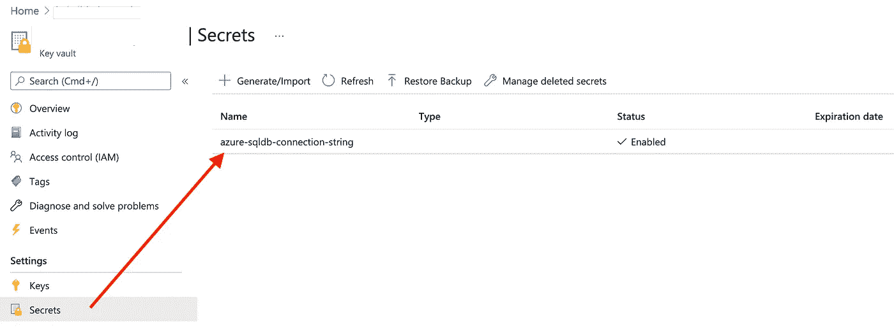
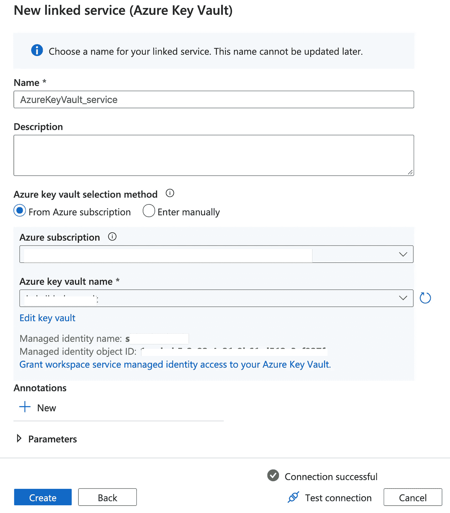
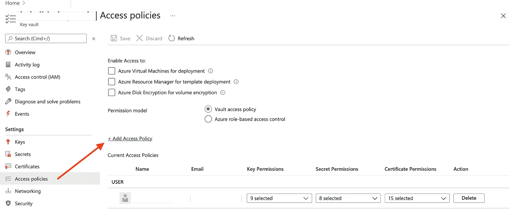
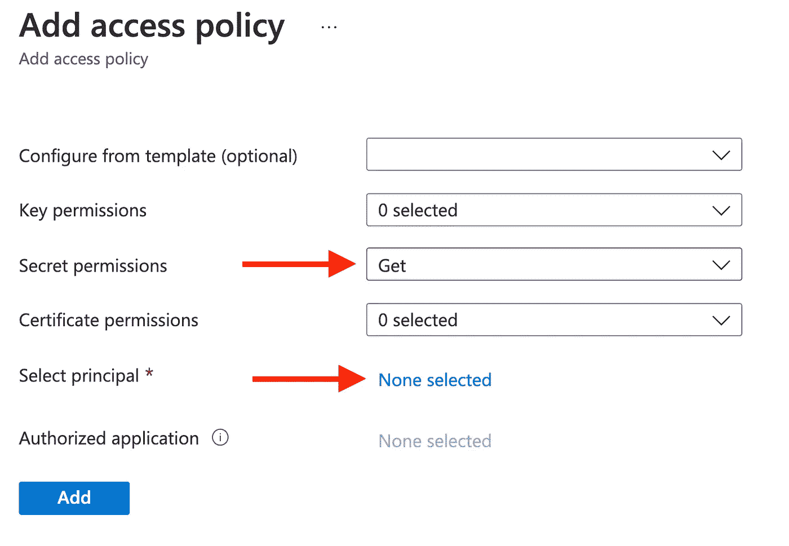
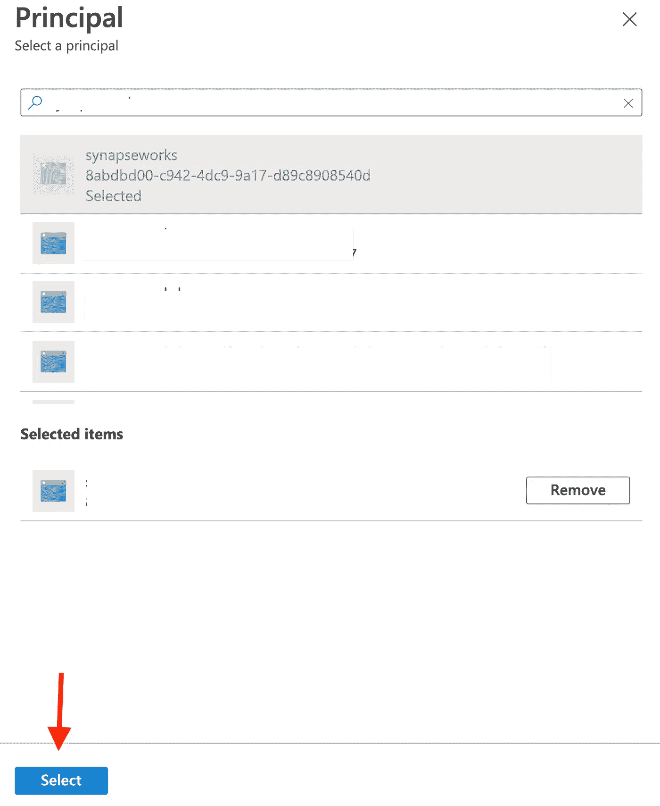
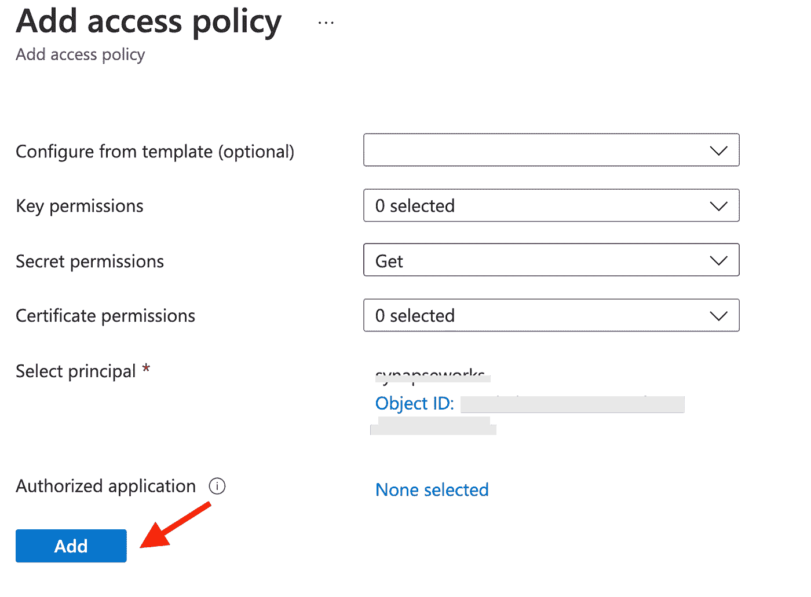
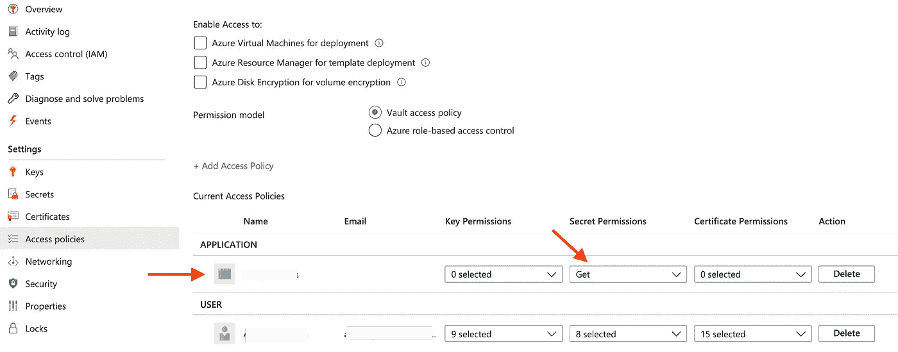

# 从 Azure Synapse 安全地访问 Azure SQL 数据库

> 原文：<https://itnext.io/securely-access-azure-sql-database-from-azure-synapse-6dbee7afc30e?source=collection_archive---------2----------------------->

## 使用 Azure Key Vault 从 Azure Synapse 中的 Spark 池进行安全访问

[Apache Spark connector for Azure SQL Database(和 SQL Server)](https://docs.microsoft.com/sql/connect/spark/connector?view=sql-server-ver15&WT.mc_id=data-34417-abhishgu) 使这些数据库能够用作 Apache Spark 作业的输入数据源和输出数据接收器。您可以使用 Azure Synapse Analytics 中的连接器[对实时交易数据进行大数据分析，并为即席查询或报告保存结果。](https://docs.microsoft.com/azure/synapse-analytics/spark/data-sources/apache-spark-sql-connector?WT.mc_id=data-34417-abhishgu)

在撰写本文时，Azure SQL connector 没有通过 Azure Synapse Analytics 提供链接服务或 AAD 传递支持。但是你可以使用其他选项，比如 [Azure Active Directory 认证](https://docs.microsoft.com/azure/synapse-analytics/spark/data-sources/apache-spark-sql-connector?WT.mc_id=data-34417-abhishgu#azure-active-directory-authentication)或者通过直接 SQL 认证(基于用户名和密码)。一种安全的方法是将 Azure SQL 数据库证书存储在 Azure Key Vault 中(作为秘密)——这就是这篇简短的博客文章所涵盖的内容。


照片由[埃尔卡里托](https://unsplash.com/@elcarito?utm_source=medium&utm_medium=referral)在 [Unsplash](https://unsplash.com?utm_source=medium&utm_medium=referral) 上拍摄

假设您已经创建了 [Azure Synapse 工作区](https://docs.microsoft.com/azure/synapse-analytics/quickstart-create-workspace?WT.mc_id=data-34417-abhishgu)和 [Azure SQL 数据库](https://docs.microsoft.com/azure/azure-sql/database/single-database-create-quickstart?tabs=azure-portal&WT.mc_id=data-34417-abhishgu)，您需要做的就是:

1.  创建一个 Azure 密钥库，并添加一个密码来存储 Azure SQL 数据库连接信息。
2.  在 Azure Synapse Workspace 中为您的 Azure Key Vault 创建链接服务。
3.  向 Azure Key Vault 提供 Azure Synapse workspace 托管服务身份的适当权限

# 下面是该过程的一个演示

[创建一个天蓝色密钥库](https://docs.microsoft.com/azure/key-vault/general/quick-create-portal?WT.mc_id=data-34417-abhishgu)和[添加一个秘密](https://docs.microsoft.com/azure/key-vault/secrets/quick-create-portal?WT.mc_id=data-34417-abhishgu#add-a-secret-to-key-vault)。



Azure 密钥库秘密(图片由作者提供)

> *在这种情况下，我已经存储了整个 JDBC 连接字符串，但是您也可以选择只存储密码。*

要从 Azure Key Vault 中检索机密，推荐的方法是创建一个到您的 Azure Key Vault 的链接服务。此外，确保 [Synapse workspace 托管服务身份(MSI)](https://docs.microsoft.com/azure/synapse-analytics/security/synapse-workspace-managed-identity?WT.mc_id=data-34417-abhishgu) 在您的 Azure Key Vault 上拥有`Secret Get`权限。这将允许 Synapse 使用 Synapse workspace 托管服务身份向 Azure Key Vault 进行身份验证。

> *您还可以使用您的用户 Azure Active Directory 凭据进行身份验证。*

在 Azure Synapse Workspace 中创建链接服务:



Azure Key Vault 链接服务(图片由作者提供)

[授予 Azure Synapse workspace 服务托管身份对您的 Azure Key Vault 的适当访问权限](https://docs.microsoft.com/azure/key-vault/general/assign-access-policy-portal?WT.mc_id=data-34417-abhishgu):



Azure Key Vault 访问策略配置(图片由作者提供)

在`Secret`上选择`Get`权限:



Azure Key Vault 访问策略配置(图片由作者提供)

搜索 Synapse Workspace 托管服务身份，它与工作区的名称相同



Azure Key Vault 访问策略配置(图片由作者提供)

添加策略:



Azure Key Vault 访问策略配置(图片由作者提供)

点击**保存**确认:



Azure Key Vault 访问策略配置(图片由作者提供)

# 让我们看看如何使用这个…

> *我将以在 Synapse Spark pools 中使用* `*pyspark*` *为例。*

默认情况下，Synapse 使用 Azure Active Directory (AAD)直通进行资源之间的身份验证。如果您需要使用其他凭据连接到资源，[直接使用令牌库](https://docs.microsoft.com/azure/synapse-analytics/spark/apache-spark-secure-credentials-with-tokenlibrary?pivots=programming-language-python&WT.mc_id=data-34417-abhishgu) —这简化了检索 SAS 令牌、AAD 令牌、连接字符串以及存储在链接服务中或来自 Azure Key Vault 的机密的过程。

要从 Azure Key Vault 中检索存储的秘密，请使用`TokenLibrary.getSecret()`函数。这里有一个 [python 的例子](https://docs.microsoft.com/azure/synapse-analytics/spark/apache-spark-secure-credentials-with-tokenlibrary?pivots=programming-language-python&WT.mc_id=data-34417-abhishgu#getsecret)，但同样适用于 [C#](https://docs.microsoft.com/azure/synapse-analytics/spark/apache-spark-secure-credentials-with-tokenlibrary?pivots=programming-language-csharp&WT.mc_id=data-34417-abhishgu#getsecret) 或 [Scala](https://docs.microsoft.com/azure/synapse-analytics/spark/apache-spark-secure-credentials-with-tokenlibrary?pivots=programming-language-scala&WT.mc_id=data-34417-abhishgu#getsecret) 。

例如，要从`SalesLT.Customer`表(AdventureWorks 示例数据库的一部分)中访问数据，可以使用以下代码:

```
url = TokenLibrary.getSecret("<Azure Key Vault name>", "<Secret name>", "<Linked Service name>")dbtable = "SalesLT.Customer"customers = spark.read \
    .format("com.microsoft.sqlserver.jdbc.spark") \
    .option("url", url) \
    .option("dbtable", dbtable) \
    .load()print(customers.count())
customers.show(5)
```

这就是全部了！