# 使用带有 SASL/SCRAM 的 Kafka 安全地解耦亚马逊 EKS 上基于 Kubernetes 的应用

> 原文：<https://itnext.io/securely-decoupling-applications-on-amazon-eks-using-kafka-with-sasl-scram-48c340e1ffe9?source=collection_archive---------5----------------------->

## 使用具有 IRSA、SASL/SCRAM 和数据加密的亚马逊 MSK，安全地分离亚马逊 EKS 上基于 Go 的微服务

随着组织的扩展和成熟，他们经常努力从单一的应用程序架构转向基于微服务的分布式范例。作为这种转变的一部分，组织经常采用现代编程语言和框架，采用容器化，获得对开源软件组件的偏好，并选择异步事件驱动的通信模型。无论最终的体系结构如何，组织都必须持续保持高水平的应用程序和基础架构安全性。

# 介绍

本文将探索一个简单的基于 Go 的应用程序，该应用程序使用亚马逊弹性 Kubernetes 服务([亚马逊 EKS](https://aws.amazon.com/eks/) )部署到 Kubernetes。组成应用程序的微服务通过从 Amazon Managed Streaming for Apache Kafka([亚马逊 MSK](https://aws.amazon.com/msk/) )产生和消费事件来异步通信。

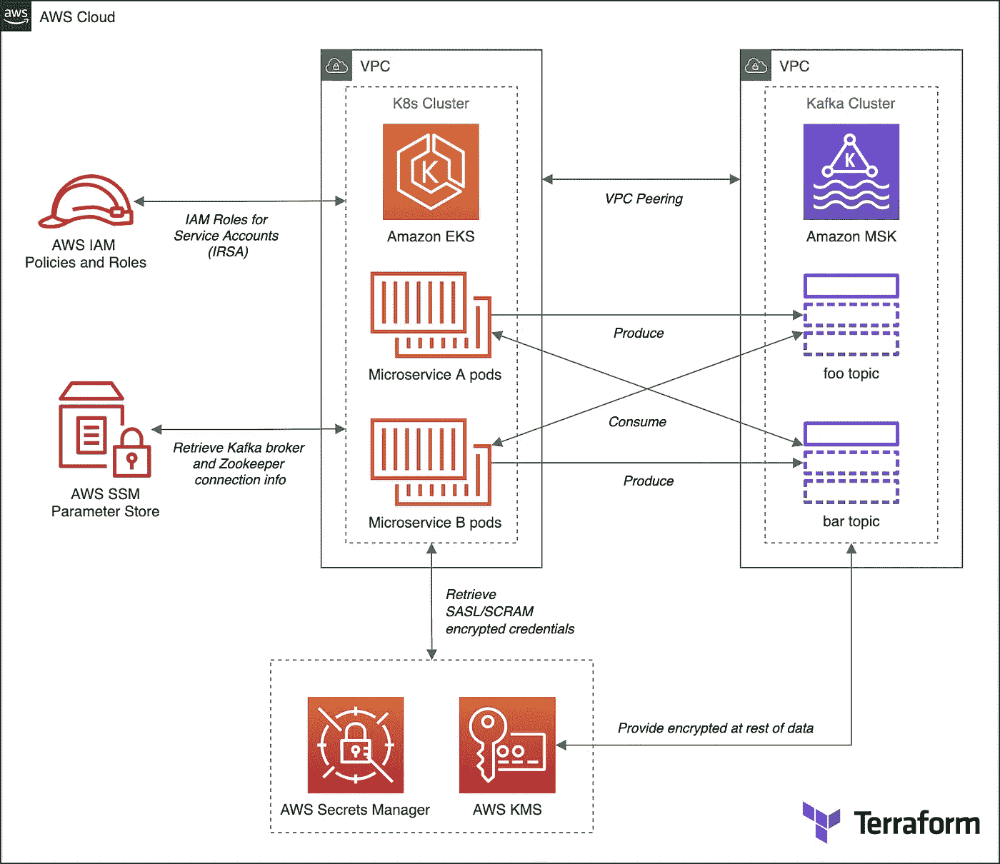

post 的高级应用程序和 AWS 基础架构

## Apache Kafka 的认证和授权

根据 [AWS](https://docs.aws.amazon.com/msk/latest/developerguide/kafka_apis_iam.html) 的说法，你可以使用 IAM 来认证客户端，并允许或拒绝 Apache Kafka 的操作。或者，您可以使用 TLS 或 SASL/SCRAM 来验证客户端，并使用 Apache Kafka ACLs 来允许或拒绝操作。

对于这篇文章，我们的亚马逊 MSK 集群将使用 [SASL/SCRAM](https://datatracker.ietf.org/doc/html/rfc5802) (简单认证和安全层/Salted Challenge Response 机制)用户名和基于密码的认证来增加安全性。用于 SASL/SCRAM 认证的凭证将安全地存储在 [AWS 秘密管理器](https://aws.amazon.com/secrets-manager/)中，并使用 AWS 密钥管理服务( [KMS](https://aws.amazon.com/kms/) )进行加密。

## 数据加密

MSK 集群中的静态数据将使用亚马逊 MSK 与 AWS KMS 的集成进行加密，以提供透明的服务器端加密。将使用[传输层安全性](https://en.wikipedia.org/wiki/Transport_Layer_Security) (TLS 1.2)对在 MSK 集群的代理之间传输的数据进行加密。

## 资源管理

亚马逊 MSK 的 AWS 资源将使用 [HashiCorp Terraform](https://www.terraform.io/) 创建和管理，这是一个流行的开源基础设施即代码(IaC)软件工具。亚马逊 EKS 资源将使用`[eksctl](https://eksctl.io/)`创建和管理，这是由 [Weaveworks](https://www.weave.works/) 赞助的亚马逊 EKS 官方 CLI。最后，Kubernetes 资源将由开源的 Kubernetes 包管理器 Helm 来创建和管理。

## 示范应用

组成演示应用程序的基于 Go 的微服务将使用 Segment 流行的`[kafka-go](https://github.com/segmentio/kafka-go)`客户端。[细分市场](https://segment.com/?ref=nav)是领先的客户数据平台(CDP)。微服务将使用存储在 [AWS 系统管理器(SSM)参数存储](https://docs.aws.amazon.com/systems-manager/latest/userguide/systems-manager-parameter-store.html)中的 Kafka broker 连接信息访问亚马逊 MSK。

## 源代码

这篇文章的所有源代码，包括演示应用程序、Terraform 和 Helm 资源，都是开源的，位于 GitHub 上。

[](https://github.com/garystafford/terraform-msk-demo) [## garystafter/terraform-MSK-demo

### Terraform 项目使用亚马逊弹性库伯内特公司的阿帕奇卡夫卡(亚马逊 MSK)的亚马逊管理流…

github.com](https://github.com/garystafford/terraform-msk-demo) 

## 先决条件

为了跟随这篇文章的演示，你需要安装最新版本的`terraform`、`eksctl`和`helm`，并且可以从你的终端访问。可选地，具有`git`或`gh`、`kubectl`和 AWS CLI v2 ( `aws`)将是有帮助的。

# 示范

为了演示上述 EKS 和 MSK 功能，我们将按如下方式进行:

1.  使用`eksctl`部署 EKS 集群和相关资源；
2.  使用 Terraform 部署 MSK 集群和相关资源；
3.  更新 VPC 和相关子网的路由表，以便在对等 VPC 之间路由流量；
4.  使用`eksctl`为服务帐户(IRSA)创建 IAM 角色，允许从 EKS 访问 MSK 和相关服务；
5.  使用 Helm 将 Kafka 客户端容器部署到 EKS；
6.  使用 Kafka 客户端为 MSK 创建 Kafka 主题和 ACLs
7.  使用 Helm 将基于 Go 的应用程序部署到 EKS；
8.  确认应用程序的功能；

## 1.亚马逊 EKS 集群

首先，使用 Weaveworks 的`eksctl`创建一个新的亚马逊 EKS 集群。项目中包含的默认`cluster.yaml`配置文件将基于`us-east-1`中的 [Kubernetes 1.20](https://kubernetes.io/blog/2020/12/08/kubernetes-1-20-release-announcement/) 创建一个小型的开发级 EKS 集群。集群将包含一个由三个`t3.medium` Amazon Linux 2 EC2 工作节点组成的[托管节点组](https://docs.aws.amazon.com/eks/latest/userguide/managed-node-groups.html)。EKS 集群将创建在一个新的 VPC。

设置以下环境变量，然后运行`eksctl create cluster`命令来创建新的 EKS 集群和相关的基础设施。

```
export AWS_ACCOUNT=$(aws sts get-caller-identity \
    --output text --query 'Account')
export EKS_REGION="us-east-1"
export CLUSTER_NAME="eks-kafka-demo"eksctl create cluster -f ./eksctl/cluster.yaml
```

根据我的经验，完全构建和配置新的 3 节点 EKS 集群可能需要 25-40 分钟。


使用 eksctl 开始创建亚马逊 EKS 集群

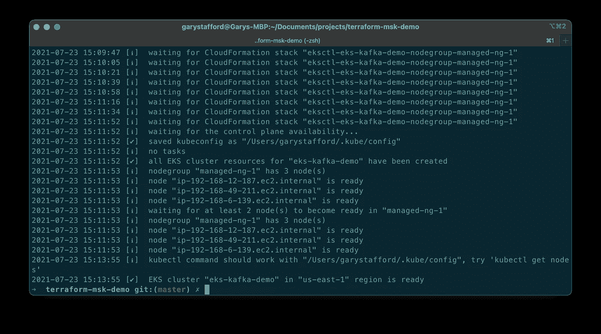

使用 eksctl 成功完成亚马逊 EKS 集群创建

作为创建 EKS 集群的一部分，`eksctl`将自动部署三个 [AWS CloudFormation](https://aws.amazon.com/cloudformation/) 堆栈，包含以下资源:

1.  亚马逊虚拟专用云(VPC)、子网、路由表、NAT 网关、安全策略和 EKS 控制平面；
2.  包含 Kubernetes 三个工作节点的 EKS 管理节点组；
3.  将 AWS IAM 角色映射到 Kubernetes 服务帐户的 IAM 服务帐户角色(IRSA );

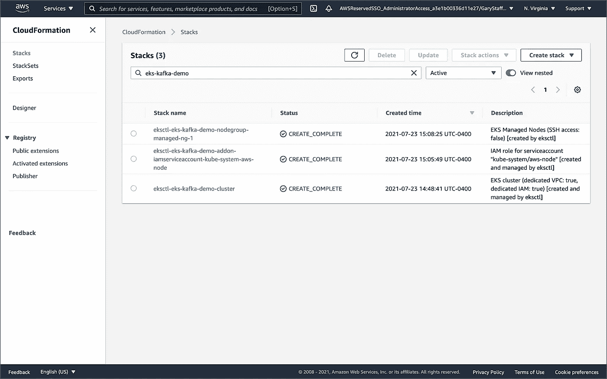

完成后，更新您的`kubeconfig`文件，以便您可以使用以下 AWS CLI 命令连接到新的亚马逊 EKS 集群:

```
aws eks --region ${EKS_REGION} update-kubeconfig \
    --name ${CLUSTER_NAME}
```

使用以下`eksctl`命令查看新 EKS 集群的详细信息:

```
eksctl utils describe-stacks \
  --region ${EKS_REGION} --cluster ${CLUSTER_NAME}
```

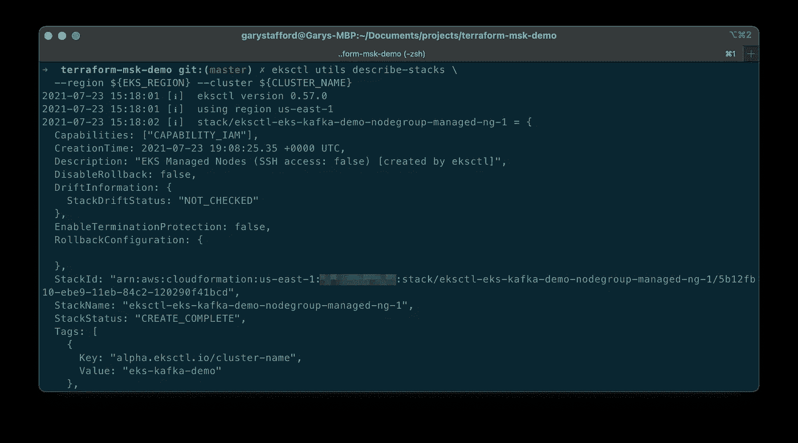

在亚马逊容器服务控制台的亚马逊 EKS 集群[选项卡](https://console.aws.amazon.com/eks/home?region=us-east-1#/clusters)中查看新的 EKS 集群。

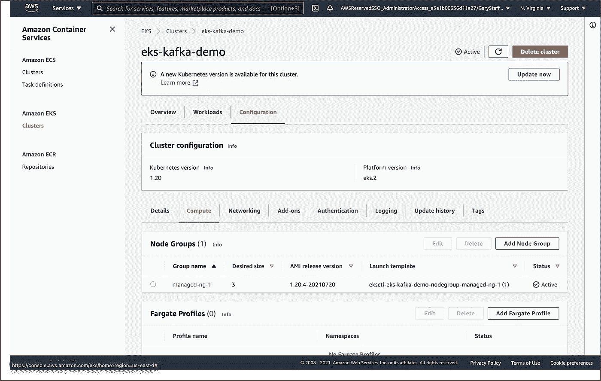

从亚马逊容器服务控制台看到的新亚马逊 EKS 集群

下面，请注意 EKS 集群的 OpenID 连接 URL。[在 EKS 集群上支持服务帐户](https://docs.aws.amazon.com/emr/latest/EMR-on-EKS-DevelopmentGuide/setting-up-enable-IAM.html) (IRSA)的 IAM 角色需要一个与之关联的 OpenID Connect issuer URL。OIDC 是在`cluster.yaml`文件中配置的；参见第 8 行(显示在上方的*)。*

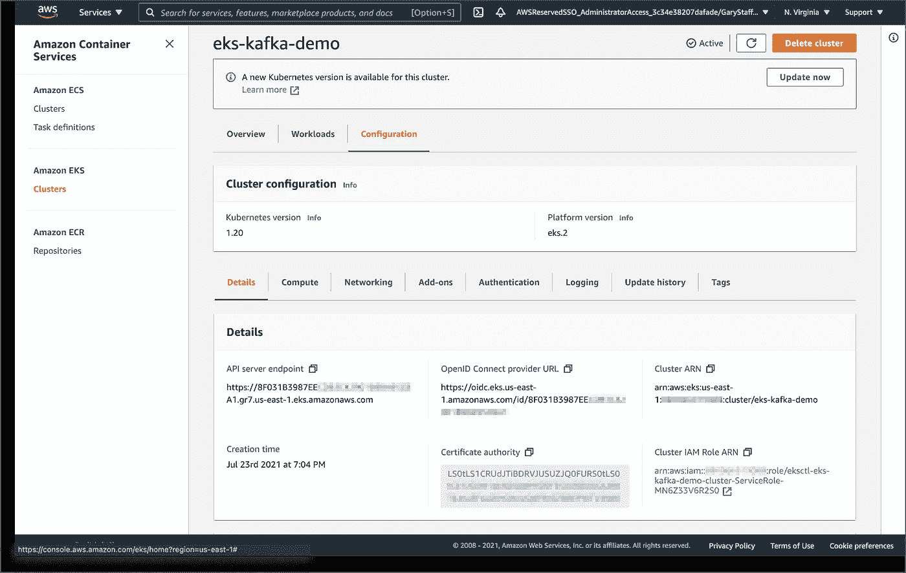

从亚马逊容器服务控制台看到的新亚马逊 EKS 集群

在 EKS 集群的控制台中引用的由`eksctl`创建的 [OpenID Connect 身份提供者](https://docs.aws.amazon.com/IAM/latest/UserGuide/id_roles_providers_create_oidc.html)，可以在 [IAM 身份提供者控制台](https://console.aws.amazon.com/iamv2/home?#/identity_providers)中看到。

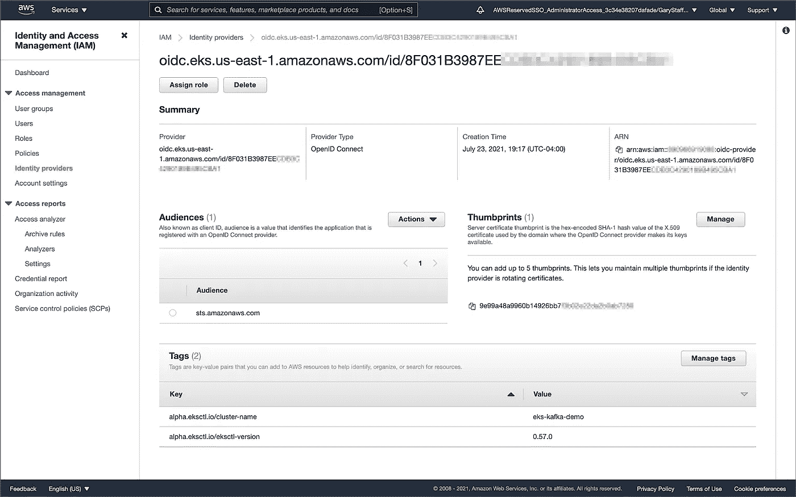

IAM 身份提供者控制台中 EKS 集群的 OpenID 连接身份提供者

## 2.亚马逊 MSK 集群

接下来，使用 HashiCorp Terraform 部署亚马逊 MSK 集群以及相关的网络和安全资源。

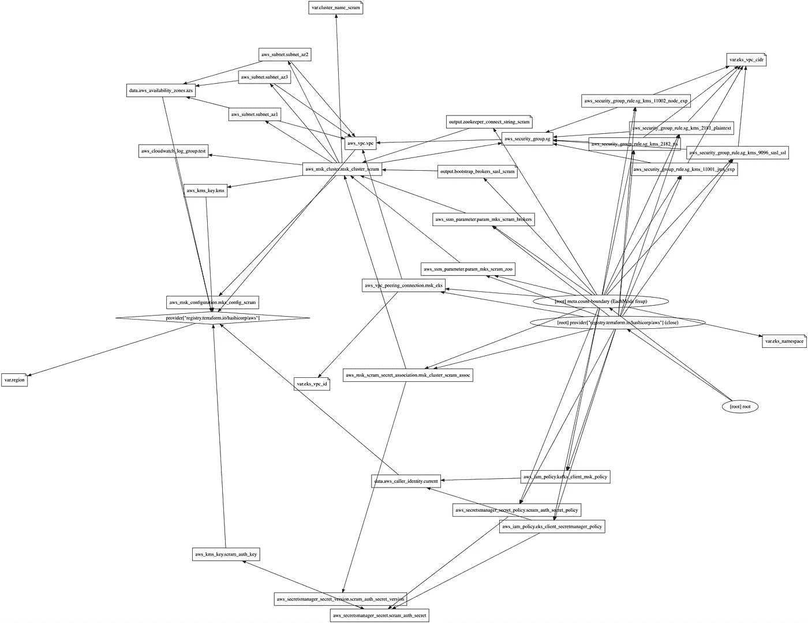

Terraform 的 AWS 资源的 Graphviz 开源图形可视化

在使用 Terraform 创建 AWS 基础设施之前，更新 [Terraform 状态](https://www.terraform.io/docs/language/state/index.html)的位置。这个项目的代码使用亚马逊 S3 作为后端存储平台的状态。将亚马逊 S3 存储桶的名称更改为您现有的存储桶，位于`main.tf`文件中。

```
terraform {
  backend "s3" {
 **bucket = "terrform-us-east-1-your-unique-name"**    key    = "dev/terraform.tfstate"
    region = "us-east-1"
  }
}
```

同样，用步骤 1 中由`eksctl`创建的 EKS VPC 的 VPC ID 更新`variables.tf`文件中的`eks_vpc_id`变量。

```
variable "eks_vpc_id" {
 **default = "vpc-your-id"** }
```

获取 EKS VPC ID 的最快方法是使用以下 AWS CLI v2 命令:

```
aws ec2 describe-vpcs --query 'Vpcs[].VpcId' \
  --filters Name=tag:Name,Values=eksctl-eks-kafka-demo-cluster/VPC \
  --output text
```

接下来，在亚马逊 S3 初始化你的 Terraform 后端，用`terraform init`初始化最新的`[hashicorp/aws](https://registry.terraform.io/providers/hashicorp/aws/latest)` provider 插件。

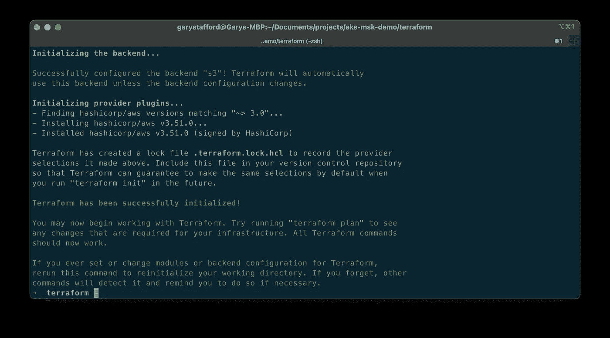

使用`terraform plan`生成一个执行计划，显示 Terraform 将采取什么行动来应用当前配置。作为计划的一部分，Terraform 将创建大约 25 个 AWS 资源。

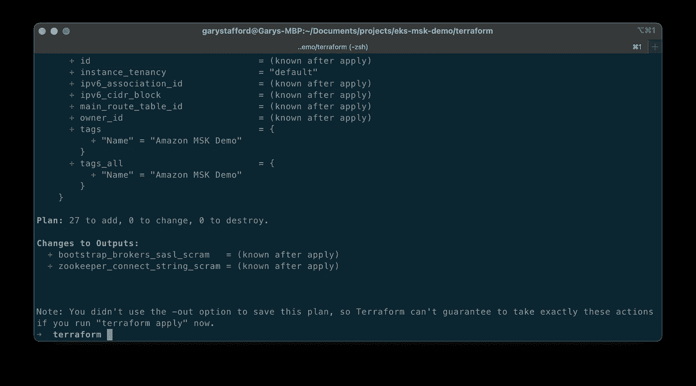

最后，使用`terraform apply`创建亚马逊资源。Terraform 将在`us-east-1`中基于 Kafka 2.8.0 创建一个小型的开发级 MSK 集群，包含一组三个`kafka.m5.large`代理节点。Terraform 将在新 VPC 创建 MSK 集群。代理节点分布在新 VPC 内的三个可用性区域中，每个区域位于一个专用子网中。

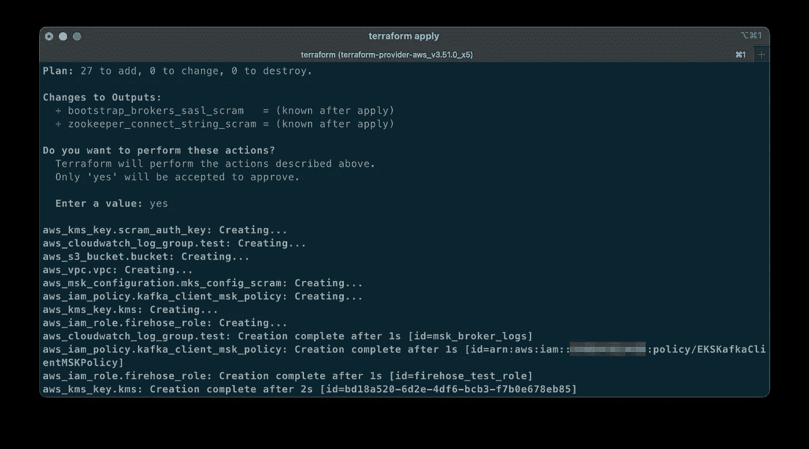

开始使用 Terraform 创建亚马逊 MSK 集群

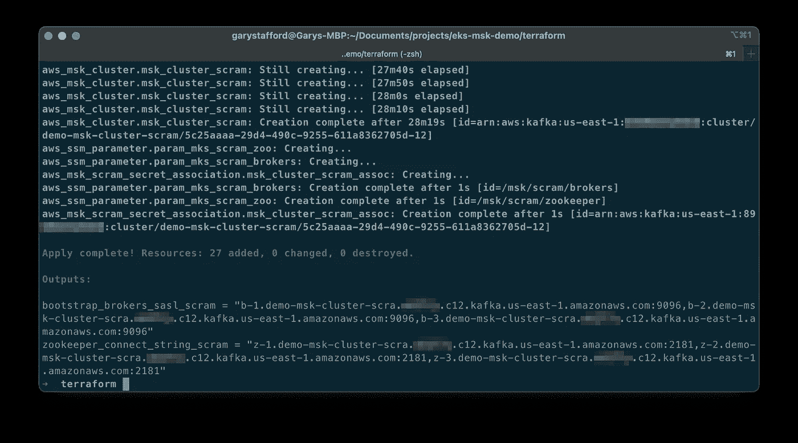

使用 Terraform 成功创建亚马逊 MSK 集群

Terraform 可能需要 30 分钟或更长时间来创建新的集群和相关基础架构。完成后，您可以在[亚马逊 MSK 管理控制台](https://console.aws.amazon.com/msk/home?region=us-east-1#/clusters)中查看新的 MSK 集群。

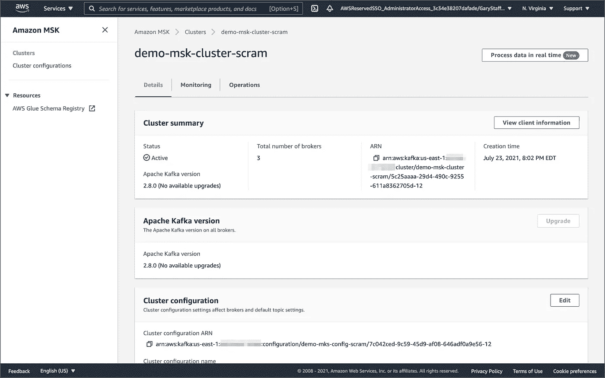

从亚马逊 MSK 控制台看到的新亚马逊 MSK 集群

下面，请注意新群集的“访问控制方法”是 SASL/SCRAM 身份验证。群集使用 TLS 对传输中的数据进行加密，并使用 AWM KSM 中由客户管理的[客户主密钥](https://docs.aws.amazon.com/kms/latest/developerguide/concepts.html) (CMS)对静态数据进行加密。

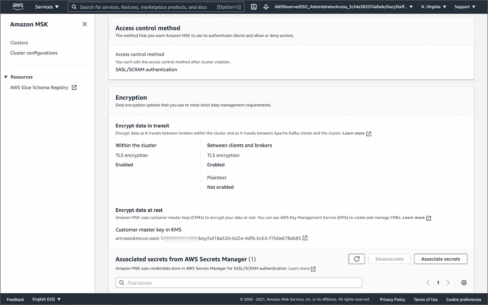

从亚马逊 MSK 控制台看到的新亚马逊 MSK 集群

请注意下面的“AWS 机密管理器的相关机密”密码`AmazonMSK_credentials`包含 SASL/SCRAM 认证凭证——用户名和密码。这些是部署到 EKS 的演示应用程序用来安全访问 MSK 的凭证。

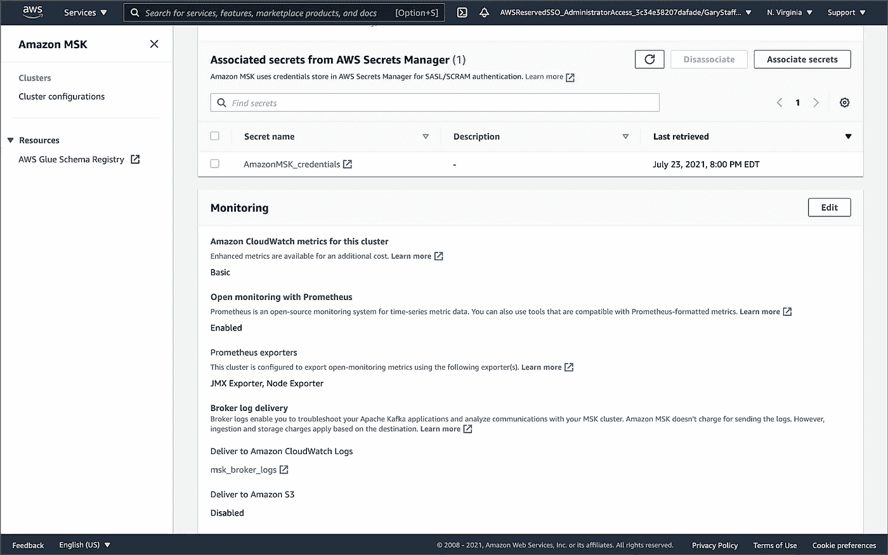

从亚马逊 MSK 控制台看到的新亚马逊 MSK 集群

可以在 [AWS 机密管理器控制台](https://console.aws.amazon.com/secretsmanager/home?region=us-east-1#!/listSecrets)中观察到上面显示的 SASL/紧急停堆凭证机密。请注意客户管理的客户主密钥(CMK)，它存储在 AWS KMS 中，用于加密密钥。

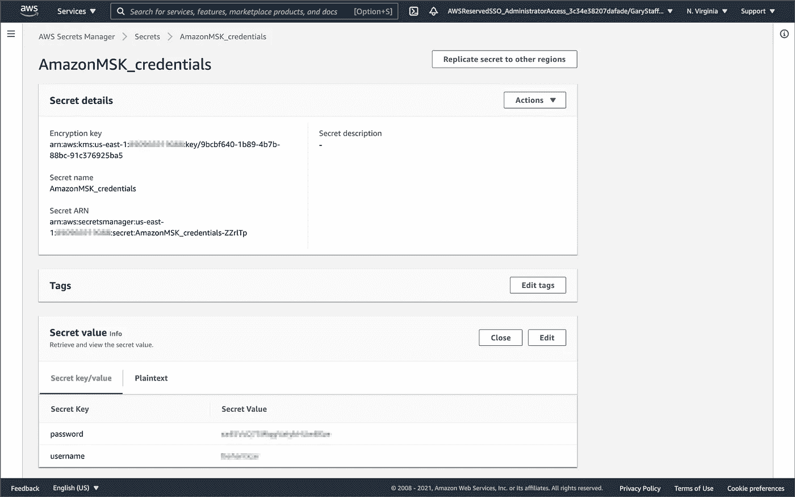

AWS 机密管理器控制台中显示的 SASL/紧急停堆凭证机密

## 3.更新 VPC 对等的路由表

Terraform 在新 EKS VPC 和 MSK VPC 之间建立了一种 [VPC 对等关系](https://docs.aws.amazon.com/vpc/latest/peering/what-is-vpc-peering.html)。但是，我们需要通过更新路由表来完成对等配置。我们希望通过 VPC 对等连接资源，路由所有从 EKS 集群发往 MSK(其 VPC CIDR 是`10.0.0.0/22`)的流量。有四个路由表与 EKS VPC 相关联。向路由表中添加一条名称以'`PublicRouteTable`'结尾的新路由，例如`rtb-0a14e6250558a4abb / eksctl-eks-kafka-demo-cluster/PublicRouteTable`。使用 VPC 控制台的路由表[选项卡](https://console.aws.amazon.com/vpc/home?region=us-east-1#RouteTables)在该路由表中手动创建所需的路由，如下所示(*新路由在列表*中显示在第二位)。

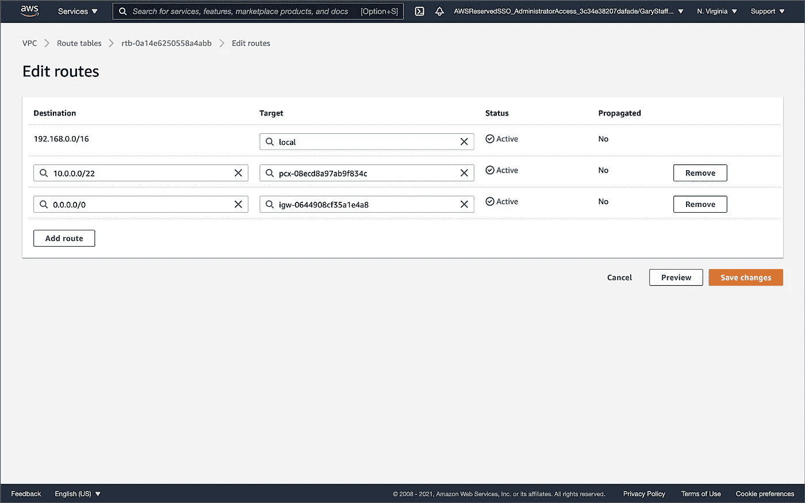

EKS 路由表中有一条通过 VPC 对等连接到 MSK 的新路由

类似地，我们希望通过同一个 VPC 对等连接资源路由从 MSK 集群发往 EKS 的所有流量，的 CIDR 是`192.168.0.0/16`。使用 VPC 控制台的路由表选项卡更新单 MSK VPC 的路由表，如下所示(*新路由显示在列表*的第二位)。

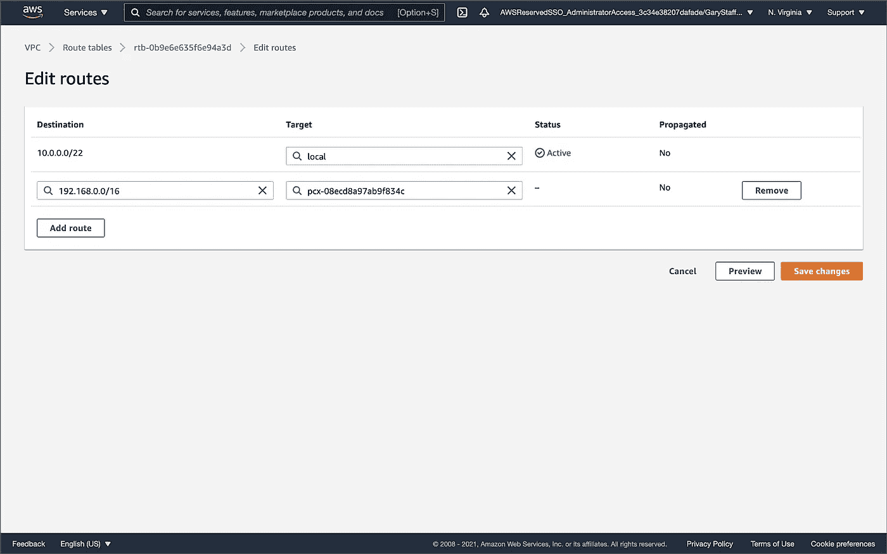

MSK 路由表中有一条通过 VPC 对等连接到 EKS 的新路由

## 4.为服务帐户创建 IAM 角色(IRSA)

随着 EKS 和 MSK 集群的创建和对等，我们准备开始部署 Kubernetes 资源。创建一个新的名称空间，`kafka`，它将包含演示应用程序和 Kafka 客户端 pods。

```
export AWS_ACCOUNT=$(aws sts get-caller-identity \
    --output text --query 'Account')
export EKS_REGION="us-east-1"
export CLUSTER_NAME="eks-kafka-demo"
export NAMESPACE="kafka"kubectl create namespace $NAMESPACE
```

然后使用`eksctl`，为与 [Kubernetes 服务帐户](https://kubernetes.io/docs/tasks/configure-pod-container/configure-service-account/)相关联的服务帐户(IRSA)创建两个 IAM 角色。Kafka 客户端的 pod 将使用其中一个角色，演示应用程序的 pod 将使用另一个角色。根据 [eksctl 文档](https://eksctl.io/usage/iamserviceaccounts/#how-it-works)，IRSA 通过 EKS 公开的 IAM OpenID 连接提供者( [OIDC](https://docs.aws.amazon.com/eks/latest/userguide/enable-iam-roles-for-service-accounts.html) )工作，IAM 角色必须参考帖子前面描述的 IAM OIDC 提供者以及它将绑定的 Kubernetes 服务帐户的引用来构造。下面的`eksctl`命令中引用的两个 IAM 策略是 Terraform 早先创建的。

```
*# kafka-demo-app role* eksctl create iamserviceaccount \
 **--name kafka-demo-app-sasl-scram-serviceaccount \**  --namespace $NAMESPACE \
  --region $EKS_REGION \
  --cluster $CLUSTER_NAME \
 **--attach-policy-arn "arn:aws:iam::${AWS_ACCOUNT}:policy/EKSScramSecretManagerPolicy" \**  --approve \
  --override-existing-serviceaccounts*# kafka-client-msk role* eksctl create iamserviceaccount \
 **--name kafka-client-msk-sasl-scram-serviceaccount \**  --namespace $NAMESPACE \
  --region $EKS_REGION \
  --cluster $CLUSTER_NAME \
 **--attach-policy-arn "arn:aws:iam::${AWS_ACCOUNT}:policy/EKSKafkaClientMSKPolicy" \
  --attach-policy-arn "arn:aws:iam::${AWS_ACCOUNT}:policy/EKSScramSecretManagerPolicy" \**  --approve \
  --override-existing-serviceaccounts*# confirm successful creation of accounts* eksctl get iamserviceaccount \
  --cluster $CLUSTER_NAME \
  --namespace $NAMESPACEkubectl get serviceaccounts -n $NAMESPACE
```

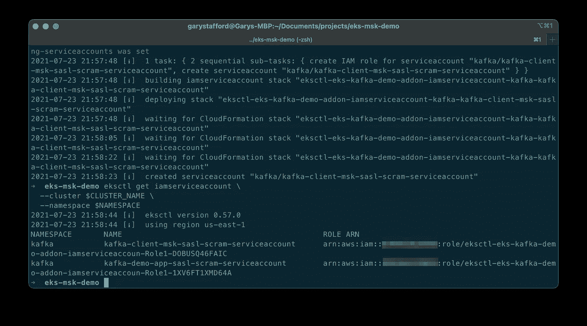

使用 eksctl 为服务帐户(IRSA)成功创建了两个 IAM 角色

回忆一下`eksctl`最初创造了三个云形成堆栈。添加了两个 IAM 角色后，我们现在总共部署了五个 CloudFormation 堆栈。

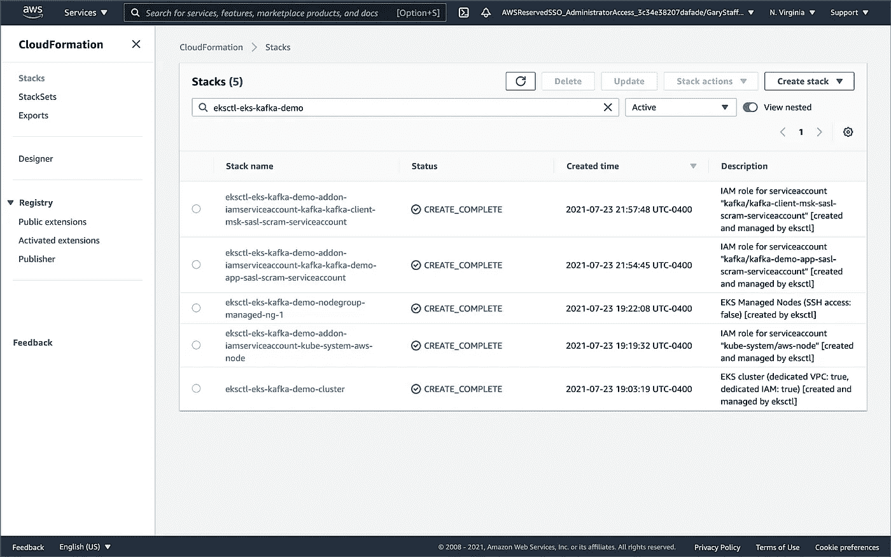

由 eksctl 创建的亚马逊 EKS 相关云形成堆栈

## 5.卡夫卡客户端

接下来，使用项目的掌舵图`kafka-client-msk`部署 Kafka 客户端。我们将使用 Kafka 客户端来创建 Kafka 主题和[Apache Kafka ACL](https://docs.aws.amazon.com/msk/latest/developerguide/msk-acls.html)。这个特殊的 Kafka 客户端是基于一个定制的 Docker 映像，我自己用 Java [OpenJDK 17](https://openjdk.java.net/projects/jdk/17/) 、`garystafford/kafka-client-msk`使用 [Alpine Linux](https://alpinelinux.org/) 基础映像构建的。该映像包含最新的 Kafka 客户端以及 AWS CLI v2 和其他一些有用的工具，如`jq`。如果你喜欢一个替代方案，Docker Hub 上有多个 Kafka 客户端映像。

Kafka 客户端只需要一个 pod。运行下面的`helm`命令，使用项目的 Helm 图表`kafka-client-msk`将 Kafka 客户端部署到 EKS:

```
cd helm/*# perform dry run to validate chart* helm install kafka-client-msk ./kafka-client-msk \
  --namespace $NAMESPACE --debug --dry-run*# apply chart resources* helm install kafka-client-msk ./kafka-client-msk \
  --namespace $NAMESPACE
```

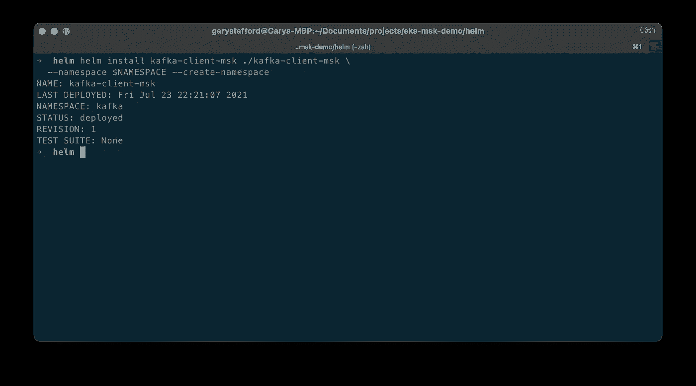

Kafka 客户端舵图的成功部署

使用以下命令之一确认 Kafka 客户端 pod 的成功创建:

```
kubectl get pods -n kafkakubectl describe pod -n kafka -l app=kafka-client-msk
```

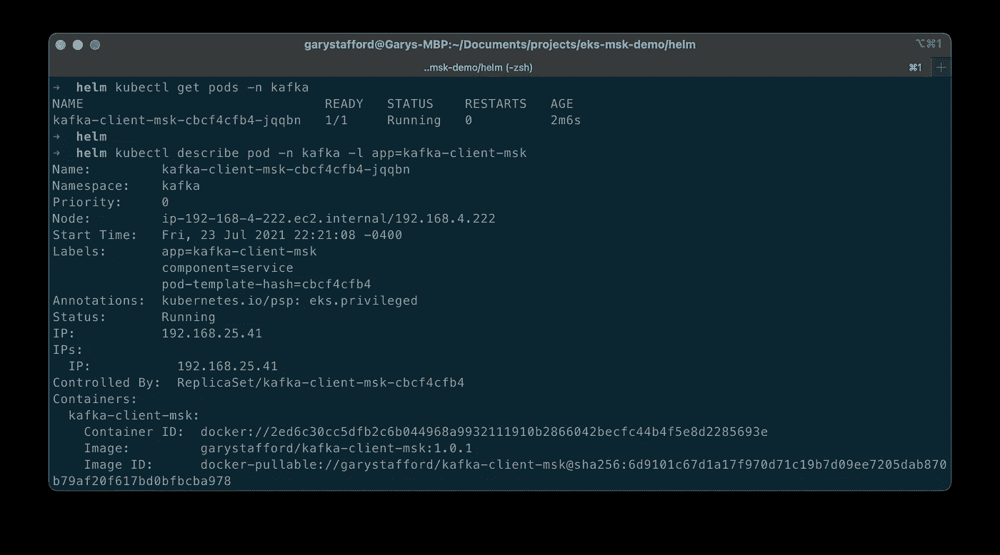

使用 kubectl 描述 Kafka 客户端 pod

Kafka 客户端与亚马逊 MSK、AWS SSM 参数商店和 AWS Secrets Manager 交互的能力基于 Terraform 创建的两个 IAM 策略，`EKSKafkaClientMSKPolicy`和`EKSScramSecretManagerPolicy`。这两个策略与一个新的 IAM 角色相关联，该角色又与 Kubernetes 服务帐户`kafka-client-msk-sasl-scram-serviceaccount`相关联。此服务帐户与 Kafka 客户端 pod 相关联，是 Helm 图表中 Kubernetes 部署资源的一部分。

## 6.卡夫卡主题和卡夫卡的 ACL

使用 Kafka 客户端创建 Kafka 主题和 Apache Kafka ACLs。首先，使用`kubectl exec`命令执行 Kafka 客户端容器中的命令。

```
export KAFKA_CONTAINER=$(
  kubectl get pods -n kafka -l app=kafka-client-msk | \
    awk 'FNR == 2 {print $1}')kubectl exec -it $KAFKA_CONTAINER -n kafka -- bash
```

一旦成功连接到 Kafka 客户端容器，设置以下三个环境变量:1) Apache ZooKeeper 连接字符串，2) Kafka 引导程序代理，以及 3)引导程序代理的'*可分辨名称'*([*参见 AWS 文档*](https://docs.aws.amazon.com/msk/latest/developerguide/msk-acls.html) )。这些环境变量的值将从 [AWS 系统管理器(SSM)参数存储库](https://docs.aws.amazon.com/systems-manager/latest/userguide/systems-manager-parameter-store.html)中检索。这些值是在创建 MSK 聚类期间由 Terraform 存储在参数存储中的。根据附加到与此 Pod (IRSA)相关联的 IAM 角色的策略，客户端可以访问 SSM 参数存储中的这些特定参数。

```
export ZOOKPR=$(\
  aws ssm get-parameter --name /msk/scram/zookeeper \
    --query 'Parameter.Value' --output text)export BBROKERS=$(\
  aws ssm get-parameter --name /msk/scram/brokers \
    --query 'Parameter.Value' --output text)export DISTINGUISHED_NAME=$(\
  echo $BBROKERS | awk -F',' '{print $1}' | sed 's/b-1/*/g')
```

使用`env`和`grep`命令验证环境变量已被正确检索和构建。你的 Zookeeper 和 Kafka bootstrap broker 的 URL 将与下面显示的不同。

```
env | grep 'ZOOKPR\|BBROKERS\|DISTINGUISHED_NAME'
```

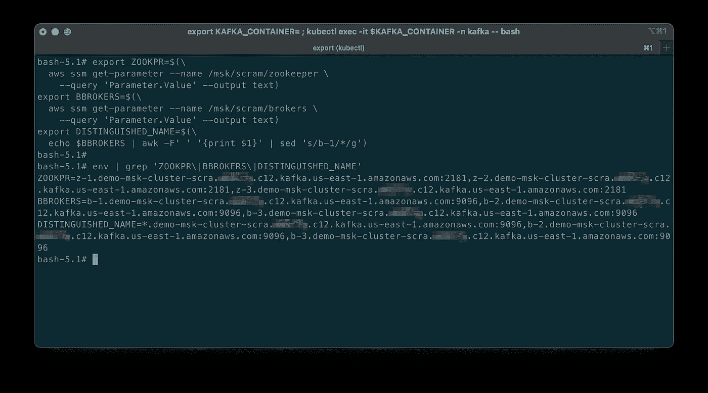

在 Kafka 客户端容器中设置所需的环境变量

要测试 EKS 和 MSK 之间的联系，请从 Kafka 客户端容器中列出现有的 Kafka 主题:

```
bin/kafka-topics.sh --list --zookeeper $ZOOKPR
```

您应该会看到三个默认主题，如下所示。

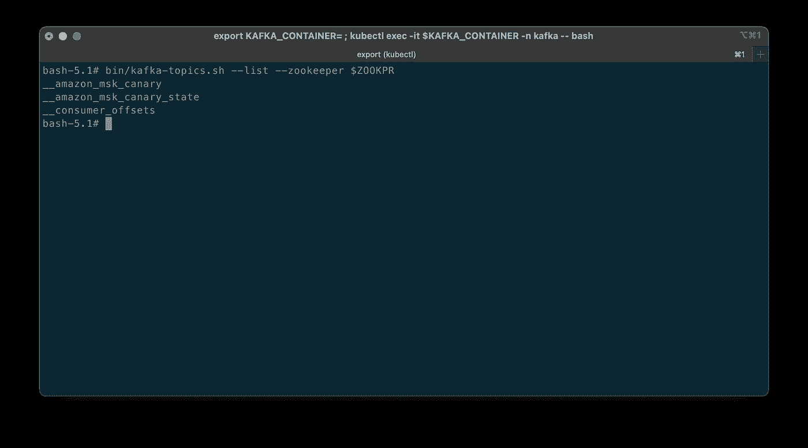

新 MSK 集群的默认卡夫卡主题

如果在上一步“建立 EKS 和 MSK VPC 的对等关系”中没有将新的 VPC 对等路由正确添加到适当的路由表中，您可能会在尝试连接时看到超时错误。返回并确认两个路由表都正确更新了新路由。

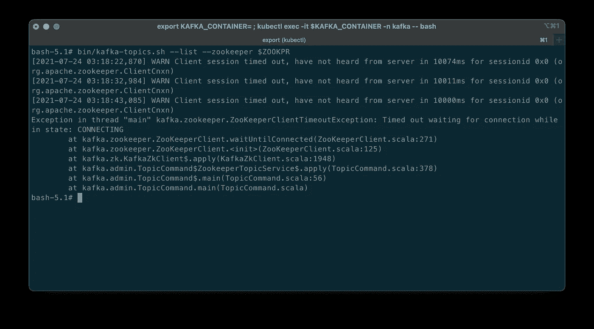

由于 VPC 对等相关路由表配置不正确，导致连接超时错误

## **卡夫卡主题、分区和复制品**

演示应用程序从两个主题`foo-topic`和`bar-topic`中产生和使用消息。每个主题将有三个[分区](https://kafka.apache.org/intro#intro_concepts_and_terms)，三个代理节点各一个，以及三个[副本](https://kafka.apache.org/intro#intro_concepts_and_terms)。

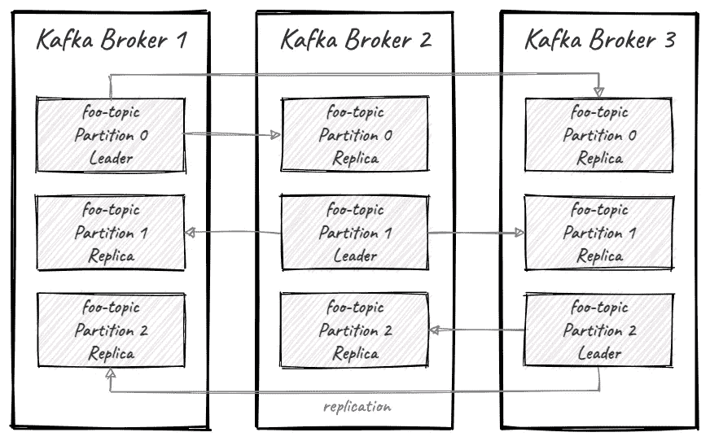

Kafka 主题与分区、副本和代理的关系

使用客户机容器中的以下命令创建两个新的 Kafka 主题。完成后，再次使用`list`选项确认主题的创建。

```
bin/kafka-topics.sh --create --topic foo-topic \
  --partitions 3 --replication-factor 3 \
  --zookeeper $ZOOKPRbin/kafka-topics.sh --create --topic bar-topic \
  --partitions 3 --replication-factor 3 \
  --zookeeper $ZOOKPRbin/kafka-topics.sh --list --zookeeper $ZOOKPR
```

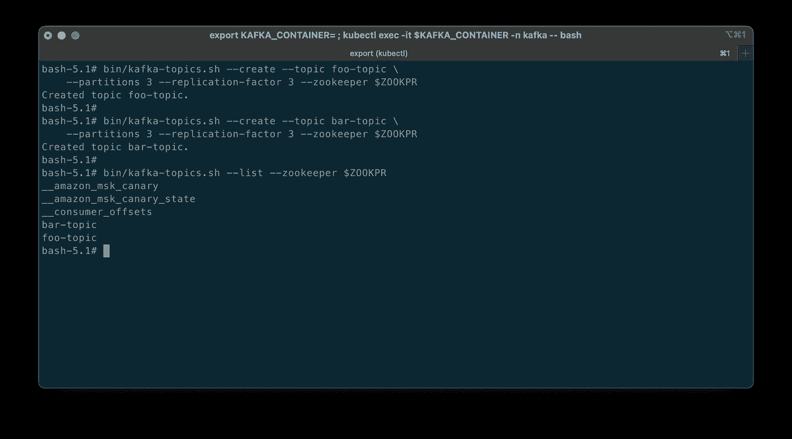

创造两个新的卡夫卡主题

使用`describe`选项查看主题的详细信息。注意每个主题有三个分区，每个主题有三个副本。

```
bin/kafka-topics.sh --describe --topic foo-topic --zookeeper $ZOOKPRbin/kafka-topics.sh --describe --topic bar-topic --zookeeper $ZOOKPR
```

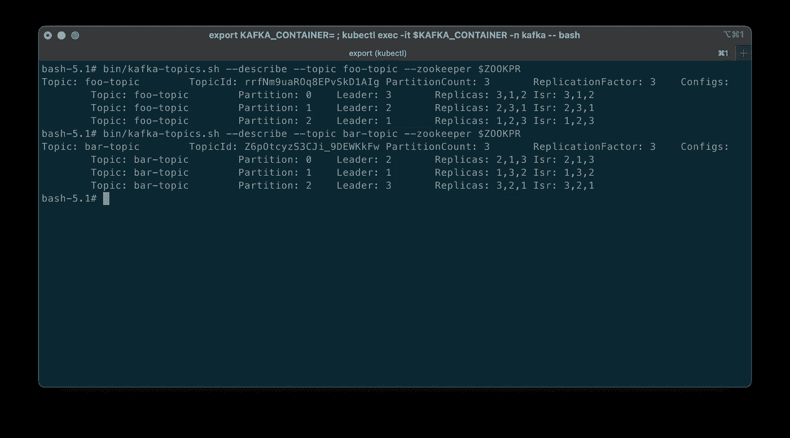

描述两个新的卡夫卡主题

## **卡夫卡 ACL**

根据 Kafka 的[文档](https://cwiki.apache.org/confluence/display/KAFKA/Kafka+Authorization+Command+Line+Interface)，Kafka 附带了一个可插拔的授权器和一个开箱即用的授权器实现，它使用 Zookeeper 来存储所有的访问控制列表(ACL)。Kafka ACLs 是以“Principal P is[Allowed/Denied]Operation O From Host H On Resource r”的通用格式定义的，你可以在 [KIP-11](https://cwiki.apache.org/confluence/display/KAFKA/KIP-11+-+Authorization+Interface) 上阅读更多关于 ACL 结构的内容。要添加、删除或列出 ACL，您可以使用 Kafka authorizer CLI。

授权 Kafka 代理和演示应用程序访问这两个主题。首先，允许使用`DISTINGUISHED_NAME`环境变量从代理访问主题(*参见* [*AWS 文档*](https://docs.aws.amazon.com/msk/latest/developerguide/msk-acls.html) )。

```
*# read auth for brokers* bin/kafka-acls.sh \
  --authorizer-properties zookeeper.connect=$ZOOKPR \
  --add \
 **--allow-principal "User:CN=${DISTINGUISHED_NAME}" \
  --operation Read \
  --group=consumer-group-B \
  --topic foo-topic**bin/kafka-acls.sh \
  --authorizer-properties zookeeper.connect=$ZOOKPR \
  --add \
 **--allow-principal "User:CN=${DISTINGUISHED_NAME}" \
  --operation Read \
  --group=consumer-group-A \
  --topic bar-topic***# write auth for brokers* bin/kafka-acls.sh \
  --authorizer-properties zookeeper.connect=$ZOOKPR \
  --add \
 **--allow-principal "User:CN=${DISTINGUISHED_NAME}" \
  --operation Write \
  --topic foo-topic**bin/kafka-acls.sh \
  --authorizer-properties zookeeper.connect=$ZOOKPR \
  --add \
 **--allow-principal "User:CN=${DISTINGUISHED_NAME}" \
  --operation Write \
  --topic bar-topic**
```

服务 A 的三个实例(副本/pod)是`consumer-group-A`的一部分，它们向`foo-topic`生成消息，并从`bar-topic`消费消息。相反，作为`consumer-group-B`的一部分，服务 B 的三个实例向`bar-topic`产生消息，并从`foo-topic`消费消息。

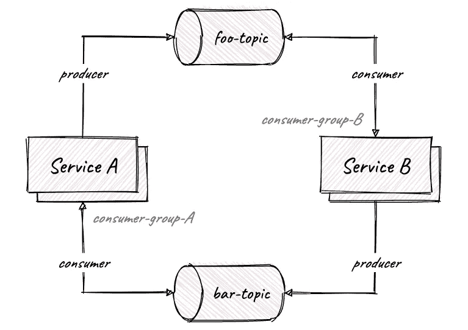

从微服务到 Kafka 主题的消息流

允许从演示应用的微服务访问适当的主题。首先，设置`USER`环境变量——MSK 集群的 SASL/紧急停堆凭证的用户名，由 Terraform 存储在 AWS Secrets Manager 中。我们可以从 Secrets Manager 中检索用户名，并使用以下命令将其分配给环境变量。

```
export USER=$(
  aws secretsmanager get-secret-value \
    --secret-id AmazonMSK_credentials \
    --query SecretString --output text | \
    jq .username | sed -e 's/^"//' -e 's/"$//')
```

创建适当的 ACL。

```
*# producers* bin/kafka-acls.sh \
  --authorizer kafka.security.auth.SimpleAclAuthorizer \
  --authorizer-properties zookeeper.connect=$ZOOKPR \
  --add \
 **--allow-principal User:$USER \
  --producer \
  --topic foo-topic**bin/kafka-acls.sh \
  --authorizer kafka.security.auth.SimpleAclAuthorizer \
  --authorizer-properties zookeeper.connect=$ZOOKPR \
  --add \
 **--allow-principal User:$USER \
  --producer \
  --topic bar-topic***# consumers* bin/kafka-acls.sh \
  --authorizer kafka.security.auth.SimpleAclAuthorizer \
  --authorizer-properties zookeeper.connect=$ZOOKPR \
  --add \
 **--allow-principal User:$USER \
  --consumer \
  --topic foo-topic \
  --group consumer-group-B**bin/kafka-acls.sh \
  --authorizer kafka.security.auth.SimpleAclAuthorizer \
  --authorizer-properties zookeeper.connect=$ZOOKPR \
  --add \
 **--allow-principal User:$USER \
  --consumer \
  --topic bar-topic \
  --group consumer-group-A**
```

要列出您刚刚创建的 ACL，请使用以下命令:

```
*# list all ACLs* bin/kafka-acls.sh \
  --authorizer kafka.security.auth.SimpleAclAuthorizer \
  --authorizer-properties zookeeper.connect=$ZOOKPR \
  --list*# list for individual topics, e.g. foo-topic* bin/kafka-acls.sh \
  --authorizer kafka.security.auth.SimpleAclAuthorizer \
  --authorizer-properties zookeeper.connect=$ZOOKPR \
  --list \
 **--topic foo-topic**
```

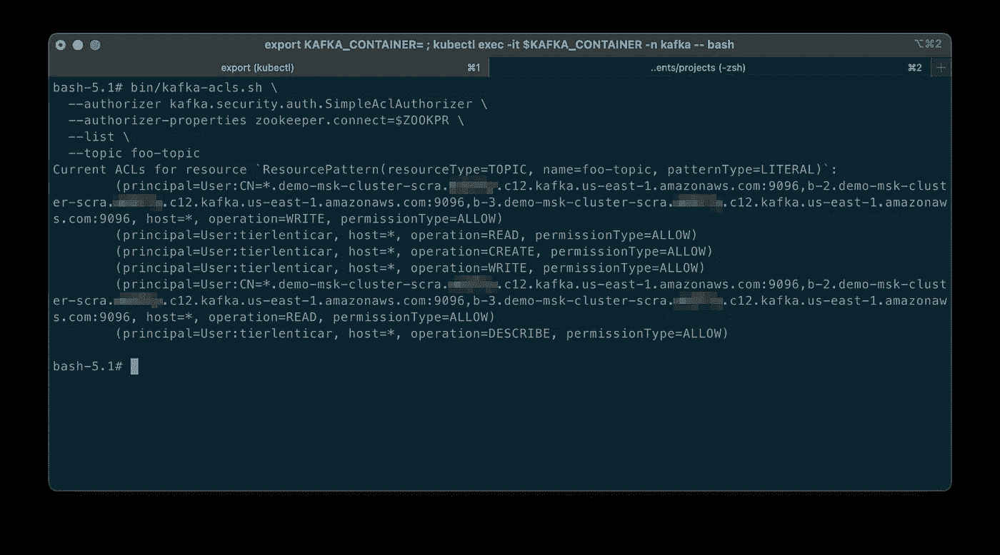

与 foo-topic Kafka 主题关联的 Kafka ACLs

## 7.部署示例应用程序

我们应该最终准备好将我们的演示应用程序部署到 EKS。该应用包含两个基于 Go 的微服务，即服务 A 和服务 b。演示应用的功能来源于 Soham Kamani 在 2020 年 9 月发表的博文[，在 Golang 中实现一个 Kafka 生产者和消费者(带有完整示例)用于生产](https://www.sohamkamani.com/golang/working-with-kafka/)。演示应用程序的所有源代码都包含在项目中。

```
.
├── Dockerfile
├── README.md
├── consumer.go
├── dialer.go
├── dialer_scram.go
├── go.mod
├── go.sum
├── main.go
├── param_store.go
├── producer.go
└── tls.go
```

两个微服务都使用相同的 Docker 映像`garystafford/kafka-demo-service`，配置了不同的环境变量。该配置使这两种服务以不同的方式运行。如前所述，微服务使用 Segment 的`[kafka-go](https://github.com/segmentio/kafka-go)`客户端与 MSK 集群的代理和主题进行通信。下面，我们看到了演示应用程序的消费者功能(`consumer.go`)。

上图中的消费者和生产者都使用 SASL/SCRAM 连接到 MSK 集群。下面，我们看到 SASL/急停拨号器的功能。这个`Dialer`类型镜像了`net.Dialer` API，但是被设计用来打开 Kafka 连接而不是原始网络连接。请注意该函数如何访问 AWS Secrets Manager 来检索 SASL/紧急停堆凭证。

我们将使用 Helm 部署每个微服务的三个副本(每个微服务三个单元)。下面，我们看到了每个微服务的 Kubernetes `Deployment`和`Service`资源。

运行下面的`helm`命令，使用项目的 Helm 图表`kafka-demo-app`将演示应用程序部署到 EKS:

```
cd helm/*# perform dry run to validate chart* helm install kafka-demo-app ./kafka-demo-app \
    --namespace $NAMESPACE --debug --dry-run*# apply chart resources* helm install kafka-demo-app ./kafka-demo-app \
    --namespace $NAMESPACE
```

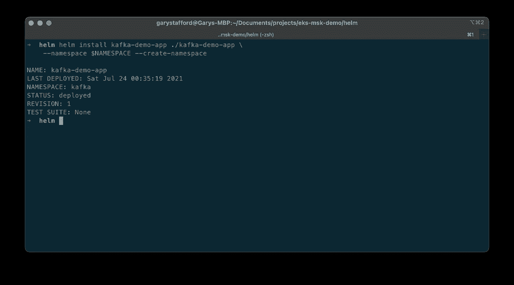

成功部署演示应用程序的舵图

使用以下命令之一确认 Kafka 客户端 pod 的成功创建:

```
kubectl get pods -n kafkakubectl get pods -n kafka -l app=kafka-demo-service-akubectl get pods -n kafka -l app=kafka-demo-service-b
```

现在您应该有总共七个 pods 在`kafka`名称空间中运行。除了之前部署的单个 Kafka 客户端 pod 之外，还应该有三个新的服务 A pods 和三个新的服务 B pods。

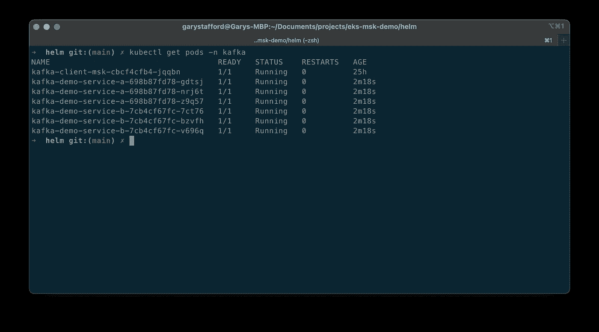

kafka 命名空间显示了七个正在运行的 pod

演示应用程序与 AWS SSM 参数存储和 AWS Secrets Manager 交互的能力基于 Terraform，`EKSScramSecretManagerPolicy`创建的 IAM 策略。该策略与一个新的 IAM 角色相关联，该角色又与 Kubernetes 服务帐户`kafka-demo-app-sasl-scram-serviceaccount`相关联。这个服务帐户与演示应用程序的 pods 相关联，是 Helm 图表中 Kubernetes 部署资源的一部分。

## 8.验证应用程序功能

虽然 pod 成功启动和运行是一个好的迹象，但是要确认演示应用程序是否正常运行，请使用`kubectl`检查服务 A 和服务 B 的日志。这些日志将确认应用程序已经成功地从 Secrets Manager 检索到 SASL/紧急停堆凭证，连接到 MSK，并且可以从适当的主题生成和使用消息。

```
kubectl logs -l app=kafka-demo-service-a -n kafkakubectl logs -l app=kafka-demo-service-b -n kafka
```

`MSG_FREQ`环境变量控制微服务产生消息的频率。默认情况下，频率为 60 秒，但在舵图中会被覆盖并增加到 10 秒。

下面，我们看到了由服务 A pods 生成的日志。注意，其中一条消息表明服务 A 生产者成功:`writing 1 messages to foo-topic (partition: 0)`。以及指示消费者成功的消息:`kafka-demo-service-a-db76c5d56-gmx4v received message: This is message 68 from host kafka-demo-service-b-57556cdc4c-sdhxc`。每条消息都包含生成和使用它的主机容器的名称。

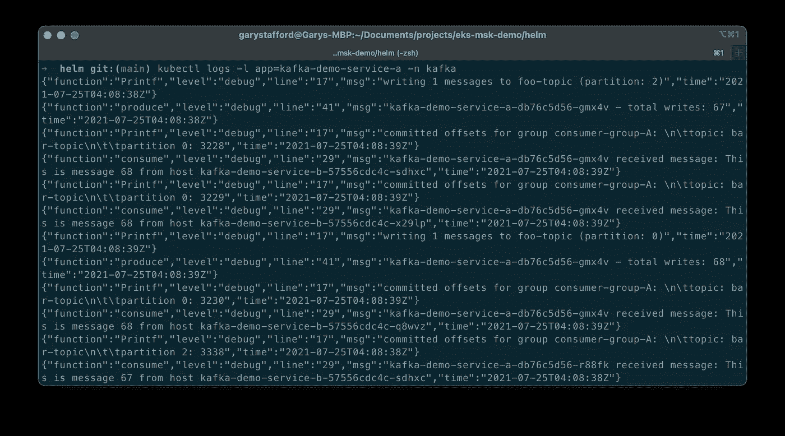

服务 A pods 生成的日志

同样，我们可以看到由两个服务 B pods 生成的日志。注意，其中一条消息表明服务 B 生产者成功:`writing 1 messages to bar-topic (partition: 2)`。以及指示消费者成功的消息:`kafka-demo-service-b-57556cdc4c-q8wvz received message: This is message 354 from host kafka-demo-service-a-db76c5d56-r88fk`。

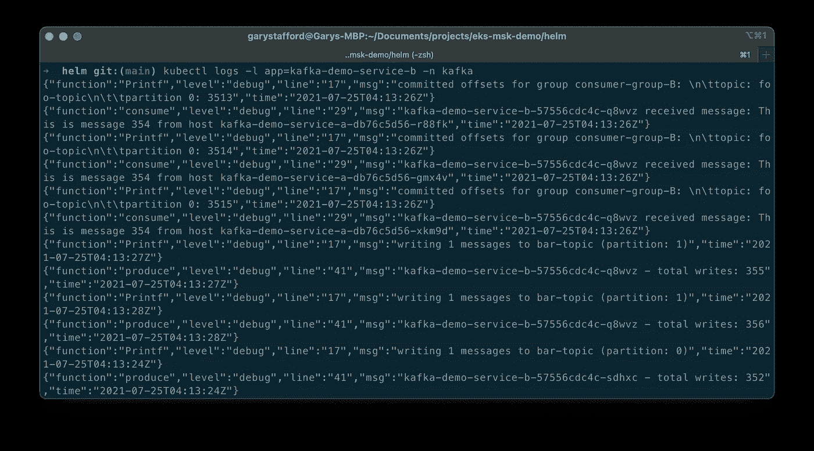

服务 B 窗格生成的日志

## 云观察指标

我们还可以检查可用的亚马逊 MSK CloudWatch 指标，以确认基于 EKS 的演示应用程序正在按预期与 MSK 通信。该集群有 132 个不同的指标可用。下面，我们看到两个主题的三个分区中的每一个的`BytesInPerSec`和`BytesOutPerSecond`，它们分布在三个 Kafka broker 节点中的每一个上。每个指标显示了每个主题的类似流量，包括入站和出站流量。除了日志之外，这些指标还显示了服务 A 和服务 B 的多个实例正在生成和使用消息。

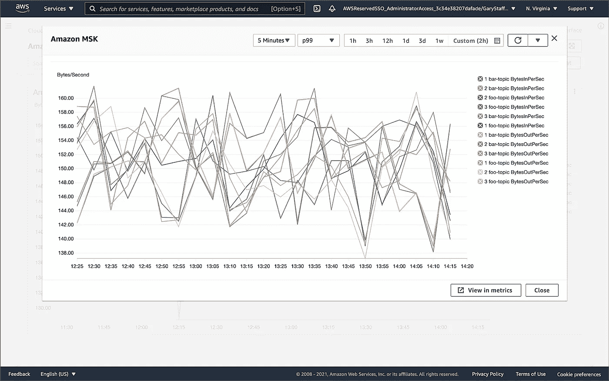

MSK 集群的亚马逊云观察指标

## 普罗米修斯

我们也可以使用开源的可观测性工具来确认同样的结果，比如普罗米修斯。亚马逊 MSK 开发者指南概述了使用 Prometheus 监控 Kafka 的必要步骤。由`eksctl`创建的亚马逊 MSK 集群已经启用了开放监控，并且端口`11001`和`11002`被 Terraform 添加到必要的 MSK 安全组。

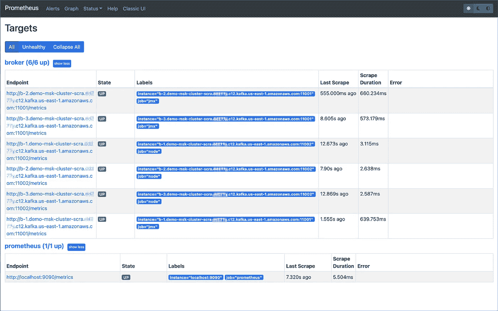

亚马逊 MSK 代理目标成功连接到 Prometheus

在 EKS 集群上的单个 pod 中运行 Prometheus(从 Ubuntu base Docker 映像或类似映像构建)可能是这个演示中最简单的方法。

```
rate(kafka_server_BrokerTopicMetrics_Count{topic=~"foo-topic|bar-topic", name=~"BytesInPerSec|BytesOutPerSec"}[5m])
```

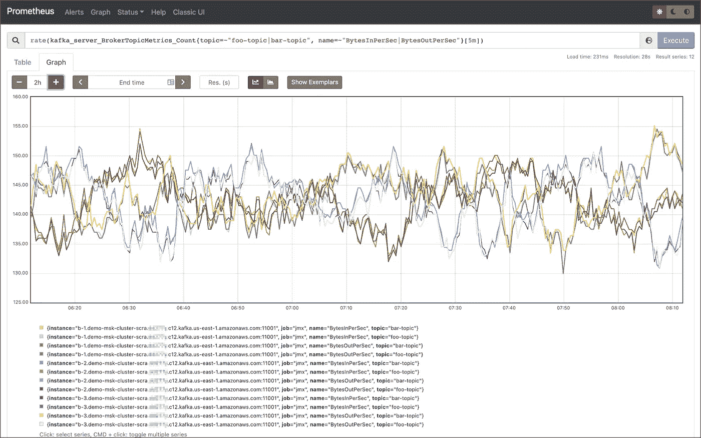

普罗米修斯图显示了`BytesInPerSec`和`BytesOutPerSecond for the two topics`的速率

# 参考

*   [亚马逊面向 Apache Kafka 开发者的托管流媒体指南](https://docs.aws.amazon.com/msk/latest/developerguide/what-is-msk.html)
*   [段的](https://github.com/segmentio/kafka-go) `[kafka-go](https://github.com/segmentio/kafka-go)` [项目](https://github.com/segmentio/kafka-go) (GitHub)
*   [为生产](https://www.sohamkamani.com/golang/working-with-kafka/)实现 Golang
    中的 Kafka 生产者和消费者，作者 Soham Kamani
*   [卡夫卡戈朗的例子](https://github.com/sohamkamani/golang-kafka-example) (GitHub/Soham Kamani)
*   [AWS 亚马逊 MSK 车间](https://amazonmsk-labs.workshop.aws/en/)

这篇博客代表我自己的观点，而不是我的雇主亚马逊网络服务公司(AWS)的观点。所有产品名称、徽标和品牌都是其各自所有者的财产。