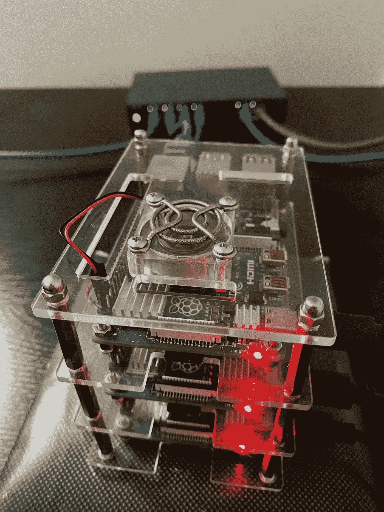
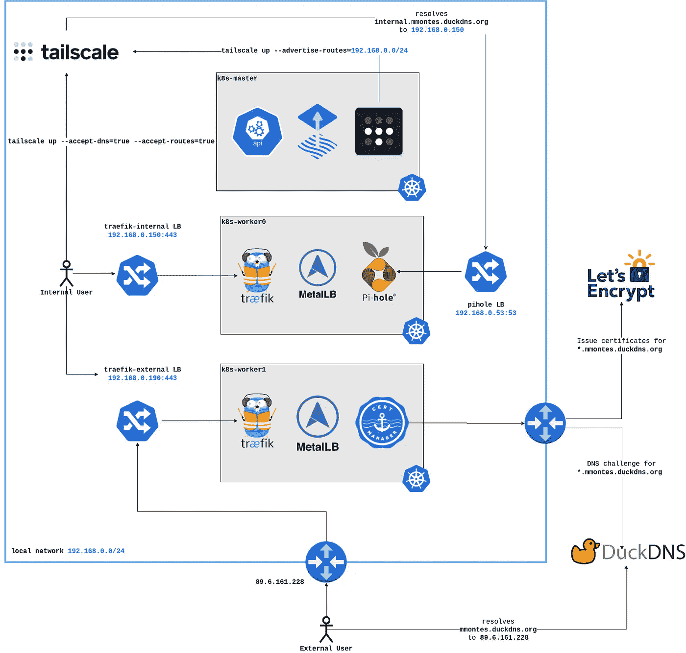
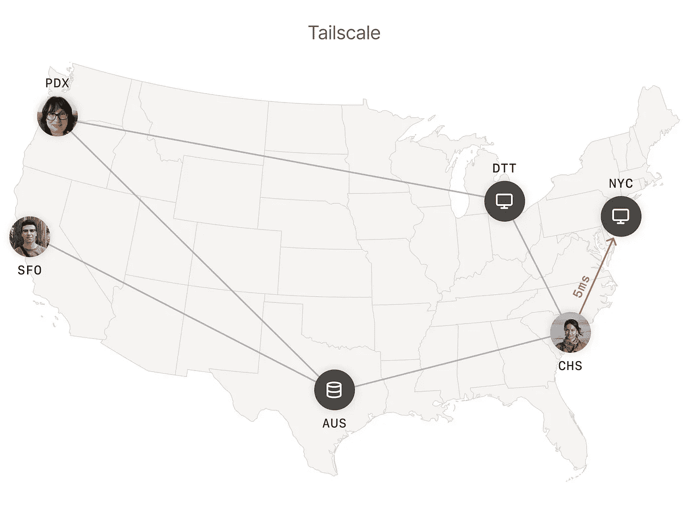
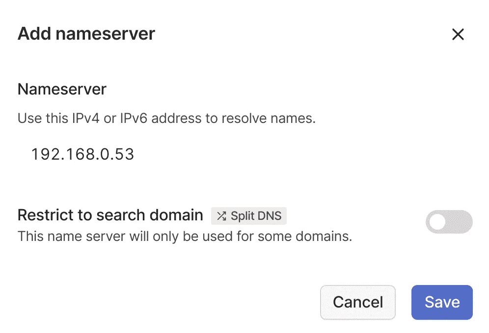
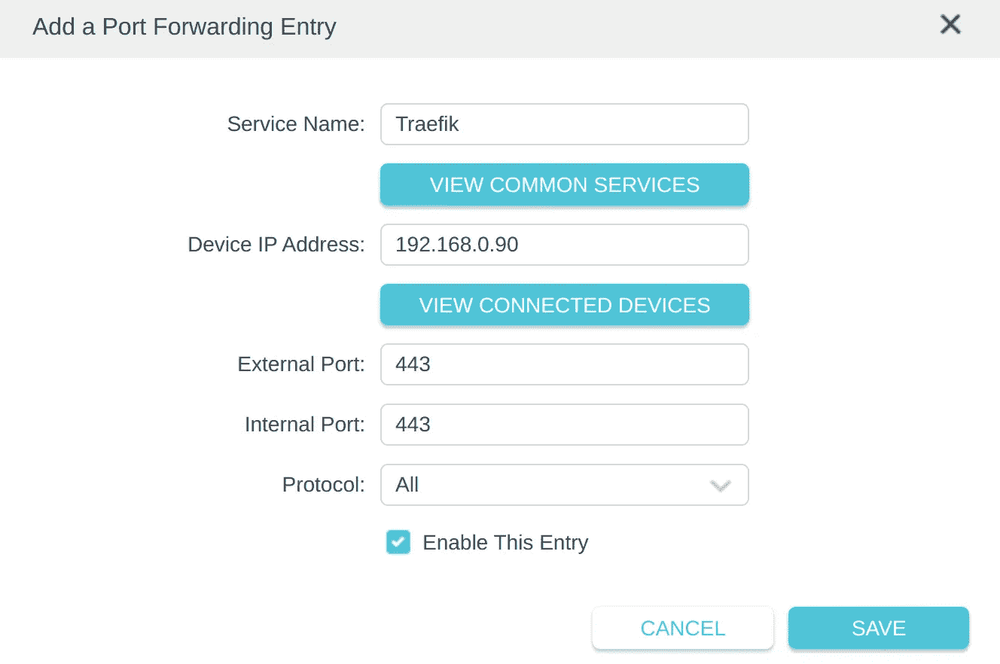
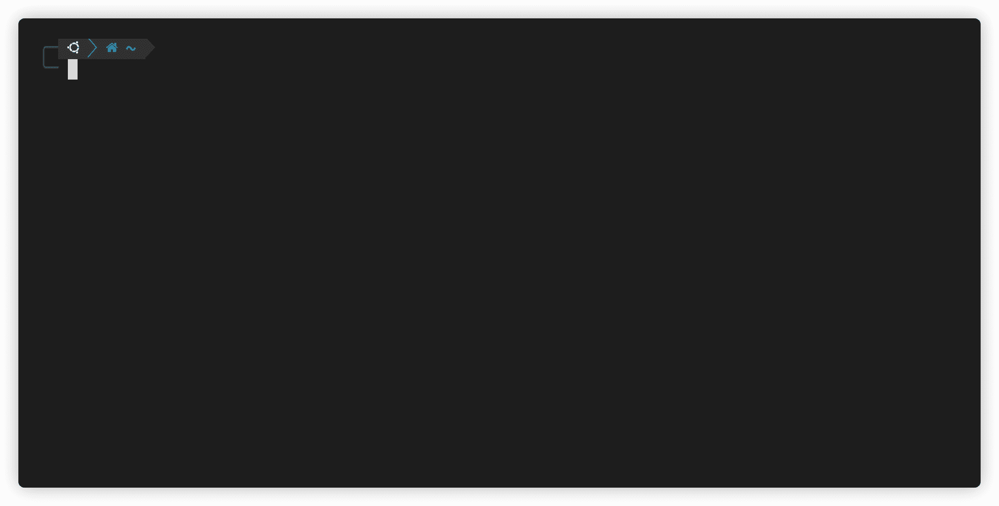
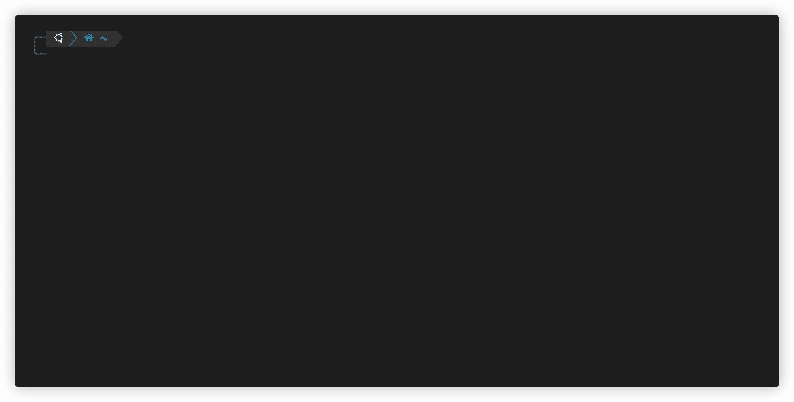

# 使用网关 API 和 Tailscale 安全地进入裸机 Kubernetes 集群

> 原文：<https://itnext.io/securely-ingressing-into-bare-metal-kubernetes-clusters-with-gateway-api-and-tailscale-cc68299b646a?source=collection_archive---------1----------------------->



由树莓皮 4 制成的裸机 Kubernetes 集群

避免将带有敏感数据的互联网应用程序暴露给公众是一项基本的安全实践，即使应用程序使用任何类型的身份验证，也应该始终保持这种做法。为了实现这一点，您可以设置一个虚拟专用网，并在本地 DNS 中解析专用负载平衡器的 IP，这样只有您的 VPN 用户才能将流量路由到您的应用程序。

如果您在 AWS 中运行您的平台，有像 [AWS PrivateLink](https://aws.amazon.com/privatelink/) 这样的托管服务提供托管私有连接服务，因此您可以从外部 VPC 安全地访问您的私有 NLB。但是，如果您有裸机集群，实现这种模式可能会有困难，因为您必须自己处理物理网络。

本文的目的是提供一个解决方案，通过利用具有免费层的开放源码技术来私有地访问裸机 Kubernetes 集群，所以您不会花一分钱！

我们将使用[网关 API](https://gateway-api.sigs.k8s.io/) 的实现来声明性地定义访问集群所需的网络资源。如果您熟悉 Kubernetes，您可能知道在 API 网关中公开您的应用程序的[入口 API](https://kubernetes.io/docs/concepts/services-networking/ingress/) 。为了克服它的局限性， [SIG network](https://github.com/kubernetes/community/tree/master/sig-network) 最近推出了它的继任者 Gateway API。

# 什么是网关 API？

这个新的 API 引入了一组新的网络资源，可以在您的组织中更好地划分职责:

*   `[GatewayClass](https://gateway-api.sigs.k8s.io/api-types/gatewayclass/)`:定义一个`Gateway`类的集群作用域资源，类似于它的前辈 [IngressClass](https://kubernetes.io/docs/concepts/services-networking/ingress/#ingress-class) 。它通常由基础设施提供商管理，以提供不同的网关风格，例如公共或私有。
*   `[Gateway](https://gateway-api.sigs.k8s.io/api-types/gateway/)`:包含负载平衡基础设施配置的集群范围的资源，例如网络协议和 TLS。平台团队负责维护所有应用程序共享的`Gateway`资源，以路由流量。
*   `[HTTPRoute](https://gateway-api.sigs.k8s.io/api-types/httproute/)`:由应用程序团队管理，这个资源包含将 HTTP 流量映射到 Kubernetes `Service`资源的路由配置。


使用网关 API 资源的职责分离。网关 API 文档提供的图像

在我们的例子中，这个想法是让两个不同的`GatewayClass`对象能够声明我们是否希望`Gateway`将其`HTTPRoutes`暴露给互联网或 Tailscale VPN。这样，在`GatewayClass`和`Gateway`资源中抽象出了为应用程序提供连接所需的网络细节，因此不会向开发人员公开，因此他们可以专注于配置他们的应用程序。反之亦然，平台工程师能够在不干扰应用团队的情况下执行他们的操作，例如，他们能够在应用团队没有注意的情况下配置新的 TLS 证书。

# 需求和架构

我们的集群将有两种不同类型的用户:

*   **内部:**使用本地网络或 Tailscale VPN 访问集群，该用户将能够访问内部和外部应用程序。
*   **外部**:位于网络外部，该用户将使用我们的公共 IP 路由到集群，只能访问外部应用程序。

我们应该为用户提供适当的 DNS 解析，这样他们就可以顺利地进入我们的集群，而不必记住 IP 地址。更准确地说，我们将提供这些 DNS 名称:

*   **internal.mmontes.duckdns.org**:它将由本地 DNS 服务器解析到我们内部的负载均衡器 IP。
*   **mmontes.duckdns.org**:它会被一个公共 DNS 服务器解析到我们的外部负载均衡器 IP。

我们的通信应该使用 TLS 加密，以避免 [MITM](https://en.wikipedia.org/wiki/Man-in-the-middle_attack) 攻击并保证机密性，因此我们将使用 Let's Encrypt 为内部和外部端点颁发证书。

考虑到所有这些需求，这是我们解决方案的高级架构。



我们目标体系结构的网络图

我们将放大每个组件以提供更多细节。

# 尾秤

为了能够从任何网络对我们的设备进行私有寻址，我们将引入 [Tailscale](https://tailscale.com/) ，这是一种 VPN 服务，与其他集中式解决方案不同，它通过使用 [Wireguard](https://www.wireguard.com/) 协议，实现您的设备之间的加密点对点连接。与传统的集中式 VPN 相比，这导致了更低的延迟。



使用 Tailscale 的加密点对点连接。图片由 Tailscale docs 提供

Tailscale 将为您创建一个虚拟专用网络，也称为`tailnet`，在这里您可以安全地路由到您的设备。它还将在每台设备上创建一个网络接口，每当它向`tailnet`中的一个 IP 发送流量时都会使用这个接口。

```
mmontes@k8s-worker0:~$ ifconfig
...
tailscale0: flags=4305<UP,POINTOPOINT,RUNNING,NOARP,MULTICAST>  mtu 1280
        inet 100.80.97.21  netmask 255.255.255.255  destination 100.80.97.21
        inet6 fe80::522b:a1ae:f74a:b97c  prefixlen 64  scopeid 0x20<link>
        inet6 fd7a:115c:a1e0:ab12:4843:cd96:6250:6115  prefixlen 128  scopeid 0x0<global>
        unspec 00-00-00-00-00-00-00-00-00-00-00-00-00-00-00-00  txqueuelen 500  (UNSPEC)
        RX packets 71147  bytes 31066579 (31.0 MB)
        RX errors 0  dropped 0  overruns 0  frame 0
        TX packets 62171  bytes 8793662 (8.7 MB)
        TX errors 0  dropped 0 overruns 0  carrier 0  collisions 0
```

为了解析 DNS 名称，Tailscale 有一个名为 [MagicDNS](https://tailscale.com/kb/1081/magicdns/) 的功能，可以自动为`tailnet`中的设备配置 DNS 名称。您也可以配置自己的 DNS 服务器，但是我们将在后面介绍。

```
mmontes@raspi-ramallal:~ $ nslookup k8s-worker0
Server:         100.100.100.100
Address:        100.100.100.100#53

Name:   k8s-worker0.tail03db8.ts.net
Address: 100.80.97.21
```

到目前为止，我们已经介绍了安装了 Tailscale 的设备的私有连接，但是，可能有一些设备无法运行 Tailscale 守护程序，但它们在您的本地网络中有一个 IP，例如物联网设备。我们能从 VPN 解决这些问题吗？足够幸运的是，Tailscale 已经覆盖了你，它们允许你配置设备作为[子网路由器](https://tailscale.com/kb/1019/subnets/)。您可以选择运行 Tailscale 的设备在`tailnet`中通告您本地网络的 CIDR。

```
#!/bin/bash

curl -fsSL https://pkgs.tailscale.com/stable/ubuntu/jammy.noarmor.gpg | tee /usr/share/keyrings/tailscale-archive-keyring.gpg >/dev/null
curl -fsSL https://pkgs.tailscale.com/stable/ubuntu/jammy.tailscale-keyring.list | tee /etc/apt/sources.list.d/tailscale.list

apt update
apt install -y tailscale

tailscale up --advertise-routes=192.168.0.0/24
```

我们在这里宣传的是`192.168.0.0/24` CIDR，因此我们将能够从生活在`tailnet`的设备寻址该范围内的任何 IP，即使它们不在同一个本地网络中。这将是我们设置的一个关键特性，因为我们需要在`tailnet`中公布不能自己运行 Tailscale 的`LoadBalancer`IP。

# 引导集群

一旦连接就绪，接下来的事情将是配置主机并使用 [kubeadm](https://kubernetes.io/docs/setup/production-environment/tools/kubeadm/create-cluster-kubeadm/) 引导 Kubernetes 集群，但不幸的是这是一个广泛的主题，不适合本文(也许另一篇？)，所以这里是回购如果你想看看。

[](https://github.com/mmontes11/k8s-bootstrap) [## GitHub—mmontes 11/k8s—引导程序:🚀使用 kubeadm 的 Kubernetes 集群引导

### 使用 kubeadm 的 Kubernetes 集群引导。

github.com](https://github.com/mmontes11/k8s-bootstrap) 

# 流量

我们将遵循 [GitOps](https://opengitops.dev/) 方法将工作负载部署到我们的集群。这意味着一组 Kubernetes 控制器将不断地协调 git 存储库的清单，因此我们实际上不需要手动操作集群，相反，我们只需声明所需的状态，控制器将确保实际状态符合我们的要求。

为了实现这一点，我们将使用他们方便的 [CLI](https://fluxcd.io/flux/cmd/) 安装 [Flux](https://fluxcd.io/) ，它提供了一个`bootstrap`子命令来快速启动控制平面并开始协调 git repo。

```
mmontes@k8s-master:~$ flux bootstrap github \
  --owner=mmontes11 \
  --repository=mmontes11/k8s-infrastructure \
  --branch=main \
  --path=./clusters/production \
  --personal \
  --private=false
```

运行该命令后，您将看到在`flux-system`名称空间中出现流量控制平面，并且`Kustomization`和`HelmRelease`资源开始协调。

```
mmontes@k8s-master:~$ kubectl get pods -n flux-system
NAME                                       READY   STATUS    RESTARTS   AGE
helm-controller-59f8b44dd5-sln4l           1/1     Running   0          7d11h
kustomize-controller-7d475476b4-qhl8b      1/1     Running   0          7d11h
notification-controller-677cf654b9-99kfp   1/1     Running   0          7d11h
source-controller-dc97b975b-cwv88          1/1     Running   0          7d11h

mmontes@k8s-master:~$ kubectl get kustomizations -A
NAMESPACE         NAME                             AGE     READY   STATUS
flux-system       cert-manager                     12d     True    Applied revision: main/04437305d3780aca25115d5fe77ae193c48a3cc2
flux-system       cert-manager-issuers             3h9m    True    Applied revision: main/04437305d3780aca25115d5fe77ae193c48a3cc2
flux-system       dns                              12d     True    Applied revision: main/04437305d3780aca25115d5fe77ae193c48a3cc2
flux-system       flux-system                      12d     True    Applied revision: main/04437305d3780aca25115d5fe77ae193c48a3cc2
flux-system       gateway-api                      12d     True    Applied revision: main/04437305d3780aca25115d5fe77ae193c48a3cc2
flux-system       kube-prometheus-stack            12d     True    Applied revision: main/04437305d3780aca25115d5fe77ae193c48a3cc2
flux-system       kube-prometheus-stack-monitors   3h15m   True    Applied revision: main/04437305d3780aca25115d5fe77ae193c48a3cc2
flux-system       metallb                          12d     True    Applied revision: main/04437305d3780aca25115d5fe77ae193c48a3cc2
flux-system       networking                       12d     True    Applied revision: main/04437305d3780aca25115d5fe77ae193c48a3cc2
flux-system       traefik                          12d     True    Applied revision: main/04437305d3780aca25115d5fe77ae193c48a3cc2
flux-system       traefik-config                   3h15m   True    Applied revision: main/04437305d3780aca25115d5fe77ae193c48a3cc2
...

mmontes@k8s-master:~$ kubectl get helmrelease -A
NAMESPACE         NAME                         AGE    READY   STATUS
dns               duckdns                      12d    True    Release reconciliation succeeded
dns               pihole                       12d    True    Release reconciliation succeeded
monitoring        kube-prometheus-stack        12d    True    Release reconciliation succeeded
networking        metallb                      12d    True    Release reconciliation succeeded
networking        traefik-external             10d    True    Release reconciliation succeeded
networking        traefik-internal             10d    True    Release reconciliation succeeded
pki               cert-manager                 12d    True    Release reconciliation succeeded
pki               letsencrypt                  3h8m   True    Release reconciliation succeeded
...
```

这里是 Flux 正在协调的回购协议，接下来的部分将介绍安装和配置所有可用的网络组件，不过您可以随意查看。

[](https://github.com/mmontes11/k8s-infrastructure) [## GitHub-mmontes 11/k8s-基础设施:🏗使用 Flux 的️基础设施和租户引导

### 使用 Flux 的基础设施和租户引导。当…时，Flux 使用的每个簇的入口点

github.com](https://github.com/mmontes11/k8s-infrastructure) 

# 金属 lb

为了提高可用性，我们将使用`LoadBalancer`服务进入我们的集群。与托管 Kubernetes 产品不同，IP 不会自动提供给`LoadBalancer`服务，它们将保持待定状态。在裸机集群中自动配置这些 IP 不是很好吗？这是 Kubernetes 控制器 [Metallb](https://metallb.universe.tf/) 的使命，它为您的`LoadBalancer`服务提供和分配 IP 地址，与云提供商的做法相同。

我们将使用`HelmRelease`在集群中安装 Metallb。

```
apiVersion: helm.toolkit.fluxcd.io/v2beta1
kind: HelmRelease
metadata:
  name: metallb
spec:
  chart:
    spec:
      chart: metallb
      sourceRef:
        kind: HelmRepository
        name: metallb
      version: "0.13.7"
  interval: 1h0m0s
  values:
    prometheus:
      rbacPrometheus: true
      serviceAccount: metallb
      namespace: networking
      serviceMonitor:
        enabled: true
        controller:
          additionalLabels:
            release: kube-prometheus-stack
        speaker:
          additionalLabels:
            release: kube-prometheus-stack
```

然后，我们将声明一个`IPAddressPool`来提供一系列 IP 供`LoadBalancer`服务稍后使用。正如我们之前提到的，Tailscale 的子网路由器在 VPN 中通告了`192.168.0.0/24` CIDR，我们需要确保`IPAddressPool`中声明的 IP 覆盖了这个范围，以便它们可以从 VPN 寻址。

```
apiVersion: metallb.io/v1beta1
kind: IPAddressPool
metadata:
  name: load-balancer
spec:
  addresses:
    - 192.168.0.50-192.168.0.99
```

默认情况下，这个 IP 池不会在本地网络中公布，我们需要创建一个`L2Advertisement`来这样做。否则，流量不会被路由到这些 IP。

```
apiVersion: metallb.io/v1beta1
kind: L2Advertisement
metadata:
  name: l2advertisement
spec:
  ipAddressPools:
    - load-balancer
```

如果你想知道 Metallb 是如何在幕后做 L2 广告的，看看这些[文件](https://metallb.universe.tf/configuration/_advanced_l2_configuration/)。

# DuckDNS

下一步将是建立一个公共 DNS 记录来解析我们的公共 IP，这样我们就可以从外部网络寻址我们的集群。这将使我们能够解决 DNS01 挑战，以便稍后使用“让我们加密”来颁发 TLS 证书。我们将使用 [DuckDNS](https://www.duckdns.org/) ，一个免费提供`duckdns.org`子域名的 DNS 提供商。

因为我有一个动态的 IP 地址，所以我需要定期更新 DNS 记录，这有可能通过 [linuxserver/duckdns](https://hub.docker.com/r/linuxserver/duckdns) 映像自动完成。它在内部创建一个 crontab，使用 DuckDNS API 定期更新您的公共 IP。

```
apiVersion: helm.toolkit.fluxcd.io/v2beta1
kind: HelmRelease
metadata:
  name: duckdns
spec:
  releaseName: duckdns
  chart:
    spec:
      chart: duckdns
      sourceRef:
        kind: HelmRepository
        name: mmontes
        namespace: flux-system
      version: "0.3.0"
  interval: 5m
  values:
    image:
      repository: linuxserver/duckdns
      pullPolicy: IfNotPresent
      tag: 0168fda3-ls117

    subdomains:
      - mmontes.duckdns.org
    ...
    secretRef:
      name: duckdns
```

# 证书管理器

如果不正确地自动化 TLS 证书的颁发和轮换，会使您的群集操作变得非常复杂。为此，我们将使用 [cert-manager](https://cert-manager.io/) ，它是一个 Kubernetes 操作者，负责在您的 Kubernetes 集群中颁发和更新 x.509 证书。

它支持多个证书源，包括集群内 CAs、Hashicorp Vault、Venafi 和 Let's Encrypt。由于我们想要一个由所有客户端都信任的公共 CA 颁发的证书，我们将使用自动化证书管理环境( [ACME](https://cert-manager.io/docs/configuration/acme/) )颁发者在[让我们加密](https://letsencrypt.org/)中颁发证书。

第一件事将是使用另一个`HelmRelease`资源安装 cert-manager。请注意，我们已经启用了一个实验性的特性 gate 来与 Gateway API 集成，我们将在后面进行介绍。

```
apiVersion: helm.toolkit.fluxcd.io/v2beta1
kind: HelmRelease
metadata:
  name: cert-manager
spec:
  chart:
    spec:
      chart: cert-manager
      sourceRef:
        kind: HelmRepository
        name: jetstack
      version: "1.10.1"
  interval: 1h0m0s
  values:
    installCRDs: true
    featureGates: "ExperimentalGatewayAPISupport=true"
    prometheus:
      enabled: true
      servicemonitor:
        enabled: true
        prometheusInstance: kube-prometheus-stack
        labels:
          release: kube-prometheus-stack
```

`Certificate`资源是与证书管理器交互的方式。它们引用了`Issuer`或`ClusterIssuer`资源，这就是我们将要配置的。我们将为 Let's 创建一个`ClusterIssuer`,用 [DNS01 挑战求解器](https://cert-manager.io/docs/configuration/acme/dns01/)进行加密，以便发布通配符证书。这个解算器在 DuckDNS 中创建了一个 TXT 记录，所以我们可以验证我们是这个域名的合法所有者。

不幸的是，证书管理器本身不支持 DuckDNS，所以我们需要使用 [webhook](https://cert-manager.io/docs/configuration/acme/dns01/webhook/) 解算器。这个[舵图](https://github.com/ebrianne/cert-manager-webhook-duckdns/tree/master/deploy/cert-manager-webhook-duckdns)很好的抽象了`ClusterIssuer`和准入 webhook 服务器的创建。

```
apiVersion: helm.toolkit.fluxcd.io/v2beta1
kind: HelmRelease
metadata:
  name: letsencrypt
spec:
  chart:
    spec:
      chart: cert-manager-webhook-duckdns
      sourceRef:
        kind: HelmRepository
        name: letsencrypt
      version: "v1.2.4"
  interval: 1h0m0s
  values:
    fullnameOverride: letsencrypt
    groupName: mmontes.io

    certManager:
      namespace: pki
      serviceAccountName: cert-manager

    secret:
      existingSecret: true
      existingSecretName: "duckdns"

    clusterIssuer:
      email: martin11lrx@gmail.com
      staging:
        create: true
      production:
        create: true
```

一旦一切就绪并开始运行，您应该能够看到您的`ClusterIssuer`资源已经准备好发布证书。

```
mmontes@k8s-master:~$ kubectl get clusterissuer -n pki -o wide
NAME                     READY   STATUS                                                 AGE
letsencrypt-production   True    The ACME account was registered with the ACME server   21h
letsencrypt-staging      True    The ACME account was registered with the ACME server   21h
```

# 网关 API

由于 Gateway API 仍处于早期阶段，它还没有与 Kubernetes 一起开箱即用。正如在[文档](https://gateway-api.sigs.k8s.io/guides/#install-experimental-channel)中所描述的，我们需要安装一个包含 CRD 和许可 webhook 服务器的清单包来验证它们。在我们的例子中，我们可以通过协调这个指向我们的回购路径的`Kustomization`来安装它们。

```
apiVersion: kustomize.toolkit.fluxcd.io/v1beta2
kind: Kustomization
metadata:
  name: gateway-api
  namespace: flux-system
spec:
  interval: 5m
  sourceRef:
    kind: GitRepository
    name: flux-system
  path: ./infrastructure/gateway-api
  prune: true
  timeout: 5m
```

当我们完成时，我们将配置`GatewayClass`和`Gateway`资源。正如我们之前提到的，我们的目标是抽象我们正在建立的连接，因此应用程序开发人员只需要决定他们是在他们的`HTTPRoute`资源中引用内部的还是外部的`Gateway`。

关于平台方面的事情，cert-manager 可以自动为我们的`Gateway`资源颁发 TLS 证书，我们只需要添加`cert-manager.io/cluster-issuer`注释来指示我们想要使用哪个`ClusterIssuer`。在这些场景下，cert-manager 将监视带注释的`Gateway`资源，并为`listeners`数组下的`hostname`字段颁发证书。

```
apiVersion: gateway.networking.k8s.io/v1alpha2
kind: GatewayClass
metadata:
  name: traefik-external
  labels:
    gatewayclass.mmontes.io/type: traefik-external
spec:
  controllerName: traefik.io/gateway-controller
---
apiVersion: gateway.networking.k8s.io/v1beta1
kind: Gateway
metadata:
  name: traefik-external
  annotations:
    cert-manager.io/cluster-issuer: letsencrypt-production
spec:
  gatewayClassName: traefik-external
  listeners:
    - name: websecure
      port: 8443
      protocol: HTTPS
      hostname: "*.mmontes.duckdns.org"
      allowedRoutes:
        namespaces:
          from: All
      tls:
        mode: Terminate
        certificateRefs:
          - name: websecure-external-tls
            kind: Secret
            group: core
```

我们需要另一个专用于内部流量的`Gateway`和`GatewayClass`实例。唯一的区别是`Gateway`将匹配`internal.mmontes.duckdns.org`主机名。

```
apiVersion: gateway.networking.k8s.io/v1alpha2
kind: GatewayClass
metadata:
  name: traefik-internal
  labels:
    gatewayclass.mmontes.io/type: traefik-internal
spec:
  controllerName: traefik.io/gateway-controller
---
apiVersion: gateway.networking.k8s.io/v1beta1
kind: Gateway
metadata:
  name: traefik-internal
  annotations:
    cert-manager.io/cluster-issuer: letsencrypt-production
spec:
  gatewayClassName: traefik-internal
  listeners:
    - name: websecure
      port: 8443
      protocol: HTTPS
      hostname: "*.internal.mmontes.duckdns.org"
      allowedRoutes:
        namespaces:
          from: All
      tls:
        mode: Terminate
        certificateRefs:
          - name: websecure-internal-tls
            kind: Secret
            group: core
```

值得注意的是，已安装的`Gateway`资源没有在我们的集群中运行的实现，因此它们将保持未就绪状态，直到我们提供一个实现。

# 特拉菲克

安装网关 API 资源后，我们将安装 [Traefik](https://doc.traefik.io/traefik/providers/kubernetes-gateway/) 来协调它们，并配置集群的入口。正如我们在前面的章节中所描述的，目标架构将有两个 Traefik 实例来满足我们的连接需求:`traefik-internal`和`traefik-external`。

前一个将使用来自`traefik-internal` `Gateway`的配置，并将通过在`192.168.0.50` IP 中公布的`LoadBalancer`公开，稍后将由本地 DNS 解析。

```
apiVersion: helm.toolkit.fluxcd.io/v2beta1
kind: HelmRelease
metadata:
  name: traefik-internal
spec:
  chart:
    spec:
      chart: traefik
      sourceRef:
        kind: HelmRepository
        name: traefik
      version: "20.8.0"
  interval: 1h0m0s
  values:
    ...
    additionalArguments:
      - "--experimental.kubernetesgateway"
      - "--providers.kubernetesgateway"
      - "--providers.kubernetesgateway.labelselector=gatewayclass.mmontes.io/type=traefik-internal"
    service:
      annotations:
        metallb.universe.tf/loadBalancerIPs: 192.168.0.50
    deployment:
      enabled: true
      kind: DaemonSet
    resources:
      requests:
        cpu: "300m"
        memory: "200Mi"
      limits:
        memory: "200Mi"
```

而后者将使用在`traefik-external` `Gateway`资源中提供的配置，并通过在`192.168.0.90` IP 中公布的`LoadBalancer`公开，稍后我们将通过路由器中的端口转发向互联网公开。

```
apiVersion: helm.toolkit.fluxcd.io/v2beta1
kind: HelmRelease
metadata:
  name: traefik-external
spec:
  chart:
    spec:
      chart: traefik
      sourceRef:
        kind: HelmRepository
        name: traefik
      version: "20.8.0"
  interval: 1h0m0s
  values:
    ...
    additionalArguments:
      - "--serverstransport.insecureskipverify"
      - "--experimental.kubernetesgateway"
      - "--providers.kubernetesgateway"
      - "--providers.kubernetesgateway.labelselector=gatewayclass.mmontes.io/type=traefik-external"
    service:
      annotations:
        metallb.universe.tf/loadBalancerIPs: 192.168.0.90
    deployment:
      enabled: true
      kind: DaemonSet
    resources:
      requests:
        cpu: "300m"
        memory: "200Mi"
      limits:
        memory: "200Mi"
```

当 Traefik 实例启动并运行时，`Gateway`资源应该准备好了。

```
mmontes@k8s-master:~$ kubectl get gateway -n networking
NAME               CLASS              ADDRESS   READY   AGE
traefik-external   traefik-external             True    11d
traefik-internal   traefik-internal             True    11d
```

# 应用程序

此时，我们能够配置`HTTPRoute`资源，以便通过新的`Gateways`公开我们的应用程序。第一个将是 [GitHub explorer](https://github.com/mmontes11/github-explorer) ，它将对公共互联网上的任何人开放。

```
apiVersion: gateway.networking.k8s.io/v1beta1
kind: HTTPRoute
metadata:
  name: github-explorer
spec:
  hostnames:
    - github-explorer.mmontes.duckdns.org
  parentRefs:
    - group: gateway.networking.k8s.io
      kind: Gateway
      name: traefik-external
      namespace: networking
  rules:
    - backendRefs:
      - kind: Service
        name: github-explorer
        port: 80
```

另一个将是 Grafana，但在这种情况下，它将只在内部曝光。

```
apiVersion: gateway.networking.k8s.io/v1beta1
kind: HTTPRoute
metadata:
  name: grafana
spec:
  parentRefs:
    - name: traefik-internal
      namespace: networking
  hostnames:
    - "grafana.internal.mmontes.duckdns.org"
  rules:
    - backendRefs:
      - kind: Service
        name: kube-prometheus-stack-grafana
        port: 80
```

# 皮霍尔

既然`traefik-internal`正在为`192.168.0.50` IP 上的流量提供服务，我们需要在我们的 VPN 中配置一个本地 DNS 来将`internal.mmontes.duckdns.org`解析到那个 IP。为此，我们将部署一个 [Pihole](https://pi-hole.net/) 作为我们的本地 DNS 服务器。

```
apiVersion: helm.toolkit.fluxcd.io/v2beta1
kind: HelmRelease
metadata:
  name: pihole
spec:
  releaseName: pihole
  chart:
    spec:
      chart: pihole
      sourceRef:
        kind: HelmRepository
        name: pihole
      version: "2.11.0"
  interval: 1h0m0s
  values:
    image:
      repository: "pihole/pihole"
      pullPolicy: IfNotPresent

    serviceDns:
      mixedService: false
      type: LoadBalancer
      port: 53
      externalTrafficPolicy: Local
      annotations:
        metallb.universe.tf/loadBalancerIPs: 192.168.0.53
        metallb.universe.tf/allow-shared-ip: pihole-dns-tcp,pihole-dns-udp
    ...    
    dnsmasq:
      customDnsEntries:
        - address=/internal.mmontes.duckdns.org/192.168.0.50
```

如您所知，本地 DNS 服务器将在`192.168.0.53` IP 上可用，这也是 Tailscale 子网路由器通告的。现在我们能够配置 Tailscale 来使用这个 DNS 服务器。



Tailscale DNS 配置。在 DNS >添加名称服务器>自定义中可用

# 路由器

最后但同样重要的是，我们需要将`192.168.0.90`公开给互联网，以使`traefik-external`公开的应用程序可用。



在路由器中配置端口转发

可选地，本地 DNS 可以被配置为本地网络的 DNS，这样本地网络内部的设备不需要连接到 VPN 来访问内部应用。另一个好处是，Pihole 将在 DNS 级别阻止广告。

# 测试连通性

最后，关键时刻到了，我们将在不同的场景中测试访问外部应用程序`[https://github-explorer.mmontes.duckdns.org](https://github-explorer.mmontes.duckdns.org/)`和内部应用程序`[https://grafana.internal.mmontes.duckdns.org](https://grafana.internal.mmontes.duckdns.org/)`的连接性。

让我们从 Tailscale VPN 内部访问:



从 Tailscale VPN 成功访问外部应用程序


从 Tailscale VPN 成功访问内部应用程序

通过使用 Tailscale DNS 服务器`100.100.100.100`解析它们的 DNS 名称，我们成功地连接到了这两个应用程序。让我们再试一次，但这次是从外部网络连接。



从外部网络成功访问外部应用程序


试图从外部网络访问内部应用程序

我们设法连接到外部应用程序，但在尝试连接到内部应用程序时，我们得到了一个 404 错误，这是预期的行为。在引擎盖下，内部应用程序 DNS 被解析为我们的公共 IP，因此正在点击`traefik-external`，它没有注册内部应用程序。

# 包扎

我们已经释放了新的网关 API 的力量来设计一个解决方案，实现平台和应用程序团队之间更好的协作。我们抽象了`Gateway`资源中的平台细节，因此应用团队只需在`HTTPRoutes`中声明他们的应用需要哪种连接模型。

为了给那些`Gateways`提供连接，我们通过使用 Metallb 和 Tailscale 的一些出色功能，设法从我们的 VPN 内部寻址我们的`LoadBalancer`IP。这实现了到我们在 Kubernetes 中运行的工作负载的加密点对点连接，与传统的集中式 VPN 解决方案相比，延迟更低。

黑客快乐！感谢阅读。

# 资源

[](https://github.com/mmontes11/k8s-bootstrap) [## GitHub - mmontes11/k8s-bootstrap:🚀使用 kubeadm 的 Kubernetes 集群引导

### 使用 kubeadm 的 Kubernetes 集群引导。

github.com](https://github.com/mmontes11/k8s-bootstrap) [](https://github.com/mmontes11/k8s-infrastructure) [## GitHub-mmontes 11/k8s-基础设施:🏗使用 Flux 的️基础设施和租户引导

### 使用 Flux 的基础设施和租户引导。当…时，Flux 使用的每个簇的入口点

github.com](https://github.com/mmontes11/k8s-infrastructure) 

*   [https://github . com/kubernetes/community/tree/master/SIG-network](https://github.com/kubernetes/community/tree/master/sig-network)
*   [https://gateway-api.sigs.k8s.io/](https://gateway-api.sigs.k8s.io/)
*   [https://tailscale.com/](https://tailscale.com/)
*   [https://tailscale.com/kb/1081/magicdns/](https://tailscale.com/kb/1081/magicdns/)
*   [https://tailscale.com/kb/1019/subnets/](https://tailscale.com/kb/1019/subnets/)
*   [https://traefik.io/](https://traefik.io/)
*   [https://doc . trae fik . io/trae fik/providers/kubernetes-gateway/](https://doc.traefik.io/traefik/providers/kubernetes-gateway/)
*   [https://metallb.universe.tf/](https://metallb.universe.tf/)
*   [https://metal lb . universe . TF/configuration/_ advanced _ L2 _ configuration/](https://metallb.universe.tf/configuration/_advanced_l2_configuration/)
*   [https://cert-manager.io/](https://cert-manager.io/)
*   https://cert-manager.io/docs/configuration/acme/dns01/
*   【https://pi-hole.net/ 
*   [https://www.duckdns.org/](https://www.duckdns.org/)
*   [https://letsencrypt.org/](https://letsencrypt.org/)