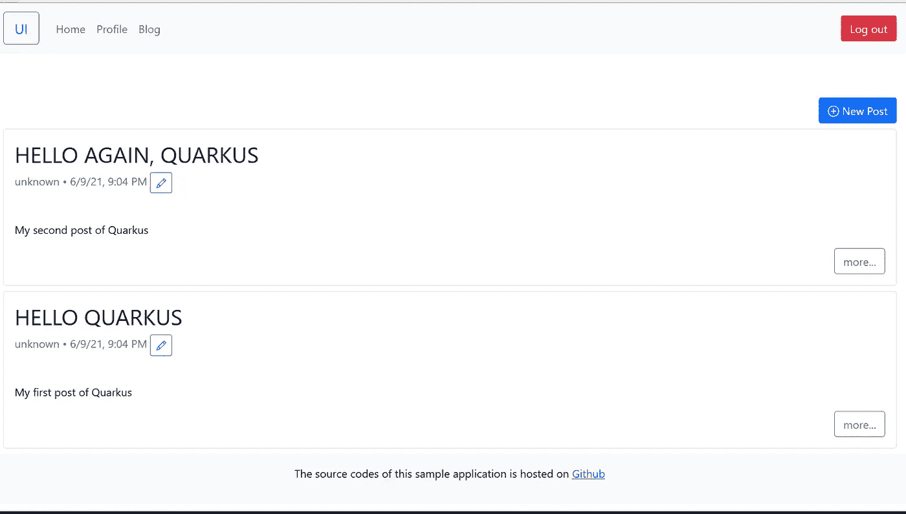

# 用夸库斯·OIDC 和 Auth0 保护 RESTful APIs

> 原文：<https://itnext.io/secures-restful-apis-with-quarkus-oidc-and-auth0-643475a9710c?source=collection_archive---------0----------------------->

Quarkus 非常支持 OAuth 2 和 OIDC 协议。在本帖中，我们将探讨如何用夸库斯·OIDC 和 Auth0 保护 RESTful APIs。


[谭曼玲](https://unsplash.com/@linglivestolaugh?utm_source=unsplash&utm_medium=referral&utm_content=creditCopyText)在 [Unsplash](https://unsplash.com/?utm_source=unsplash&utm_medium=referral&utm_content=creditCopyText) 上拍照

[Quarkus](https://www.quarkus.io) 是众所周知的*超音速亚原子 Java 框架*来构建 Kubernetes 友好的云原生应用。在之前的文章[中，我们已经讨论了如何用 Spring Security 和 Auth0 保护 RESTful APIs，我们将用 Quarkus OIDC 扩展实现相同的功能。](/secures-rest-apis-with-spring-security-5-and-auth0-41d579ca1e27)

进入 [Quarkus 开始编码](https://code.quarkus.io/)页面，确保已经添加了这些扩展: *oidc* ， *resteasy* ， *resteasy-jackson* ， *hibernate-validator* ， *hibernate-orm-panache* ， *jdbc-postgresql* 。然后像往常一样生成一个我们在[前帖](/building-graphql-apis-with-quarkus-dbbf23f897df)中做过的项目骨架。将源代码导入您的 IDE。

打开项目 *pom.xml* 文件你应该会看到下面的依赖项。添加一个额外的 Lombok 依赖项来清理 POJOs。

```
<dependency>
    <groupId>io.quarkus</groupId>
    <artifactId>quarkus-oidc</artifactId>
</dependency>
<dependency>
    <groupId>io.quarkus</groupId>
    <artifactId>quarkus-resteasy</artifactId>
</dependency>
<dependency>
    <groupId>io.quarkus</groupId>
    <artifactId>quarkus-resteasy-jackson</artifactId>
</dependency>
<dependency>
    <groupId>io.quarkus</groupId>
    <artifactId>quarkus-hibernate-validator</artifactId>
</dependency>
<dependency>
    <groupId>io.quarkus</groupId>
    <artifactId>quarkus-hibernate-orm-panache</artifactId>
</dependency>
<dependency>
    <groupId>io.quarkus</groupId>
    <artifactId>quarkus-jdbc-postgresql</artifactId>
</dependency><dependency>
    <groupId>io.quarkus</groupId>
    <artifactId>quarkus-arc</artifactId>
</dependency><!-- Erase getters and setters -->
<dependency>
    <groupId>org.projectlombok</groupId>
    <artifactId>lombok</artifactId>
    <version>1.18.20</version>
    <optional>true</optional>
</dependency>
```

在这篇文章中，我们将关注如何整合夸库斯·OIDC 和 Auth0。我们不打算解释 RESTful APIs 的开发进度，源代码的细节与我们在[我的 Quarkus 简介](https://hantsy.medium.com/kickstart-your-first-quarkus-application-cde54f469973)中讨论过的非常相似。在进入下一步之前，请从我的 github 查看一份[这篇文章的源代码，并亲自探索一下。](https://github.com/hantsy/quarkus-auth0-sample)

与 Spring Security 不同，Quarkus Security 不遵循命名规则(`resourceserver`、`client`和`authorizationserver`等)。)对配置属性进行分类。Quarkus 将 OAuth2/OIDC 配置属性绑定到功能名称(如`quarkus.oidc.xxx`、`quarkus.oidc-flow.xxx`等)，当你第一次来到 Quarkus 世界时，会感到困惑。

大多数官方 Quarkus OAuth2 和 OIDC 示例和指南都依赖于 Redhat 的开源 OAuth2/OIDC 兼容授权服务器。如果您非常了解 OAuth2/OIDC 协议，那么转向 Auth0 并不困难。

为了让夸克鲁斯·OIDC 与 Auth0 一起工作，在*应用程序中添加以下配置。*

```
# Oidc auth config for resource server
quarkus.oidc.client-id=backend-api
quarkus.oidc.auth-server-url=https://dev-ese8241b.us.auth0.com/
quarkus.oidc.token.audience=https://hantsy.github.io/api
#quarkus.oidc.application-type=service
```

默认*quar kus . oidc . application-type*为 *service* ，用于标识应用类型， *service* 相当于 Spring Security 中的 *resourceserver* 。

> *注意:* quarkus.oidc.client-id *必须提供，尽管这不是 OAuth2* client *角色。*

当解析 JWT 令牌时，如果授权服务器支持 OIDC 配置协议，夸尔库斯·OIDC 也可以从基本的 *auth-server-url* 值中自动发现 *jwt 集合 url* 。

当提供了一个令牌受众时，Quarkus 会自动验证它。您也可以自己验证 JWT 令牌中的受众或其他项目。

```
//@Provider
public class AudienceValidator implements ContainerRequestFilter { @Inject
    OidcConfigurationMetadata configMetadata; @Inject
    JsonWebToken jwt; @Inject
    SecurityIdentity identity; public void filter(ContainerRequestContext requestContext) {
        String aud = configMetadata.get("audience");//.replace("{tenant-id}", identity.getAttribute("tenant-id"));
        if (!jwt.getAudience().contains(aud)) {
            requestContext.abortWith(Response.status(401).build());
        }
    }
}
```

在上面的例子中，`OidcConfigurationMetadata`是这个应用程序的 OIDC 配置属性。`JsonWebToken`是被解析的令牌声明。`SecurityIdenity`是一个通用的安全上下文对象，用于封装用户主体和角色，类似于 JaxRS、EJB 等公司的传统 Jakarta EE `SecurityContext` API。

为了保护 API 并使一些 API 只对认证用户可用，Quarkus Security 提供了一个`@Authenticated`注释。以下是对`PostResource`的修改版本，其中我们在所有*写*操作上添加了`@Authenticated`注释以保护资源。

```
@Path("/posts")
@RequestScoped
public class PostResource {
    private final static Logger LOGGER = Logger.getLogger(PostResource.class.getName()); private final PostRepository posts; @Context
    UriInfo uriInfo; @Inject
    public PostResource(PostRepository posts) {
        this.posts = posts;
    } @Path("count")
    @GET
    @Produces(MediaType.APPLICATION_JSON)
    public Response countAllPosts(@QueryParam("q") String q) {
        return ok(this.posts.countByKeyword(q)).build();
    } @GET
    @Produces(MediaType.APPLICATION_JSON)
    public Response getAllPosts(
            @QueryParam("q") String q,
            @QueryParam("offset") @DefaultValue("0") int offset,
            @QueryParam("limit") @DefaultValue("10") int limit ) {
        return ok(this.posts.findByKeyword(q, offset, limit)).build();
    } @POST
    @Consumes(MediaType.APPLICATION_JSON)
    @Authenticated
    public Response savePost(@Valid CreatePostCommand post) {
        Post saved = this.posts.save(Post.builder().title(post.title()).content(post.content()).build());
        return created(
                uriInfo.getBaseUriBuilder()
                        .path("/posts/{id}")
                        .build(saved.getId())
        ).build();
    } @Path("{id}")
    @GET
    @Produces(MediaType.APPLICATION_JSON)
    public Response getPostById(@PathParam("id") final Long id) {
        return this.posts.findByIdOptional(id)
                .map(post -> ok(post).build())
                .orElse(status(NOT_FOUND).build());
    } @Path("{id}")
    @PUT
    @Consumes(MediaType.APPLICATION_JSON)
    @Authenticated
    public Response updatePost(@PathParam("id") final Long id, @Valid UpdatePostCommand post) {
        return this.posts.findByIdOptional(id)
                .map(existed -> {
                    existed.setTitle(post.title());
                    existed.setContent(post.content()); Post saved = this.posts.save(existed);
                    return noContent().build();
                })
                .orElse(status(NOT_FOUND).build());
    } @Path("{id}/status")
    @PUT
    @Consumes(MediaType.APPLICATION_JSON)
    @Authenticated
    public Response updatePostStatus(@PathParam("id") final Long id, @Valid UpdatePostStatusCommand status) {
        return this.posts.findByIdOptional(id)
                .map(existed -> {
                    existed.setStatus(status.status());
                    Post saved = this.posts.save(existed);
                    return noContent().build();
                })
                .orElse(status(NOT_FOUND).build());
    } @Path("{id}")
    @DELETE
    @Authenticated
    public Response deletePost(@PathParam("id") final Long id) {
        this.posts.deleteById(id);
        return noContent().build();
    }}
```

要手动测试应用程序，请登录 auth0 仪表板，按照我们在之前的 Spring Security 和 Auth0 integration post 的[中介绍的步骤，通过 Auth0 提供的*测试应用程序*获得一个令牌，然后使用`curl`命令或类似 Postman 的工具来访问受保护的 API。](/secures-rest-apis-with-spring-security-5-and-auth0-41d579ca1e27)

在我看来，Quarkus 测试框架没有 Spring 灵活。在 Spring 生态系统中，Spring Security 提供了测试工具来模拟单元测试中的 MVC 和 JWT 解码，不幸的是 Quarkus 没有提供这样一个简单的助手。但是有一些可能的方法来测试*服务*类型应用程序的安全性。

在 *pom.xml* 文件中添加以下依赖项。

```
<dependency>
    <groupId>io.quarkus</groupId>
    <artifactId>quarkus-test-security</artifactId>
    <scope>test</scope>
</dependency><dependency>
    <groupId>io.quarkus</groupId>
    <artifactId>quarkus-elytron-security-properties-file-deployment</artifactId>
    <scope>test</scope>
</dependency>
```

为了集中测试 Quarkus 应用程序中的业务逻辑，您可以在一个属性文件中设置嵌入式用户来替换数据库中的真实用户，并使 Http 基本身份验证能够绕过 JWT 令牌授权。

创建一个*src/test/resources/application-embedded-users . properties*文件来设置嵌入式用户并启用 *basic* auth。

```
quarkus.security.users.embedded.enabled=true
quarkus.security.users.embedded.plain-text=true
quarkus.security.users.embedded.users.alice=password
quarkus.security.users.embedded.roles.alice=user
quarkus.security.users.embedded.users.admin=password
quarkus.security.users.embedded.roles.admin=admin
quarkus.http.auth.basic=true
quarkus.oidc.enabled=false
```

创建一个`QuarkusTestProfile`来为一些特殊的目的对测试资源进行分类。

```
public class PropertiesFileEmbeddedUsersProfile implements QuarkusTestProfile {
    @Override
    public String getConfigProfile() {
        return "embedded-users";
    }
}
```

创建一个简单的测试，通过`@TestProfile`注释来应用这个测试概要。

```
@QuarkusTest
@TestHTTPEndpoint(PostResource.class)
@TestProfile(PropertiesFileEmbeddedUsersProfile.class)
public class TestSecurityLazyAuthTest {
 @Test
    public void testGetAllPostsWithoutAuth() {
        //@formatter:off
        given()
            .accept(ContentType.JSON)
        .when()
            .get("")
        .then()
            .statusCode(200);
        //@formatter:on
    } @Test
    //@TestSecurity(authorizationEnabled = false)
    public void testCreatPostsWithoutAuth() {
        //@formatter:off
        given()
            .body(Post.builder().title("test title").content("test content").build())
            .contentType(ContentType.JSON)
        .when()
            .post("")
        .then()
            .statusCode(401);
        //@formatter:on
    } @Test
    @TestSecurity(user = "alice", roles = "user")
    public void testCreatPostsWithAuth() {
        //@formatter:off
        given()
            .body(Post.builder().title("test title").content("test content").build())
            .contentType(ContentType.JSON)
        .when()
            .post("")
        .then()
            .statusCode(201);
        //@formatter:on
    }
}
```

此外，您可以生成本地 RSA 公钥/私钥对来执行 JWT 令牌验证过程。

用 OpenSSL 生成密钥。

```
openssl genrsa -out rsaPrivateKey.pem 2048
openssl rsa -pubout -in rsaPrivateKey.pem -out publicKey.pem
```

需要一个额外的步骤来生成私钥，以便将其转换成 PKCS#8 格式。

```
openssl pkcs8 -topk8 -nocrypt -inform pem -in rsaPrivateKey.pem -outform pem -out privateKey.pem
```

创建一个`TestProfile`类来设置使用本地公钥来验证 JWT 令牌的属性。

```
public class InlinedPublicKeyProfile implements QuarkusTestProfile {
    @Override
    public Map<String, String> getConfigOverrides() {
        return Map.of(
                "quarkus.oidc.client-id", "test",
                "quarkus.oidc.public-key", "MIIBIjANBgkqhkiG9w0BAQEFAAOCAQ8AMIIBCgKCAQEAzcAl1DgYnAkpYelL4lxl" +
                        "csdX0dHj92g+pMyjzWE3nzSV8i726lTJtg5kxaJyv8epEOAiMcelFk0v+9HMOPla" +
                        "6/pgkEHE5PPyaHlgegDIzge2RQLidDwl8IWBksUkfDWjQk+JfrEPJxrES4OXUOyp" +
                        "mO/XsNIGcbZfopi1Ook7XIjBPohuiHBcp8Fw1NVzaP7EvyYzxcxoIpa4Y/knF1Sa" +
                        "FIBuMmA/lE7PHKlBqcsS1EXkyI1TBGcdH+VWhUvsDVehKSlZoUCE6XrWY3M/xzyb" +
                        "gN+C9KPln+fQZ42Fnqo6PpD++NWRo8vgWxsMsqb+nltEQADfd8CFEuLt1BvObh8N" +
                        "fQIDAQAB",
                "quarkus.oidc.token.audience", "https://service.example.com",
                "smallrye.jwt.sign.key-location", "privateKey.jwk"
        );
    }}
```

现在编写一个测试来验证它。`getAccessToken`使用我们在上一步中生成的私钥生成一个令牌。

```
@QuarkusTest
@TestProfile(InlinedPublicKeyProfile.class)
public class InlinedPublicKeyAuthorizationTest { @Test
    public void testBearerToken() {
        //@formatter:off
        given()
            .auth().oauth2(getAccessToken("alice", Set.of("user")))
            .body(new CreatePostCommand("test title", "test content"))
            .contentType(ContentType.JSON)
        .when()
            .post("/posts")
        .then()
            .statusCode(201);
        //@formatter:on
    } //
    private String getAccessToken(String userName, Set<String> groups) {
        return Jwt.preferredUserName(userName)
                .claim("scope", "write:posts")
                .groups(groups)
                .issuer("https://server.example.com")
                .audience("https://service.example.com")
                .jws()
                .keyId("1")
                .sign("privateKey.jwk");
    }
}
```

如您所见，我们在测试中使用了定制的私有/公共密钥对，通过 jwk set url 从远程授权服务器获取公共密钥。

让我们把所有这些放在一起，运行应用程序。

从 github 获取[源代码](https://github.com/hantsy/quarkus-auth0-sample)。

启动应用程序。

```
docker compose up postgresql
mvn clean quarkus:dev
```

从[hantsy/spring-security-auth0-sample](https://github.com/hantsy/spring-security-auth0-sample/tree/master/ui)中复制 ui 代码，我们已经在[中将 auth 0 集成到您的 Angular 应用](/integrating-auth0-into-your-angular-applications-42fabef31f3e)中。这是一个用 Angular 12 编写的 SPA 应用程序。

```
npm install
npm run start
```

打开浏览器并导航至 [http://localhost:4200](http://localhost:4200) 。登录并点击*博客*菜单项，你会看到来自后端 *API* 应用的数据。

