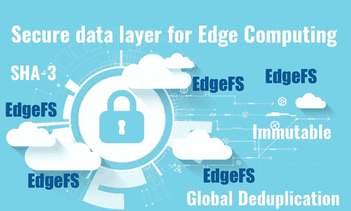
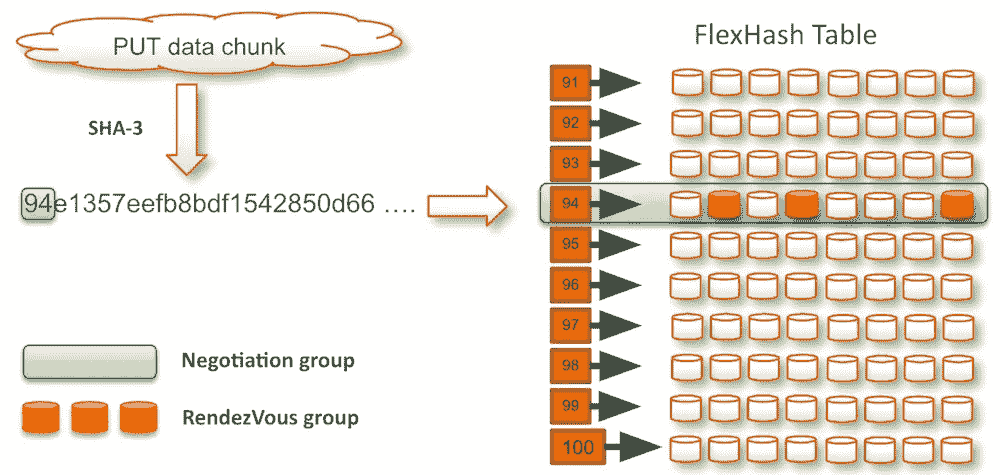
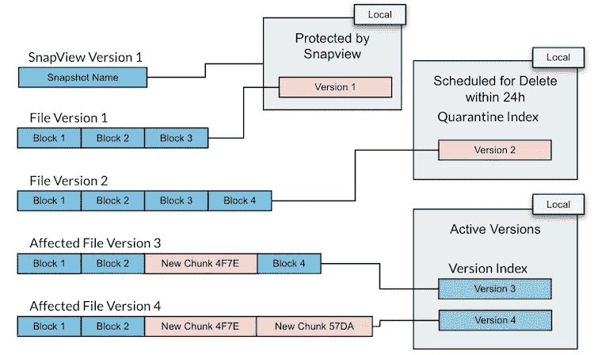
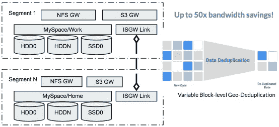

# 使用 EdgeFS 保护边缘并消除重复

> 原文：<https://itnext.io/securing-and-deduplicating-the-edge-with-edgefs-d5668907dd36?source=collection_archive---------3----------------------->

## 数据安全性是边缘/雾计算增长的主要挑战。了解如何克服引入现代分散数据层 EdgeFS 带来的问题。

我们一直在阐述边缘/雾计算转型，论证了由于带宽消耗减少而带来的显著成本节约、由于对物理世界中的事件的必要反应时间缩短而带来的分析效率提高、由于不依赖 WAN(广域网)而实现的最大正常运行时间(像蜂窝网络可能不如有线网络可靠)以及安全性提高。

在安全性方面，好处来自于保护靠近数据源的资产，这些资产从未打算连接到更广泛的网络，更不用说互联网了。

然而，随着应用程序、数据和计算服务被从集中位置推开，数据碎片必须在越来越多的分布式网络上复制。考虑到这一点，数据安全性仍然是边缘/雾计算增长的主要挑战。

为了应对这些挑战，我们需要概念上全新的分散式数据分发和访问层，这些层在设计时考虑了边缘/雾安全性。

让我们比较两种开源的分散存储层设计，从数据安全的角度来看，它们可能符合需求列表:EdgeFS ( [http://edgefs.io](http://edgefs.io) ，Apache 许可)和 IPFS(星际文件系统 [https://ipfs.io](https://ipfs.io) ，MIT 许可)。

当我们设计 EdgeFS 时，数据安全性是我们的首要任务。在 EdgeFS 中，一旦被记录，任何给定块中的数据都不能被追溯性地更改，因为这将使类似区块链的 n 元树中的先前块中的所有 SHA-3 散列无效，并打破分散位置之间达成的共识。IPFS 也是如此。

> EdgeFS 构建在具有不可变的自验证位置无关元数据的架构上，该元数据引用自验证位置无关有效负载。

虽然这两种存储解决方案对有效负载块的处理非常相似，但在如何命名和查找对象方面的差异却是尽可能的不同。IPFS 主要是为点对点分类账加密交易而设计的，而 EdgeFS 没有做出这样的假设，而是专注于 extream 高性能，用于多对多的本地或远程内容寻址网络操作。

**不可变的有效载荷块**
将数据块放置到 IPFS 的最终结果是，使用强密码散列来识别和验证该数据块，并且该密码散列可用于找到该数据块以进行检索。这与 EdgeFS 非常相似，但也有一些不同之处:

*   IPFS 接受这个块，然后生成它的加密散列。EdgeFS 客户端(通过 CCOW 的“写时云复制”网关库 API)在请求上传之前对数据块进行加密哈希处理。这可以避免传输重复的有效负载区块，也称为线内重复数据消除
*   IPFS 路由是一种一致的哈希解决方案。相反，EdgeFS 将 I/O 请求路由到一个目标组，然后在该组内进行快速协商，以找到并动态地将新块放在负担最小的目标上。这提高了存储设备的容量平衡和利用率，也称为动态数据放置。

EdgeFS FlexHash 表是一个本地站点构造。它会被自动发现并驻留在本地站点的服务器内存中。FlexHash 负责 I/O 路由，在动态负载平衡逻辑中起着重要的作用。根据发现的站点拓扑，它定义了所谓的协商目标组，这些目标组通常由 8 到 24 个分区存储设备组成，以确保正确的故障域分布。

**元数据理念的差异**
IPFS 命名系统仍在发展中，有例子表明 IPFS 使用一种非常不同的方法来发布可通过名称访问的内容。

IPFS 接受原子对象的加密散列，并将这些引用嵌入到其他命名对象中，这些命名对象基本上起目录的作用。
这些目录对象中的每一个也是不可变的，引用特定的冻结时间内容。目录对象本身有一个加密散列，可以在更高层的目录中引用它。最后，发布一个“根”目录，然后通过一个可变名称到目录对象的映射指向它。我怀疑这种设计受到了为加密货币分类账算法提供高度安全的持久层的必要性的严重影响，而牺牲了一般的存储灵活性和性能。

EdgeFS 采用了一种不同的方法，其目标是为版本化内容启用共享数据存储库，该存储库可以由数千名租户批准的用户同时访问和更新，并支持跨站点一致性组。

在 EdgeFS 中，支持通过名称或其他搜索标准查找存储对象的信息，总是作为元数据与有效负载分开记录。它将存储的有效负载视为不透明的 blobs，磁盘上的组织不需要在块本身中查找引用，因此允许客户端驱动的端到端加密。即，它假定所有有效载荷都被加密，并且从不试图分析它。可变的元数据信息始终存储在本地(本地站点集群)，因此支持始终本地、立即一致的 I/O 策略，而不会牺牲灵活性或性能。

**不可变版本元数据**
根据定义，关于一个对象的特定版本的大多数元数据必须是不可变的。某些元数据可以独立于版本内容，例如控制对象版本保留的元数据、本地站点复制覆盖、ACL 等。

IPFS 的一个优点是，当可变命名引用指向新版本时，它不会改变目录对象的存储。这与 EdgeFS 处理可变命名引用的方式非常相似，在我看来，这远比创建显式版本化名称更可取。在 EdgeFS 中，可变命名总是被认为是本地的，并在远程站点到站点的传输中被“重新水合”。这使得跨地理位置的传输始终保持全局不变，从而实现全局复制，非常有效地避免不必要的网络传输，也称为广域网上的线内重复数据消除。

# 摘要

版本化内容存储需要现代元数据存储子系统的许多其他功能，而 IPFS 似乎还没有解决这些功能:

*   能够快速找到任何给定文件夹/目录中的名称
*   可预测的目录或存储桶搜索时间
*   租户对租户元数据的访问和修改的控制
*   元数据驱动的引用有效负载的保留。

虽然我承认 IPFS 的主要和最初目标不是服务于边缘/雾计算用例，但它的安全性和全球可扩展性优势确实符合这一特征。也许有一天它会赶上其余的需求。但是为什么要等呢？EdgeFS 现已推出，它符合边缘/雾计算的最重要要求——数据安全性、成本降低和性能。

EdgeFS 利用本地可用的站点资源，并将它们呈现为高可用性集群段，该集群段是地理上分散的数据层的一部分。由于其不可变的数据结构设计、通过基于 UDP 的低延迟协议实现的动态数据放置、内置多协议存储网关(S3、NoSQL DB、NFS、iSCSI 等)以及高度可扩展的无共享架构，实现了出色的本地站点性能特征，可以成为专为边缘/雾计算时代设计的应用的真正推动者。

今天就试试吧！启动我们的 [GitHub 库](https://github.com/Nexenta/edgefs)，让我知道你的想法？

加入我们不断发展的社区，了解更多信息，网址为 [http://edgefs.io](http://edgefs.io/) 和 [http://rook.io](http://rook.io/)