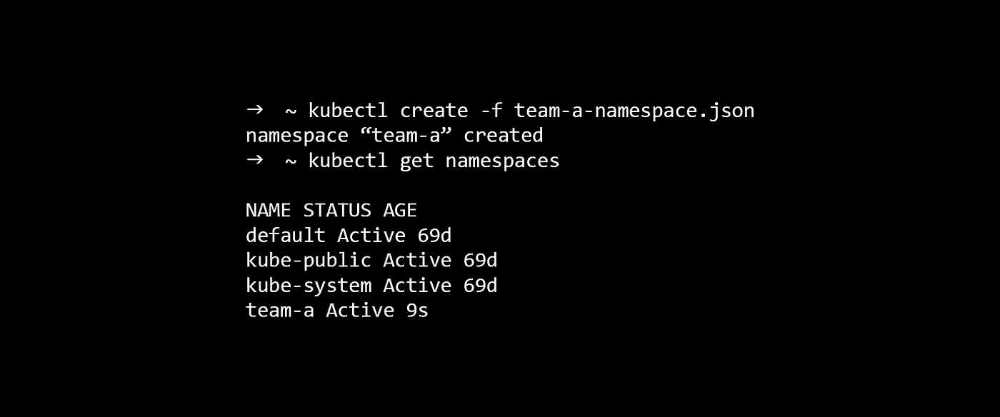

# 保护 Kubernetes 集群访问。

> 原文：<https://itnext.io/securing-kubernetes-cluster-access-3f0ea15428fa?source=collection_archive---------1----------------------->



在一个不断发展的世界中，团队能够完全拥有自己的服务已经成为一种规范。从最初的规划到开发和最终的部署。将代码扔向你从未见过面或只与之发生过争执的运营团队的日子已经一去不复返了，欢迎来到未来。

在 [Turnitin](http://www.turnitin.com) 我们开始在部署中充分利用 Kubernetes 的力量。我们有大量的团队致力于与 LMSs (Moodle、Blackboard、Canvas 等)的集成。)，到我们用于原创匹配的强大服务，所有这些都必须放在某个地方，并以这样的方式放置，以便负责服务的团队能够管理他们的部署。

# **输入名称空间**

我们将使用 [minikube](https://kubernetes.io/docs/getting-started-guides/minikube/) 来利用名称空间的力量，让我们来看看默认情况下提供了什么。

```
➜ ~ kubectl get namespaces
NAME STATUS AGE
default Active 69d
kube-public Active 69d
kube-system Active 69d
```

这很好，但是我们的团队需要他们自己的名称空间，我们可以使用`kubectl`创建名称空间！查看这个[要点](https://gist.github.com/DominicGunn/6af344f949333cbb90b32b3701833c87)以获得对 **team-a** 的名称空间的描述。让我们利用这一点为团队建立一个区域。

它包含了一些关于我们将要创建的名称空间的信息，最重要的是名称！

```
➜ ~ kubectl create -f team-a-namespace.json
namespace “team-a” created➜ ~ kubectl get namespaces
NAME STATUS AGE
default Active 69d
kube-public Active 69d
kube-system Active 69d
team-a Active 9s
```

在创建名称空间时，可以定义各种超级棒的策略，您可能有兴趣看一下涉及[资源配额](https://kubernetes.io/docs/concepts/policy/resource-quotas/)的策略。

# **处理部署**

如果团队不能在名称空间中放置任何东西，那么这个名称空间就没有用。我们不想让每个团队都超级访问集群，所以我们应该创建一个服务帐户，该帐户有权为他们管理名称空间。

Kubernetes 有各种各样的授权机制，但我们将要关注的是 [RBAC](https://kubernetes.io/docs/admin/authorization/rbac/) ，具体来说就是[角色](https://kubernetes.io/docs/admin/authorization/rbac/#role-examples)T6 和[角色绑定](https://kubernetes.io/docs/admin/authorization/rbac/#rolebinding-and-clusterrolebinding) ' [s](https://kubernetes.io/docs/admin/authorization/rbac/#rolebinding-and-clusterrolebinding)'s) 。

**创建服务账户**

创建服务帐户是一个简单的过程，为了做到这一点，我们需要定义帐户的名称，并定义它将存在的名称空间，要点是这里的，但它足够小，我们可以看一看。

```
apiVersion: v1
kind: ServiceAccount
metadata:
 name: team-a-service-account
 namespace: team-a
```

超级简单，让`kubectl`为我们创建它。

```
➜ ~ kubectl create -f team-a-service-account.yaml
serviceaccount “team-a-service-account” created
```

**创建角色**

我们有一个服务帐户，但它还不能做任何事情，我们需要给它一个角色。[文档](https://kubernetes.io/docs/admin/authorization/rbac/#role-examples)非常棒，所以我建议你阅读一下，为了这个团队，一个服务帐户，创建和更新部署和服务的权限将满足团队的需求。

这个角色的定义可以在这里的要点[中找到，看起来是这样的](https://gist.github.com/DominicGunn/ca57b205930039224d05bb227d5ef3fc)

```
kind: Role
apiVersion: rbac.authorization.k8s.io/v1beta1
metadata:
 namespace: team-a
 name: team-a-deploy-role
rules:
- apiGroups: [“extensions”, “apps”]
 resources: [“deployments”]
 verbs: [“get”, “create”, “update”, “patch”]
- apiGroups: [“”]
 resources: [“services”]
 verbs: [“get”, “create”, “update”, “patch”]
```

同样没什么大不了的，我们已经为这个角色定义了几个明确的规则，完全符合我们团队的需要。我们可以根据需要添加更多，但这符合我们当前团队的需求，重要的是，我们还调用了该角色适用的名称空间。用`kubectl`来套用一下吧

```
➜ ~ kubectl create -f team-a-deploy-role.yaml
role “team-a-deploy-role” created
```

**创建角色角色绑定**

我们就快完成了，现在我们只需要将角色绑定到我们创建的服务帐户，同样，如果您正在努力理解任何概念，那么[文档](https://kubernetes.io/docs/admin/authorization/rbac/#default-roles-and-role-bindings)是一个很好的资源。让我们来看看[和](https://gist.github.com/DominicGunn/21fdc919b2fd55ef8acf0f2cc0ad86bf)。

```
kind: RoleBinding
apiVersion: rbac.authorization.k8s.io/v1beta1
metadata:
 name: team-a-binding
 namespace: team-a
subjects:
- kind: ServiceAccount
 name: team-a-service-account
 namespace: team-a
roleRef:
 kind: Role
 name: team-a-deploy-role
 apiGroup: rbac.authorization.k8s.io
```

这里发生了什么？正在创建一个名为 **team-a-binding** 的新角色绑定，我们将它绑定到 subject**team-a-service-account**并引用我们创建的角色 **team-a-deploy-role** ，所有这些都发生在 **team-a** 名称空间内。让`kubectl`为我们运行这个。

```
➜ ~ kubectl create -f team-a-role-binding.yaml
rolebinding “team-a-binding” created
```

# **共享凭证**

太好了，我们有了一个服务帐户，它能够执行团队请求的部署，但现在我们实际上需要与 **team-a** 共享凭据，我们该如何做呢？

在我们创建服务帐户之后，Kubernetes 为我们创建了一堆东西，包括一个包含帐户 CA 和 token 的秘密。让我们看一下资源。

```
➜ ~ kubectl get sa team-a-service-account — namespace team-a -o json
{
 “apiVersion”: “v1”,
 “kind”: “ServiceAccount”,
 “metadata”: {
 “creationTimestamp”: “2018–05–20T15:59:38Z”,
 “name”: “team-a-service-account”,
 “namespace”: “team-a”,
 “resourceVersion”: “18409”,
 “selfLink”: “/api/v1/namespaces/team-a/serviceaccounts/team-a-service-account”,
 “uid”: “cc52ba75–5c46–11e8–9562–080027247075”
 },
 “secrets”: [
 {
 “name”: “team-a-service-account-token-lf4k7”
 }
 ]
}
```

我们可以看到已经为我们创建了一个名为**team-a-service-account-token-lf4k 7**的秘密资源，我们将使用它来获取一些信息，并与团队分享。

接下来的一些步骤将包括一个名为`jq`的伟大工具，如果你以前没有用过它，我建议你安装它并看看[文档](https://stedolan.github.io/jq/)，它是一个使用 JSON 的伟大工具！

**抓取证书权限**

我们创建服务帐户的方式意味着我们使用 CA 和令牌对群集进行身份验证，我们可以使用`kubectl`获取 CA 并将其放入证书文件中！

```
➜ ~ kubectl get secret team-a-service-account-token-lf4k7 — namespace team-a -o json | jq -r ‘.data[“ca.crt”]’ > team-a.crt➜ ~ cat team-a.crt
ZXlKaGJHY2lPaUpTVXpJMU5pSXNJbXRwWkNJ….
```

**抓取用户令牌**

除了 CA 之外，我们还需要用于针对 Kubernetes API 进行身份验证的无记名令牌，我们可以以非常相似的方式获取它。

```
➜ ~ kubectl get secret team-a-service-account-token-lf4k7 — namespace team-a -o json | jq -r ‘.data[“token”]’ > team-a.token➜ ~ cat team-a.token
ZXlKaGJHY2lPaUpTVXpJMU5pSXNJbXRwWkNJ….
```

# **与库伯内特交谈**

作为 Kubernetes 管理员，我们的工作现在已经完成，我们可以将证书和令牌传递给需要它们的团队，并用它们来擦手，但是作为团队，我们现在如何与集群对话呢？

首先，我们使用`kubectl`获得的证书是 base64 编码的，在我们继续之前，我们需要确定这一点。

```
➜ ~ base64 — decode -i team-a.crt > team-a-decoded.crt
```

很好，现在让我们使用`kubectl`来设置我们的本地配置，以便我们可以与集群对话。

```
➜ ~ kubectl config set-cluster minikube — embed-certs=true — server=[https://192.168.99.100:8443](https://192.168.99.100:8443) — certificate-authority=team-a-decoded.crt
Cluster “minikube” set.➜ ~ kubectl config set-credentials team-a-service-account — token=ZXlKaGJHY2lPaUpTVXpJMU5pSXNJbXRwWkNJ….
User “team-a-service-account” set.➜ ~ kubectl config set-context team-a-context — cluster=minikube — user=team-a-service-account — namespace=team-a
Context “team-a-context” created.➜ ~ kubectl config use-context team-a-context
Switched to context “team-a-context”.
```

几个细节，服务器`[https://192.168.99.100:8443](https://192.168.99.100:8443`)`是我们的 Minikube 集群的地址，这可能对你来说是不同的，在现实生活中肯定是不同的，你的 Kubernetes 管理员应该能够提供给你。

如果您是集群管理员，并且不确定主服务器在哪里运行，您可以使用`cluster-info`轻松找到它

```
➜ kubectl cluster-info
Kubernetes master is running at [https://192.168.99.100:8443](https://192.168.99.100:8443)
```

# **乡亲们都到了**

没有太多太多了。在真实的场景中，您可能有几个脚本来自动完成一些设置，并且您授予您的角色的规则可能在这里或那里有点严格，但是这应该有助于您立即投入使用！

在我的博客上阅读这篇文章和更多内容，[https://寓言. sh](https://fable.sh) ！