# 使用 JSON Web 令牌(JWT)和 Auth0 对 Kubernetes 进行 Istio 最终用户身份验证

> 原文：<https://itnext.io/securing-kubernetes-withistio-end-user-authentication-using-json-web-tokens-jwt-97f4bb8e71c6?source=collection_archive---------0----------------------->

在最近的帖子[用融合云、MongoDB Atlas、Istio 和 Google Kubernetes 引擎](https://medium.com/@GaryStafford/building-a-microservices-platform-with-confluent-cloud-mongodb-atlas-istio-and-google-c2279526ea84)构建微服务平台中，我们在 Google 云平台上用 [Istio](https://cloud.google.com/istio/docs/istio-on-gke/overview) 1.0.x 构建并部署了一个基于微服务的云原生 API 给 Google Kubernetes 引擎。为了简洁起见，我们有意省略了操作和保护 API 所需的一些关键特性。这些缺失的特性包括 HTTPS、用户认证、请求配额、请求节流，以及一个完整生命周期 API 管理工具的集成，比如 Google [Apigee](https://apigee.com/api-management/#/homepage) 。

在后续的文章[用 HTTPS 保护您的 Istio 入口网关](https://medium.com/@GaryStafford/securing-your-istio-ingress-gateway-with-https-8c59972cb5d7)中，我们禁用了对运行在 GKE 集群上的 API 的 HTTP 访问。然后，我们使用 HTTPS 启用了客户端和 GKE 集群之间的双向通信加密。

在本文中，我们将通过使用基于 JSON Web 令牌的凭证启用 [Istio 最终用户身份验证](https://istio.io/help/ops/security/end-user-auth/)，进一步增强店面演示 API 的安全性。使用 JSON Web Tokens (JWT)，发音为'*jot【T11]'，将允许 Istio 对调用店面演示 API 的最终用户进行身份验证。作为基于 OAuth 2.0 令牌的授权流程的一部分，我们将使用认证即服务提供商 [Auth0](https://auth0.com/) 为注册的店面演示 API 消费者生成 JWT 令牌，并验证来自 Istio 的 JWT 令牌。*

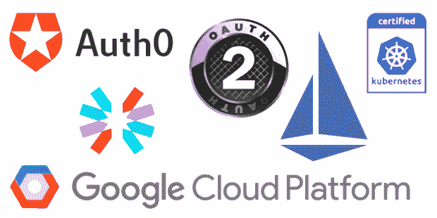

# JSON Web 令牌

根据 Auth0 的说法，基于令牌的身份验证的工作原理是，确保向服务器发出的每个请求都附有一个签名令牌，服务器验证该令牌的真实性，然后才响应请求。根据 [JWT.io](https://jwt.io/introduction/) 的说法，JWT 是一个开放标准( [RFC 7519](https://tools.ietf.org/html/rfc7519) )，它以 JSON 对象的形式定义了一种在各方之间安全传输信息的紧凑且独立的方式。该信息可以被验证和信任，因为它是数字签名的。其他常见的令牌类型包括简单 Web 令牌(SWT)和安全声明标记语言令牌(SAML)。

jwt 可以使用基于[哈希的消息认证码](https://en.wikipedia.org/wiki/HMAC) (HMAC)算法的秘密进行签名，或者使用[Rivest–sha mir–ad leman](https://en.wikipedia.org/wiki/RSA_(cryptosystem))(RSA)或[椭圆曲线数字签名算法](https://en.wikipedia.org/wiki/Elliptic_Curve_Digital_Signature_Algorithm) (ECDSA)的公钥/私钥对进行签名。授权是使用 JWT 最常见的场景。在令牌有效负载中，您可以轻松指定用户角色和权限以及用户可以访问的资源。

一个注册的 API 消费者向授权服务器发出一个初始请求，在这个请求中，他们用某种形式的凭证交换一个令牌。JWT 与一组特定的用户角色和权限相关联。每个后续请求都将包含令牌，允许用户访问该令牌允许的授权路由、服务和资源。

# Auth0

要使用 JWTs 通过 Istio 进行最终用户身份验证，我们需要一种方法来验证与特定用户相关联的凭证，并将这些凭证交换为 JWT。此外，我们需要一种方法来验证来自 Istio 的 jwt。为了满足这些要求，我们将使用 Auth0。Auth0 为 web、移动和遗留应用程序提供了一个通用的认证和授权平台。据 [G2 Crowd](https://www.g2crowd.com/categories/customer-identity-and-access-management) 报道，Auth0 在[客户身份和访问管理](https://en.wikipedia.org/wiki/Customer_Identity_Access_Management) (CIAM)软件类别的竞争对手包括 Okta、微软 Azure Active Directory (AD)和 AD B2C、Salesforce Platform: Identity、OneLogin、Idaptive、IBM Cloud Identity Service 和 Bitium。

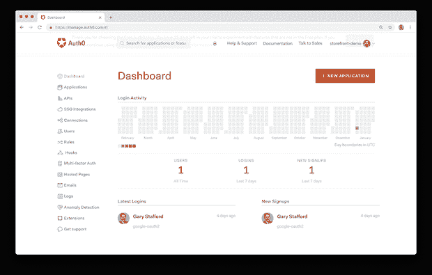

Auth0 目前提供四种定价方案:免费、开发者、开发者专业版和企业版。计划订阅按月或按年打折。对于这个演示的有限要求，你只需要使用 Auth0 的免费计划。


OAuth 2.0 协议[定义了四种流](https://auth0.com/docs/protocols/oauth2)或*授权类型*，以获取访问令牌，这取决于应用架构和最终用户的类型。我们将模拟一个需要使用店面 API 的第三方外部应用程序，使用[客户端凭证](https://oauth.net/2/grant-types/client-credentials/)授权类型。根据 [Auth0](https://auth0.com/docs/api-auth/tutorials/client-credentials) ，OAuth 2.0 授权框架 [RFC 6749 第 4.4 节](https://tools.ietf.org/html/rfc6749#section-4.4)中定义的客户端凭证授权允许应用程序使用其客户端 Id 和客户端机密请求访问令牌。它用于非交互式应用程序，如 CLI、守护程序或在您的后端上运行的服务，其中令牌颁发给应用程序本身，而不是最终用户。

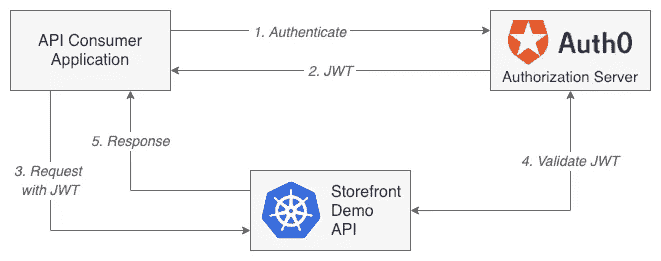

对于 Auth0，我们需要创建两种类型的实体，一个 Auth0 [API](https://auth0.com/docs/apis) 和一个 Auth0 [应用程序](https://auth0.com/docs/applications)。首先，我们定义一个 Auth0 API，它代表我们正在保护的店面 API。其次，我们定义了一个 Auth0 应用程序，它是我们 API 的消费者。应用程序与 API 相关联。这种关联允许应用程序(*API*的消费者)使用 Auth0 进行身份验证，并接收一个 JWT。注意 Auth0 和 Istio 或 Storefront API 之间没有直接集成。我们正在促进 Auth0、Istio 和使用 API 的注册终端用户应用程序之间的解耦、相互信任关系。

首先创建一个新的 Auth0 API，即“店面演示 API”。对于这个演示，我使用我的域的 URL 作为标识符。要与 Istio 一起使用，请选择 RS256(带 SHA-256 的 RSA 签名)，这是一种使用公钥/私钥对的非对称算法，与 HS256 对称算法相反。对于 RS256，Auth0 将使用相同的私钥来创建签名和验证签名。Auth0 发表了一篇关于 RS256 与 HS256 算法使用的好文章。

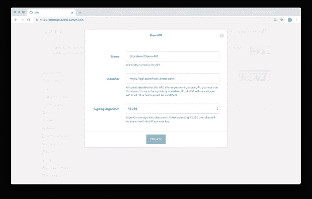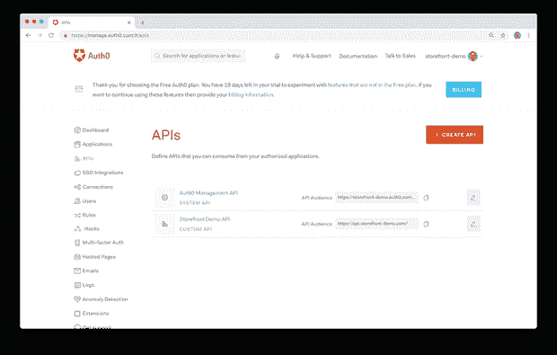

Auth0 允许通过使用作用域对 API 进行粒度访问控制。根据 [Auth0](https://auth0.com/docs/scopes/current) ，OAuth 2.0 术语中由访问令牌表示的权限被称为作用域。`scope`参数允许应用程序表达访问请求的期望范围。授权服务器还可以在响应中使用`scope`参数来指示哪些作用域被实际授予了权限。

尽管有必要为我们的 Auth0 应用程序定义和分配至少一个作用域，但我们实际上不会使用这些作用域来控制对 Storefront API 中的资源的细粒度授权。在本演示中，如果最终用户通过了身份验证，他们将被授权访问所有 Storefront API 资源。

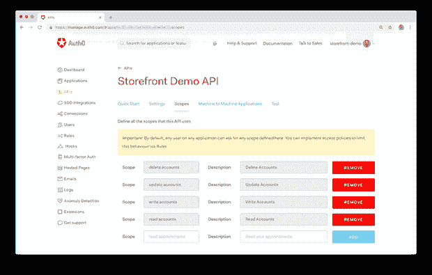

接下来，定义一个新的 Auth0 机器对机器(M2M)应用程序，“Storefront Demo API Consumer 1”。

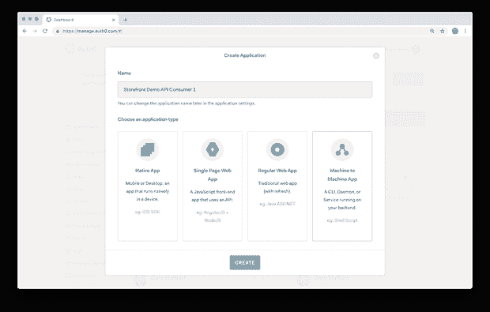

接下来，授权新的 M2M 应用程序请求访问新的店面演示 API。同样，我们没有使用作用域，但是至少需要一个作用域，否则稍后您将无法进行身份验证。

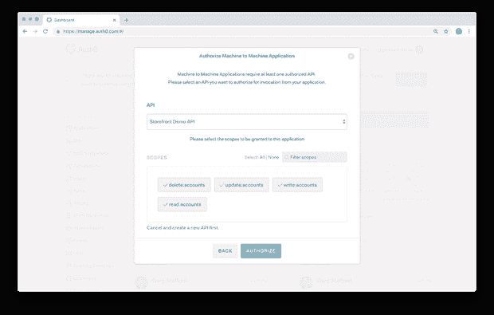

每个 M2M 应用程序都有一个唯一的客户端 ID 和客户端密码，用于向 Auth0 服务器进行身份验证并检索 JWT。

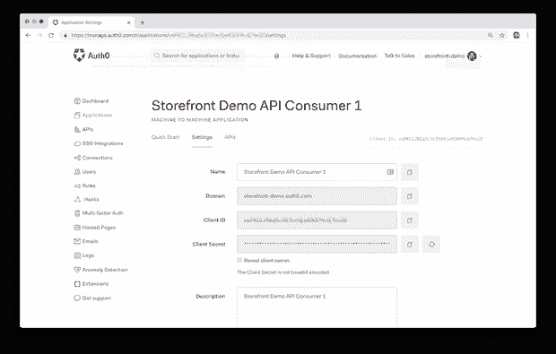

多个 M2M 应用程序可以被授权请求访问 API。

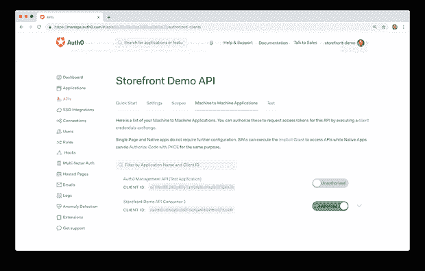

在“高级应用程序设置”的“端点”选项卡中，有一系列 OAuth URLs。为了授权我们的新 M2M 应用程序使用店面演示 API，我们需要“OAuth 授权 URL”。

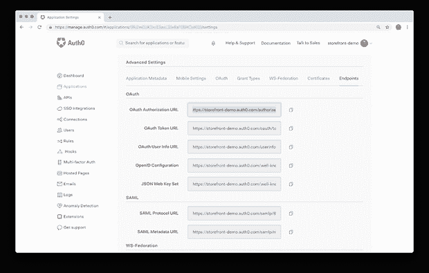

为了测试基于 Auth0 JWT 的身份验证和授权工作流，我更喜欢使用 Postman。方便的是，Auth0 提供了一个 [Postman 集合](https://auth0.com/docs/api/info)，其中包含了您需要的所有 HTTP 请求，已经构建好了。使用[客户端凭证](https://auth0.com/docs/api-auth/tutorials/client-credentials) POST 请求。`grant_type`标题值将始终为`client_credentials`。您需要提供 Auth0 应用程序的客户端 ID 和客户端秘密作为`client_id`和`client_secret`头值。`audience`头值将是您之前用来创建 Auth0 API 的 API 标识符。

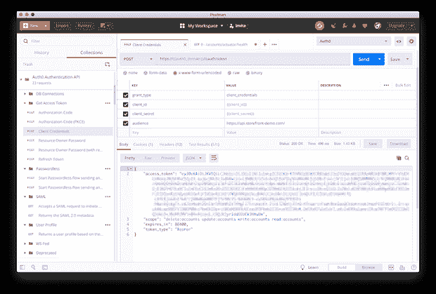

如果 HTTP 请求成功，您应该会收到一个 JWT `access_token`作为响应，这将允许我们稍后使用 Storefront API 进行身份验证。注意，用 Auth0 定义的作用域也是响应的一部分，还有令牌的 TTL。

# jwt.io 调试器

现在，使用 [jwt.io](https://jwt.io/) 调试器页面测试 JWT。如果一切正常，JWT 应该可以成功验证。

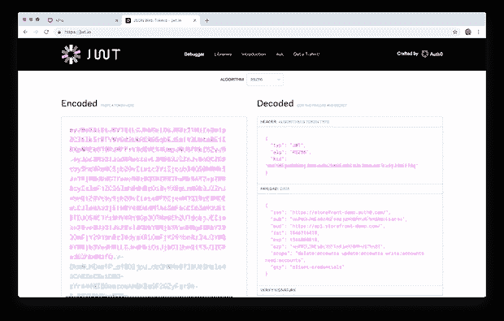

# Istio 身份验证策略

为了使用 JWT 和 Auth0 启用 Istio 最终用户身份验证，我们向现有的已部署资源集添加了一个 [Istio 策略身份验证资源](https://istio.io/docs/reference/config/istio.authentication.v1alpha1/#Policy)。对于最终用户身份验证，您有几个选择，例如:

1.  通过 Istio 入口网关全局应用于所有名称空间的所有服务；
2.  本地应用于特定名称空间(即`uat`)内的所有服务；
3.  本地应用于特定名称空间内的一个或多个服务(即`prod.accounts`)；

实际上，由于您可能有多个具有不同角色的 API 注册消费者，因此您将有多个身份验证策略应用于集群。

在这个演示中，我们将在 [Istio 入口网关](https://istio.io/docs/tasks/traffic-management/ingress/)使用 JWTs 对 Storefront API 启用全局最终用户身份验证。为了创建一个 Istio 认证策略资源，我们使用 Istio 认证 API 版本`authentication.istio.io/v1alpha1` ( [*要点*](https://gist.github.com/garystafford/2437110cfb64a16ca3cefa224fb8a3c5) )。

单个`audiences` YAML 地图值与您在之前的 Postman 请求中使用的受众头值相同，这是您之前用于创建 Auth0 Storefront 演示 API 的 API 标识符。`issuer` YAML 标量值是 Auth0 M2M 应用程序的域值，可在“Storefront Demo API Consumer 1”设置选项卡中找到。`jwksUri` YAML 标量值是 JSON Web Key Set URL 值，可以在高级应用程序设置的 Endpoints 选项卡中找到。

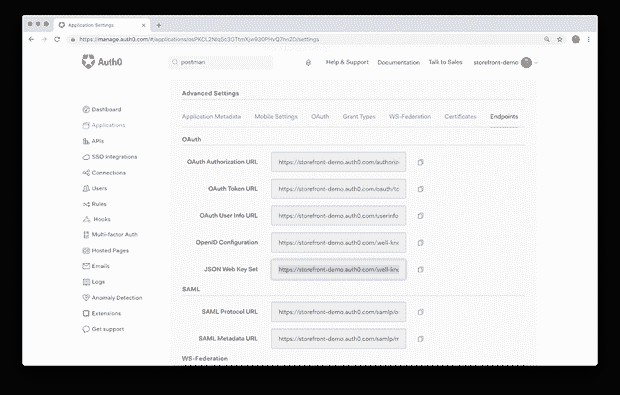

JSON Web 密钥集 URL 是一个可公开访问的端点。Istio 将访问该端点以获取用于认证 JWT 的公钥。


假设您已经将 Storefront API 部署到 GKE 集群，只需应用新的 Istio 策略。我们现在应该已经使用 JSON Web 令牌在 Istio 入口网关上启用了最终用户身份验证。

```
kubectl apply -f ./resources/other/ingressgateway-jwt-policy.yaml
```

# 细粒度认证

如果需要对资源进行更细粒度的身份验证，也可以跨名称空间对特定的一个或多个服务应用 Istio 身份验证策略。下面，我们看到一个只对`uat`名称空间应用策略的例子。当您想要控制对非生产环境中的资源的访问时，这种场景是很常见的，例如 UAT、外部测试团队或一组选定的外部 beta 测试人员。根据 [Istio](https://istio.io/docs/tasks/security/authn-policy/#namespace-wide-policy) ，要跨单个名称空间应用名称空间范围的最终用户身份验证，必须将策略命名为`default` ( [*要点*](https://gist.github.com/garystafford/9b053ccbd9eddefa6bf43515becd2eb6) )。

下面，我们看到一个更细粒度的策略示例，其范围仅限于`prod`名称空间内的`accounts`服务。当您的 API 消费者的角色只需要访问 API 的一部分时，这种情况很常见。例如，一个营销应用程序可能只需要访问`accounts`服务，而不需要访问`orders`或`fulfillment`服务( [*要点*](https://gist.github.com/garystafford/40c17e18e677d95f48041dfa00545813) )。

# 测试认证

要测试最终用户身份验证，首先，调用任何有效的 Storefront Demo API 端点，而不提供授权的 JWT。您应该会收到一个“401 未授权”HTTP 响应代码，以及响应正文中的一条`Origin authentication failed.`消息。这意味着店面演示 API 现在是不可访问的，除非 API 消费者提供一个 JWT，这可以由 Istio 成功验证。

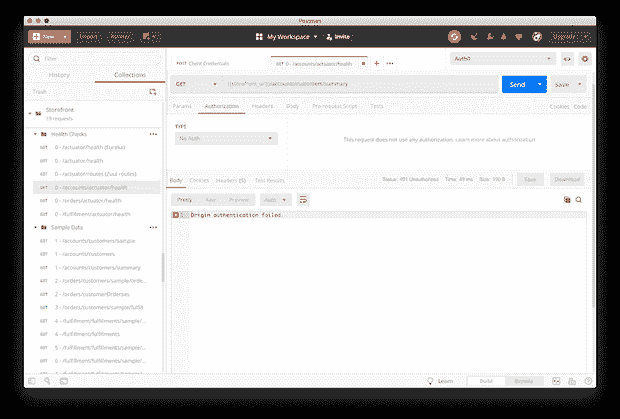

接下来，通过选择“Bearer Token”类型的身份验证方法，向 Postman 请求添加授权。复制并粘贴您之前从客户端凭证请求中收到的 JWT ( `access_token`)。这将添加一个`Authorization`请求头。在 curl 中，请求头看起来如下( [*要点*](https://gist.github.com/garystafford/38d0e46e2d6d3cfd88097669272cf5b8) )。

向邮递员提出请求。如果正确应用了 Istio 策略，请求现在应该会收到来自 Storefront API 的成功响应。成功响应表示 Istio 针对 Auth0 授权服务器成功验证了位于授权头中的 JWT。然后，Istio 允许用户“店面演示 API 消费者 1”应用程序访问所有店面 API 资源。

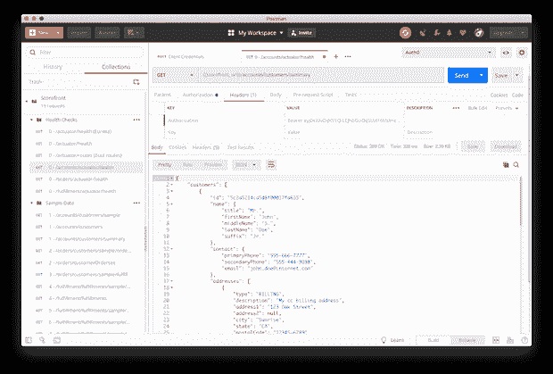

# 解决纷争

Istio 有几页关于[解决](https://istio.io/help/ops/security/end-user-auth/)认证问题的在线文档。如果您的最终用户身份验证不起作用，但 JWT 有效，首先要查找的错误之一就是 [Istio Pilot](https://istio.io/docs/concepts/traffic-management/#pilot-and-envoy) 日志。Istio 中用于流量管理的核心组件 Pilot 管理和配置特定 Istio 服务网格中部署的所有特使代理实例。Pilot 向代理分发身份验证策略，如我们新的最终用户身份验证策略，以及安全的命名信息。

下面，在 Google Stackdriver 日志中，我们看到典型的日志条目，表明飞行员无法检索 JWT 公钥(回想一下，我们使用的是 RS256 公钥/私钥对[非对称算法](https://en.wikipedia.org/wiki/Public-key_cryptography))。此特定错误是由于 Istio 策略身份验证资源 YAML 文件中的打字错误造成的。

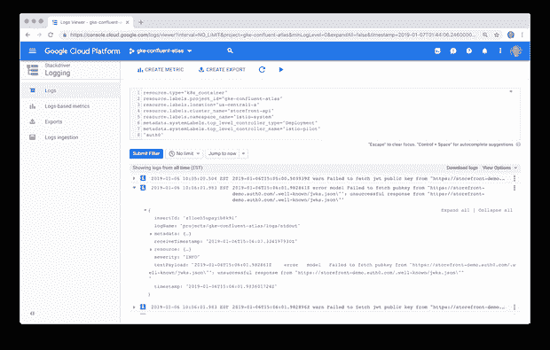

下面我们看到一个 Istio Mixer 日志条目，其中包含了对 Accounts Storefront 服务`/accounts/customers/summary`端点的 Postman 请求的详细信息。根据 [Istio](https://istio.io/docs/concepts/policies-and-telemetry/) 的说法，Mixer 是负责提供策略控制和遥测收集的 Istio 组件。注意日志条目的`textPayload`的`apiClaims`部分，对应于该请求中传递的 JWT 的有效载荷段。日志条目清楚地显示，在将请求转发到帐户服务之前，JWT 由 Istio 解码和验证。

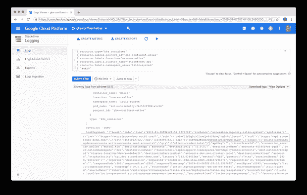

# 结论

在这篇简短的帖子中，我们将终端用户身份验证添加到了店面演示 API 中，该 API 使用 Istio 在 GKE 上运行。尽管还没有准备好投入生产，但我们已经通过 HTTPS 客户端-服务器加密和基于 JSON Web 令牌的授权保护了店面 API。下一步将是在 Storefront API GKE 集群前添加 mutual TLS(MTL)和完全托管的 API 网关，以提供[高级 API 功能](https://apigee.com/about/cp/api-management-features)，如缓存、配额和速率限制。

*本文表达的所有观点都是我个人的，不一定代表我现在或过去的雇主或他们的客户的观点。*

*原载于 2019 年 1 月 7 日*[*programmaticponderings.com*](https://programmaticponderings.com/2019/01/06/securing-kubernetes-withistio-end-user-authentication-using-json-web-tokens-jwt/)*。*