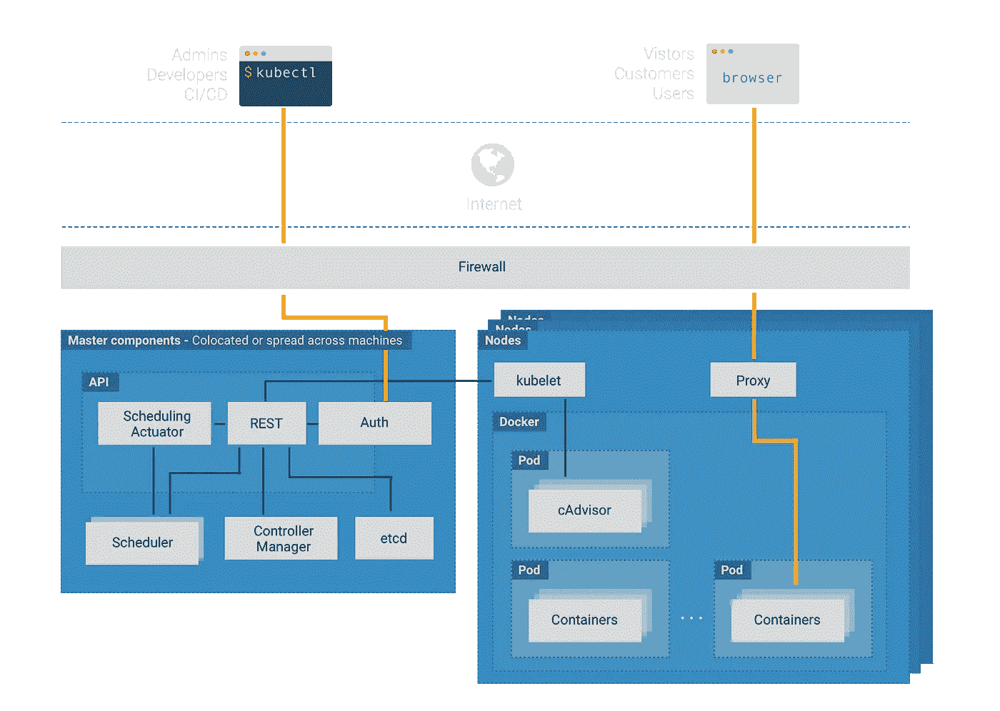
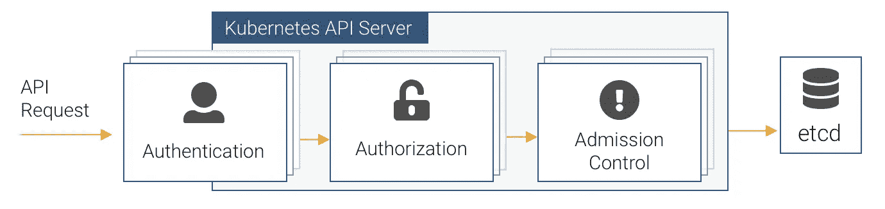

# 保护 Kubernetes 集群组件的配置

> 原文：<https://itnext.io/securing-the-configuration-of-kubernetes-cluster-components-c9004a1a32b3?source=collection_archive---------1----------------------->

在本系列 ***的[上一篇文章](https://blog.giantswarm.io/securing-the-base-infrastructure-of-a-kubernetes-cluster/)中，我们讨论了在保护部署了 Kubernetes 集群的基础设施时需要考虑的事项。这一次，我们将注意力转向星团本身。***

Kubernetes 是一个复杂的系统，上图显示了构成一个集群的许多不同的组成部分。这些组件中的每一个都需要小心保护，以保持集群的整体完整性。

在本文中，我们不可能涵盖集群级安全性的所有方面，但是我们将致力于解决更重要的主题。正如我们将在后面看到的，在 Kubernetes 集群的最佳实践安全性方面，以及用于衡量最佳实践遵守情况的工具方面，可以从更广泛的社区获得帮助。

# 集群安装程序

我们应该先简要观察一下可以用来安装集群组件的许多不同的工具。

Kubernetes 集群组件的一些默认配置参数从安全角度来看是次优的，需要正确设置以确保集群的安全。除非您选择托管的 Kubernetes 集群(如 Giant Swarm 提供的集群),其中整个集群由您管理，否则这个问题会因许多不同的集群安装工具而加剧，每种工具都会应用稍微不同的配置。虽然大多数安装程序都有合理的默认设置，但我们永远不应该认为他们会在安全方面保护我们，我们应该将确保根据我们的要求配置安装程序机制来保护群集作为我们的目标。

让我们看一下控制平面安全性的一些重要方面。

# API 服务器

API 服务器是集群内所有通信的中枢，它位于 API 服务器上，集群的大部分安全配置都应用于此。API 服务器是集群控制平面的唯一组件，能够直接与集群的状态存储进行交互。操作集群的用户、其他控制平面组件，有时还有集群工作负载，都使用服务器的基于 HTTP 的 REST API 与集群进行交互。

由于它在控制集群中的关键作用，仔细管理对 API 服务器的访问就安全性而言至关重要。如果某人或某物获得了对 API 的未经请求的访问，他们就有可能获得所有类型的敏感信息，并获得对群集本身的控制。因此，客户端对 Kubernetes API 的访问应该经过加密、认证和授权。

# 保护与 TLS 的通信

为了防止中间人攻击，应该使用 TLS 对每个客户端和 API 服务器之间的通信进行加密。为此，API 服务器需要配置一个私钥和 X.509 证书。

在 TLS 握手期间，颁发 API 服务器证书的根证书颁发机构(CA)的 X.509 证书必须可供任何需要向 API 服务器进行身份验证的客户端使用，这就引出了集群的证书颁发机构问题。正如我们马上会看到的，有许多方法可以让客户端向 API 服务器进行身份验证，其中之一就是 X.509 证书。如果采用这种客户端身份验证方法，这在大多数情况下可能是正确的(至少对于集群组件而言)，每个集群组件都应该获得自己的证书，并且建立集群范围的 PKI 功能是非常有意义的。

有许多方法可以为集群实现 PKI 功能，没有一种方法比另一种更好。它可以手动配置，也可以由您选择的安装程序配置，或者通过其他方式配置。事实上，集群可以被配置为拥有自己的内置 CA，它可以发布证书以响应通过 API 服务器提交的证书签名请求。在这里，在 Giant Swarm，我们使用一个名为 [cert-operator](https://github.com/giantswarm/cert-operator) 的运营商，与 Hashicorp 的 [Vault](https://www.vaultproject.io/) 联合使用。

当我们谈到与 API 服务器的安全通信时，一定要禁用它的不安全端口(在 Kubernetes 1.13 之前)，该端口通过普通 HTTP ( `--insecure-port=0`)为 API 提供服务！

# 认证、授权和准入控制

现在，让我们将注意力转向控制哪些客户端可以在集群中的哪些资源上执行哪些操作。我们不会在这里详细讨论，因为总的来说，这是下一篇文章的主题。重要的是，要确保控制面板的组件配置为提供底层访问控制。

当 API 请求到达 API 服务器时，它执行一系列检查来确定是否服务于该请求，如果服务于该请求，则根据定义的策略来验证或改变资源对象。执行链如上图所示。

Kubernetes 支持许多不同的身份验证方案，这些方案几乎总是在集群外部实现，包括 X.509 证书、基本身份验证、不记名令牌、用于向可信身份提供者进行身份验证的 OpenID Connect (OIDC ),等等。使用 API 服务器上的相关配置选项来启用各种方案，因此请确保为您计划使用的身份验证方案提供这些配置选项。例如，X.509 客户端证书认证需要包含一个或多个 ca 证书(`--client-ca-file`)的文件的路径。需要记住的重要一点是，默认情况下，任何未经身份验证方案验证的 API 请求都被视为匿名请求。虽然匿名请求获得的访问权限可以通过授权来限制，但是如果不需要的话，应该完全关闭它们(`--anonymous-auth=false`)。

一旦请求被认证，API 服务器就根据授权策略考虑该请求。同样，授权模式是一个配置选项(`--authorization-mode`)，至少应该从 AlwaysAllow 的缺省值进行更改。理想情况下，授权模式列表应该包括`RBAC`和`Node`，前者用于启用细粒度访问控制的 RBAC API，后者用于授权 kubelet API 请求(见下文)。

一旦 API 请求被验证和授权，资源对象就可以在被保存到集群的状态数据库之前，使用准入控制器进行验证或变异。建议[使用](https://kubernetes.io/docs/reference/access-authn-authz/admission-controllers/#is-there-a-recommended-set-of-admission-controllers-to-use)一组最少的准入控制器，并且不应该从列表中删除，除非有非常好的理由这样做。值得考虑的其他安全相关准入控制器有:

*   **DenyEscalatingExec** —如果有必要允许您的 pod 以增强的权限运行(例如，使用主机的 IPC/PID 名称空间)，该准入控制器将阻止用户在 pod 的特权容器中执行命令。
*   **PodSecurityPolicy** —为所有创建的 pod 提供应用各种安全机制的方法。我们将在本系列的下一篇文章中进一步讨论这一点，但是现在重要的是确保启用这个准入控制器，否则我们的安全策略将无法应用。
*   **NodeRestriction** —一个许可控制器，控制 kubelet 对集群资源的访问，这将在下面详细介绍。
*   **ImagePolicyWebhook** —允许外部“图像验证器”检查为 pod 容器定义的图像的漏洞，例如图像实施器。 [Image Enforcer](https://github.com/open-policy-agent/contrib/tree/master/image_enforcer) 基于[开放策略代理](https://www.openpolicyagent.org/) (OPA)，与开源漏洞扫描器 [Clair](https://github.com/coreos/clair) 协同工作。

动态准入控制是 Kubernetes 中相对较新的特性，旨在提供比静态插件准入控制机制更大的灵活性。它是通过准入 webhooks 和基于控制器的初始化器实现的，并且一旦社区解决方案达到足够成熟的水平，它对集群安全性有很大的承诺。

# 库伯莱

kubelet 是一个在集群中的每个节点上运行的代理，负责它所运行的节点上所有与 pod 相关的活动，包括启动/停止和重新启动 pod 容器，报告 pod 容器的健康状况等。在 API 服务器之后，kubelet 是安全性方面要考虑的下一个最重要的集群组件。

# 访问 Kubelet REST API

kubelet 在端口 10250 和 10255 上提供一个小的 REST API。端口 10250 是一个读/写端口，而 10255 是一个带有 API 端点子集的只读端口。

提供对端口 10250 的自由访问是危险的，因为它可能在 pod 的容器内执行任意命令，以及启动任意 pod。类似地，两个端口都提供对有关 pod 及其容器的潜在敏感信息的读取访问，这可能会使工作负载容易受到危害。

为了防止潜在的危害，应通过设置 kubelet 的配置`--read-only-port=0`来禁用只读端口。然而，端口 10250 需要可用于度量收集和其他重要功能。应该小心控制对此端口的访问，所以让我们讨论一下关键的安全配置。

# 客户端身份验证

除非经过特别配置，否则 kubelet API 对来自客户端的未经验证的请求是开放的。因此，配置一种可用的身份验证方法很重要；X.509 客户端证书或带有包含不记名令牌的授权头的请求。

在 X.509 客户端证书的情况下，CA 包的内容需要对 kubelet 可用，以便它可以在 TLS 握手期间对客户端提供的证书进行身份验证。这是 kubelet 配置的一部分(`--client-ca-file`)。

在理想情况下，唯一需要访问 kube let API 的客户机是 Kubernetes API 服务器。它需要访问 kubelet 的 API 端点来实现各种功能，比如收集日志和指标、在容器中执行命令(比如 kubectl exec)、将端口转发到容器等等。为了让 kubelet 对它进行认证，API 服务器需要配置客户机 TLS 凭证(`--kubelet-client-certificate`和`--kubelet-client-key`)。

# 匿名认证

如果您已经仔细配置了 API 服务器对 kubelet 的 API 的访问，那么您认为“任务完成”也是情有可原的。但事实并非如此，因为任何访问 kubelet 的 API 的请求，如果不尝试通过 kubelet 进行身份验证，都被视为匿名请求。默认情况下，kubelet 传递匿名请求进行授权，而不是以未经身份验证为由拒绝它们。

如果在您的环境中允许匿名 kubelet API 请求是必不可少的，那么就有了授权门，它提供了一些灵活性来决定什么可以、什么不可以由 API 提供服务。然而，通过将 kubelet 的`--anonymous-auth`配置设置为`false`，完全禁止匿名 API 请求要安全得多。通过这样的配置，API 向未授权的客户端返回一个`401 Unauthorized`响应。

# 批准

通过授权对 kubelet API 的请求，再次有可能违反默认的 Kubernetes 设置。对 kubelet API 的授权以两种模式之一运行；`AlwaysAllow`(默认)或`Webhook`。`AlwaysAllow`模式做的正是您所期望的——它将允许所有通过认证门的请求成功。这包括匿名请求。

最好的方法是使用 kubelet 的`--authorization-mode`配置选项和`webhook`值，将授权决策卸载给 Kubernetes API 服务器，而不是让它完全开放。使用这种配置，kubelet 调用`SubjectAccessReview` API(它是 API 服务器的一部分)来决定是否允许主体发出请求。

# 限制库伯勒的权力

在 Kubernetes 的旧版本(1.7 之前)中，kubelet 可以读写所有节点和 Pod API 对象，即使节点和 Pod 对象受另一个运行在不同节点上的 kubelet 的控制。他们也有读取 pod 规格中包含的所有对象的权限；Secret、ConfigMap、PersistentVolume 和 PersistentVolumeClaim 对象。换句话说，一个库伯莱人可以使用和控制许多它不负责的资源。这是非常强大的，在集群节点受损的情况下，损害可能会迅速扩大到有问题的节点之外。

# 节点授权人

出于这个原因，专门为 kubelet 引入了节点授权模式，目的是控制它对 Kubernetes API 的访问。节点授权者限制 ku elet 读取与 ku elet 相关的对象(例如，pod、节点、服务),并对 Secrets、Configmap、PersistentVolume 和 PersistentVolumeClaim 对象应用进一步的只读限制，这些对象与绑定到 ku elet 运行的节点的 pod 特别相关。

# 节点限制准入控制器

限制 kubelet 对相关对象的只读访问是防止集群或工作负载受损的重要一步。然而，kubelet 需要对其节点和 Pod 对象进行写访问，作为其正常功能的一种手段。考虑到这一点，一旦 kubelet 的 API 请求通过了节点授权，它就要服从 NodeRestriction 准入控制器，该控制器限制 kubelet 可以修改的节点和 Pod 对象——它自己的对象。为此，kubelet 用户必须是`system:node:<nodeName>`，它必须属于`system:nodes`组。当然，这是 kubelet 用户的`nodeName`组件，NodeRestriction 准入控制器使用它来允许或禁止修改节点和 Pod 对象的 kubelet API 请求。因此，每个 kubelet 都应该有一个惟一的 X.509 证书，用于向 API 服务器进行身份验证，主题可分辨名称的通用名称反映用户，组织反映组。

同样，这些重要的配置不会自动发生，API 服务器需要以`Node`作为`--authorization-mode`配置选项的一个逗号分隔的插件列表来启动，而`NodeRestriction`需要在由`--enable-admission-plugins`选项指定的准入控制器列表中。

# 最佳实践

需要强调的是，我们只讨论了集群层安全考虑的一个子集(尽管很重要)，如果您认为这一切听起来很可怕，那么不用担心，因为帮助就在身边。

与为基础设施层的元素(如 Docker)创建基准安全建议的方式一样，它们也是为 Kubernetes 集群创建的。互联网安全[中心](https://www.cisecurity.org/) (CIS)已经为集群的每个组件编译了一套完整的配置设置和文件系统检查，作为 [CIS Kubernetes 基准](https://www.cisecurity.org/benchmark/kubernetes/)发布。

您可能还想知道 Kubernetes 社区已经开发了一个开源工具，用于根据基准对 Kubernetes 集群进行审计，这个工具就是[Kubernetes Bench for Security](https://github.com/aquasecurity/kube-bench)。这是一个 Golang 应用程序，支持许多不同的 Kubernetes 版本(从 1.6 开始)，以及不同版本的基准测试。

如果您真的想适当地保护您的集群，那么使用基准作为合规性的衡量标准是必须的。

# 摘要

显然，采取预防措施，通过适当的配置来保护集群，对于保护集群中运行的工作负载至关重要。虽然 Kubernetes 社区非常努力地提供所有必要的安全控制来实现这种安全性，但由于历史原因，一些默认配置忽略了被认为是最佳实践的内容。我们忽视这些缺点是很危险的，无论何时我们建立一个集群，或者当我们升级到提供新功能的新版本时，我们都必须承担起弥补差距的责任。

我们在此讨论的一些内容为堆栈中的下一层铺平了道路，在这一层中，我们利用已配置的安全机制来定义和应用安全控制，以保护在群集上运行的工作负载。下一篇文章叫做 ***将最佳实践安全控制应用到 Kubernetes 集群*** 。

由[Puja Abbas si](https://twitter.com/puja108)——开发者倡议@ [巨型虫群](https://giantswarm.io/)撰写

 [## Puja Abbassi (@puja108) |推特

### Puja Abbassi 的最新推文(@puja108)。开发者倡导者@ GiantSwarm & Researcher 主题:码头工人…

twitter.com](https://twitter.com/puja108)