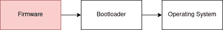
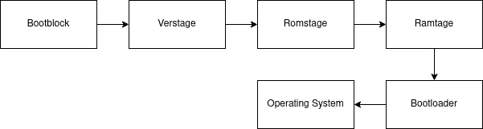

# 安全性始于固件

> 原文：<https://itnext.io/security-starts-in-the-firmware-19e0fc75afd9?source=collection_archive---------4----------------------->

我是 LinkedIn 的一个相当频繁的用户——因为我确实比邢更喜欢这个网络的风格，而且我觉得它有一个更活跃的社区。我收到了很多关于安全设备、防火墙、身份管理系统等广告的垃圾邮件。但大多数人不知道的是:安全性，无论是防火墙、VPN 设备还是投票系统，它总是从固件级别开始。让我们了解如何构建这样一个系统，以及为什么安全性总是始于固件。

由[米尔蒂亚迪斯·弗拉基迪斯](https://unsplash.com/@_miltiadis_?utm_source=unsplash&utm_medium=referral&utm_content=creditCopyText)在 [Unsplash](https://unsplash.com/s/photos/chain?utm_source=unsplash&utm_medium=referral&utm_content=creditCopyText) 上拍摄的照片

安全工程师倾向于谈论信任链。这意味着具有各种组件的系统需要在彼此之上构建安全性，通过完整的系统链接可信度。这个链条总是有一个所谓的信任锚，信任的根源。信任的根源是您需要信任的系统中的一个代码块、二进制代码或硬件部分，以便建立信任链。让我们在这里做一个例子:

# 一个“安全”系统

首先，没有安全的系统。安全性的衡量标准是:需要付出多大的努力才能打破它。不管怎样，假设您想要构建一个 VPN 设备。那么我们需要什么呢

*   裸机平台，即*硬件*
*   一些操作系统——可能是 *Linux*
*   VPN 服务器——因为你和我一样是开源软件的粉丝，所以让我们使用 OpenVPN 吧

大多数人现在把这些部分放在一起，在 Linux 中做一些很好的配置，这样它只允许特定的端口通过，没有根登录，你的 VPN 设备就可以使用了。但是，从系统开始引导到应用程序被加载，实际上会发生什么呢？

# Bootflow

每台计算机总是从重置向量开始。复位向量是一个片上系统特定的地址，它指向系统上运行的初始代码(即所谓的固件)的存储位置，大多数情况下这可能是一个 SPI 闪存芯片。

固件将初始化系统上运行的大部分硬件，并跳转到引导装载程序，然后装载操作系统。在我们的场景中，一旦加载了您的操作系统，OpenVPN 服务器将启动并向我们的客户端提供所需的服务。

所以很明显根，整个系统的开始就是固件。在固件中，我们甚至可以更加具体。固件由多个部分组成。因为我的主要专业领域是 x86 固件，所以我们可以将其分为几个阶段。代码的第一部分在 UEFI 中被称为 *bootblock* 或*安全*阶段。安全阶段根本不包含安全，这个名字选得很不恰当。安全阶段确实初始化 CPU，并将 CPU 缓存作为 RAM，因为还没有可用的 RAM。

下一个阶段是 Pre-Efi Init (PEI)或 romstage。romstage 主要有两个目的。做额外的硬件初始化和最重要的:启动内存。

接下来是 ramstage 或驱动程序执行(DXE)阶段。DXE 阶段可以完成系统需要的所有工作。启动硬件，与系统中的设备对话，如基板管理控制器。必要时加载 USB 驱动程序等等。我们不需要在这里详细讨论。在所有的驱动程序都被初始化后，引导程序弹出，并开始执行你的操作系统内核(是的，Windows 也有一个内核)。

内核基本上重复了固件中的许多步骤——尤其是 DXE 部分。一旦加载了用户空间，应用程序就会启动，我们就可以开始了。

# 信任的根源

在大多数系统中，信任的根源是*完整的固件。因为我们并不真正知道下面发生了什么，因为大部分都是封闭的源代码，我们只需要把固件当作一个大的 blob，作为我们信任的根源。从那里可以建立一个信任链使用已知的技术，如 UEFI 安全引导。*

UEFI 安全引导声明系统的完整性是正确的，从信任的根开始，并且固件仅加载了签名的引导加载程序，该引导加载程序加载了签名的操作系统，该操作系统仅加载签名的内核驱动程序。所以这里的链条应该是

经典 UEFI 安全引导

整个系统依赖于固件没有被破坏。由于这是完全闭源的，我们必须将整个固件作为 RoT——大约 16MB。

# 我们能做得更好吗？

是的。开源固件是一种工具，可以获得对信任根的更多控制和安全性，并最小化 RoT。我们以 [coreboot](https://www.coreboot.org) 为例。coreboot 有多个阶段，在引导加载程序加载之前执行。这将是

具有测量/验证引导的核心引导引导流

coreboot 遵循最小信任计算基础方法 bootblock 是整个固件的一个非常小的部分，只需要启动堆栈和磁头，以便固件可以工作，我们不必再使用汇编。在 bootblock 之后，可信平台模块将被初始化，我们的信任链开始。

因此，我们没有将完整的固件作为信任的根源，而是仅将固件中的一小部分，即 bootblock 和 verstage 作为我们的信任根源，并从那里开始信任链。因此，所有后续阶段都将从启动模块和结束阶段开始进行测量和验证。这大大增加了安全性，因为我们确实需要信任一小部分代码——甚至是开源的。

# TL；速度三角形定位法(dead reckoning)

如果你正在设计一个安全的系统，固件应该是你安全的基础——理想情况下，它应该是开放的和最小化的。

感谢您的阅读——如果您想了解更多关于开源固件的信息，请查看:

 [## 开源固件——我们为什么要支持它？

### 固件是平台上运行的最强大的软件。但是为什么所有的东西都是闭源的呢？支持…

medium.com](https://medium.com/swlh/open-source-firmware-why-should-we-support-it-bbd0ad75b651)  [## 入门指南:coreboot

### coreboot 是一个开源固件替代方案。本文介绍了固件，并向您展示了如何开始使用…

medium.com](https://medium.com/swlh/getting-started-with-coreboot-7ade78327e75)