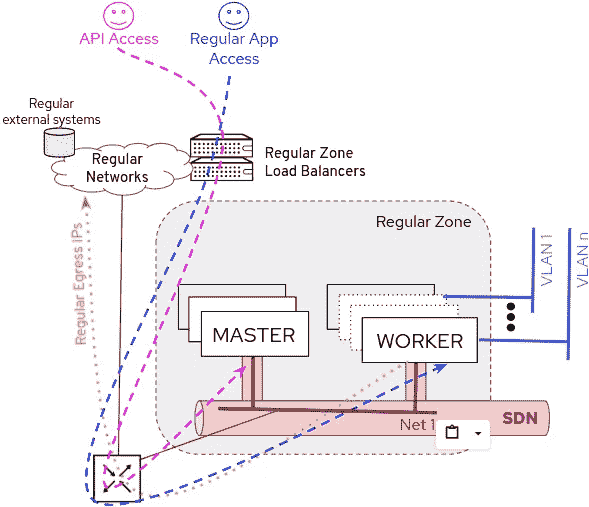
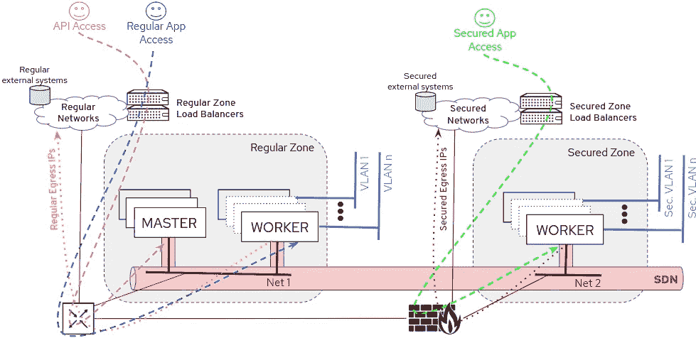
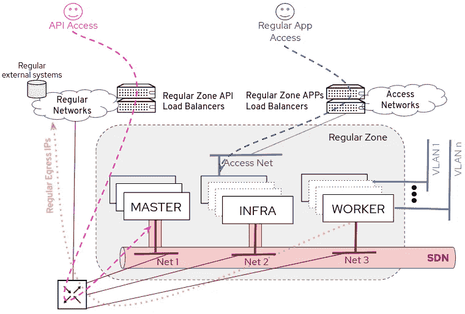

# OpenShift 工作节点中的安全区域—第一部分—简介

> 原文：<https://itnext.io/security-zones-in-openshift-worker-nodes-part-i-introduction-4f85762962d7?source=collection_archive---------2----------------------->


在这个系列文章中，您将看到如何将 OpenShift 工作人员分成多个安全区域。

我不想这篇文章成为“快速指南”。我会解释很多细节，选项，解释，技巧和窍门，最坏的情况，警告，测试，第二天的操作等等…这就是为什么它这么长…

这本书更适合那些以在 worker 节点中创建安全区域为借口，想要了解更多关于 Kubernetes/OpenShift 基础设施的人，而不是那些想要快速查看如何执行实际配置的人。[如果你属于第二组，请直接进入文章的最后部分，我将在那里总结配置过程中完成的步骤。](https://medium.com/@luis.ariz/security-zones-in-openshift-worker-nodes-part-iv-user-restrictions-and-recap-5ec0ba7bdaf9)

你需要知道一些 OpenShift/Kubernetes 的基本概念，但我会尽可能地涵盖更多内容，而不是写一本完整的书来解释一切。

最后，如果您认为使用多个 OpenShift 集群来覆盖此用例比使用单个大型 OpenShift 集群更容易、更干净，我不会不同意，但这取决于您的具体情况，因为多个 OpenShift 集群意味着您需要考虑多个 API 和应用入口点，以及更多的控制平面节点，管理和配置成倍增加，但老实说，由于有了像[高级集群管理](https://www.redhat.com/en/technologies/management/advanced-cluster-management)这样的产品，最后一部分越来越不是问题。正如我告诉你的，这将取决于你和你的需求，但是对于这篇文章，这个主题更多的是解释一些基础设施概念的借口，而不是推荐的架构。

回到主题，为什么在你的工人中设置安全区域是有用的？因为您可以涵盖一些用例，例如:

*   创建一个安全区域，您可以在其中运行最明智的应用程序，并且只有一部分用户可以部署工作负载

```
Workloads:      Trusted
OCP Users:      Trusted
Management:     Restricted to some users/projects
```

*   创建一个 DMZ，用于放置面向用户的应用程序，这些应用程序更容易受到外部入侵的攻击，并且只有一部分用户可以创建资源

```
Workloads:      Untrusted (they can be compromised)
OCP Users:      Trusted
Management:     Restricted to some users/projects
```

*   创建一个区域，在该区域中强制运行来自集群中不可信(或不太可信)用户的应用程序。这些用户将无法访问或使用其他区域中的资源。

```
Workloads:      Untrusted (they can be compromised)
OCP Users:      Untrusted
Management:     Enforced (users only have access to those resources)
```

> 这种方法使用单个 OpenShift 集群，因此所有 pod 都连接到同一个 SDN，即使我们包括“安全区域”。我们可以使用网络策略阻止 SDN 内部的连接，但这些策略在第 3/4 层工作，因此，如果您需要完全隔离，您将需要部署单独的 OpenShift 集群。

在这篇文章中，我将重点关注第一个用例(创建一个安全区域)，但我会对您尝试创建 DMZ(与安全区域相反)时的差异进行一些评论。

我们如何定义一个安全区域？我们需要:

1.  为新区域创建一组节点
2.  为区域配置特定的网络规则
3.  在新区域上配置使用限制

每篇文章都将涵盖上述观点中的一个，在最后一篇文章中，我将包括所有内容的回顾。如果你想直接跳到任何一篇文章:

[](https://medium.com/@luis.ariz/security-zones-in-openshift-worker-nodes-part-ii-grouping-workers-8e97f1d601ba) [## OpenShift 工人节点中的安全区域—第二部分—工人分组

### 这是本系列的第二部分，我们将配置两组不同的工作人员。

medium.com](https://medium.com/@luis.ariz/security-zones-in-openshift-worker-nodes-part-ii-grouping-workers-8e97f1d601ba) [](https://medium.com/@luis.ariz/security-zones-in-openshift-worker-nodes-part-iii-network-configuration-3a887854a4d) [## OpenShift 工作节点中的安全区域—第三部分—网络配置

### 在本帖中，我们将重点讨论在我们的安全系统中分离入站和出站流量所需的网络配置…

medium.com](https://medium.com/@luis.ariz/security-zones-in-openshift-worker-nodes-part-iii-network-configuration-3a887854a4d) [](https://medium.com/@luis.ariz/security-zones-in-openshift-worker-nodes-part-iv-user-restrictions-and-recap-5ec0ba7bdaf9) [## OpenShift 工作节点中的安全区域—第四部分—用户限制和概述

### 这是关于如何在你的 OpenShift workers 中配置安全区域的最后一篇文章。

medium.com](https://medium.com/@luis.ariz/security-zones-in-openshift-worker-nodes-part-iv-user-restrictions-and-recap-5ec0ba7bdaf9) 

作为我们目标的总结，我们希望:

*   拥有两组工作人员，一组用于“常规应用程序”，另一组用于“安全应用程序”
*   要有两组用户，一组可以根据需要在安全区域部署工作负载，而另一组在任何情况下都不允许。
*   在区域之间分割网络流量，包括入口和出口。
*   防止常规区域中的应用程序与安全区域中的应用程序进行交互(如果群集管理员没有明确允许)。

# 我们从哪里开始，向哪里去？

在默认设置中，我们有如下所示的 OpenShift 架构，其中我们使用负载平衡器来访问 OpenShift API 和工作节点上运行的工作负载，并且应用出口流量默认使用工作接口 IP 来访问外部系统(但是[您可以将 IP 池分配给某些项目](https://docs.openshift.com/container-platform/4.5/networking/openshift_sdn/assigning-egress-ips.html))。

我们还可以将一些 VLANs 直接连接到我们的工作人员[以供 PODs(使用 Multus)](https://www.openshift.com/blog/demystifying-multus) 使用，例如，如果我们有隔离的网络(未连接到任何路由器),其服务必须由我们的应用程序访问，或者如果我们需要使用不同于 HTTP/HTTPS 的协议，并且我们不想/可以使用 Kubernetes 服务类型，如 NodePort、ExternalIP、LoadBalancer 等，或者即使我们希望提高网络性能，这也是有用的。



因此，本帖中我们的安全区域配置的想法将类似于下面的架构(这不是一个首选架构，它只是我在创建工作者组时用来展示 OpenShift 功能的一个示例)，其中我们添加工作者节点，连接到不同的网络，但我们将添加阻止用户和工作负载在其上运行的配置。

如果您想要配置 DMZ 而不是安全区域，设置将是相同的，但是如果您想要将不受信任的用户限制在节点的子集内，我将包括一些更改(不同之处在于，在 DMZ 设置中，我们信任 Openshift 用户，但是我们担心那里的工作负载受到损害)。

例如，在不可信用户的情况下，我将尽可能地保护 API 和“常规区域”应用程序，在访问前放置 L7 防火墙或代理，阻止那些不可信用户真正需要的 URL(即 OpenShift APIs 和 web 控制台)。



我们可以向默认架构添加一些额外的配置，通过为基础架构添加[个专用节点、添加一个新的接入网络以及为节点使用不同的 L3 网络来稍微改善组件之间的隔离(如下所示)](https://access.redhat.com/solutions/5034771)



如果我们将这些概念应用到我们的安全区域架构中，我们可以添加一个工作人员子集，在其中添加一个作为访问网络连接的额外 NIC，并强制运行我们的专用安全区域路由器。

这一次，我们没有将节点专用于“基础架构”(不允许其他类型的应用程序在其上运行)，因为位于这些基础架构节点上的唯一工作负载是路由器/入口。我们将在这里创建两组工作人员，一组有接入网络，另一组没有接入网络(这可以被视为更加“安全”)，但他们都将能够托管工作负载，尽管首选的是没有外部访问的节点(如果它们有运行应用程序的空间)。


> 同样，这是一个架构示例，用于展示 OpenShift/Kubernetes 创建不同工作节点组的能力，而不是用于创建安全区域的 OpenShift 参考架构，因为设计将取决于多种因素，包括用例、拓扑限制、内部安全策略等。

**这些帖子中使用的实验室设置**

我试图尽可能地接近上面显示的架构。

在我的实验室中，我部署了 3 个主节点、2 个普通工作节点(没有基础节点)、2 个安全工作节点+访问节点和 1 个安全工作节点。

我使用我的 [ansible 行动手册进行安装，这些行动手册“模拟”了虚拟机](https://github.com/luisarizmendi/ocp-kvm-bm-upi)上的裸机 UPI 安装，但我手动进行了一些更改，以获得类似于上图所示的拓扑。

在常规区域中，节点连接了两个网络:OpenShift SDN 网络和用于 Multus 的 VLAN。在新的安全区域中，节点具有用于 OpenShift SDN 的不同网络和不同的 Multus 网络(在这种情况下是隔离的，这意味着无法使用任何路由器到达该网络。我这样做是为了模拟一个孤立的网络，在这个网络中，人们过去常常包括安全的后端。安全区域中用于接入的节点具有额外的网络来充当接入网络。

在这个帖子系列中，我们不会讨论防火墙配置、路由和其他网络方面，因为我想展示的是如何从 OpenShift 的角度配置架构，所以我配置了从我的路由器(我的 KVM 主机)到所有网络的直接连接，没有安全规则。

DNS 已配置为使用默认入口路由(在常规区域中)和新入口路由(将位于安全区域入口的 access+worker 节点中)来访问该区域上的应用程序。配置了两个不同的负载平衡器，一个用于常规和 API 访问，另一个用于安全应用程序。

# **你准备好了吗？**

如果您准备好了，让我们从配置中的第一点开始，创建两组工作人员，让用户在部署他们的工作负载时选择一个或另一个

[](https://medium.com/@luis.ariz/security-zones-in-openshift-worker-nodes-part-ii-grouping-workers-8e97f1d601ba) [## OpenShift 工人节点中的安全区域—第二部分—工人分组

### 这是本系列的第二部分，我们将配置两组不同的工作人员。

medium.com](https://medium.com/@luis.ariz/security-zones-in-openshift-worker-nodes-part-ii-grouping-workers-8e97f1d601ba)