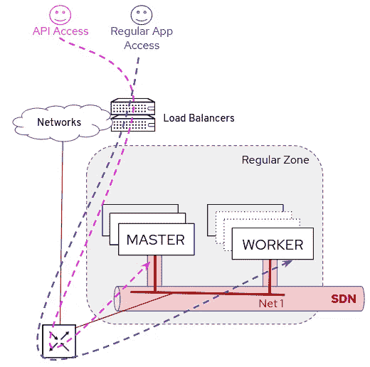
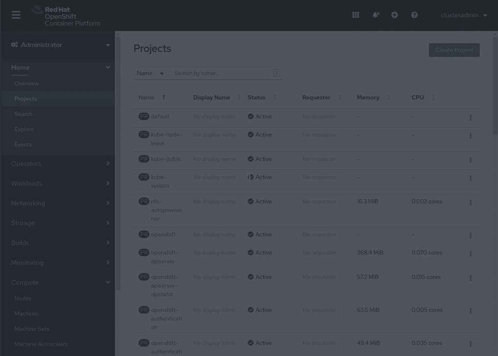
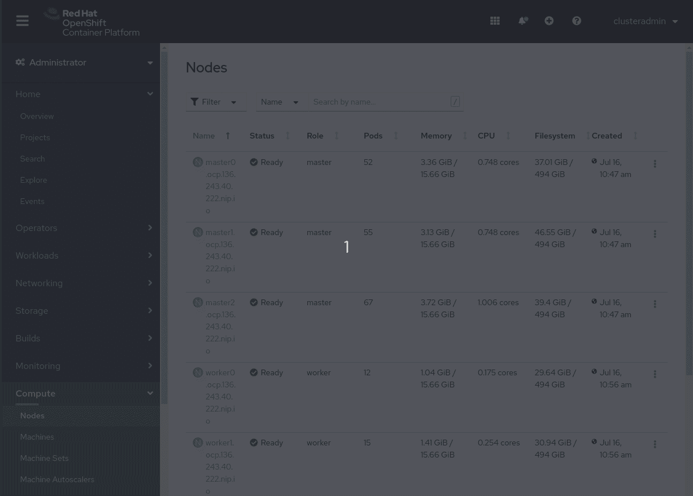
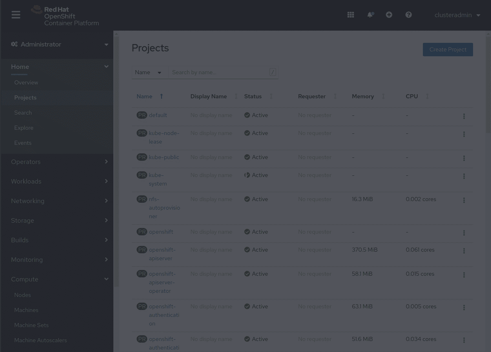
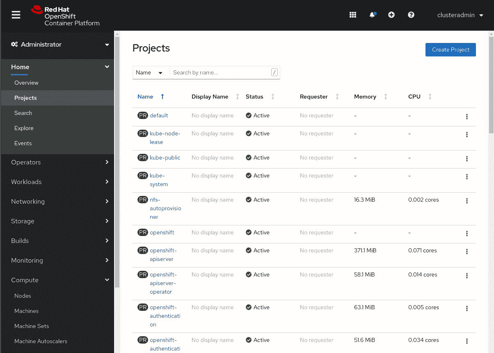
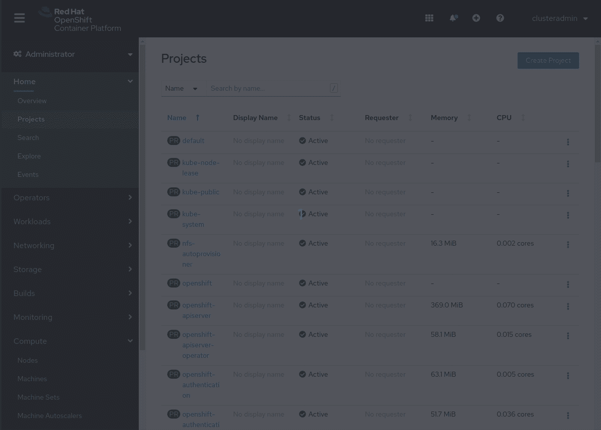

# OpenShift 工人节点中的安全区域—第二部分—工人分组

> 原文：<https://itnext.io/security-zones-in-openshift-worker-nodes-part-ii-grouping-workers-8e97f1d601ba?source=collection_archive---------3----------------------->


这是关于如何在 OpenShift workers 中创建安全区域的系列文章的第二部分。如果您错过了介绍，请查看一下:

[](https://medium.com/@luis.ariz/security-zones-in-openshift-worker-nodes-part-i-introduction-4f85762962d7) [## OpenShift 工作节点中的安全区域—第一部分—简介

### 在这个系列文章中，您将看到如何将 OpenShift 工作人员分成多个安全区域。

medium.com](https://medium.com/@luis.ariz/security-zones-in-openshift-worker-nodes-part-i-introduction-4f85762962d7) 

作为第一个配置步骤，我们将创建两组不同的工作人员。

# 概观

首先，我们需要一种方法来对新区域的工作节点进行分组。我们需要从默认的体系结构…



…到另一个领域，我们有一组与众不同的节点，用户可以在需要时放置工作负载:


> 注意:该图显示了用户如何成为“普通员工”来访问工作负载，即使在访问安全区域应用时也是如此，因为默认入口控制器(OpenShift 路由器)将在那里运行。我们将在下一节中通过执行一些网络配置来改变这种行为。

Kubernetes 中有多种方法可以对节点进行分组并影响 POD 调度，以便将它们用于某些特定的工作负载、用户、项目等:

*   节点标签+节点选择器
*   节点标签+节点关联性
*   节点污染+容忍

**节点标签+节点选择器**

NodeSelector 可以与节点标签一起使用，要求调度程序将我们的工作负载放在我们需要的节点子集中，例如，因为我们的应用程序需要使用那些节点中存在的东西(GPU、网络访问等)。

这种方法可行，但也有一些缺点:

*   如果我们需要在部署中将附加标签配置为 NodeSelector，那么除了其他标签之外，我们还需要记住常规区域安全区域标签
*   使用 nodeSelector 时，我们的标签中只允许使用“AND”运算符，因此，例如，我们不能在设置中使用两个标签，一个用于安全工作节点+访问节点，另一个用于安全工作节点，而只是对调度程序说，将此工作负载放在其中一个中。
*   它只是强制执行，因此您不能有“首选”节点或软要求，例如，在我们上面的示例中，我们不能说将此应用程序放在安全工作节点+访问节点或安全工作节点中，但如果可能，最好将它放在安全工作节点中

尽管有这些缺点，这个解决方案还是不错的，但是没有任何 NodeSelector 的其他工作负载会怎么样呢？如果没有配置 NodeSelector，那么工作负载可以放在我们的任何工作节点上。

这意味着，如果我们想要阻止任何默认工作负载(没有配置 nodeSelector)在安全区域中运行，我们需要配置污点(下面解释)。按照这种方法，我们将只能在指定的时候使用我们的安全工作节点。

使用 labels+ *nodeSelectors* 我们可以允许用户在需要的时候使用该区域，但是如果我们希望防止任何不属于某个组的用户使用该区域，或者如果我们希望避免不可信的用户工作负载，会发生什么情况呢？…当我们谈到污点时，我们会看到这个问题的答案，但首先，让我们来看看节点亲和性。

**节点标签+节点关联**

我们可以采取另一种方式来改变 POD 节点的位置，类似于*节点选择器*:节点关联。

它通过添加更多选项来最小化 *nodeSelector* 的上述缺点，例如，它允许使用 or 运算符、首选节点，并可以限制调度或调度+执行(您可以阻止调度，但让已经调度的工作负载继续在那些节点上运行)。

**污点和宽容**

Taints 采用了与 *nodeSelector* 或 Node Affinity 相反的方法，它们允许节点排斥节点上的一组 pod，从而确保工作负载不会被放置在“不合适的节点”中。我们可以在部署中配置*容忍度*，这样我们就允许一些部署在带有某些污点的节点上运行。

重要的是要注意，容忍是一种允许，它不是强制在那些节点上调度我们的应用程序，这必须通过使用 *nodeSelector* 或节点关联来完成。这意味着它们是互补的，通过*节点选择器*和节点关联，我们允许用户指定节点来运行他们的工作负载，当出现污点时，我们会阻止工作负载在某些主机上运行，但如果用户在部署中配置“容忍”，这些规则可能会被覆盖。

当我们同时使用 labels+*node selectors*/node affinity 和 Taints+tolerances 时，我们可以创建“专用节点”,因为我们使用 Taints+tolerances 来防止工作负载，并使用 labels+node selectors/node affinity 来执行调度，这正是我们的用例所需要的。

总之，当我们配置一个*节点选择器*或节点亲缘关系时，我们说“*这个工作负载必须在一个带有 XXX 标签*的节点上运行，当我们配置一个容错时，我们说“*这个工作负载允许在带有 YYYY 污点*的节点上运行”，例如，想象一下之前的 GPU 示例，这与说“请在一个带有 GPU 的节点上运行我的工作负载”(因为否则 我的 GPU 设置不会工作)比“不使用 GPU 的工作负载在这个主机中是不允许的”(因为如果它与 GPU 负载无关，我不想使用那个节点中的资源)。

**在我们的用例中,**污点+容忍和标签+节点选择器/节点关联性

我们如何在设计中运用这些概念？

我们安全区域设置的实际想法是:

*   在所有安全区域工作线程中设置一个 Taint **NoSchedule** ,以便只有打算在安全区域中运行的工作负载可以通过使用容错来使用这些节点(默认情况下将使用常规区域)。
*   在安全访问+工作节点中包含第二个污点 **PreferNoSchedule** ，因此默认情况下，工作负载将“优先”放置在安全工作节点中，而不是访问+工作节点中。
*   在安全区域工作者中包括标签，以将他们与其他工作者(“常规工作者”)区分开，并且还创建两组安全区域工作者(安全访问+工作者节点和安全节点)。如果需要，这些标签将使在 access+worker 节点中强制运行工作负载成为可能。当我们希望安全区域工作负载使用安全区域工作器时，这些标签以及污点将使配置*节点选择器*/节点关联性和容忍度成为可能

DMZ 和不受信任的 OCP 用户用例呢？

DMZ 用例可以使用相同的步骤，但是对于不受信任的用户用例，我们需要修改其中的一些步骤，例如，我们需要在不属于不受信任的用户工作人员(“常规工作人员”)的所有节点中配置污点，而不是在新创建的区域中配置污点，以防止那些不受信任的客户端使用尚未分配给它们的资源。

现在你已经理解了*节点选择器*和污点/容忍，我们可以开始配置了吗？嗯，在对节点进行分组时，我们需要在 OpenShift 中考虑更多的东西，例如机器 API。

**open shift 中的 machine API**

如果您查看了上面提到的 infra-node 过程，或者如果您回顾了如何在我的“[OpenShift-第一部分，HugePages](https://medium.com/@luis.ariz/enhanced-platform-awareness-epa-in-openshift-part-i-hugepages-a28e640fabf6) 中增强平台意识(EPA)”帖子中创建 EPA 节点，您可能会注意到我们也影响了调度程序(在这种情况下使用节点标签+ *节点选择器*),但是，除了标记节点，我们还包括了与机器集和/或机器配置相关的附加配置。我们的用例中需要这些吗？

让我们开始解释 MachineSet 配置，但是首先，我们需要理解什么是 Machine API。OpenShift 中的 Machine API 在集群安装完成后执行所有节点主机供应管理操作。这意味着 OpenShift 提供了一种灵活、动态的节点配置方法，可以从 OpenShift 配置您的底层操作系统。

如果 OpenShift 在支持它的基础设施之上运行(基本上，如果 OpenShift 是使用 IPI 方法安装的)**，并且如果您在您的 worker 节点中使用 Red Hat CoreOS 作为操作系统，则机器 API 将可用**。****

请记住，在 OpenShift 4 中，我们在为员工选择操作系统时有两个选项:Red Hat CoreOS 或 Red Hat Enterprise Linux(对于主用户，我们需要使用 Red Hat CoreOS)。建议总是安装 Hat CoreOS (RHCOS ),因为在这种情况下，您会获得很多好处，不仅有机会使用 Machine API 创建新节点，还可以获得自动节点配置(我们将在下一节中看到 MachineConfig)、自动升级和修补，以及与 OpenShift 的其他集成。

如果这对我们有好处，你可能会问:为什么红帽企业版 Linux (RHEL)仍然是一个选择？嗯，RHCOS 是不可变的操作系统，也就是说操作系统是以只读模式挂载的！，因此您不能更改基本操作系统上的任何内容(不可变)。这增加了抵御意外损坏和某些类型的恶意攻击的能力，但你如何在上面安装新软件呢？…作为容器。这意味着您想要在 RHCOS 上运行的任何软件都必须被容器化。现在考虑一些人用来在 Linux 机器上运行的“代理”(备份代理、监控代理、安全合规性等)，如果您想将它们包含在您的 RHCOS 工作节点上，就必须将它们容器化。

好消息是，这些代理中的许多都不再需要了，例如，让我们将重点放在备份代理上。对于 RHCOS，节点配置由 OpenShift 管理，open shift 将配置存储在 ETCD 数据库中，因此执行节点备份没有意义(您应该备份 ETCD)。或者现在想想监控，节点监控化包含在 OpenShift 可观察性工具中，所以你也不需要。仍然有一些代理仍然可以在 RHCOS 上运行，在这种情况下，我们应该调查是否有可能将它们容器化，只有在不可能的情况下，我们才应该考虑将 RHEL 作为我们节点中的操作系统。

回到机器 API 和机器集…

MachineSet 是一个机器 API 资源，它决定了必须在集群上运行的节点数量。机器集对于机器就像复制集对于 pod 一样。如果您需要更多的机器或者必须缩小它们的规模，您可以更改 MachineSet 上的 replicas 字段来满足您的计算需求。

MachineSets 定义了机器 CRDs，因此它包括除副本数量之外的更多信息，例如，我们可以找到我们向底层基础设施请求的“节点模板”(包括 CPU、内存)或必须放置节点的基础设施可用性区域，还有节点标签和污点(这是我们感兴趣的部分)。

当使用 MachineAPI (OpenShift IPI 安装)时，应该在您的 MachineSet 定义中配置节点标签和污点，以便在节点创建期间添加它们，从而保证您的节点将准备好预期的元数据，而不涉及进一步的手动步骤。

总之，如果您使用 IPI 安装部署了 OpenShift，请配置额外的机器集，并在其中添加将用于影响 Kubernetes POD 计划的标签和污点，如果您使用 UPI 部署，则只需在节点中手动包含标签和污点。

**OpenShift 节点角色**

我们已经说过，我们的想法是在我们的安全区域节点中设置几个污点和标签，所以让我们定义它们:

在安全工作节点中:

*   污点:

```
securityzone=secure:NoSchedule
```

*   标签:

```
node-role.kubernetes.io/secure-worker=''
```

在安全访问+工作节点中:

*   污点:

```
securityzone=secure:NoSchedule
ingressaccess=true:PreferNoSchedule
```

*   标签:

```
node-role.kubernetes.io/secure-worker=''
ingressaccess=true
```

你可能会问，为什么我选择 node-role.kubernetes.io/secure-worker=''标签*而不是比如 *secure-worker=true* ？*

嗯，*node-role.kubernetes.io/<角色名>* 是一个特殊的键名(没有值)，它给一个节点分配一个角色，当你执行*“oc get nodes”时，这是可见的。*

> 注意:如果您必须用这个角色标签配置一个机器集，您不要把它配置成一个常规标签，因为角色标签是特殊的。您可以在这里看到[一个如何创建具有新角色](https://docs.openshift.com/container-platform/4.5/machine_management/creating-infrastructure-machinesets.html)的机器集的示例。您可能会注意到，角色名包含在与机器 API 相关的其他标签中。如果您使用常规标签而不是角色标签，您只需将其添加到“标签”部分。

在 Kubernetes 中创建角色很方便，但它在 OpenShift 中还有另一层含义(这就是为什么有些人说 maybe 没有那么方便，更喜欢使用其他种类的标签)。你还记得当我们使用 RHCOS 时，我们在 OpenShift 中有自动配置和升级吗？这些升级是对已知角色执行的，并带有与之相关联的配置。

那么，如果我创建一个新角色，将它分配给一个节点并删除“worker”角色，会发生什么呢？(您的节点中可以有多个角色，当您向节点添加新角色时，它将具有旧角色和您在顶部添加的角色)，在这种情况下，我们将拥有仅分配给新角色的节点，但我们没有说“此新角色的配置是 XXXX”，那么仅附加到新角色的那些节点将不会升级。

现在是我们需要讨论 OpenShift 中的节点配置的时候了。

**open shift 中的 machine config**

我们在开始讨论 Machine API 时提到了 MachineConfigs。当您在节点中使用 RHCOS 作为操作系统时，machine config 是管理操作系统配置的部分，因此，如果您有 RHCOS，则可以使用 machine config，无论您是使用 IPI 还是 UPI 安装。

"*machineconfig*"由" *Machine Config 操作员*"管理，自动更新和节点中的操作系统配置更改，因此您不必使用 ssh 或 ansible 跳转到节点来更改它们，您只需从 OpenShift 创建或修改 CRD。

使用这些 MachineConfigs，我们可以修改网络配置、允许的 ssh 密钥等，因此它们对于根据需要修改我们的安全区域工作器的配置非常有用。

但是我们如何将配置绑定到节点呢？因为该信息不包含在 Machineconfig 定义中…嗯，这是由“MachineConfigPool”CRD 完成的。这意味着我可以在 MachineConfig 对象中定义“allow this ssh key ”,通过使用例如标签来创建一组节点，并通过配置 MachineConfigPool 将带有 ssh 密钥定义的 MachineConfig 分配给具有该标签的节点组，MachineConfig pool 表示该 machine config 应用于具有该标签的节点。

这是与我们相关的部分，因为我们可能需要/想要将 MachineConfigs 分配给我们新创建的角色。我说可能是因为我们不必从节点中删除“worker”角色，我们可以保留两个角色，即“worker”角色和新创建的角色，在这种情况下，我们已经有了一个 MachineConfigPool，它将节点与配置绑定在一起(默认的 worker MachineConfigurationPool)。

如果您想要完全删除“worker”角色，我们需要创建一个新的 MachineConfigPool 或更改默认的 MachineConfigPool，使其包含新角色。

如果您正在为您的新区域寻找单独的节点配置(即配置审计、不同的 SSH 密钥等)，您还必须复制所有 worker 角色 MachineConfigs，并将它们关联到一个新的 MachineConfigPool ( [您可以在此处查看一个示例，其中按照此方法创建了一个新的 infra 角色](https://github.com/lbohnsac/OCP4/tree/master/infrastructure-node-setup))。

总而言之，在创建新角色时，我们有三个关于节点配置的选项:

*   更少的配置选项:不要删除“worker”角色并添加新角色，将两者都保留在我们的节点中。
*   中期选项:删除“worker”角色，只配置新角色+将新角色包含在默认“worker”MachineConfigPool 中
*   Most 配置灵活选项:删除“worker”角色，只配置新角色+为新角色创建新的 MachineConfigPool

在我们目前的情况下，拥有不同的配置可能是有用的，因为我们可能希望在安全区域工作器中包含更多的安全调整，但我不想有“重复的”配置(即一个 ssh 配置对象用于普通工作人员，另一个用于安全区域工作人员)，所以我要做的是向节点添加新角色，删除工作人员角色，创建新的 MachineConfigPool，但我并没有复制所有“工作人员”MachineConfigPool，而是指向新 MachineConfigPool 中的那些工作人员配置，这为我仅向新区域节点添加配置打开了方便之门(无需复制所有 MachineConfigs，如在之前所示的示例中的[)。除了节点中的基本配置之外，我不会配置任何其他内容，但是让我的环境为该选项做好准备是很好的，以防我将来想要这样做。](https://github.com/lbohnsac/OCP4/tree/master/infrastructure-node-setup)

如果你想知道如何配置它，那么我们需要进入下一部分:OpenShift 配置。

# **OpenShift 配置(工人分组)**

> 注意:我们将使用具有集群管理员权限的 OpenShift 用户来完成所有这些配置

让我们记住配置点:

*   在节点中设置标签(在我们的例子中是节点角色)和污点，以创建一个新的工人组
*   由于我们将创建一个新角色(不是常规标签),并希望删除“工作人员”角色，并且我们希望有机会在我们的新区域工作人员中拥有专用配置，因此我将创建一个新的 *MachineConfigPool* ,但它也指向“常规工作人员”配置。

**1-标签和污点**

我们从标签和污点配置开始，所以我们需要知道我们是否将使用 Machine API 来创建/销毁新节点。那么答案很简单:“没有”。为什么不呢？因为我的[实验室是使用 UPI](https://github.com/luisarizmendi/ocp-kvm-bm-upi) OpenShift 安装方法部署的(记住，如果 OpenShift 没有与提供者集成，那么您使用 UPI 安装方法安装，您将无法使用 MachineSets)。

如果你只有一个 KVM 来设置你的实验室(像我一样)[你也可以用 libvirt IPI](https://medium.com/@luis.ariz/deploying-an-openshift-4-lab-in-a-kvm-node-using-libvirt-ipi-652f0476e8a5) 部署 OpenShift，它使用了我创建的一个[角色来简化这种部署](https://github.com/luisarizmendi/ocp-libvirt-ipi-role)。您可以在该部署中获得机器 API，但它确实是有限的，例如创建新的机器集，因此显示我们想要配置的内容是无效的。请记住，libvirt IPI 是打算只用于测试和开发。另外，请注意，MachineSet 定义会根据您使用的基础设施提供者而变化。

我们如何配置标签和污点？我们可以使用 *oc 或 kubectl* CLIs 或 OpenShift Web 控制台。让我们从命令行界面开始。

首先，看看您的节点和角色:

```
oc get nodes
```

我实验室的输出:

```
$ oc get nodes                                                 
NAME                                STATUS   ROLES    AGE   VERSION                    
master0.ocp.136.243.40.222.nip.io   Ready    master   87m   v1.18.3+6025c28            
master1.ocp.136.243.40.222.nip.io   Ready    master   87m   v1.18.3+6025c28            
master2.ocp.136.243.40.222.nip.io   Ready    master   87m   v1.18.3+6025c28
worker0.ocp.136.243.40.222.nip.io   Ready    worker   78m   v1.18.3+6025c28
worker1.ocp.136.243.40.222.nip.io   Ready    worker   78m   v1.18.3+6025c28
worker2.ocp.136.243.40.222.nip.io   Ready    worker   78m   v1.18.3+6025c28
worker3.ocp.136.243.40.222.nip.io   Ready    worker   78m   v1.18.3+6025c28
worker4.ocp.136.243.40.222.nip.io   Ready    worker   78m   v1.18.3+6025c28
```

然后向您的节点添加新角色"*安全工作者*:

```
oc label node <nodename> node-role.kubernetes.io/secure-worker=''
```

我实验室的输出:

```
$ oc label node worker2.ocp.136.243.40.222.nip.io node-role.kubernetes.io/secure-worker=''node/worker2.ocp.136.243.40.222.nip.io labeled$ oc label node worker3.ocp.136.243.40.222.nip.io node-role.kubernetes.io/secure-worker=''node/worker3.ocp.136.243.40.222.nip.io labeled$ oc label node worker4.ocp.136.243.40.222.nip.io node-role.kubernetes.io/secure-worker=''node/worker4.ocp.136.243.40.222.nip.io labeled
```

检查新角色是否已添加到节点中。我实验室的输出:

```
$ oc get node
NAME                                STATUS   ROLES                     AGE     VERSION
master0.ocp.136.243.40.222.nip.io   Ready    master                    3h10m   v1.18.3+6025c28
master1.ocp.136.243.40.222.nip.io   Ready    master                    3h10m   v1.18.3+6025c28
master2.ocp.136.243.40.222.nip.io   Ready    master                    3h10m   v1.18.3+6025c28
worker0.ocp.136.243.40.222.nip.io   Ready    worker                    3h1m    v1.18.3+6025c28
worker1.ocp.136.243.40.222.nip.io   Ready    worker                    3h1m    v1.18.3+6025c28
worker2.ocp.136.243.40.222.nip.io   Ready    secure-worker,worker   3h1m    v1.18.3+6025c28
worker3.ocp.136.243.40.222.nip.io   Ready    secure-worker,worker   3h1m    v1.18.3+6025c28
worker4.ocp.136.243.40.222.nip.io   Ready    secure-worker,worker   3h1m    v1.18.3+6025c28
```

此时，节点同时具有*工作者*和*安全工作者*角色，我想只保留后者，所以删除工作者角色标签:

```
oc label node <nodename> node-role.kubernetes.io/worker-
```

我实验室的输出:

```
$ oc label node worker4.ocp.136.243.40.222.nip.io node-role.kubernetes.io/worker-node/worker4.ocp.136.243.40.222.nip.io labeled$ oc label node worker3.ocp.136.243.40.222.nip.io node-role.kubernetes.io/worker-node/worker3.ocp.136.243.40.222.nip.io labeled$ oc label node worker2.ocp.136.243.40.222.nip.io node-role.kubernetes.io/worker-node/worker2.ocp.136.243.40.222.nip.io labeled
```

再次检查节点的角色。这是我的输出:

```
$ oc get nodes
NAME                                STATUS   ROLES              AGE     VERSION
master0.ocp.136.243.40.222.nip.io   Ready    master             3h29m   v1.18.3+6025c28
master1.ocp.136.243.40.222.nip.io   Ready    master             3h29m   v1.18.3+6025c28
master2.ocp.136.243.40.222.nip.io   Ready    master             3h29m   v1.18.3+6025c28
worker0.ocp.136.243.40.222.nip.io   Ready    worker             3h20m   v1.18.3+6025c28
worker1.ocp.136.243.40.222.nip.io   Ready    worker             3h20m   v1.18.3+6025c28
worker2.ocp.136.243.40.222.nip.io   Ready    secure-worker   3h20m   v1.18.3+6025c28
worker3.ocp.136.243.40.222.nip.io   Ready    secure-worker   3h20m   v1.18.3+6025c28
worker4.ocp.136.243.40.222.nip.io   Ready    secure-worker   3h20m   v1.18.3+6025c28
```

现在，我们让所有安全区域工作人员都担任了新的角色，但是请记住，我们在该区域中有两个子组:access+worker 安全节点和 worker 安全节点。这里我们有多种选择，我们可以为 access+worker 节点创建一个新角色并附加到这些节点，或者我们可以只为它们配置一个标签。

因为我们已经看到了如何配置角色，所以我将坚持第二个选项，只配置一个标签来区分这些节点和安全区域中的其他节点。

我将使用 worker2 和 worker3 作为 access+worker 节点，因此我将它们标记为:

```
$ oc label node worker2.ocp.136.243.40.222.nip.io ingressaccess=truenode/worker2.ocp.136.243.40.222.nip.io labeled$ oc label node worker3.ocp.136.243.40.222.nip.io ingressaccess=truenode/worker3.ocp.136.243.40.222.nip.io labeled
```

好了，我们已经在节点中设置了标签，现在是时候配置污点了，您可以使用命令来完成

```
oc adm taint nodes <nodename> <key>=<value>:<taint>
```

在我的例子中，如果部署没有 *securityzone=secure* 标签，我必须用 NoSchedule 来标记所有安全区域主机:

```
$  oc adm taint node worker2.ocp.136.243.40.222.nip.io securityzone=secure:NoSchedulenode/worker2.ocp.136.243.40.222.nip.io tainted$  oc adm taint node worker3.ocp.136.243.40.222.nip.io securityzone=secure:NoSchedulenode/worker3.ocp.136.243.40.222.nip.io tainted$  oc adm taint node worker4.ocp.136.243.40.222.nip.io securityzone=secure:NoSchedulenode/worker4.ocp.136.243.40.222.nip.io tainted
```

此外，在 access+worker 安全区域节点中，我需要说明的是，如果可能的话，最好不要在这些节点(worker2 和 worker3)中安排 pod:

```
$  oc adm taint node worker2.ocp.136.243.40.222.nip.io ingressaccess=true:PreferNoSchedulenode/worker2.ocp.136.243.40.222.nip.io tainted$  oc adm taint node worker3.ocp.136.243.40.222.nip.io ingressaccess=true:PreferNoSchedulenode/worker3.ocp.136.243.40.222.nip.io tainted
```

我们的节点被标记和污染了。

如果您想使用 Web 控制台执行此配置。以下是如何修改节点中的标签的示例(该示例显示了如何添加标签，但您也可以从中删除标签):



为了使用 Web 控制台包含污点，您必须编辑节点对象，您可以看看 worker3 中的一个示例，我们必须配置这两个污点:



**2-MachineConfigPool**

随着新角色的出现，我们希望配置一个新的 *MachineconfigPool* ，但是由于我们之前讨论的原因，它指向常规 worker 节点的 MachineConfigs。这是定义:

```
apiVersion: machineconfiguration.openshift.io/v1
kind: MachineConfigPool
metadata:
  name: secure-worker
spec:
  machineConfigSelector:
    matchExpressions:
      - {key: machineconfiguration.openshift.io/role, operator: In, values: [worker,secure-worker]}
  nodeSelector:
    matchLabels:
      node-role.kubernetes.io/secure-worker: ""
  paused: false
```

如您所见，我们将 MachineConfigPool 链接到节点(*节点选择器*链接到带有【node-role.kubernetes.io/secure-worker:】标签的节点)和 MachineConfigs(对于带有标签*machineconfiguration.openshift.io/role=worker*或*machineconfiguration.openshift.io/role=secure-worker*的 MachineConfig 对象)。通过这种方式，我们可以将常规的 worker 节点配置“附加”到新角色的节点上，而且我们还可以创建仅适用于新角色 worker 的配置。

您可以使用 CLI 创建/应用此对象(或任何其他对象)，方法是创建一个具有上述定义的文件并使用"*oc create-f<filename>*"或者，如果您不想创建文件只是为了创建对象，您可以运行 *oc create* 并将内容包括在同一个命令中，方法如下(无需创建文件):

```
oc create -f - <<EOF
apiVersion: machineconfiguration.openshift.io/v1
kind: MachineConfigPool
metadata:
  name: secure-worker
spec:
  machineConfigSelector:
    matchExpressions:
      - {key: machineconfiguration.openshift.io/role, operator: In, values: [worker,secure-worker]}
  nodeSelector:
    matchLabels:
      node-role.kubernetes.io/secure-worker: ""
  paused: false
EOF
```

为了使用描述符通过 Web 控制台创建对象，您可以通过三种方式来完成:

*   转到菜单中的 MachineConfigPool 部分



*   转到“Explore”菜单，搜索种类 *MachineConfigPool* ，创建一个新的实例，您可以对任何有效的对象使用这种技术



*   使用“+”号并复制您的定义，这可以用于任何有效的对象，而不仅仅是 MachineConfigPools:



最后两个选项非常好，因为您可以使用它们来配置我们的配置中需要的任何对象，但是使用 Web 控制台而不是 CLI。

在创建了 *MachineConfigPool* 之后，您可以检查链接到它的节点数量是否如预期的那样为 3(角色为 *secure-worker* 的节点)并且配置检查正在进行(“更新”)，您只需要运行:

```
oc get machineconfigpools
```

您可以等待，直到所有的配置都被强制执行(同样，因为他们使用的配置与普通工作人员相同)，并确保没有“降级的”节点，或者您可以继续配置并在以后进行检查。

# **配置测试(工人分组)**

我们已经完成了配置(对于这一部分),因此我们必须测试一切是否按预期工作:

*   如果一个用户部署了没有*节点选择器*的东西，那么它必须被安排给普通工人
*   用户可以使用正确的*节点选择器*和容忍度将某些东西部署到安全区域(我们将在下面的另一节中对一些用户进行限制)，默认情况下，工作负载将被放置在安全区域工作器中(而不是安全访问+工作器节点中)
*   如果安全工作节点中没有剩余空间，并且用户想要使用安全区域，则可以将工作负载放置在安全访问+工作节点中
*   用户可以强制工作负载在安全访问+工作节点中运行，尽管安全工作节点中仍有资源

对于我们的测试，我将创建一个新项目:

```
oc new-project tests
```

让我们从第一个测试开始。我将创建一个包含 5 个副本的部署，没有其他配置

```
apiVersion: apps/v1
kind: Deployment
metadata:
  name: test
  labels:
    app: test
spec:
  replicas: 5
  selector:
    matchLabels:
      app: test
  template:
    metadata:
      labels:
        app: test
    spec:
      containers:
      - name: test
        image: centos/tools
        command: ["/bin/bash", "-c", "sleep 9000000"]
```

您可以使用以下命令检查如何将所有 pod 调度给“常规工作人员”(工作人员 0 和工作人员 1):

```
oc get pod  -o wide
```

在我的实验室里(我用管道与 AWK 缩短输出):

```
$ oc get pod  -o wide | awk {'print $1" " $7'} | column -t
NAME                  NODE
test-96477d59f-74sdw  worker1.ocp.136.243.40.222.nip.io
test-96477d59f-btstd  worker1.ocp.136.243.40.222.nip.io
test-96477d59f-klt85  worker0.ocp.136.243.40.222.nip.io
test-96477d59f-qgfvq  worker1.ocp.136.243.40.222.nip.io
test-96477d59f-vhvq7  worker0.ocp.136.243.40.222.nip.io
```

移除测试，以便用一个干净的项目开始下一个测试:

```
oc delete deployment test
```

对于第二个测试，我们希望在安全区域创建 pod。我们将重复使用之前测试的部署，但是:

*   包括允许在安全区域内安排运输舱
*   在*节点选择器*上包含安全区域标签，以强制使用新区域的工作者:

```
apiVersion: apps/v1
kind: Deployment
metadata:
  name: test
  labels:
    app: test
spec:
  replicas: 5
  selector:
    matchLabels:
      app: test
  template:
    metadata:
      labels:
        app: test
    spec:
      containers:
      - name: test
        image: centos/tools
        command: ["/bin/bash", "-c", "sleep 9000000"]
**  tolerations:
        - key: "****securityzone****"
          operator: "Equal"
          value: "secure"
          effect: "NoSchedule"**
 **nodeSelector:
        node-role.kubernetes.io/secure-worker: ''**
```

当我们创建 pod 时，我们可以看到它们是如何被放置在 worker4 中的，为什么？因为它是安全区域中的工作节点，而不是访问+工作节点(这些是非首选节点):

```
oc get pod  -o wide | awk {'print $1" " $7'} | column -t
NAME                  NODE
test-995bc4654-2nz7c  worker4.ocp.136.243.40.222.nip.io
test-995bc4654-k7zpl  worker4.ocp.136.243.40.222.nip.io
test-995bc4654-rnr52  worker4.ocp.136.243.40.222.nip.io
test-995bc4654-tvn9c  worker4.ocp.136.243.40.222.nip.io
test-995bc4654-x79f9  worker4.ocp.136.243.40.222.nip.io
```

删除部署并继续下一个测试。

现在我们需要创建足够的 PODs 来耗尽安全 worker (worker4)资源，然后我们将看到如何在安全访问+worker nodes(worker 2 或 worker3)中开始调度 PODs。

我们可以使用我们在前面的测试中使用的相同的部署对象，并且只增加副本的数量，直到我们填充 worker4，但是我们要做的是在 POD 定义中包括一个最小 CPU 请求，这样我们就不必创建大量的 POD。

我的工作人员有 4 个内核，但由于默认情况下 kubelet 保留了 0.5 个内核，我们只能使用 3.5 个内核，我们可以在我的实验室中使用以下命令检查它:

```
$ oc get node -o yaml | grep -i cpu | grep m | head -n 1
      cpu: 3500m
```

我将为每个单元配置一个完整的核心请求，因此我们每个工作人员最多只能托管 3 个单元的部署，不能再多了:

```
apiVersion: apps/v1
kind: Deployment
metadata:
  name: test
  labels:
    app: test
spec:
  replicas: 5
  selector:
    matchLabels:
      app: test
  template:
    metadata:
      labels:
        app: test
    spec:
      containers:
      - name: test
        image: centos/tools
        command: ["/bin/bash", "-c", "sleep 9000000"]  
 **resources:
          limits:
            cpu: "1"
          requests:
            cpu: "1"**
      tolerations:
        - key: "securityzone"
          operator: "Equal"
          value: "secure"
          effect: "NoSchedule"
      nodeSelector:
        node-role.kubernetes.io/secure-worker: ''
```

正如预期的那样，我们的 worker4 中将有 3 个 pod，但是剩余的 2 个 pod 被安排在 worker2 和 worker3 中(安全访问+worker 节点)

```
$ oc get pod  -o wide | awk {'print $1" " $7'} | column -t
NAME                   NODE
test-6977f84b64-5jqht  worker4.ocp.136.243.40.222.nip.io
test-6977f84b64-8fcd9  worker4.ocp.136.243.40.222.nip.io
test-6977f84b64-q6rfm  worker4.ocp.136.243.40.222.nip.io
test-6977f84b64-x5r25  worker3.ocp.136.243.40.222.nip.io
test-6977f84b64-zq2s7  worker2.ocp.136.243.40.222.nip.io
```

我们可以借此机会运行一个额外的测试，如果我们尝试旋转此部署的 10 个 pod 会发生什么情况？我们的安全区域中只有 9 个完整内核可用…

```
$  oc scale --replicas=10 deployment/test
deployment.apps/test scaled
```

第 10 个 POD 调度将失败，因为我们强制在安全区域中使用我们的部署，但我们没有足够的资源来放置更多此类工作负载，这使我们可以确保我们的应用程序不会在“常规区域”中运行，即使该区域中没有更多资源可用:

```
$ oc get pod  -o wide | awk {'print $1" " $7'} | column -t
NAME                   NODE
test-6977f84b64-5jqht  worker4.ocp.136.243.40.222.nip.io
test-6977f84b64-7sz6j  worker3.ocp.136.243.40.222.nip.io
test-6977f84b64-8fcd9  worker4.ocp.136.243.40.222.nip.io
test-6977f84b64-h6xfs  <none>
test-6977f84b64-kzgfx  worker2.ocp.136.243.40.222.nip.io
test-6977f84b64-mrbtm  worker3.ocp.136.243.40.222.nip.io
test-6977f84b64-np6mb  worker2.ocp.136.243.40.222.nip.io
test-6977f84b64-q6rfm  worker4.ocp.136.243.40.222.nip.io
test-6977f84b64-x5r25  worker3.ocp.136.243.40.222.nip.io
test-6977f84b64-zq2s7  worker2.ocp.136.243.40.222.nip.io
```

对于我们的最后一个测试，从我们的测试项目中删除部署，并创建另一个项目，其中我们为我们的安全访问+工作者节点包含了*节点选择器*，这样我们可以测试，即使我们在安全工作者节点中有空闲资源，也可以强制在这些工作者中运行工作负载:

```
apiVersion: apps/v1
kind: Deployment
metadata:
  name: test
  labels:
    app: test
spec:
  replicas: 5
  selector:
    matchLabels:
      app: test
  template:
    metadata:
      labels:
        app: test
    spec:
      containers:
      - name: test
        image: centos/tools
        command: ["/bin/bash", "-c", "sleep 9000000"]  
        resources:
          limits:
            cpu: "1"
          requests:
            cpu: "1"
      tolerations:
        - key: "securityzone"
          operator: "Equal"
          value: "secure"
          effect: "NoSchedule"
      nodeSelector:
        node-role.kubernetes.io/secure-worker: ''
       ** ingressaccess: "true"**
```

检查是否在这些工人(我实验室中的工人 2 和工人 3)上创建了 pod:

```
$ oc get pod  -o wide | awk {'print $1" " $7'} | column -t
NAME                   NODE
test-5b7bf7b7fc-2lxtn  worker2.ocp.136.243.40.222.nip.io
test-5b7bf7b7fc-64ndt  worker3.ocp.136.243.40.222.nip.io
test-5b7bf7b7fc-v78pn  worker3.ocp.136.243.40.222.nip.io
test-5b7bf7b7fc-vp7m9  worker2.ocp.136.243.40.222.nip.io
test-5b7bf7b7fc-z4d98  worker2.ocp.136.243.40.222.nip.io
```

在这个最终测试之后，再次删除部署来清理测试项目。

# 我们继续吗？

在下一篇文章中，我们将继续我们的配置，包括我们的 OpenShift 集群中的一些变化，以便能够分离入口和出口流量，以及配置网络限制以防止不希望的连接。

[](https://medium.com/@luis.ariz/security-zones-in-openshift-worker-nodes-part-iii-network-configuration-3a887854a4d) [## OpenShift 工作节点中的安全区域—第三部分—网络配置

### 在本帖中，我们将重点讨论在我们的安全系统中分离入站和出站流量所需的网络配置…

medium.com](https://medium.com/@luis.ariz/security-zones-in-openshift-worker-nodes-part-iii-network-configuration-3a887854a4d)