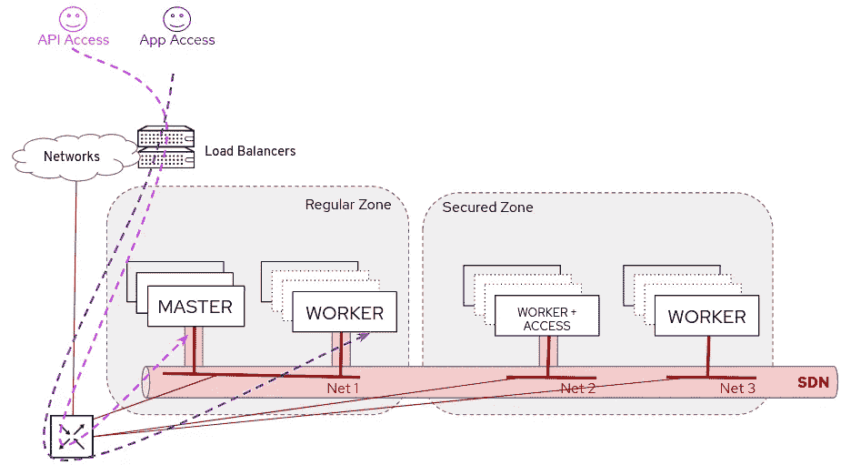
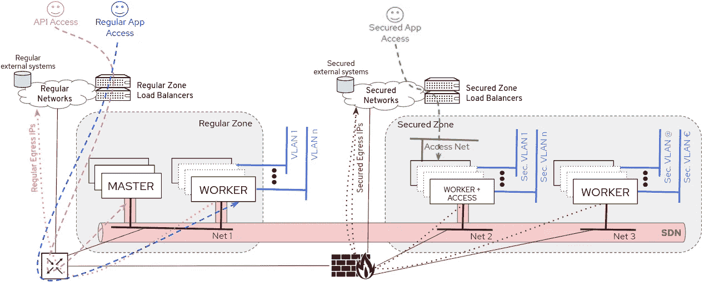
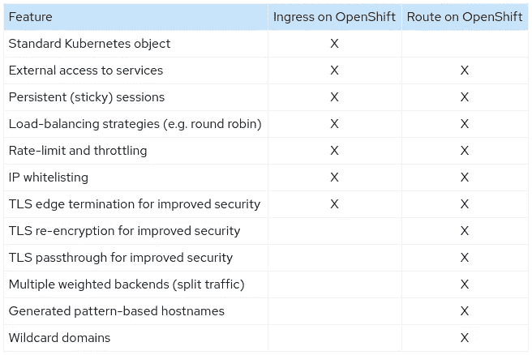
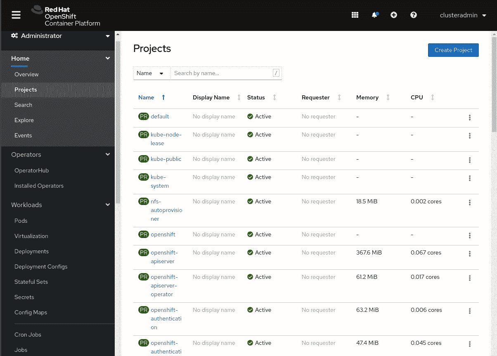
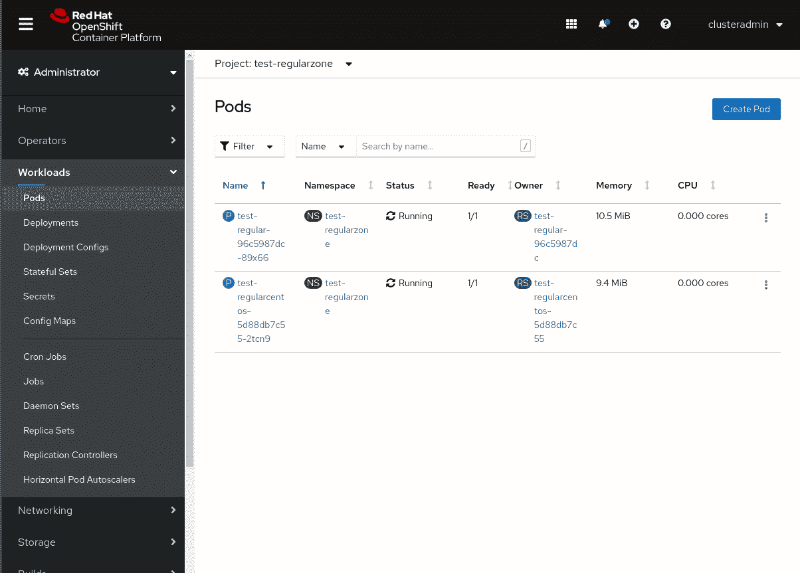

# OpenShift 工作节点中的安全区域—第三部分—网络配置

> 原文：<https://itnext.io/security-zones-in-openshift-worker-nodes-part-iii-network-configuration-3a887854a4d?source=collection_archive---------0----------------------->


在本帖中，我们将重点关注在安全区域中分离入口和出口流量所需的网络配置。我们还将配置一个额外的网络，用于从 pod 直接访问(Multus 中的二级接口)。

在开始配置该部件之前，您应该完成前面的步骤:

[](https://medium.com/@luis.ariz/security-zones-in-openshift-worker-nodes-part-ii-grouping-workers-8e97f1d601ba) [## OpenShift 工人节点中的安全区域—第二部分—工人分组

### 这是本系列的第二部分，我们将配置两组不同的工作人员。

medium.com](https://medium.com/@luis.ariz/security-zones-in-openshift-worker-nodes-part-ii-grouping-workers-8e97f1d601ba) 

# 概观

我们配置的下一步是分割网络流量。请记住，我们是从这个设置开始的:



在这一点上，我们希望通过添加一个连接到专用接入网络的新入口控制器，为想要访问我们新安全区域上的应用的用户创建一个新的入口点。

我们需要包括一个防火墙，将连接到安全的网络。这也将

在这一步中，我们还将为我们的 pod 配置额外的网络(OpenShift SDN 的外部),在我们的情况下，这些网络将是孤立的网络(您需要连接到该网络才能访问其上的资源，这些网络上不会有任何网关)。



> 注意:如果您正在使用 Machine API 创建新节点，此时不可能在 MachineSet 定义中包含多个接口，因此您需要将这些接口附加到虚拟机，作为一个额外的步骤

因此，本节将涵盖:

*   分离出口流量
*   分割入口流量
*   外部 VLAN 访问配置(Multus)
*   SDN 内部的防火墙规则(网络策略规则)

**分流出口流量**

这很容易配置，只要你在两者之间放置一个新的路由器。这是因为默认情况下，pod 使用节点的 IP 来访问外部资源，而且由于我们使用的是位于已知网络中的专用节点，这些节点连接到这个新路由器，因此我们可以根据需要管理该流量。

我们在示例中包括了防火墙，这样我们可以阻止来自特定区域的连接。还有其他选择，例如，您可以在 OpenShift 中[配置出口防火墙，以限制一些或所有 pod 可以从集群内部访问的外部主机，即使没有外部防火墙。](https://docs.openshift.com/container-platform/4.5/networking/openshift_sdn/configuring-egress-firewall.html)

还有另一种可能有用的配置。[您可以配置一个 IP 池，并将该池附加到一个命名空间，以便在该命名空间中使用其中一个 IP 而不是节点的 IP。](https://docs.openshift.com/container-platform/4.5/networking/openshift_sdn/assigning-egress-ips.html)为什么这会有用？考虑一个必须区分通过源 IP 访问其服务的用户的外部系统，或者使用 IP-用户相关性进行跟踪的系统。在这些情况下，如果您使用节点的 IP，您无法知道流量是来自一个名称空间还是来自任何其他名称空间，因为源 IP 是运行在同一主机上的所有 pod 的某个 IP，独立于它们所属的名称空间。

在我们的例子中，我们不会配置它，但是如果它对您的特定用例有意义，您应该研究这个选项。

**分裂外部的 VLAN (Multus)**

这也很容易，您只需决定哪些 VLAN 连接到每个区域中的节点，例如，您可以在您的交换机中只允许新区域 worker 中的 VLAN X，因此即使 OpenShift 中的任何人在安全区域 worker 之外配置它，它也不会工作。

**分流入口流量**

入口情况不同，因为我们需要在集群中有一个新的“入口点”。该入口点是入口控制器。我们可以创建一个新的路由器，并使用入口控制器路由分片功能将“基本域 URI”附加到这个新的控制器。

但是首先，什么是入口控制器？Kubernetes 有一个对象管理对集群中服务的外部访问: *Ingress* 对象。为了让入口资源工作，集群必须运行一个*入口控制器*，它实际上实现了入口资源，接受流量并查看*服务的 POD 端点。*


因此*入口控制器*是管理进入集群的入口流量的实现，正如您可以想象的，在 vanilla Kubernetes 中有多个选项，有时每个选项都有自己的功能

在 OpenShift 中，入口控制器基于 ha proxy(OCP 4.4 版的 v2)，但是您可以使用两种不同的对象来创建它:

*   Kubernetes *入口*物体
*   OpenShift *路线*对象

第一个是标准的 Kubernetes 对象，而第二个是在 OpenShift 中完成的 API 的扩展，能够提供更大的功能列表:



默认情况下，你将使用 *Route* 对象(因为它们有更多的功能)，但是如果你想坚持标准的 Kubernetes 特性，你也可以这样做。在我们的例子中，我们将使用*路由(路由器入口控制器)。*

*IngressController*定义附加了一个在 OpenShift 部署期间配置的域，但是您可以创建不同的域，甚至可以将这些域附加到其他 Ingres controller。

假设我们想要使用通配符** . securezoneapps .<ocpclustername>来访问新安全区域的应用程序。<域>和*让** . apps .<OCP clustername>。<域>* 访问“常规区”应用程序。后一种路由已经在我们的 OpenShift 集群中进行了配置，我们只需要创建新的路由器并将新的域分配给这些路由器，同时将新的路由器绑定到所需的安全访问+工作节点……这正是我们在配置中要做的事情。

关于我们的设计理念，还有一点必须讨论，接入网附加到 IngressController，以及它是如何“发布”的。

首先，让我们了解 IngressController 是如何在集群外部“发布”的。IngressControllers 是 PODs，因此它们必须使用 Kubernetes 构件来使它们在 SDN 外部可用。Kubernetes 有多种类型，可以将外部流量定向到 PODs，如将接口配置为*主机网络* ( `hostNetwork: true`)或使用类型为 NodePort 的 [*服务*、类型为 LoadBalancer 的*服务*等，](https://kubernetes.io/docs/concepts/services-networking/service/)默认情况下，OpenShift 中的 Ingres controller(*endpoint publishingstrategy*键)，根据已部署的平台选择主机网络、服务节点端口或服务负载平衡器:

*   AWS: `**LoadBalancerService**`(带外部范围)
*   天蓝色:`**LoadBalancerService**`(带外景)
*   GCP: `**LoadBalancerService**`(带外视镜)
*   其他:`**HostNetwork**`

我的实验室是使用裸机 UPI 在虚拟机上部署的，让我们检查一下我的路由器使用的是什么，首先让我们看看它是否使用了*主机网络:*

```
$ oc get pod -n openshift-ingress router-default-7869647cbd-48w5c -o yaml | grep -i hostnetwork
    openshift.io/scc: hostnetwork
        f:hostNetwork: {}
  hostNetwork: true
```

在我的例子中，我的路由器是使用 HostNetwork 发布的。

使用主机网络有一些缺点，例如，它限制了 Pod 可以被调度的位置的数量，因为我不能在同一个节点中放置两个监听同一个 TCP 端口的不同的 Pod。这很重要，因为我们的路由器将在端口 TCP 80 和 443 中侦听，所以我们每个节点只能有一个路由器，并且我们在配置副本数量时需要考虑到这一点(我们希望专用两个节点来运行我们的路由器，所以我不能配置 2 个以上的副本)。

到目前为止，我们已经了解了如何从外部访问 IngressControllers，但是如何在安全区域和常规区域中进行单独的访问呢？

嗯，如果使用*负载均衡器*类型，有了新的 LB，你将有一个不同的接入点。问题是，我能使用*负载均衡器*型吗？嗯，我的部署是模拟裸机 UPI 安装，这意味着我不能使用服务*负载平衡器*类型，我将需要使用*主机网络或节点端口服务。*

> 注意:将来 OpenShift 可能会支持 [MetalLB](https://metallb.universe.tf/) 在裸机部署中提供负载平衡器服务类型。

在我使用*主机网络或节点端口服务*的情况下，我只需在我的节点中配置额外的网络(默认情况下，IngressController 将监听所有节点接口)。

关于新的接入网络配置，最好理解我的节点中的当前配置是什么，以便更好地理解将在下面解释的一些概念。让我们回顾一下 secure access+worker 节点中的接口，这样我们就知道这个外部访问网络将使用的接口名称。我们需要进入节点来回顾一下。

在 OpenShift 4.5 中，我们有三个选项(两个来自 CLI，一个来自 Web 控制台)来运行访问节点的命令行(不要在服务器内部更改配置，请记住，您必须对 RHCOS 节点使用 MachineConfig！):

*   CLI 方法 1:使用您在安装过程中注入的 ssh 密钥和预先配置的“核心”用户跳转到带有 SSH 的节点。您可以使用命令 *oc get node -o wide* 知道节点的 IP

```
$ oc get node  -o wide | awk {'print $1" " $6'} | column -t
NAME                               INTERNAL-IP
master0.ocp.136.243.40.222.nip.io  192.168.120.11
master1.ocp.136.243.40.222.nip.io  192.168.120.12
master2.ocp.136.243.40.222.nip.io  192.168.120.13
worker0.ocp.136.243.40.222.nip.io  192.168.120.15
worker1.ocp.136.243.40.222.nip.io  192.168.120.16
worker2.ocp.136.243.40.222.nip.io  192.168.126.17
worker3.ocp.136.243.40.222.nip.io  192.168.126.18
worker4.ocp.136.243.40.222.nip.io  192.168.126.19$ ssh -i sshkey core@192.168.126.17
Red Hat Enterprise Linux CoreOS 45.82.202007062333-0
  Part of OpenShift 4.5, RHCOS is a Kubernetes native operating system
  managed by the Machine Config Operator (`clusteroperator/machine-config`).WARNING: Direct SSH access to machines is not recommended; instead,
make configuration changes via `machineconfig` objects:
  [https://docs.openshift.com/container-platform/4.5/architecture/architecture-rhcos.html](https://docs.openshift.com/container-platform/4.5/architecture/architecture-rhcos.html)---
[core@worker2 ~]$
```

*   CLI 方法 2:使用*oc debug node/<name>*在节点中创建特权 pod(记住运行 *chroot /host* 以允许运行所有命令并访问节点中的所有文件)

```
$ oc debug node/worker2.ocp.136.243.40.222.nip.io
Starting pod/worker2ocp13624340222nipio-debug ...
To use host binaries, run `chroot /host`
Pod IP: 192.168.126.17
If you don't see a command prompt, try pressing enter.sh-4.2# chroot /hostsh-4.4# hostname
worker2.ocp.136.243.40.222.nip.io
```

*   Web 控制台方法(OCP 4.5 中的新功能):这与 *oc 调试*相同，但是是图形化的



在我的例子中，当我运行" *ip a* "来检查接口时，我得到如下输出:

```
1: lo: <LOOPBACK,UP,LOWER_UP> mtu 65536 qdisc noqueue state UNKNOWN group default qlen 1000
    link/loopback 00:00:00:00:00:00 brd 00:00:00:00:00:00
    inet 127.0.0.1/8 scope host lo
       valid_lft forever preferred_lft forever
    inet6 ::1/128 scope host 
       valid_lft forever preferred_lft forever
2: ens3: <BROADCAST,MULTICAST,UP,LOWER_UP> mtu 1500 qdisc fq_codel state UP group default qlen 1000
    link/ether 52:54:60:00:01:0c brd ff:ff:ff:ff:ff:ff
    inet 192.168.126.17/24 brd 192.168.126.255 scope global dynamic noprefixroute ens3
       valid_lft 14110sec preferred_lft 14110sec
    inet6 fe80::c3bd:f88:4446:df63/64 scope link noprefixroute 
       valid_lft forever preferred_lft forever
3: ens4: <BROADCAST,MULTICAST,UP,LOWER_UP> mtu 1500 qdisc fq_codel state UP group default qlen 1000
    link/ether 52:54:60:20:01:0c brd ff:ff:ff:ff:ff:ff
    inet 192.168.250.191/24 brd 192.168.250.255 scope global dynamic noprefixroute ens4
       valid_lft 3313sec preferred_lft 3313sec
    inet6 fe80::5ea4:1b25:f01d:9e9c/64 scope link noprefixroute 
       valid_lft forever preferred_lft forever
4: ens10: <BROADCAST,MULTICAST,UP,LOWER_UP> mtu 1500 qdisc fq_codel state UP group default qlen 1000
    link/ether 52:54:00:e2:2c:79 brd ff:ff:ff:ff:ff:ff
    inet 192.168.210.227/24 brd 192.168.210.255 scope global dynamic noprefixroute ens10
       valid_lft 3312sec preferred_lft 3312sec
    inet6 fe80::79a4:e366:be9d:41e7/64 scope link noprefixroute 
       valid_lft forever preferred_lft forever
9: ovs-system: <BROADCAST,MULTICAST> mtu 1500 qdisc noop state DOWN group default qlen 1000
    link/ether b6:3c:74:9b:a9:44 brd ff:ff:ff:ff:ff:ff
10: br0: <BROADCAST,MULTICAST> mtu 1450 qdisc noop state DOWN group default qlen 1000
    link/ether ea:6c:07:83:7d:46 brd ff:ff:ff:ff:ff:ff
11: vxlan_sys_4789: <BROADCAST,MULTICAST,UP,LOWER_UP> mtu 65000 qdisc noqueue master ovs-system state UNKNOWN group default qlen 1000
    link/ether fe:db:05:6d:2b:31 brd ff:ff:ff:ff:ff:ff
    inet6 fe80::fcdb:5ff:fe6d:2b31/64 scope link 
       valid_lft forever preferred_lft forever
12: tun0: <BROADCAST,MULTICAST,UP,LOWER_UP> mtu 1450 qdisc noqueue state UNKNOWN group default qlen 1000
    link/ether 42:e9:24:8f:31:93 brd ff:ff:ff:ff:ff:ff
    inet 10.129.2.1/23 brd 10.129.3.255 scope global tun0
       valid_lft forever preferred_lft forever
    inet6 fe80::40e9:24ff:fe8f:3193/64 scope link 
       valid_lft forever preferred_lft forever
13: veth5da406c1@if3: <BROADCAST,MULTICAST,UP,LOWER_UP> mtu 1450 qdisc noqueue master ovs-system state UP group default 
    link/ether d6:f4:29:19:4d:c8 brd ff:ff:ff:ff:ff:ff link-netns a67d8aab-da1d-40c7-97a4-948e785ae899
    inet6 fe80::d4f4:29ff:fe19:4dc8/64 scope link 
       valid_lft forever preferred_lft forever
```

您可以在这个虚拟机上找到一个网桥(br0)接口、veth 接口、一个用于 SDN 的隧道接口(tun0)和三个“物理”网卡: *ens3* 、 *ens4* 和 *ens10* 。第一个是用于 SDN 的网卡， *ens4* 是我们想要用来将 VLANs 直接连接到 PODs (Multus)的网卡，而 *ens10* 是连接到外部接入网络的接口(只存在于安全接入+工作节点中)。

但是，您在命令行输出中看到了更多东西吗？是的，这些网卡已经有了一个 IP，这是因为我已经在这些网络上启用了 DHCP，所以我们可以说“我们已经完成了接口配置”，但是如果您没有基于 MAC 地址配置 IP 分配(因此 IP 可能会更改)，最好至少为绑定到 IngressControllers 的 IP 配置静态 IP，因为您应该放置一个指向所有这些节点的负载平衡器，所以您必须事先知道 IP，以便在负载平衡器池上配置它们…所以我们来看一下如何配置 RHCOS 接口，更具体地说，配置静态 IP。

还有一件事。我们希望只配置静态 IP，而不是额外的网关，因为我的示例设置将负载平衡器直接连接到接入网络，作为 OpenShift secure access+worker 节点，因此不需要外部路由器来连接节点和负载平衡器。这是一种常见的设置，但是如果您需要在带有 IngressController 和负载平衡器的节点之间建立 L3 连接，您还需要在节点中配置静态路由，请记住这一点。

在 OpenShift 4.5 中，如果您的节点中有 Red Hat CoreOS，则有多种方法来处理网络配置(如果是 RHEL，则必须在节点上手动配置或通过外部自动化进行配置):

*   机器操作员:还记得我们讨论过如果您使用 Red Hat CoreOs，如何在节点上配置操作系统吗？，嗯，接口配置是一种 OS 配置，所以你可以用这种方法在节点中配置一个新接口的参数。在 MachineConfig 中，您可以在节点上的特定位置包含文件，这样您就可以将网络配置文件放在正确的路径中，这样就完成了，唯一的缺点是您需要使用 URL 格式对文件进行编码(想象一下，您想要放置“Hello World”，您将必须写下“Hello%20World”)，但是您可以使用 python 来帮助完成这一工作。的确，这种配置的例子并不多，但是你可以查看下面的例子，看看如何配置 python 命令(alias 命令都在一行中，尽管这里显示的是多行)，以及如何在 MachineConfig 中使用输出…但是…这种方法有一个问题，即*machine config*被设计为应用于一个服务器池，因此在所有节点上有一个通用的配置。如果您正在配置 DHCP，这是可以的，但是如果您想要配置静态 IP…那么，这些 IP 必须是唯一的。您可以为每个节点创建一个 *MachineConfigPool* (即使用标签【kubernetes.io/hostname*】而不是每个角色(或者至少是每个具有静态 IP 的节点)。*

```
$ alias urlencode='python3 -c "import sys, urllib.parse; print(urllib.parse.quote(sys.argv[1]))"'$ urlencode 'DEVICE="ens10"
> BOOTPROTO="static"
> NM_CONTROLLED="yes"
> ONBOOT="yes"
> TYPE="Ethernet"
> IPADDR=192.168.210.102
> NETMASK=255.255.255.0
DEVICE%3D%22ens10%22%0ABOOTPROTO%3D%22static%22%0ANM_CONTROLLED%3D%22yes%22%0AONBOOT%3D%22yes%22%0ATYPE%3D%22Ethernet%22%0AIPADDR%3D192.168.210.102%0ANETMASK%3D255.255.255.0apiVersion: machineconfiguration.openshift.io/v1
kind: MachineConfig
metadata:
  labels:
    machineconfiguration.openshift.io/hostname: worker2.ocp.136.243.40.222.nip.io
  name: 50-example-nicconfig
spec:
  config:
    ignition:
      version: 2.2.0
    storage: 
      files: 
      - contents: 
         source: data:,DEVICE%3D%22ens10%22%0ABOOTPROTO%3D%22static%22%0ANM_CONTROLLED%3D%22yes%22%0AONBOOT%3D%22yes%22%0ATYPE%3D%22Ethernet%22%0AIPADDR%3D192.168.210.102%0ANETMASK%3D255.255.255.0
       filesystem: root
       mode: 420
       path: /etc/sysconfig/network-scripts/ifcfg-ens10
```

*   集群网络操作员:此方法旨在用于 Multus 接口配置，而不是用于节点网络配置。您可以查看 [Openshift 文档中的一些示例，了解 Multus 的一些配置示例。](https://docs.openshift.com/container-platform/4.5/networking/multiple_networks/understanding-multiple-networks.html)
*   NMSTATE 操作符:这是我的首选方式。Kubernetes-nmstate 操作符提供了一个通过 Kubernetes API 驱动的声明性节点网络配置。这意味着您可以在 Kubernetes 对象中指定节点的接口配置(种类:*节点网络配置策略*)。这样做的唯一缺点是，默认情况下，OpenShift 中不包含它，但我们有一个好消息，当您在集群上安装 [OpenShift 容器虚拟化](https://www.openshift.com/blog/blog-openshift-virtualization-whats-new-with-virtualization-from-red-hat)时，它会安装这个 *nmstate* 操作符，因此这里的技巧是[安装 OpenShift 容器虚拟化操作符](https://docs.openshift.com/container-platform/4.4/cnv/cnv_install/installing-container-native-virtualization.html)，以便更容易配置节点的网络。我对此不太确定，但可能在未来，*nm state*T13 的[网络附加选项将在](https://github.com/kubevirt/cluster-network-addons-operator#nmstate)[OpenShift ClusterNetworkOperator](https://github.com/openshift/cluster-network-operator)中提供，安装起来会更容易(甚至会默认提供)。看看下面的例子。注意 nodeSelector，我们不能使用包含多个节点的“通用”选择器(即安全区域角色)，如果您想要配置唯一的静态 IP)。

```
apiVersion: nmstate.io/v1alpha1
kind: NodeNetworkConfigurationPolicy
metadata:
  name: worker2-extaccess-static
spec:
  nodeSelector:
    kubernetes.io/hostname: worker2.ocp.136.243.40.222.nip.io
  desiredState:
    interfaces:
    - name: ens10
      type: ethernet
      state: up
      ipv4:
        address:
        - ip: 192.168.210.62
          prefix-length: 24
        dhcp: false
        enabled: true
```

可以想象，我想使用 *nmstate* 方法，但是这里我们发现了两个问题。

第一个问题很容易解决，默认情况下我们的集群上没有 *nmstate* ，但是我们可以安装 OpenShift 虚拟化(CNV 操作符),这将部署它，正如您已经知道的那样。

第二个问题稍微复杂一点。在我们的用例中，我们必须创建一个不同的工作人员组，除非我们指定(使用污点和容忍)，否则我们不想在其中运行工作负载。嗯，当你安装一个操作符并创建操作符 CRD 时，它一定已经实现了容错的用法，这意味着你可以在操作符内置的容错之上添加你的容错。在 OpenShift 虚拟化操作符中，该实现还没有准备好，所以当您部署它时，一些功能将只在非自定义感染的节点上工作，所以我们不能在我们的安全区域中使用 *nmstate* 操作符功能。

好的，那么我们可以选择第二个选项:MachineConfigs，但是请记住我们在 MachineConfigs 中遇到的独特配置的问题。

所以现在，在解释了我们拥有的多个选项以及为什么我们不能将它们用于这个用例之后，我们可以说我们将要做一些激烈的事情，以另一种受支持的方式配置接口，通过重新安装节点和使用内核参数设置静态 ips 的[，但是由于我不想重新开始，我将做一些我们“不应该”做的事情:我们将在 RHCOS 上手动配置接口。还记得我之前说过的不要手动配置任何东西吗？我们应该使用机器操作员还是其他方式？在这种情况下，我不想每个节点都有一个 MachineConfigPool，也不想重新安装节点，所以我将使用手动配置(**我不知道这种方法的可支持性**)。希望在不久的将来，我们会让 *nmstate* 操作符在 OpenShift 中处理污点。](https://docs.openshift.com/container-platform/4.5/installing/installing_bare_metal/installing-bare-metal.html#installation-user-infra-machines-static-network_installing-bare-metal)

您将在下一节中进行实际配置(OpenShift 配置)。

一旦我们了解了 Ingres controller 是如何发布的，以及我们如何配置将用于访问它的网络，我们现在就可以专注于如何在默认的和新的 Ingres controller 之间划分使用。

您可以通过两种方式选择将由 IngressController 发布的路由:

*   [使用 *routeSelector*](https://docs.openshift.com/container-platform/4.5/networking/ingress-operator.html#nw-ingress-sharding-route-labels_configuring-ingress) :用户可以使用一个标签来选择何时在这个 IngressController 中发布路由
*   [使用命名空间选择器](https://docs.openshift.com/container-platform/4.5/networking/ingress-operator.html#nw-ingress-sharding-namespace-labels_configuring-ingress):带有此标签的某些命名空间将始终在此 IngressController 中发布它们的路由

如果我们不包括任何选择器，IngressControllers 将发布所有路由，因此我们的想法是为默认和安全区域 Ingres controller 配置相反的选择器，这样我们就可以确保当我们要发布安全区域应用程序时，默认 Ingres controller 不会包括它，只有安全区域 Ingres controller 能够路由该 URL。

在这里，我们应该清楚如何管理对这个 *IngressController* 的访问。如果我们选择路由标签，任何用户都可以使用该标签来使用新的 *IngressController，*，这是不可取的，所以在我们的例子中，由于 clusteradmin 将是唯一一个创建项目/名称空间的人(我们将在下一篇文章中介绍这一点)，我们可以在名称空间中分配一个标签，该标签允许在安全区域中创建路由，同时我们阻止其他用户使用安全的 IngressController。

由于我们需要配置相反的标签，因此我们也将配置默认的 IngressController，但是，为了尽量减少默认对象和已部署对象中的重新配置，我们将采用以下方式:

*   新的 IngressController:仅可由“带有标签 X”的命名空间使用
*   默认 IngressController:只能由“没有标签 X”的命名空间使用

**SDN 内部防火墙**

[Kubernetes 有一个称为网络策略的特性](https://kubernetes.io/docs/concepts/services-networking/network-policies/)，如果网络插件支持(默认 OpenShift SDN 支持)，它允许配置防火墙规则来阻止 SDN 内部的连接。

您需要考虑到某些网络插件具有扩展功能，例如在 Calico(您也可以将 Calico 与 OpenShift 一起使用，因为它是一个经过认证的网络插件)中，您有适用于整个集群(GlobalNetworkPolicy)的规则，而不是基于每个名称空间。

在我的例子中，我将使用默认配置的 OpenShift SDN(这里不讨论另一种“多租户”配置)

在开始解释我们如何使用网络策略之前，您需要考虑到 Multus 或 pods 与 HostNetwork 使用的接口不在网络策略规则实施范围内，在这些情况下，您需要使用外部防火墙。

得益于网络策略，用户可以在其命名空间中配置防火墙规则，例如，他们可以配置拒绝当前命名空间中的所有非白名单流量，或者允许所有流量，但仅允许来自另一个特定命名空间的流量，或者配置常规源网络许可。您需要记住的是，用户根据名称空间配置网络策略。

如果您认为默认情况下所有网络流都被允许进入集群，那么这与我们有关。这里我们可以采取几种方法:

*   我们可以让用户阻止任何不需要的流量
*   作为管理员，我们可以在任何新创建的名称空间中包含默认的拒绝所有网络策略，并让用户打开他们需要的连接
*   作为管理员，我们根据所需的网络策略为用户创建名称空间(并且我们防止用户触及内部防火墙规则)

如果您信任您的用户，选项 1 是好的，因为如果他们没有配置正确的规则(或者即使他们没有配置任何东西)，一些不好的事情可能会发生，因为没有什么会阻止跨区域流量。

选项 2 类似于选项 1，但对用户来说更容易，因为他们需要专门打开正确的流程。

使用选项，3 个集群管理员可以完全控制用户访问，但是我们将在创建新项目时限制灵活性，因为用户需要要求管理员提前创建和设置他们的项目/名称空间。

我将选择选项 3，这样我可以在下一节解释如何限制用户创建项目的能力以及其他权限限制配置。

由于 RBAC 将在下一节中配置，此时我们只需担心为每个新命名空间配置什么默认网络策略。为了在我们的安全区域中保持安全，我会说新的名称空间将不能与任何其他名称空间通信(默认情况下)，但是“正确的”Ingresscontroller 将能够到达 pod，因此用户可以发布他们的应用程序的路由。

# **OpenShift 配置(网络配置)**

> 注意:我们将使用具有集群管理员权限的 OpenShift 用户来完成所有这些配置

第一步，正如我们之前讨论的，我们需要在我的节点中配置接入网络，以便新路由器能够使用它。

我将在这里讨论**最坏的情况**，所以当你已经有了一个节点，并且你意识到你想用它作为一个访问+工作者。我为什么这么说？嗯，在阅读了下面的解释之后，你会更好地理解，如果你想在安装那个节点之前设置任何静态 IP，最好提前知道

**1-在接入+工作节点上配置外部接入网络**

使用 ssh、 *oc debug、*或 Web 控制台(方法如上所述)跳转到节点，执行如下操作:

```
$ oc debug node/worker2.ocp.136.243.40.222.nip.io
Starting pod/worker2ocp13624340222nipio-debug ...
To use host binaries, run `chroot /host`
Pod IP: 192.168.126.17
If you don't see a command prompt, try pressing enter.sh-4.2# chroot /hostsh-4.4# nmcli con showNAME                UUID                                  TYPE      DEVICE 
Wired connection 2  14c0ead1-d070-35d9-8287-6eba5e33137e  ethernet  ens3   
Wired connection 1  69d836ff-ce43-33d9-a2ab-856d06c5fdba  ethernet  ens10  
Wired connection 3  41c7c035-f058-3cb2-a33e-746035acc7fc  ethernet  ens4sh-4.4# nmcli con mod "Wired connection 1" ipv4.addresses 192.168.210.102/24sh-4.4# nmcli con mod "Wired connection 1" ipv4.method manualsh-4.4# nmcli con down "Wired connection 1"Connection 'Wired connection 1' successfully deactivated (D-Bus active path: /org/freedesktop/NetworkManager/ActiveConnection/6)sh-4.4# nmcli con up "Wired connection 1"Connection successfully activated (D-Bus active path: /org/freedesktop/NetworkManager/ActiveConnection/7)sh-4.4# ip a show ens104: ens10: <BROADCAST,MULTICAST,UP,LOWER_UP> mtu 1500 qdisc fq_codel state UP group default qlen 1000
    link/ether 52:54:00:e2:2c:79 brd ff:ff:ff:ff:ff:ff
    inet 192.168.210.102/24 brd 192.168.210.255 scope global noprefixroute ens10
       valid_lft forever preferred_lft forever
    inet6 fe80::79a4:e366:be9d:41e7/64 scope link noprefixroute 
       valid_lft forever preferred_lft forever
```

在另一个安全访问+工作节点中重复该操作。

> 注意:同样，为这一非常具体的使用情形配置静态 IP 的最佳方式是在部署节点时(查看上一节中的说明)，而不是在节点上使用 nmcli 或任何其他直接配置。

**2-创建新的 Ingres controller**

我们在接入网络中有了带有静态 IP 的节点，现在是时候创建将在该网络上侦听的新 IngressControllers 了。新 IngressController 配置的要点是:

*   我将使用新安全区域的** . Secure apps .<OCP-cluster-name><domain>*URL。
*   我还将使用节点选择器来确保 IngressController 将由安全访问+工作节点托管。
*   我将用标签“ *securityzone= secure* ”配置一个命名空间选择器

对象应该是这样的:

```
apiVersion: operator.openshift.io/v1
kind: IngressController
metadata:
  name: secure-ingress
  namespace: openshift-ingress-operator
spec:
  endpointPublishingStrategy:
    type: HostNetwork 
  domain: secureapps.ocp.136.243.40.222.nip.io
  replicas: 2
  nodePlacement:
    nodeSelector:
      matchLabels:
        node-role.kubernetes.io/secure-worker: ""
        ingressaccess: "true"
  namespaceSelector:
    matchExpressions:
      - key: securityzone
        operator: In
        values:
        - secure
```

如前所述，我们还需要配置默认的 IngressController，通过配置一个 *namespacesSelector* ，它只允许用户访问任何没有“ *securityzone= secure* 标签的名称空间。

```
$  oc edit ingresscontrollers.operator.openshift.io -n openshift-ingress-operator default
```

您需要添加粗体文本中的内容:

```
...
spec:
 **namespaceSelector:
    matchExpressions:
    - key: securityzone
      operator: DoesNotExist**
...
```

如果创建新的 IngressController 对象，您将立即看到在名称空间“ *openshift-ingress* ”下创建了两个窗格:

```
# oc get pod -n openshift-ingress
NAME                                          READY   STATUS    RESTARTS   AGE
router-default-7869647cbd-48w5c               1/1     Running   0          30h
router-default-7869647cbd-q6597               1/1     Running   0          31h
router-secure-zone-ingress-5956858749-8v4gr   0/1     Pending   0          48s
router-secure-zone-ingress-5956858749-jcftz   0/1     Pending   0          47s
```

你可以等，但是我告诉你，他们不会从*待定*通过，为什么？因为我们试图将一些工作负载(IngressController)放在我们的超级超级安全区域中，而不给 it 访问它的权限。请记住，我们通过配置容差来提供访问权限，但在这里，直接在这些单元中配置容差并不是一个好主意，因为它们可能会被销毁或创建，这取决于我们是否扩大或减少副本的数量。我们可以做的是在默认情况下，在 *OpenShift-Ingress* 名称空间中创建的所有工作负载中配置我们的容忍度。

有一个特殊的注释**scheduler.alpha.kubernetes.io/defaultTolerations**，我们可以将它包含在命名空间对象中(不在项目对象中，考虑到这一点),它在所有部署中注入容错配置。在我们的例子中，我们希望配置这种容忍:

```
tolerations:
    - key: securityzone
      operator: Equal
      value: secure
      effect: NoSchedule
```

因此，注释将是粗体文本(提取自 *openshift-ingress* 名称空间对象定义):

```
...
  annotations:
    openshift.io/node-selector: ''
    openshift.io/sa.scc.mcs: 's0:c24,c4'
    openshift.io/sa.scc.supplemental-groups: 1000560000/10000
    openshift.io/sa.scc.uid-range: 1000560000/10000
 **scheduler.alpha.kubernetes.io/defaultTolerations: '[{"Key": "securityzone", "Operator":"Equal", "Value": "secure", "effect": "NoSchedule"}]'**
  managedFields:
 ...
```

在名称空间定义中包含该行，然后删除处于挂起状态的 pod(*oc delete pod xxxx*)，然后您将看到如何创建两个新的 pod，这一次它们将达到“正在运行”状态。您还可以检查它们在哪里运行，它们应该在安全访问+worker 节点中(在我的例子中是 worker2 和 worker3):

```
oc get pod -o wide -n openshift-ingress | awk {'print $1" " $2" " $7'} | column -t
NAME                                         READY  NODE
router-default-7869647cbd-48w5c              1/1    worker1.ocp.136.243.40.222.nip.io
router-default-7869647cbd-q6597              1/1    worker0.ocp.136.243.40.222.nip.io
router-secure-zone-ingress-5956858749-5ftt4  1/1    worker2.ocp.136.243.40.222.nip.io
router-secure-zone-ingress-5956858749-crrrp  1/1    worker3.ocp.136.243.40.222.nip.io
```

**3-网络策略**

默认情况下，任何命名空间都允许所有流量，但是一旦您配置了任何网络策略，只有策略中允许的流量不会被丢弃，因此我们需要配置规则以允许我们想要的流量，在我的示例中:

*   项目/命名空间内的所有流量
*   所有来自 OpenShift 监控系统的流量
*   来自 IngressController 的流量

前两点很容易。对于第一个规则，我们只需要在名称空间中配置这个规则:

```
kind: NetworkPolicy
apiVersion: networking.k8s.io/v1
metadata:
  namespace: <namespace name>
  name: allow-same-namespace
spec:
  podSelector:
  ingress:
  - from:
    - podSelector: {}
```

在下一节(RBAC 配置)中，我们将看到如何在名称空间创建中默认注入这个规则。

为了允许监控系统:

```
apiVersion: networking.k8s.io/v1
kind: NetworkPolicy
metadata:
  namespace: <namespace name>
  name: allow-from-openshift-monitoring
spec:
  ingress:
  - from:
    - namespaceSelector:
        matchLabels:
          network.openshift.io/policy-group: monitoring
  podSelector: {}
  policyTypes:
  - Ingress
```

最后一个有点棘手。

我们已经限制了从“错误的”Ingres Controller 对区域的访问，因为正如我们已经看到的那样，我们配置了命名空间选择器，所以我们在这里应该做的唯一事情是允许来自 Ingres controllers 的流量进入命名空间(Ingres controllers 在 openshift-ingress 命名空间中运行)…但是，正如您可以在 [OpenShift 文档](https://docs.openshift.com/container-platform/4.1/networking/configuring-networkpolicy.html)中找到的，如果 IngressController 配置了`**endpointPublishingStrategy: HostNetwork**`，那么 Ingress Controller Pod 在主机网络上运行。

当在主机网络上运行时，来自入口控制器的流量被分配了`**netid:0**`虚拟网络 ID (VNID)。与入口运营商相关联的名称空间的`**netid**`不同，因此`**allow-from-openshift-ingress**`网络策略中的`**matchLabel**`与来自`**default**`入口控制器的流量不匹配。

因为`**default**`名称空间被分配了`**netid:0**` VNID，所以您可以通过用`**network.openshift.io/policy-group: ingress**`标记您的`**default**`名称空间来允许来自`**default**`入口控制器的流量。

总之，我们需要向命名空间添加一个标签“default ”,这样我们就可以使用该标签来允许 Ingres controller 流量，因为我们的 Ingres controller 是使用 HostNetwork 发布的，它强制使用默认命名空间而不是 openshift-ingress 命名空间

```
oc edit namespace default
```

包括粗体文本的标签:

```
apiVersion: v1
kind: Namespace
metadata:
 **labels:
    network.openshift.io/policy-group: ingress**
  annotations:
...
```

现在，您可以使用以下网络策略来允许 IngressTraffic:

```
apiVersion: networking.k8s.io/v1
kind: NetworkPolicy
metadata:
  namespace: <namespace name>
  name: allow-from-openshift-ingress
spec:
  ingress:
  - from:
    - namespaceSelector:
        matchLabels:
          network.openshift.io/policy-group: ingress
  podSelector: {}
  policyTypes:
  - Ingress
```

**4-Multus**

为了配置 Multus，您必须在*networks . operator . open shift . io*对象类型的 *cluster* 实例中添加一个“附加网络”。

```
oc edit networks.operator.openshift.io cluster
```

在*规格*部分添加*附加网络*，包括:

*   您允许使用 VLAN 命名空间
*   插件类型([有多个可用的插件](https://docs.openshift.com/container-platform/4.5/networking/multiple_networks/understanding-multiple-networks.html)，我在这个例子中使用的是 *macvlan* ，你可以设置其他配置，比如其他模式中的 VLAN id，比如“*桥*类型)
*   主界面
*   IPAM 配置(我在这个网络中没有 DHCP，所以我将在我的 pod 上配置静态 IP)

```
...
spec:
 **additionalNetworks:
    - name: test-vlan
      namespace: test-securezone
      rawCNIConfig: '{ "cniVersion": "0.3.1", "type": "macvlan", "capabilities": { "ips": true }, "master": "ens4", "mode": "bridge", "ipam": { "type": "static" } }'
      type: Raw**
  clusterNetwork:
...
```

仅此而已。您只需要允许正确的 VLANs 访问正确的名称空间(记住，最终将由集群管理员创建名称空间，查看下一节关于 RBAC 的内容以了解更多信息)。

# **配置测试(网络配置)**

测试我们将创建两个名称空间和两个应用程序，一个在“常规区域”，另一个在“安全区域”，然后我们将运行一些测试:

*   检查应用程序是否可以通过路由访问，但只能由它们自己区域的入口控制器访问。
*   检查出口流量是否正在使用节点的 IPs
*   检查应用程序是否无法通信(在应用网络策略后)
*   检查两个应用程序是否都可以在其 pod 中使用外部 VLAN(Multus)

**1-入口流量**

让我们首先创建名称空间和应用程序(它将显示 POD 的名称)，首先是在常规区域上运行的应用程序。

命名空间:

```
apiVersion: v1
kind: Namespace
metadata:
  name: test-regularzone
```

应用程序:

```
apiVersion: apps/v1
kind: Deployment
metadata:
  namespace: test-regularzone
  name: test-regularzone
  labels:
    app: test-regularzone
spec:
  replicas: 1
  selector:
    matchLabels:
      app: test-regularzone
  template:
    metadata:
      labels:
        app: test-regularzone
    spec:
      containers:
      - name: test-regularzone
        image: gcr.io/google-samples/hello-app:1.0
```

然后是在安全区域运行的那个。

对于此命名空间，我们需要添加一个标签，以便为在此命名空间中创建的路由选择我们的安全 IngressController:

```
apiVersion: v1
kind: Namespace
metadata:
  name: test-securezone
 **labels:
    securityzone: secure**
```

应用程序:

```
apiVersion: apps/v1
kind: Deployment
metadata:
  namespace: test-securezone
  name: test-securezone
  labels:
    app: test-securezone
spec:
  replicas: 1
  selector:
    matchLabels:
      app: test-securezone
  template:
    metadata:
      labels:
        app: test-securezone
    spec:
      containers:
      - name: test-securezone
        image: gcr.io/google-samples/hello-app:1.0
**  tolerations:
        - key: "****securityzone****"
          operator: "Equal"
          value: "secure"
          effect: "NoSchedule"**
 **nodeSelector:
        node-role.kubernetes.io/secure-worker: ''**
```

我们检查运行它们的节点，以确保哪个区域托管它们:

```
$ oc get pod -o wide --all-namespaces | grep test | awk {'print $2" " $8'} | column -t
test-regularzone-95f775f45-vcnmg   worker0.ocp.136.243.40.222.nip.io
test-securezone-7b9f668668-p8rpk   worker4.ocp.136.243.40.222.nip.io
```

一切似乎都很好，现在让我们使用一个路由发布应用程序，但是为了这样做我们需要有一个*服务*对象。因为我刚刚创建了一个*部署*对象，所以还没有*服务*。这很重要，因为如果我使用" *oc new-app* "命令，它将创建*部署*和*服务*。我将创建这两个服务。

对于常规区域应用程序(该应用程序在 POD 中的端口 8080 上运行):

```
apiVersion: v1
kind: Service
metadata:
  name: test-regularzone
  namespace: test-regularzone
spec:
  selector:
    app: test-regularzone
  ports:
    - name: 8080-tcp
      protocol: TCP
      port: 8080
      targetPort: 8080
```

对于安全区域应用程序:

```
apiVersion: v1
kind: Service
metadata:
  name: test-securezone
  namespace: test-securezone
spec:
  selector:
    app: test-securezone
  ports:
    - name: 8080-tcp
      protocol: TCP
      port: 8080
      targetPort: 8080
```

现在我们可以创建路线了。我们可以使用“*oc expose service<service name>*”命令或路由对象定义来发布应用程序。我将第一种方法用于常规区域的应用程序，第二种方法用于安全区域，这样你就可以同时看到这两种方法。

我从常规区域应用程序开始。我在命令中使用默认域名(这是针对“常规区域”)包含主机名

```
$ oc expose svc test-regularzone -n test-regularzone --hostname=hello.apps.ocp.136.243.40.222.nip.ioroute.route.openshift.io/test-regularzone exposed
```

对于运行安全区域的服务器，我将使用描述符进行配置(也可以使用 OC CLI，这只是为了展示一个不同的示例):

```
kind: Route
apiVersion: route.openshift.io/v1
metadata:
  name: test-securezone
  namespace: test-securezone
spec:
  host: hello.secureapps.ocp.136.243.40.222.nip.io
  to:
    kind: Service
    name: test-securezone
  port:
    targetPort: 8080-tcp
```

让我们检查一下常规区域的服务:

```
$ curl hello.apps.ocp.136.243.40.222.nip.io
Hello, world!
Version: 1.0.0
Hostname: test-regularzone-95f775f45-vcnmg
```

在安全区域中:

```
$ curl hello.secureapps.ocp.136.243.40.222.nip.io
Hello, world!
Version: 1.0.0
Hostname: test-securezone-7b9f668668-p8rpk
```

我们还可以检查每个路由仅由一个控制器提供服务。由于命名空间标签，test-regularzone 路由托管在默认的 IngressController:

```
oc describe route hello -n test-regularzone
Name:                   hello
Namespace:              test-regularzone
Created:                18 minutes ago
Labels:                 <none>
Annotations:            <none>
Requested Host:         hello.apps.ocp.136.243.40.222.nip.io
                          exposed on router default (host apps.ocp.136.243.40.222.nip.io) 18 minutes ago
Path:                   <none>
TLS Termination:        <none>
Insecure Policy:        <none>
Endpoint Port:          8080-tcpService:        test-regularzone
Weight:         100 (100%)
Endpoints:      10.128.2.72:8080
```

并且 test-securezone 路由托管在安全 IngressController 中:

```
oc describe route hello -n test-securezone
Name:                   hello
Namespace:              test-securezone
Created:                18 minutes ago
Labels:                 <none>
Annotations:            <none>
Requested Host:         hello.secureapps.ocp.136.243.40.222.nip.io
                          exposed on router secure-zone-ingress (host secureapps.ocp.136.243.40.222.nip.io) 9 minutes ago
Path:                   <none>
TLS Termination:        <none>
Insecure Policy:        <none>
Endpoint Port:          8080-tcpService:        test-securezone
Weight:         100 (100%)
Endpoints:      10.131.2.19:8080
```

但是，您如何能够完全确定您到达了正确的 IngressController(因此负载平衡器、DNS、路由等是正确的)。嗯，使用 *tcpdump* 是一个很好的选择，但是，既然它是一个不可变的操作系统并且 *tcpdump* 没有作为容器映像提供，你怎么能在 Red Hat CoreOS 中运行 *tcpdump* 呢？这里有一个窍门…

在 RHCOS 中，您可以找到创建 Fedora 容器的" *toolbox"* 命令，并且您可以在那里安装对节点进行故障排除所需的任何工具，在执行 *toolbox start* 之后，检查如何安装 *tcpdump* (已经安装了 *tcpdump* ，但是您可以使用此过程来安装您想要的任何东西):

```
$ oc debug node/worker2.ocp.136.243.40.222.nip.ioStarting pod/worker2ocp13624340222nipio-debug ...
To use host binaries, run `chroot /host`
Pod IP: 192.168.126.17
If you don't see a command prompt, try pressing enter.sh-4.2# chroot /hostsh-4.4# toolbox startTrying to pull registry.redhat.io/rhel8/support-tools...
Getting image source signatures
Copying blob fc5aa93e3b58 done
Copying blob 1a6747857d79 done
Copying blob 7256d4208767 done
Copying config 18ef4c45e2 done
Writing manifest to image destination
Storing signatures
18ef4c45e2b0cf15d13eabcb5f3f50fdcdb281f599dc4b259e6a4a896644cf75
Spawning a container 'toolbox-' with image 'registry.redhat.io/rhel8/support-tools'
Detected RUN label in the container image. Using that as the default...
command: podman run -it --name toolbox- --privileged --ipc=host --net=host --pid=host -e HOST=/host -e NAME=toolbox- -e IMAGE=registry.redhat.io/rhel8/support-tools:latest -v /run:/run -v /var/log:/var/log -v /etc/machine-id:/etc/machine-id -v /etc/localtime:/etc/localtime -v /:/host registry.redhat.io/rhel8/support-tools:latest[root@worker2 /]# yum install tcpdump -yUpdating Subscription Management repositories.
Unable to read consumer identity
Subscription Manager is operating in container mode.
This system is not registered to Red Hat Subscription Management. You can use subscription-manager to register.
Red Hat Universal Base Image 8 (RPMs) - BaseOS                                                                                                                                                                 3.5 MB/s | 766 kB     00:00   
Red Hat Universal Base Image 8 (RPMs) - AppStream                                                                                                                                                               23 MB/s | 3.9 MB     00:00   
Red Hat Universal Base Image 8 (RPMs) - CodeReady Builder                                                                                                                                                      105 kB/s |  11 kB     00:00   
Package tcpdump-14:4.9.2-6.el8.x86_64 is already installed.
Dependencies resolved.
Nothing to do.
Complete!
```

您可以在运行 IngressControllers 的所有节点中运行 *tcpdump* ，然后在尝试获取两个 URL 时检查数据包的去向。在我的例子中，我在我们为新的 IngressController 配置的 *ens10* 接口中运行了 *tcpdump* ，当我试图访问*hello . secure apps . OCP . 136 . 243 . 40 . 222 . nip . io*时，我在那里获得了流量，但当我试图访问*hello . apps . OCP . 136 . 243 . 40 . 222 . nip . io【T23*

您还可以运行额外的测试，您可以在/etc/hosts 中为指向“错误的”Ingres controller 的 URL 配置一个静态条目，从而模拟有人试图访问默认 Ingres controller 中的安全区域路由。这将会失败，因为正如我们所看到的，路由只在“正确的”Ingresscontroller 中发布。

**2-出口交通**

这是默认行为，所以我不会进行这个测试，但是如果您想要仔细检查，您可以使用 *tcpdump* 来检查出口流量是否正在使用节点的 IP。

在运行 PODs 的主机上运行 *tcpdump* ，然后跳转到 PODs 终端并尝试访问外部资源。我们不能使用我们已经部署的 pod，因为映像限制了对我们想要使用的命令的访问，所以我们可以使用我们在第一节中使用的部署对象，在第一节中，我们使用了 *centos/tools* 映像，并以特权访问权限运行它(查看下一点，我将确切地执行该操作)。

**3-网络策略**

对于这些测试，我们还需要一个映像来运行带有 ping、curl 等功能的 bash，因此我将使用 *centos/tools* 映像部署几个 PODs。如果您像我们之前那样部署该映像，当您尝试在容器内使用 ping 时，将会得到以下错误:

```
ping: permission denied (are you root?)
command terminated with exit code 1
```

我们将使用这个映像，但是我们将使用 ROOT 用户启动它，ROOT 用户需要足够的权限来执行此操作。最好的方法是创建一个 ServiceAccount，赋予这个帐户特殊的权限，然后使用它启动部署。让我们开始创建 ServiceAccount，每个名称空间一个:

```
$  oc create serviceaccount -n test-regularzone privilegeduserserviceaccount/privilegeduser created$ oc create serviceaccount -n test-securezone privilegeduserserviceaccount/privilegeduser created
```

然后将权限授予服务帐户:

```
$  oc adm policy add-scc-to-user privileged -n test-regularzone -z privilegeduserclusterrole.rbac.authorization.k8s.io/system:openshift:scc:privileged added: "privilegeduser"$ oc adm policy add-scc-to-user privileged -n test-securezone -z privilegeduserclusterrole.rbac.authorization.k8s.io/system:openshift:scc:privileged added: "privilegeduser"
```

最后，使用 ServiceAccount 创建*部署*，并在容器定义中添加*security context**privileged*，在规范中添加 *runAsUser:0* 。常规区域中应用程序的*部署*定义(检查粗体文本):

```
apiVersion: apps/v1
kind: Deployment
metadata:
  namespace: test-regularzone
  name: test-regularcentos
  labels:
    app: test-regularcentos
spec:
  replicas: 1
  selector:
    matchLabels:
      app: test-regularcentos
  template:
    metadata:
      labels:
        app: test-regularcentos
    spec:
 **serviceAccountName: privilegeduser**      **securityContext:
        runAsUser: 0**
      containers:
      - name: test-regularcentos
        image: centos/tools
        command: ["/bin/bash", "-c", "sleep 9000000"]
**securityContext:
          privileged: true 
          runAsUser: 0**
```

另一个在安全区:

```
apiVersion: apps/v1
kind: Deployment
metadata:
  namespace: test-securezone
  name: test-securecentos
  labels:
    app: test-securecentos
spec:
  replicas: 1
  selector:
    matchLabels:
      app: test-securecentos
  template:
    metadata:
      labels:
        app: test-securecentos
    spec:
 **serviceAccountName: privilegeduser**
**securityContext: 
        runAsUser: 0**
      containers:
      - name: test-securecentos
        image: centos/tools
        command: ["/bin/bash", "-c", "sleep 9000000"]
**securityContext:
          privileged: true**
      tolerations:
        - key: "securityzone"
          operator: "Equal"
          value: "secure"
          effect: "NoSchedule"
      nodeSelector:
        node-role.kubernetes.io/secure-worker: ''
```

现在让我们跳进豆荚终端，试着从一个 ping 到另一个。您可以通过多种方式在 POD 中运行命令:

*   使用*" oc exec<pod name>-ti—<command>"*(在本例中，该命令可以是*/bin/bash*…*/usr/bin/bash*，因为映像在该路径中托管 bash)

```
$ oc exec -n test-regularzone test-regularcentos-5d88db7c55-2tcn9 -ti -- hostnametest-regularcentos-5d88db7c55-2tcn9
```

*   使用*“oc rsh<pod name>”*

```
$ oc rsh -n test-regularzone test-regularcentos-5d88db7c55-2tcn9
sh-4.2$ hostname
test-regularcentos-5d88db7c55-2tcn9
```

*   使用 Web 控制台



让我们执行以下 PINGs 命令:

*   同一命名空间中的源和目标
*   不同命名空间中的源和目标

我首先检查 test-securezone 名称空间中一个 pod 的 IP:

```
$ oc exec -n test-securezone test-securecentos-757dd94f95-p4x8z -ti -- ip a | grep inetinet 127.0.0.1/8 scope host lo
    inet6 ::1/128 scope host 
    inet 10.131.2.22/23 brd 10.131.3.255 scope global eth0
    inet6 fe80::4822:8dff:fe0e:b4a1/64 scope link
```

您可以尝试从不同名称空间中的另一个 POD ping 它( *test-regularzone* )，ping 失败:

```
$ oc exec -n test-regularzone test-regularcentos-cc5d9555c-98xv5 -ti -- ping 10.131.2.22
PING 10.131.2.12 (10.131.2.22) 56(84) bytes of data.
...
```

您可以检查一下，如果您尝试相反的方法，从安全区域 ping 到常规区域，也会失败。

如果我尝试 ping 同一个名称空间中的两个 pod(*test-regular zone*)，ping 就会成功。这次我们使用“oc get pod”命令检查 IP:

```
$ oc get pod -n test-regular -o wide | awk {'print $1" " $6'} | column -tNAME                                IP
test-regularcentos-cc5d9555c-8m7vg  10.131.2.13
test-regularzone-95f775f45-nnws2    10.131.2.12
```

我们运行 ping 命令:

```
$ oc exec -n test-regular test-regularcentos-cc5d9555c-8m7vg -ti -- ping 10.131.2.12
PING 10.131.2.12 (10.131.2.12) 56(84) bytes of data.
64 bytes from 10.131.2.12: icmp_seq=1 ttl=64 time=0.928 ms
64 bytes from 10.131.2.12: icmp_seq=2 ttl=64 time=0.138 ms
...
```

最后一个测试是检查 IngressController 是否被允许，您只需请求已经创建的路由:

```
$ curl [http://hello.apps.ocp.136.243.40.222.nip.io/](http://hello.apps.ocp.136.243.40.222.nip.io/)Hello, world!
Version: 1.0.0
Hostname: test-regularzone-95f775f45-nnws2 $ curl [http://hello.secureapps.ocp.136.243.40.222.nip.io/](http://hello.secureapps.ocp.136.243.40.222.nip.io/)
Hello, world!
Version: 1.0.0
Hostname: test-securezone-7b9f668668-rlsjk
```

**4-Multus**

让我们部署一个连接到我们允许的网络的具有静态 IP 的 POD(名称: *test-vlan* )，并检查我是否连接到群集外部的 IP:

```
apiVersion: v1
kind: Pod
metadata:
  namespace: test-securezone
  name: test-secure-multus
  labels:
    app: test-secure-multus
  annotations:
    k8s.v1.cni.cncf.io/networks: '[
        {
                "name": "test-vlan",
                "ips": ["192.168.250.5/24"]
        }
]'
spec:
  serviceAccountName: privilegeduser
  securityContext: 
    runAsUser: 0
  containers:
  - name: test-securecentos
    image: centos/tools
    command: ["/bin/bash", "-c", "sleep 9000000"]
    securityContext:
      privileged: true 
  tolerations:
    - key: "securityzone"
      operator: "Equal"
      value: "secure"
      effect: "NoSchedule"
  nodeSelector:
    node-role.kubernetes.io/secure-worker: ''
```

部署 POD 后，检查 192.168.250.5 IPs 是否已分配给 POD:

```
oc exec -n test-securezone test-secure-multus  -ti -- ip a | grep inet
    inet 127.0.0.1/8 scope host lo
    inet6 ::1/128 scope host 
    inet 10.131.2.23/23 brd 10.131.3.255 scope global eth0
    inet6 fe80::d431:79ff:fe60:3a3e/64 scope link 
    inet 192.168.250.5/24 brd 192.168.250.255 scope global net1
    inet6 fe80::e03c:7fff:feab:9402/64 scope link
```

并尝试 ping 外部 IP (192.168.250.192)

```
oc exec -n test-securezone test-secure-multus  -ti -- ping 192.168.250.192
PING 192.168.250.192 (192.168.250.192) 56(84) bytes of data.
64 bytes from 192.168.250.192: icmp_seq=1 ttl=64 time=2.00 ms
64 bytes from 192.168.250.192: icmp_seq=2 ttl=64 time=0.222 ms
```

您还可以检查未被允许的名称空间是否不能使用该网络。尝试在 *test-regularzone* 名称空间中创建此 POD:

```
apiVersion: v1
kind: Pod
metadata:
  namespace: test-regularzone
  name: test-regular-multus
  labels:
    app: test-regular-multus
  annotations:
    k8s.v1.cni.cncf.io/networks: '[
        {
                "name": "test-vlan",
                "ips": ["192.168.250.6/24"]
        }
]'
spec:
  serviceAccountName: privilegeduser
  securityContext: 
    runAsUser: 0
  containers:
  - name: test-securecentos
    image: centos/tools
    command: ["/bin/bash", "-c", "sleep 9000000"]
    securityContext:
      privileged: true
```

您不会得到任何错误，但是如果您检查 POD 的状态，您会看到它是如何卡在*容器中的。*

```
oc get pod -n test-regularzone
NAME                                 READY   STATUS              RESTARTS   AGE
test-regular-multus                  0/1     **ContainerCreating**   0          3m37s
test-regularcentos-cc5d9555c-8m7vg   1/1     Running             0          16m
test-regularzone-95f775f45-nnws2     1/1     Running             0          79m
```

如果您想知道发生了什么，请查看事件:

```
oc describe pod test-regular-multus  -n test-regularzone
```

你会看到实际的

```
cannot find a network-attachment-definition (test-vlan) in namespace (test-regularzone)
```

# 只差一步了

你快完成了，不要放弃。在下一篇文章中，我们将配置 RBAC 和其他限制，只允许我们的 OpenShift 集群用户的子集能够使用安全区域。

[](https://medium.com/@luis.ariz/security-zones-in-openshift-worker-nodes-part-iv-user-restrictions-and-recap-5ec0ba7bdaf9) [## OpenShift 工作节点中的安全区域—第四部分—用户限制和概述

### 这是关于如何在你的 OpenShift workers 中配置安全区域的最后一篇文章。

medium.com](https://medium.com/@luis.ariz/security-zones-in-openshift-worker-nodes-part-iv-user-restrictions-and-recap-5ec0ba7bdaf9)