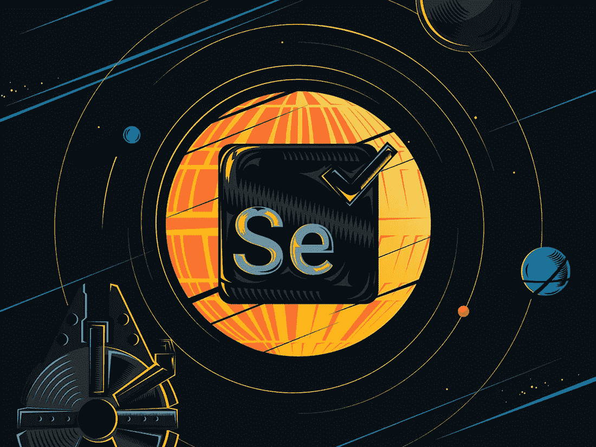
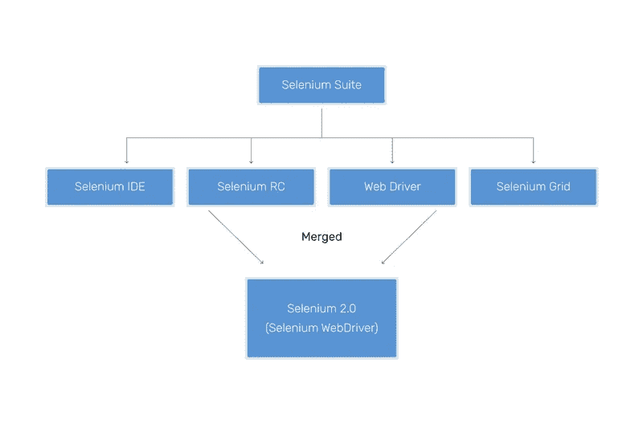

# 为什么所有真正的绝地武士都选择硒？(第一部分)

> 原文：<https://itnext.io/selenium-why-we-love-it-so-much-part-1-b1e05790d142?source=collection_archive---------9----------------------->

自动化测试在很多时候胜过手工测试，因为它节省了大量的时间，提供了高水平的准确性，并且需要更少的人力。selenium——一个用于测试 web 应用程序的开源工具——是目前最流行和最有效的测试自动化工具之一。在这篇文章中，我们解释了为什么我们发现硒真的很神奇。

> [*硒*](https://www.seleniumhq.org) *自动化浏览器。就是这样！你用这种力量做什么完全取决于你自己。*

# 自动化测试与手动测试

在直接讨论 Selenium 之前，让我们简单回顾一下两种类型的软件测试——手工测试和自动化测试。人工测试依赖于人力——QA 测试人员整天用不同的数据集和成功/失败率人工执行软件测试。穷人不得不记录并人工核实每一笔交易；因此，他们很容易疲劳，很明显，容易出错。

正如 Yellow 的 Nikita 回忆的那样，在他职业生涯的早期，作为一名 QA 测试人员并没有多少乐趣:“这是一个标准的、例行的手工测试:日复一日相同的案例和场景…

然而，一旦尼基塔作为手动测试员的无聊经历结束:“当有一天我发现了一种允许记录动作并多次运行它们的仪器时，一切都改变了。在 Selenium 的帮助下，我几乎可以自动进行测试，这显然提高了我的工作效率。”

长话短说，Selenium 是作为一种自动化测试工具建立的，它克服了手工测试的局限性，并使测试人员的工作变得简单了许多。事实上，自动化测试完全战胜了手工测试。为什么？

自动化测试要快得多，需要的人力也更少(公司可能会在 QA 的工资上节省预算)。此外，自动化测试减少了错误，并允许频繁的测试执行。此外，它可以在不同的环境和网络浏览器中同时执行。您甚至可以将结果文件安排在一天中的特定时间。

# 硒:这一切是如何开始的

在某种程度上，硒的创造类似于一部典型的励志电影。想象一下 21 世纪初，测试自动化市场还不发达。一家名为 Mercury Interactive 的公司凭借其测试自动化工具 Astra Quick Test 统治了市场。该工具远非完美，因为它只能在 Windows 上运行测试，并且支持少量的浏览器。

显然，并不是每个人都对 Astra Quick Test 满意，包括一位来自加利福尼亚的软件工程师 Jason Huggins。当哈金斯建立了一个新的高级测试自动化工具时，他将它命名为硒，这是一种被推荐作为汞解毒剂的化学元素。

最初，Huggins 的 Selenium 作为 JavaScript 框架工作，在浏览器中执行测试，并在没有手动帮助的情况下重新运行它们。Selenium 的主要优势是测试人员有机会用他们选择的编程语言与浏览器进行交互。结果，很快 Selenium 开始统治测试自动化世界。

# Selenium Suite 及其特性

目前，Selenium 由一个工具包(或一套工具)组成。Selenium Suite 由几个组件组成:Selenium WebDriver、Selenium IDE、Selenium Grid 和 Selenium Remote Control (RC)。2008 年，Selenium WebDriver 和 RC 合并为 Selenium-2，所以万一你看到 Selenium-1 这个名字，它只指 Selenium RC。

## Selenium WebDriver

大多数情况下，当人们谈到 Selenium 时，他们指的是 Selenium web driver——该套件中最重要的产品。事实上，Selenium WebDriver 是第一个跨浏览器和跨平台的测试框架。在 WebDriver 的帮助下，测试人员能够从操作系统层面控制浏览器上的 web 交互，并以各种语言(Java、Perl、Python、C#等)编写脚本。

在某种程度上，Selenium WebDriver 相当于一名出租车司机。当顾客向出租车司机发出指令时，出租车司机也相应地向汽车发出指令。类似地，当测试人员命令 WebDriver 与某些 web 元素交互时，WebDriver 会向浏览器发出适当的命令。浏览器随后向 WebDriver 提供有关 web 元素的值和状态的信息，这些数据随后会变成一个脚本。

然而，Selenium 的 WebDriver 也有其黑暗的一面。你在网上订极其便宜的机票时遇到过麻烦吗？也许，有人已经在 WebDriver 的帮助下通过自动化订票迅速拿走了所有的票…

## 硒 IDE

启动 Selenium IDE 所需要的就是在浏览器上安装扩展。Selenium IDE 操作极其简单，它会记录用户在浏览器中的动作，并在稍后重复这些动作。这是快速可靠的端到端测试的简单解决方案。某些公司可能使用 Selenium IDE 作为 Selenium WebDriver 的简单替代方案。此外，Selenium IDE 可以借助不同的插件进行扩展。

## 硒栅

Selenium Grid 是一个非常省时的工具，它允许同时在多个浏览器和机器上运行并行测试。比如说，你要进行 1000 次测试。你会怎么做？在 Selenium Grid 的帮助下，设置 10、20、100 多台虚拟机或物理机，与只运行一台机器相比，可以节省高达 100 %的时间。

并行测试是网格的另一个有用特性。考虑到脚本可能在某些浏览器上运行得很慢，你可以在 Chrome、Firefox、Opera 中并行启动你的测试…此外，使用 Grid，你可以组合不同的浏览器和操作系统！

# 最后的想法

在第 1 部分的结论中，Selenium 彻底改变了测试世界，让 QA 测试人员从枯燥的手工测试工作中解脱出来。今天，Selenium 作为一套不同的产品出现在软件市场上:WebDriver、IDE 和 Grid。其中，WebDriver 是套件中最重要的产品，而 Selenium IDE 作为 Selenium WebDriver 的更简单的替代产品。Selenium Grid 用于同时在多个浏览器和机器上运行并行测试。

在第 2 部分中，我们讨论了 Selenium 为什么是测试 web 应用程序的最佳工具的 10 大原因，以及使它不那么完美的 3 个原因。敬请期待！

*原载于*[*https://yellow . systems*](https://yellow.systems/blog/selenium-why-we-love-it-so-much-part-1)*。*