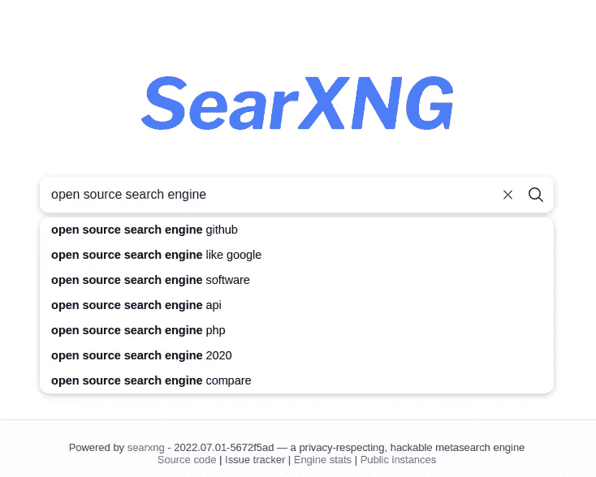
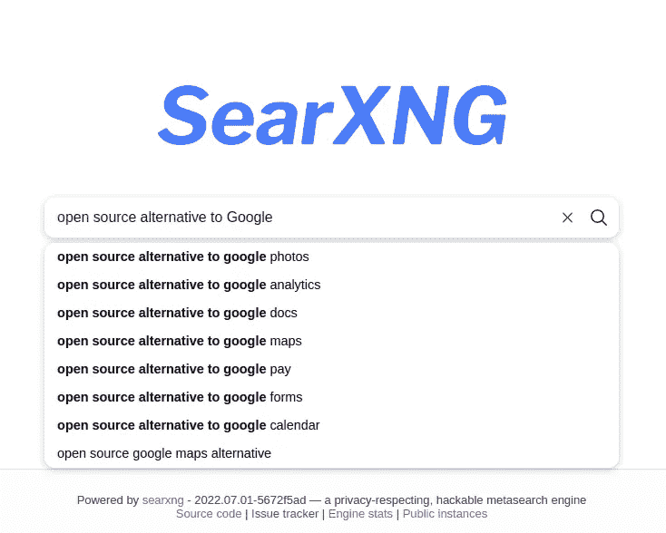
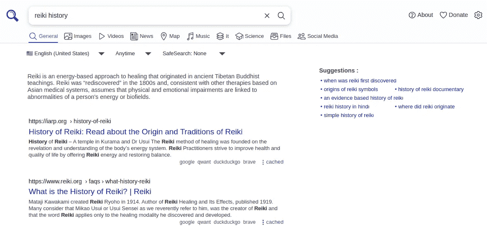
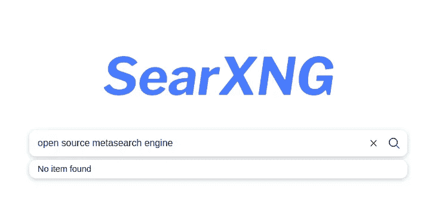
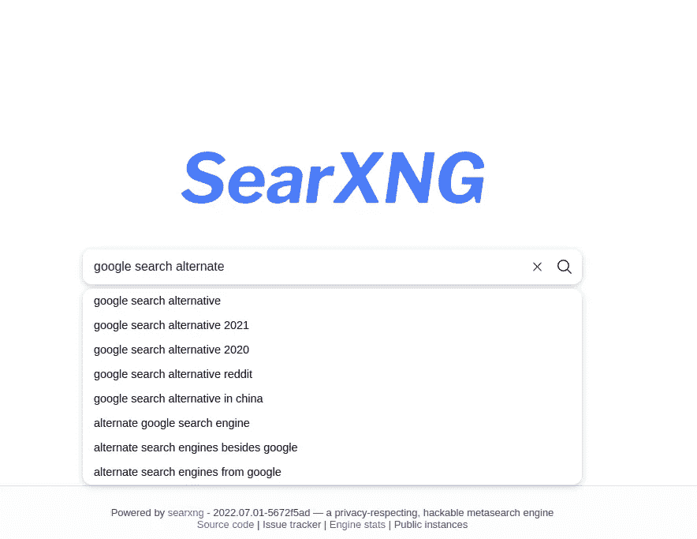
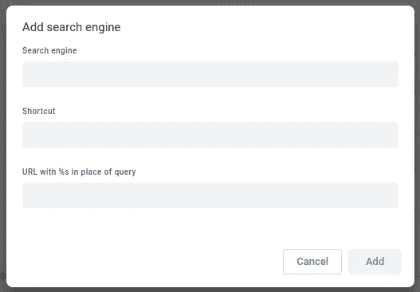
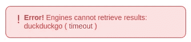

# 自托管元搜索引擎保护免受谷歌、必应等的追踪

> 原文：<https://itnext.io/self-hosted-metasearch-engine-protects-against-tracking-from-google-bing-etc-7bc1de8262a8?source=collection_archive---------2----------------------->

## 用你自己的搜索引擎严格保护你的隐私



作者图片

**你担心 Google/Bing/etc 知道你太多细节吗？这些公司收集我们的数据，然后针对我们销售广告。这可以通过使用保护隐私的搜索工具来避免。一个是 SearXNG，它是一个开源元搜索引擎，保证完全匿名。**

像 Google 或 Bing 这样的传统集中式搜索引擎很方便。他们的规模意味着他们可以汇集所有网站的大规模索引。他们拥有庞大的软件工程师团队，致力于提高对高质量内容的理解，或搜索索引基础设施，或理解各种人类语言，等等。难怪主要的搜索引擎如此受欢迎，因为它们非常有用，并且免费提供很大的价值。

正如他们所说，如果你不为服务付费，那么你就是产品。

但是，有一些主要的搜索引擎的问题。我遇到的一些问题是:

*   收集太多的信息，建立我们所有人的档案，然后卖给广告商
*   每一个搜索查询都会被谷歌藏起来，以改善未来的搜索结果，向你展示更好的广告，等等。
*   改变搜索结果，淡化有机结果，减少从搜索引擎网站到索引网站的用户流量(详情:[谷歌获取更大的搜索流量，挤压网站的有机点击](https://techsparx.com/blog/2019/07/google-taking-more-clicks.html)，[谷歌广告操纵谷歌搜索结果](https://techsparx.com/blog/2019/01/google-downplays-organic-results.html))

你可能会说“*就用 DuckDuckGo* ”，因为 DuckDuckGo 保证它不会追踪你是谁。事实上，多年来我一直将 DDG 作为我的主要搜索引擎。我对它给出的结果很满意，并且基本上相信 DDG 真的没有跟踪它的用户在做什么。

但是，最近我发现一个问题，DDG(和必应)没有索引我的几个网站。在解决这个问题的过程中，我了解到 DDG 的(部分)搜索结果数据来自必应。DDG 使用几个搜索数据源，必应是其主要来源。因此，有人建议让你的网站在 DuckDuckGo 中被索引，他们说首先让它在 Bing 中被索引，然后它会自动出现在 DDG。

提到这一点的关键是——我不知道 DDG 使用必应搜索数据，那么必应会通过 DDG 收集我们的搜索数据吗？此外，Bing 还向其他几个搜索引擎提供搜索数据。



作者图片

# 搜索——其他搜索引擎的隐私替代方案

在寻找替代方案时，我遇到了一个由对个人隐私非常感兴趣的人开发的自托管搜索引擎选项。即——搜索——[https://docs.searxng.org/](https://docs.searxng.org/)

search ng 是所谓的“元搜索引擎”，这意味着它本身并不索引互联网，而是向其他几个搜索引擎发送搜索查询。然后，它将这些结果汇集在一起，呈现在一个统一的搜索结果中。



作者图片

这看起来像来自其他搜索引擎的搜索引擎结果，但是有区别。请注意，每个搜索结果列表都包含一个搜索引擎列表，在该列表中可以找到搜索结果。这是结果的“元搜索”部分。顶部的标签也很不错。例如，你的视频搜索不再局限于 YouTube，它们同样可以给出其他视频网站(Odysee 等)的搜索结果。



作者图片

# 什么是元搜索引擎？

在找到 SearXNG 之前，我从未听说过元搜索引擎，我打赌你也没听说过。为了理解为什么我们应该安装一个，我们应该理解元搜索引擎是做什么的，等等。我们刚刚看到了一个元搜索引擎的例子，所以让我们试着创建一个定义。

元搜索引擎是一个在线信息源，它使用一个或多个其他搜索引擎的数据来产生搜索结果。

换句话说，元搜索引擎将您的查询发送到一个或多个其他搜索引擎，聚合搜索结果，根据其他搜索引擎的排名对它们进行排名，并以自己的格式显示结果。

有很多商业元搜索引擎的例子。两个突出的例子是 *DogPile* 和 *Metacrawler* ，我相信像 *Kayak* 这样的旅游网站是幕后的元搜索引擎。

# SearXNG 如何更好地保护隐私？

好吧，你在想，SearXNG 在其他搜索引擎上做搜索查询。这与 DuckDuckGo 有什么不同，它也使用其他搜索引擎来满足搜索查询？答案是 SearXNG 对发送给其他搜索引擎的查询进行了严格的匿名处理。

搜索文档是这样写的:

*   从发送到搜索服务的请求中删除私人数据
*   不通过搜索服务转发来自第三方服务的任何内容(如广告)
*   从发送到结果页面的请求中删除私有数据

它通过不向搜索引擎发送 cookies 并为每个请求生成一个随机的浏览器配置文件来做到这一点。这可以防止搜索引擎跟踪进行查询的人。

因为它是开源的，我们可以通过研究源代码来验证这些说法。DuckDuckGo 可能会做出类似的声明，但我们无法独立核实他们这样做，因为 DuckDuckGo 不是开源的。

# 自托管搜索元搜索引擎

让我感兴趣的是了解搜索如何保护隐私。经过几周的使用，我对结果相当满意。唯一的问题是，在查询给定的搜索引擎时，它通常会说“超时”。

实现自托管搜索最简单的方法是使用 Docker。SearXNG 团队提供了一个预烘焙的 Docker 合成文件，我将它作为一个起点。

参见:[https://github.com/searxng/searxng-docker](https://github.com/searxng/searxng-docker)

他们首选的部署使用:

*   Caddy——它是一个反向代理服务器，捆绑了从 Lets Encrypt 获取 SSL 证书的支持——我在部署中没有使用 CADDY
*   搜索——元搜索引擎
*   REDIS —用于缓存数据

在我的服务器上，我使用 NGINX 代理管理器作为反向代理，管理来自 Lets Encrypt 的 SSL 证书。因此，我没有包括他们的合成文件的球童部分。

首先创建一个目录来存放一些东西。在该目录中创建另一个目录`searxng`，其中包含一个名为`settings.yml`的文件，该文件包含以下内容:

```
# see https://docs.searxng.org/admin/engines/settings.html#use-default-settings 
use_default_settings: true
server:
   # base_url is defined in the SEARXNG_BASE_URL environment variable, see .env and docker-compose.yml   
   secret_key: "ultrasecretkey"  # change this!
   limiter: true  # can be disabled for a private instance
   image_proxy: true
   method: "GET" 
search:
   autocomplete: "duckduckgo" 
general:
   instance_name: 'YOUR NAME HERE' 
ui:
   static_use_hash: true 
redis:
   url: redis://redis:6379/0
```

这个文件来自`searxng-docker`库，有一些小的改动。

*   将`method`设置为`GET`修复了一个行为问题
*   `autocomplete`设置允许您指定自动完成建议的来源。
*   `instance_name`设置是更新品牌以包含您的名字的第一步

对于超级密钥，您可以使用任何您喜欢的字符串。似乎我运行了这样一个命令:

```
% cat searxng/settings.yml | md5sum 
f29bdcafbb3d43e84e85c851459c61e1 # Or, this 
$ uuid | md5sum
020a52f6b234e33eb0d4924a7b695683
```

无论你喜欢用什么方式来产生一个随机的字符串都是好的。

接下来，创建一个名为`docker-compose.yml`的文件，其中包含:

```
version: '3.7'

services:

  redis:
    container_name: redis
    image: "redis:alpine"
    command: redis-server --save "" --appendonly "no"
    networks:
      - searxng
    tmpfs:
      - /var/lib/redis
    cap_drop:
      - ALL
    cap_add:
      - SETGID
      - SETUID
      - DAC_OVERRIDE

  searxng:
    container_name: searxng
    image: searxng/searxng:latest
    networks:
      - searxng
    ports:
     - "8080:8080"
    volumes:
      - ./searxng:/etc/searxng:rw
    environment:
      - SEARXNG_BASE_URL=https://${SEARXNG_HOSTNAME:-localhost}/
    cap_drop:
      - ALL
    cap_add:
      - CHOWN
      - SETGID
      - SETUID
      - DAC_OVERRIDE
    # logging:
    #   driver: "json-file"
    #   options:
    #     max-size: "1m"
    #     max-file: "1"

networks:
  searxng:
    external: true
#    ipam:
#      driver: default
```

这也是来自`searxng-docker`库的一些变化。球童服务完全停止。由于我在 Docker 安装中管理虚拟网络的方式，在外部创建了`searxng`网络。

目录的卷挂载将前面讨论的配置文件挂载到容器中。

注意，`SEARXNG_BASE_URL`变量是从环境变量`SEARXNG_HOSTNAME`中设置的。要按预期进行设置，创建一个名为`.env`的文件，其中包含:

```
SEARXNG_HOSTNAME=searx.DOMAIN-NAME.com
# LETSENCRYPT_EMAIL=<email>
```

这将告诉 SearXNG 它的域名是什么。`LETSENCRYPT_EMAIL`变量与 Caddy 一起使用，如果你使用的话。

我不明白为什么它应该使用一个`.env`文件，因为这些值可以很容易地在 Compose 文件中编码。就此而言，基本 URL 可以设置在`settings.xml`的`server.base_url`值中。也就是在上面显示的`settings.xml`中，用`base_url: "https://searx.DOMAIN"`替换以`base_url`开头的注释。

# 部署搜索元搜索引擎

准备工作到此为止。上一节讨论的文件必须部署在安装了 Docker 的主机上。

运行`docker compose up`(或`docker-compose up`)后，这两个服务就会出现，你就可以在`[http://DOMAIN-NAME:8080](http://DOMAIN-NAME:8080.)` [使用搜索引擎了。](http://DOMAIN-NAME:8080.)

注意我说的是`docker compose`而不是`docker-compose`。后者是启动合成文件的传统方式。但是，大约在去年的某个时候，Docker 团队将`docker-compose`的功能移植到了`docker`命令中，因此我们现在可以运行`docker compose`(注意，没有破折号)。

在我的例子中，我使用 NGINX 代理管理器，因此在其配置中创建了一个代理主机。这个代理连接到后端的`http://searxng:8080`，在前端显示为`https://searx.DOMAIN`。在设置反向代理时，从 Lets Encrypt 提供 SSL 证书非常简单。

# 使用搜索元搜索引擎

如果你用过某个名字以`G`开头的搜索引擎，你就会知道如何使用 search ng。



作者图片

这是用户界面，我真的需要解释该怎么做吗？

一个有趣的地方是设置区，通过右上角的齿轮图标可以到达。你可以选择精确的搜索引擎，以及其他一些参数。非常酷。

另一个有用的资源是文档，特别是关于[设置文件](https://docs.searxng.org/admin/engines/index.html)的文档。

您可以轻松定制正在使用的搜索引擎列表。因为它是开源的，所以你可以通过编写代码来集成其他搜索引擎，然后在设置文件中配置它们。

有极大的灵活性。

只有一个例子涵盖了您自己的 SQL 数据库中的数据的情况。集成这些数据是这样完成的:

```
- name: my_database
  engine: postgresql
  database: my_database
  username: searxng
  password: password
  query_str: 'SELECT * from my_table WHERE my_column = %(query)s'
```

换句话说，可以用它来构建一个高度定制的搜索引擎。

# 在 Chrome 浏览器中添加 search ng 实例作为默认搜索引擎

如果您对 search ng 给出的结果满意，您可以设置您的 web 浏览器来使用您的 search ng 实例。我们将专注于在 Google Chrome 中实现这一点，但是你也可以在其他浏览器中实现这一点，比如 Firefox。

打开*设置*区，导航到*搜索引擎*。你会看到一个按钮*管理搜索引擎和网站搜索*。

需要做的是将您的 search ng 实例作为自定义条目添加到这个列表中，然后选择它作为默认的搜索引擎。

会有一个*添加*按钮，所以点击它。



作者图片

对于*搜索引擎*给它一个用户友好的名字，并在*快捷方式*中给它一个更短的用户友好的名字。网址使用:`https://searx.DOMAIN/search?q=%s` -最后点击*添加*。

自定义搜索引擎将被添加到列表中。在最右边有一个按钮，你可以点击它弹出一个菜单，其中一个选项是*设为默认*。点击它，让它成为你的默认搜索引擎。

完成后，通过浏览器位置框执行的任何搜索都将通过 search ng 实例。

# 搜索超时

我唯一的问题是:



有时候，它给我的不是搜索结果，而是像这样的超时。在文档中，超时阈值似乎是可以调整的。我怀疑这是因为我的实例被托管在家中 DSL 路由器后面的一台机器上。托管在常规 web 服务器上的实例应该有更好的互联网带宽，以及更好的搜索查询响应时间。

# 摘要

search ng 是一个值得选择的搜索引擎。它严格保护你不被正规搜索引擎跟踪，同时给你那些搜索引擎的搜索结果。

我每天都充分利用搜索引擎，用它们来寻找令人惊奇的资源。我专门用了 SearXNG 大概 2 个星期，它帮我发现了一些很神奇的东西。我无意过度使用*惊人*这个词，但我的意思是，我经常通过常规搜索引擎找到有用的相关资源，到目前为止，我对 SearXNG 也是如此。

# 关于作者


[**大卫·赫伦**](https://davidherron.com/) :大卫·赫伦是一名作家和软件工程师，专注于技术的明智使用。他对太阳能、风能和电动汽车等清洁能源技术特别感兴趣。David 在硅谷从事了近 30 年的软件工作，从电子邮件系统到视频流，再到 Java 编程语言，他已经出版了几本关于 Node.js 编程和电动汽车的书籍。

*原载于*[*https://techsparx.com*](https://techsparx.com/software-development/docker/tutorials/diy-search-engine.html)*。*