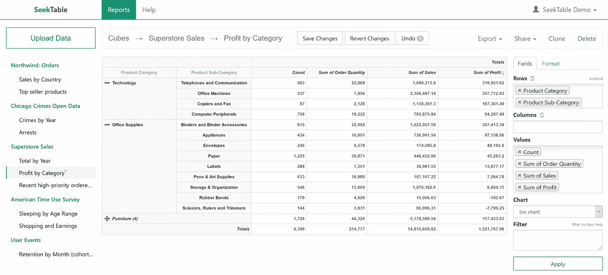
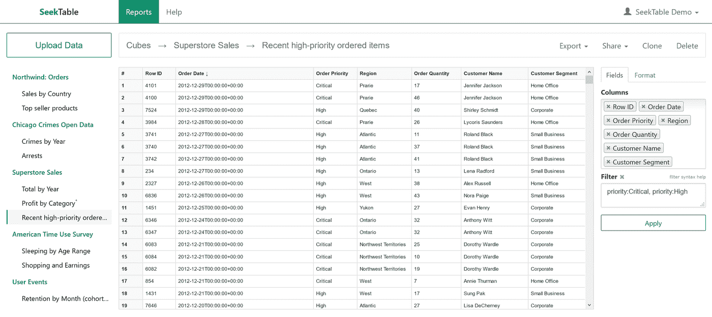
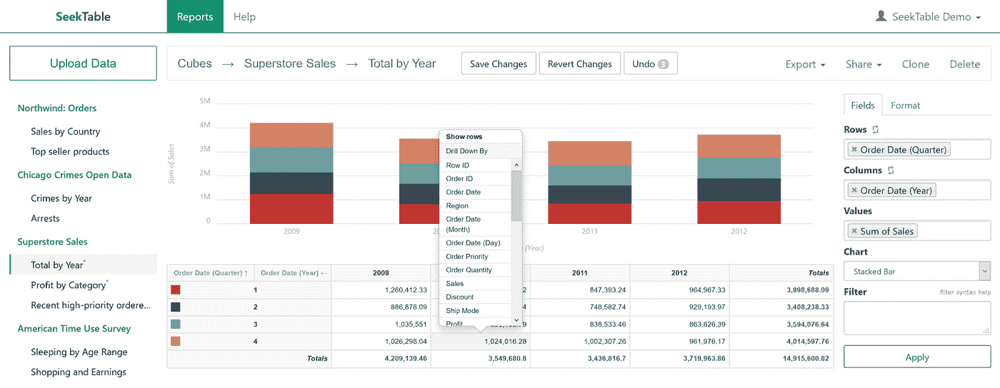

# SeekTable 自助服务分析—一种超级简单的在线数据透视表解决方案

> 原文：<https://itnext.io/self-service-analytics-with-seektable-a-super-simple-online-pivot-table-solution-1b69a0f188b2?source=collection_archive---------2----------------------->

目前有许多仪表板解决方案。它们都在类似的功能上竞争，如顶级可视化、数据连接、可用性和简单的数据处理。然而，最简单的自助分析形式并没有得到这些解决方案的青睐。自助分析的最简单形式是什么？嗯……当然是数据透视表。

数据透视表是分析师和商业人士快速筛选数据和获得快速见解的便捷工具，这主要归功于 MS Excel。它们已经被使用了很长时间，每个在 Excel 中做过复杂分析的人都知道它们。但是，当然，正如我们在这里所说的，虽然 Excel 是一个很好的工具，但它也有很多问题，尤其是在今天，数据来自许多来源，大小不一。

# 标准 MS Excel 数据透视表的问题

标准 Excel 数据透视表的问题是分析师和商业智能专家经常遇到的。

真相的一个来源消失了。下载一个电子表格是没问题的，但是随着时间的推移，很快就会怀疑你应该相信哪个电子表格，或者哪个数据点是正确的。人们最终会得到相同数据的不同版本，并且会开始讨论谁在使用正确的报告。

**数据量有限**。当然，MS Excel 允许越来越大的数据集，但它无法与真正的数据库竞争。最终，主要的限制是用户正在使用的特定计算机工作站的 RAM。即使 Excel 在某些时候允许更大的限制，我们也会达到工作站的限制。

**报告分散，难以共享**。今天，我们都在一个团队中工作，都需要分享见解。然而，通过电子邮件发送报告的旧模式很快就变成了一种拖累，因为在需要的时候快速找到见解变得越来越困难。

**很手动**。当涉及到 BI 和分析时，必须下载数据，然后构建数据透视表和建立洞察力是最乏味、最慢和最容易出错的过程之一。如果周围有很多这样的报告，那么雇佣那些唯一的工作就是刷新 Excel 报表的人的公司并不少见。

# 用 SeekTable 进入联机透视表

但是 MS Excel 数据透视表很简单！我们都知道他们，他们几乎没有学习曲线，因为每个分析过数据的人都知道他们，我们能让他们回来吗？嗯，是的！答案是 [SeekTable](https://www.seektable.com/) 。

SeekTable 是一个在数据库表上快速构建在线数据透视表的工具。您只需要将 SeekTable 与您的数据库连接起来，这就完成了，现在您可以快速地将您的多维数据集发布给您的分析师和业务用户。

业务用户将能够快速学习 SeekTable 的基础知识，因为它看起来非常像 Excel 数据透视表。以下是截图:

神奇的事情发生在右栏:

*   **行**是可以选择维度列的地方。我们可以根据需要添加任意多的列
*   **值**是可以选择措施的地方。可以使用不同的汇总类型，如总和、平均值和计数
*   **过滤器**是可以过滤尺寸的地方。我们可以直接输入尺寸值，过滤器会自动选择正确的尺寸

完成设置并对结果满意后，我们可以保存报告。这意味着我们现在有了一个报告，每当底层数据表发生变化时，它就会自动更新。我们现在终于不再手动更新电子表格了！

SeekTable 中的报告也可以以多种不同的格式共享或导出。尤其是 Excel 数据透视表导出功能。不，我们不提倡用这个工具导出 Excel，但是我们知道有些人是 Excel 的死忠用户，这个功能会让他们很容易接受报告。

# 或者只使用看起来像 Excel 工作表的平面表结构

SeekTable 还支持**平表**报表。平面表格报告是一种没有汇总级别的报告，它看起来有点像一个填充了数据的普通电子表格，没有任何其他结构或格式。

你可以在下面看到它的样子:

这里有趣的是**滤镜**。我们可以键入平面表的任何列中存在的任何值，SeekTable 将知道该做什么。当我们想要快速筛选行项目级别的数据时，这非常方便。

这是有意义的，因为很多用户要么只需要看到几个数据点，要么只想下载一个 Excel。我们都同意在 Excel 中下载数据是一个坏主意，但如果我们让它变得困难，用户会找到其他方法来做到这一点，使它变得可用和简单首先会增加采用，然后让我们控制如何使用数据(没有影子 it 实践)。

# 图表和钻取

SeekTable 的另外两个很酷的特性是图表和向下钻取。你可以在下面看到两者的截图:

为了向报告添加图表，我们只需在右侧字段部分的**图表**字段中选择图表类型。当然，我们可以在多种类型的图表中进行选择。

最后，表格中的每个单元格都有向下钻取的功能。在上面的屏幕截图中，我们展示了如何通过多个可用维度进一步深入查看 2010 年第 4 季度的销售额(或使用**显示行**选项仅显示汇总行)。该功能提供了强大的探索能力，对于寻求快速洞察的用户来说非常有用。

# 如何使用 SeekTable

首先，如果你感兴趣的话，你可以现在就试用这个工具，他们有一个很酷的演示，只需点击[这里](http://demo.seektable.com/)就可以玩了。

SeekTable 有两种形式:内部版本或云版本。你现在可以使用 SeekTable 的云版本，只需将其连接到数据库或 csv 文件，就可以开始构建在线数据透视表了。如果你的公司接受云解决方案，事实上你现在就可以在你的数据库表之上使用 SeekTable，免费的**。[付费订阅](https://www.seektable.com/help/cloud-pricing)可能仅用于安全报告共享或高级报告发布。**

**还有一个 SeekTable 的内部版本，基本上也是免费的，除非你需要高级功能，如用户管理、单点登录或白标解决方案(详情[在此](https://www.seektable.com/help/self-hosted-setup#paid))。价格以服务器为基础，并以年度订阅的形式提供。**

**值得注意的一点是，你可以连接 SeekTable，从而开始在 MongoDB 和 ElasticSearch 上构建在线数据透视表。这是两个非常常见的非 sql 数据库，通常不适合 SQL 解决方案。ElasticSearch 集成尤其令人兴奋，因为这是一个非常好的分析数据库，目前缺乏广泛的 BI 解决方案选择。**

# **但是一般来说 Tableau、PowerBI 和 dashboard 工具呢？**

**现实是看情况。如果您的视觉受众希望以多种方式与仪表板进行交互，那么强大的仪表板工具将会为您提供更好的服务。但是，如果您的用户只想查看普通的交叉表，或者今天在 Excel 上花费大量时间，那么 SeekTable 将会更好地为他们服务。**

**仪表板经常出现的情况是，它们需要更陡峭的学习曲线。这意味着我们只有很少的内容(仪表板)创建者和大量的消费者。事实上，有了 SeekTable 这样的工具，我们可以进一步推动采用，让每个人，或者几乎每个人，都成为内容创作者。使用可以快速学习并且对用户来说不觉得太新的工具，推动“每个人都是分析师”的策略变得更加容易。**

**SeekTable 还有一个有利于采用的有趣价格——您不会受到单用户许可证成本的限制。这实际上是非常重要的，因为采用和拥有成本往往是密切相关的，尤其是如果您必须说服您的 IT 部门采用特定的工具。**

**如果你需要制作复杂的图表，或者需要一个复杂的企业解决方案，那么 Tableau 或 PowerBI 或该领域的任何东西都可能是更好的选择。但是如果你的用户只是想要一些旧的交叉表，那么 SeekTable 会让他们更高兴。**

# **结论**

**SeekTable 可以是对现有 BI 堆栈的一个很好的补充，甚至是新兴 BI 堆栈中的一个新工具。我们还看到一些公司将 SeekTable 与仪表盘工具结合使用。在该架构中，我们将使用 SeekTable 进行交叉表类型的报告，然后我们将使用 Tableau 或 PowerBI 等工具进行可视化类型的报告。以正确的方式使用这两种类型的解决方案来满足所有的业务需求确实是一个很好的例子。**

**如果您需要在线数据透视表或简单的交叉表类型的报告，那么 SeekTable 将是一个很好的解决方案。在自助服务方面，由于其平滑的学习曲线，它是迄今为止让每个人都能进行分析和构建报告的最佳工具之一。**