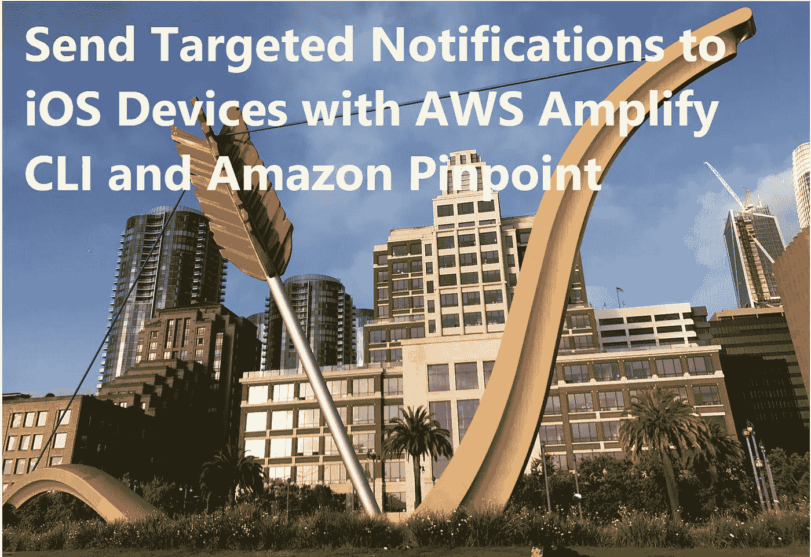
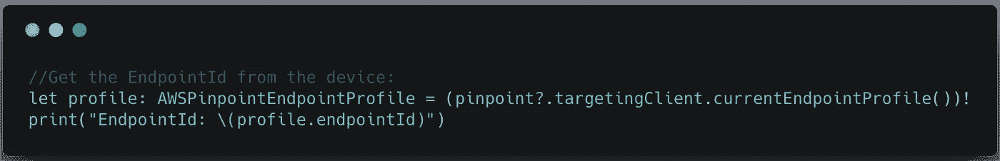
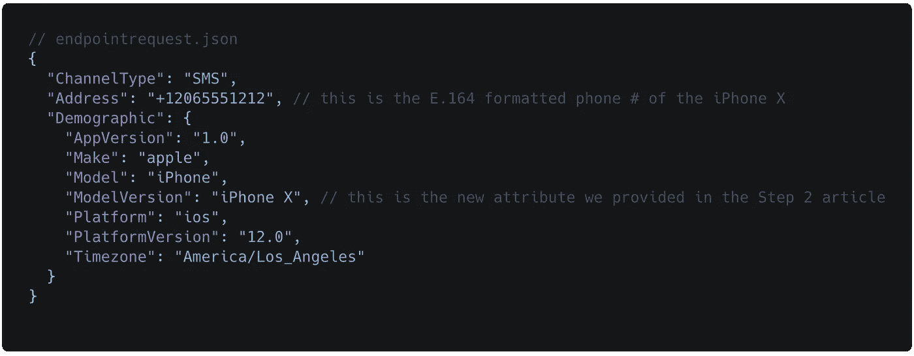
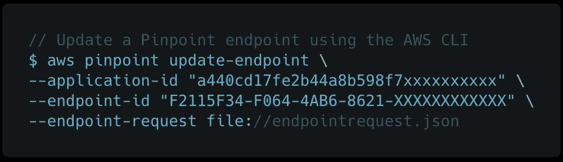
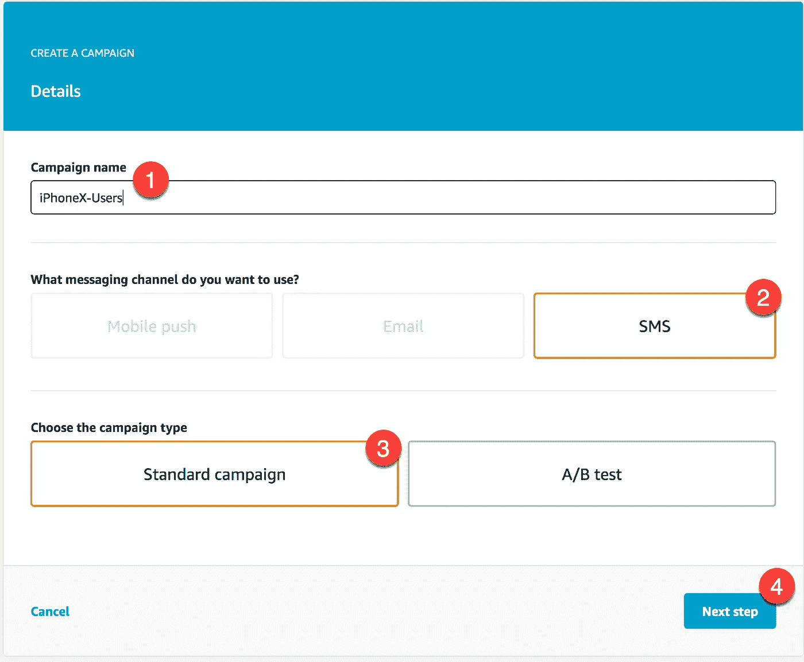
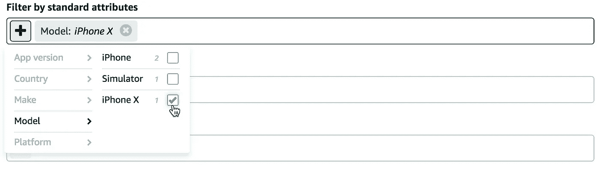
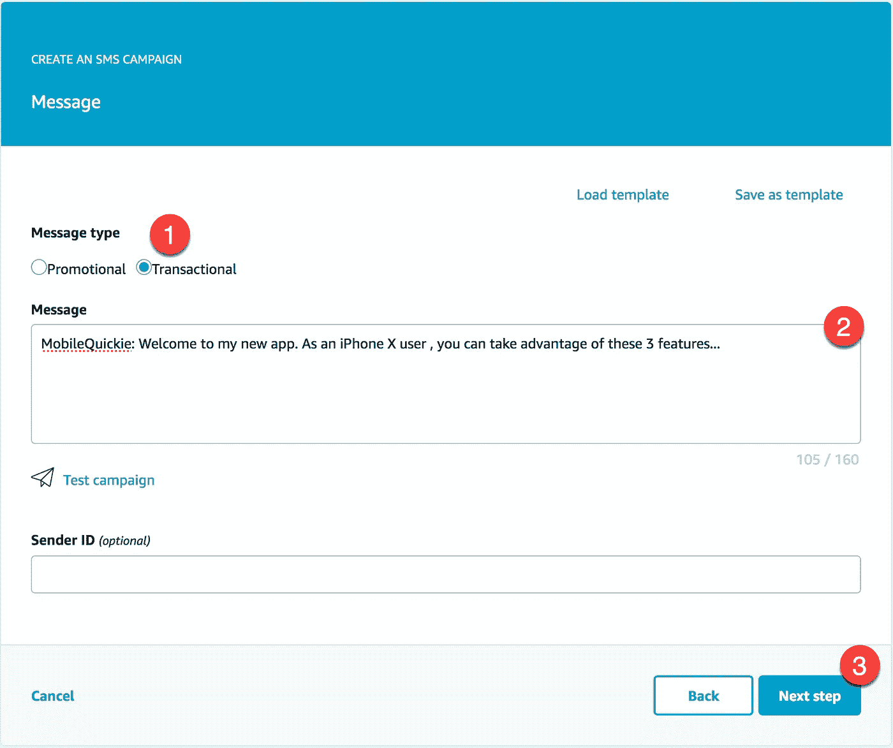
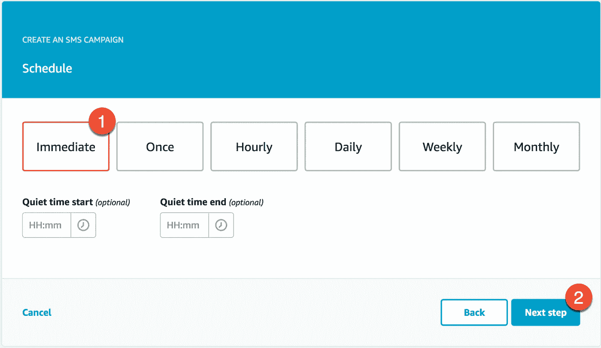

# 通过 AWS Amplify 和 Amazon Pinpoint 向 iOS 设备发送目标通知

> 原文：<https://itnext.io/send-targeted-notifications-to-ios-devices-with-aws-amplify-and-amazon-pinpoint-81badf4100ad?source=collection_archive---------1----------------------->

丘比特的跨度——在旧金山跑了 5 公里

这是关于使用[*AWS Amplify*](https://aws-amplify.github.io/media/get_started?utm_source=da&utm_medium=blog&utm_campaign=denhills&utm_term=ios_native)*和*[*Amazon Pinpoint*](https://docs.aws.amazon.com/pinpoint/latest/userguide/welcome.html)将用户分析添加到您的 iOS Swift 应用程序的 3 部分系列的第 3 部分。在[第 1 部分](https://medium.com/@dmennis/integrate-analytics-into-your-ios-swift-applications-with-aws-amplify-20d31fe0a20e)中，我们在你的 iOS 应用中收集了基本的用户分析(人口统计和应用活动)。在[第 2 部分](https://medium.com/p/2ace3ce0fef1)中，我们通过以**设备特定属性的形式添加自定义用户设备分析，增强了标准人口统计收集流程。**然后，我们基于 iOS 设备的子集创建了一个亚马逊定位细分市场。

在本文中，我们将启用 SMS 消息，创建一个针对我们的自定义设备特定属性的[精确定位活动](https://docs.aws.amazon.com/pinpoint/latest/userguide/campaigns.html)，然后向 iPhone X 设备上的用户发送一条有针对性的 SMS 消息。

首先，让我们回到我们在第二部分中创建的精确细分市场。在那篇文章中，我们创建了一个新的细分市场，通过特定的设备(iPhone X)来识别用户子集。当时，我们只是选择了一个任意的通信频道。在这里，我们应该修改细分市场，以使用三种可用渠道(推送通知、电子邮件和短信)之一，并使用该渠道向这些细分市场的设备型号发送我们的营销活动消息。

对于这个例子，我将使用 SMS，但您也可以通过[电子邮件](https://docs.aws.amazon.com/pinpoint/latest/userguide/channels-email.html)或[推送通知](https://docs.aws.amazon.com/pinpoint/latest/userguide/channels-mobile.html)渠道设置消息。

## 启用短信服务

从 iOS 项目文件夹中，启动终端并键入:

$ *放大添加通知*

选择**短信。**这将在您的 Amazon Pinpoint 项目中启用短信功能。

## 为 SMS 注册设备

针对我们的移动用户，我们有三种渠道可供选择。您可以使用 AWS CLI 或 AWS SDK 向一个或多个通道注册设备。每个 Amazon Pinpoint 端点代表一个通道。因此，如果有一个用户设备注册了所有三个通道，则同一设备将有三个不同的端点，每个通道一个。当我们创建细分市场时，我们只选择一个渠道，并且在发送有针对性的通知时，每个活动只选择一个细分市场。

通常，当用户第一次注册时，会进行频道注册。例如，如果我们为 Amazon Cognito 用户池启用了电子邮件/密码注册，我们将在这个阶段捕获电子邮件，并将电子邮件地址发送给 Pinpoint。因为我选择了 SMS 作为我的通道，所以我需要更新一个设备端点，将通道类型设置为 SMS，并为端点地址提供一个有效的移动电话号码。在这个演示中，我将使用 [AWS CLI](https://aws.amazon.com/cli/) 更新一个端点。

## 使用 AWS CLI 更新端点

> 我本打算向您展示如何使用 AWS SDK for iOS 直接从客户端更新端点，但是，它不可用(对我无效)。如果情况有变，我会在这里更新。抱歉，CLI 确实创建了一些额外的步骤。

1.  使用以下代码片段从 iOS 应用程序客户端获取 Amazon Pinpoint*endpoint-id*:

[https://gist . github . com/mobile quickie/30 a3 F2 ee 03527924 c 796 a3 e 7 f 455d 559](https://gist.github.com/mobilequickie/30a3f2ee03527924c796a3e7f455d559)

2.通过将其粘贴到新的 *endpointrequest.json* 文件中来定义端点请求。*不要忘记更改电话号码以匹配 iPhone 设备

[https://gist . github . com/mobile quickie/429 aafc 0711130822 f 675827442926 a9](https://gist.github.com/mobilequickie/429aafc0711130822f675827442926a9)

3.从与 *endpointrequest.json* 相同目录中的终端，让我们更新从步骤#1 捕获的现有端点 id。应用 id 可在 Pinpoint 控制台应用视图[中找到，此处为](https://console.aws.amazon.com/pinpoint/home/?region=us-east-1#/apps)。

使用以下 [AWS CLI 命令](https://docs.aws.amazon.com/cli/latest/reference/pinpoint/update-endpoint.html)更新精确定位端点。

[https://gist . github . com/mobile quickie/4c 901 aedc 5429573d 28 d4f 2778 b 909 e](https://gist.github.com/mobilequickie/4c901aedec5429573d28d4f2778b909e)

您的端点现在应该与一个电话号码和一个 iPhone X 设备相关联。

## 创建新的活动

您可以先创建一个细分市场或一个活动。如果不存在细分市场，控制台将引导您在活动页面中创建细分市场。

1.  在终端的项目目录中，使用 AWS Amplify CLI 启动 Amazon Pinpoint 控制台: *$ amplify analytics console*
2.  在导航菜单中，选择**活动**。
3.  选择**新战役**。
4.  如图所示，完成四个步骤。

创建新的活动

## 指定段

1.  在段下，选择**创建一个新段**。

2.为段提供一个可选名称，以便以后重用。

3.对于**按标准属性过滤**，定义哪些用户正在使用型号为>的 iPhone X。您在这里看到的(2)个“iPhone”设备表示尚未使用第 2 部分中的代码进行更新的应用程序，因此我们只知道这些用户使用的是 iPhone。多无聊啊？！

4.保持 0%不变。

5.选择**下一步**。

## 撰写并发送消息

选择交易并输入 shore SMS 消息，然后选择下一步。

立即发送**。选择**下一步**。**

****

**选择**发起活动**。**

**您应该可以在任何安装了您的应用程序并提供了电话号码的 iPhone X 上立即看到结果:**

****

**来自亚马逊 Pinpoint 的短代码短信**

## **最后的想法**

**在本文中，我们使用 Amplify CLI 在 Amazon Pinpoint 应用程序中启用了 SMS 消息传递。然后，我们创建了一个新的精确定位活动，将我们的 iPhone X 作为目标受众，并向这些用户发送有针对性的短信。这就是我的收集用户分析、添加自定义人口统计数据和对这些用户进行细分的 3 部分系列的结论，这样我们就可以利用相关信息锁定用户。请留下你的评论或建议，告诉我们你将来想在这里阅读的内容。感谢阅读！**

## **资源**

**[AWS Amplify CLI](https://aws-amplify.github.io/media/get_started?utm_source=da&utm_medium=blog&utm_campaign=denhills&utm_term=ios_native)**