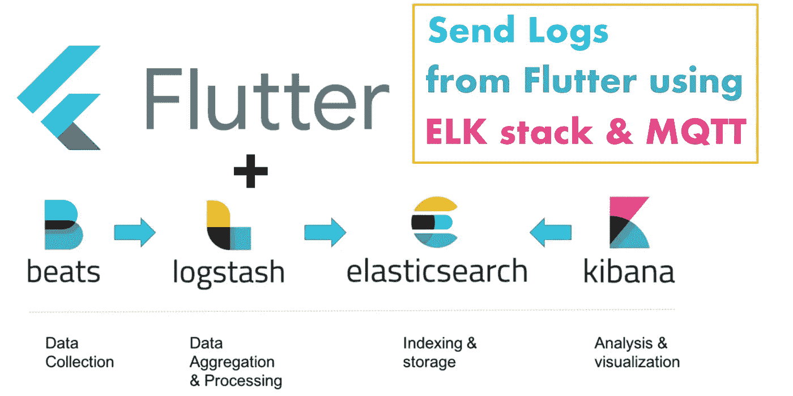
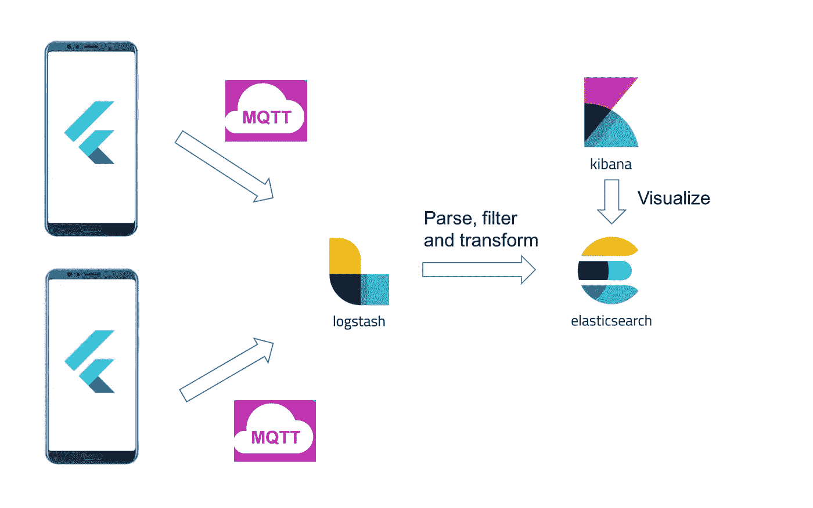
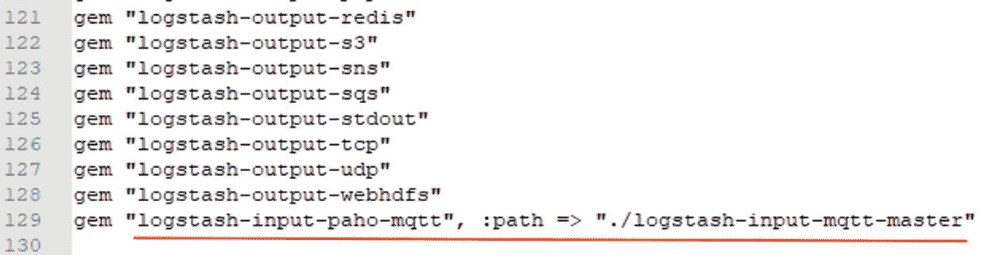
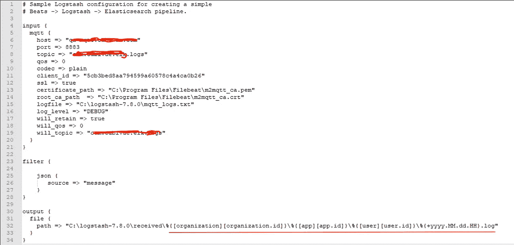
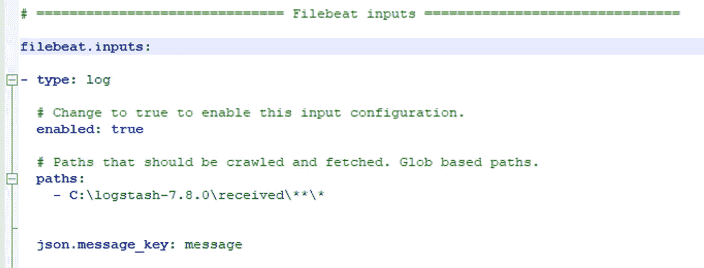
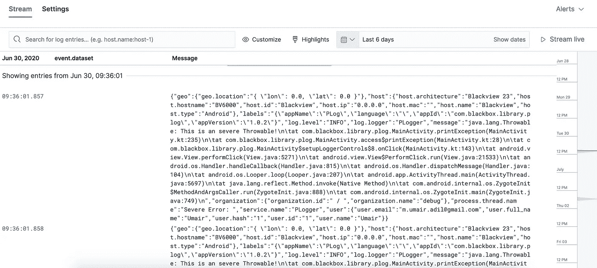

# 使用 ELK stack & MQTT 从 Flutter 应用程序实时发送日志

> 原文：<https://itnext.io/sending-logs-from-flutter-apps-in-real-time-using-elk-stack-mqtt-c24fa0cb9802?source=collection_archive---------1----------------------->



# 调试多个应用程序的问题:

您是否曾经不得不使用存储在不同来源的日志来调试应用程序的问题？我不得不这样做，并且花费了大量的时间来获取日志，仅仅是为了开始调试过程。有时，我甚至会等上好几天才能最终获得我请求的日志，因为我的用户的设备会被关闭。我的大部分时间都花在使用推送通知请求获取日志并等待它们到达。

> 解决应用程序问题的第一步是减少解决问题所需的时间。

从一开始，日志可用性就一直是我的团队面临的最大问题。过去，我们确实尝试过一些解决方案，但没有一个是一致和可靠的。

生产环境中总会有异常和问题，但是检索日志并不一定是一个紧张的过程。如果你有日志，找出问题就不是问题了，因为最终，你将能够追踪模式，但是另一方面，如果你没有日志，找出问题可能是一场噩梦。

# 正确的解决方案:

解决这个问题的方法是使用任何日志记录器在你的设备上存储异常日志，有审计日志和任何崩溃报告服务也很好，但是如果你有很多应用程序，管理日志本身就成为一个障碍。如何管理每天来自多个来源的数千个日志条目？有了 [ELK Stack](https://www.elastic.co/what-is/elk-stack) ，解决方案变得更加简单。

## ELK Stack 是一个开源项目的集合，结合起来可以帮助您解决上述问题。

> TL；DR: Elasticsearch 是一个搜索和分析引擎。Logstash 是一个服务器端数据处理管道，它同时从多个来源获取数据，对其进行转换，然后将其发送到像 Elasticsearch 这样的“stash”。

# 我们的要求:

我们需要将应用程序中特定事件的日志实时发送到一个集中的远程服务器，这些日志可以存储在一个由组织和用户分开的文件中。在报告任何问题的情况下，我们应该能够打开网站，通过应用适当的过滤器来搜索日志。一旦我们跟踪了日志，我们应该能够下载完整的日志文件进行审计。就这么简单。

## 下面是它应该如何工作的简单流程:



# 设置环境:

为了开始这个解决方案，我必须在 Azure Windows 机器上安装 ELK 栈。我不会进入安装步骤，因为它们非常简单。你可以在这里找到安装步骤。对我来说棘手的部分是设置配置。让我们深入研究一下。

# 设置 MQTT:

为了实时发送日志，我们选择了 MQTT 发布订阅。我们已经准备好了 MQTT 服务器，我们需要做的就是在 **elk 服务器和 flutter 应用**上配置代理 URL、端口、主题和证书。

ELK 的插件**‘log stash’**提供了对 MQTT 输入的支持，但是它没有附带 MQTT 插件，所以我们必须自己安装。这个插件可以从这个[链接](https://rubygems.org/gems/logstash-input-paho-mqtt/versions/0.1.1)下载。下载完成后，可以通过执行一些额外的[步骤](https://www.rubydoc.info/gems/logstash-input-paho-mqtt/0.1.5)来安装。最后一步是将它添加到位于 logstash 目录中的 gem 文件:



我们的应用程序将发布日志到 Logstash 插件订阅的主题。为了告诉 logstash 监听 MQTT 输入，我们需要配置它。下面是我们在 logstash 上应用的配置:



该配置保存在 **logstash.conf** 文件中。这里我们使用 MQTT 的输入配置，过滤器从 JSON 模式中提取消息字段，接下来我们将讨论 JSON 模式。这里的输出将以文件的形式出现。每个日志条目将包含一些用于组织、应用程序&用户的 JSON 字段。Logstash 将使用这些值来创建一个新的目录或文件(如果尚未创建的话)。文件名将被时间格式化。

# FileBeats 配置:

Logstash 从多个来源收集和解析文件中的日志，我们还需要将这些日志发送到 Kibana 仪表板。我们使用 Filebeat 作为高效的日志发送器。在我们的例子中，我们只需要它将日志从源路径发送到 Kibana。我们在这里提供的路径与 logtash 放置日志的路径相同。Filebeat 的配置保存在 **filebeat.yml** 文件中。我们是这样配置的:



# 运行服务:

一旦所有的配置都完成了，我们必须从命令行运行它们。必须启动以下服务和插件:

## 弹性服务

```
./elasticsearch.bat
```

## 基巴纳

```
./kibana.bat
```

## Logstash

```
./logstash.bat -f logstash.conf
```

## Filebeats

```
./filebeat -c filebeat.yml -e -d "*"
```

# ELK 模式:

为了在 **Kibana** 仪表板上显示日志，并能够对记录的数据应用过滤器，ELK 要求将日志嵌入到预定义的模式中。这个模式的细节可以在[这里](https://www.elastic.co/guide/en/ecs/current/ecs-reference.html)找到。我们将该模式缩小到几个值，下面是该模式的一个示例:

```
{
  "user": {
    "user.email": "m.umair.adil@gmail.com",
    "user.full_name": "umair",
    "user.id": "17282738",
    "user.hash": "1",
    "user.name": "Umair"
  },
  "message": "{OkHttpClient}  {X-XSS-Protection: 1; mode=block} [30 June 2020 04:15:16 PM]",
  "@version": "1",
  "log.logger": "PLogger",
  "host": {
    "host.type": "Android",
    "host.name": "LG",
    "host.architecture": "LG 23",
    "host.hostname": "8000",
    "host.id": "LG",
    "host.ip": "0.0.0.0",
    "host.mac": ""
  },
  "labels": "{}",
  "app": {
    "app.language": "en-US",
    "app.id": "com.example.develop",
    "app.name": "Flutter Dev",
    "app.version": "0.0.108"
  },
  "process.thread.name": "DATA_LOG",
  "organization": {
    "organization.name": "debug",
    "organization.id": "BlackBox"
  },
  "geo": {
    "geo.location": "{ \"lon\": 0.0, \"lat\": 0.0 }"
  },
  "service.name": "Network",
  "@timestamp": "2020-06-30T16:27:36.894Z",
  "topic": "com.flutter.elk.logs",
  "log.level": "INFO"
}
```

您在上面看到的一些字段是由 Logstah 自动插入的。这是因为我们使用了 JSON 过滤器插件。更多详情见此[链接](https://www.elastic.co/guide/en/logstash/current/plugins-filters-json.html)。

这里**【消息】**字段包含&的日志信息，其他字段用于搜索&过滤日志。在发布到 MQTT 之前，每个日志条目都将被嵌入到这个模式中。日志将作为 JSON 分隔的字符串写入文件。幸运的是，使用 flutter 日志插件创建这个模式的过程变得很简单，我们接下来将讨论这个插件。

# 用于日志记录的 Flutter 插件:


我们已经创建了一个名为**‘flutter _ logs’**的 flutter 插件，用于记录日志文件中的数据，并在 MQTT 主题上发布它们。此插件可在以下位置找到:

[](https://pub.dev/packages/flutter_logs) [## flutter_logs | Flutter 包

### 用于 Flutter 应用程序的基于文件的高级日志框架(Android)。iOS 支持即将推出。颤振日志提供…

公共开发](https://pub.dev/packages/flutter_logs) 

这个插件是专门为更容易将日志实时发送到 ELK stack 而设计的。以下是该插件的一些主要特性:

1.  简单的 MQTT 配置&主题的自动发布者
2.  记录 ELK 模式中的数据
3.  在本地存储上记录数据，以防需要完整的日志记录

## 为了将这个插件添加到 flutter 项目中，只需在 pubspec 文件中添加这一行:

```
dependencies:
  flutter_logs: [LATEST_VERSION]
```

## 下一步是用一些配置初始化 flutter_logs:

```
**await** FlutterLogs.initLogs(
        logLevelsEnabled: [
          LogLevel.INFO,
          LogLevel.WARNING,
          LogLevel.ERROR,
          LogLevel.SEVERE
        ],
        timeStampFormat: TimeStampFormat.TIME_FORMAT_READABLE,
        directoryStructure: DirectoryStructure.FOR_DATE,
        logTypesEnabled: ["Locations","APIs"],
        logFileExtension: LogFileExtension.LOG,
        logsWriteDirectoryName: "FlutterLogs",
        logsExportDirectoryName: "FlutterLogs/Exported"
);
```

这里我们定义了以下内容:

1.  **logLevelsEnabled:** 应该存储或发布多少级日志，默认为 all，但您可以选择只发送`ERROR or SEVERE`来保存数据
2.  **timeStampFormat:** 应该在每个日志条目中附加什么格式的时间
3.  **directoryStructure:** 默认情况下，它提供 3 种类型，这里我们选择将日志放在设备上当前日期的目录中。例如，日志 03102020
4.  **logTypesEnabled:** 默认情况下，记录器将始终将数据记录到根据设备时间创建的每小时文件中，但您也可以添加自己的数据文件来记录特定事件。这些必须在日志配置中定义。
5.  **日志文件扩展名:**您可以使用该选项定义日志文件的扩展名。
6.  **logsWriteDirectoryName:**在该字段中，必须提供存储目录的路径，您希望在该目录中存储所有日志。
7.  **logsExportDirectoryName:**在此字段中，必须提供存储目录的路径，您希望将所有日志导出为压缩的 zip 文件。

## 要添加 MQTT 配置，请添加以下块:

```
**await** FlutterLogs.initMQTT(
        topic: "YOUR_TOPIC",
        brokerUrl: "", *//Add URL without schema*
        certificate: "name_of_your_certificate_file",
        port: "8883");
```

## 要启用和添加 ELK 模式选项，请在初始化日志后添加以下块:

```
**await** FlutterLogs.setMetaInfo(
      appId: "flutter_logs_example",
      appName: "Flutter Logs Demo",
      appVersion: "1.0",
      language: "en-US",
      deviceId: "00012",
      environmentId: "7865",
      environmentName: "dev",
      organizationId: "5767",
      userId: "883023-2832-2323",
      userName: "umair13adil",
      userEmail: "m.umair.adil@gmail.com",
      deviceSerial: "YJBKKSNKDNK676",
      deviceBrand: "LG",
      deviceName: "LG-Y08",
      deviceManufacturer: "LG",
      deviceModel: "989892BBN",
      deviceSdkInt: "26"
    );
```

**注意:**所有这些字段都是可选的。

# 运行 Flutter 应用:

一旦我们运行我们的应用程序，我们的日志将开始出现在 Kibana 仪表板中:



我们可以很容易地从这些日志中找到组织 id 和用户 id，一旦有了这些信息，我们就可以从服务器的存储中下载这些日志的完整文件。

# 结论:

ELK stack 是一个强大的日志集中工具，即使有多个应用程序，我们也可以将所有日志转发到一个点，它能够处理大量的日志数据。跟踪问题和获取日志的时间大大减少了。我们期待使用 ELK stack 提供的机器学习功能。通过尝试 Kibana 提供的不同特性和插件，我们有很多方法可以使它更好地用于我们未来的应用程序。

下面是 **flutter_logs** 演示的样本代码:

[](https://github.com/umair13adil/flutter_logs) [## umair13adil/flutter_logs

### iOS 支持即将推出。Flutter Logs 提供快速简单的基于文件的日志解决方案。所有日志都保存到文件中…

github.com](https://github.com/umair13adil/flutter_logs)