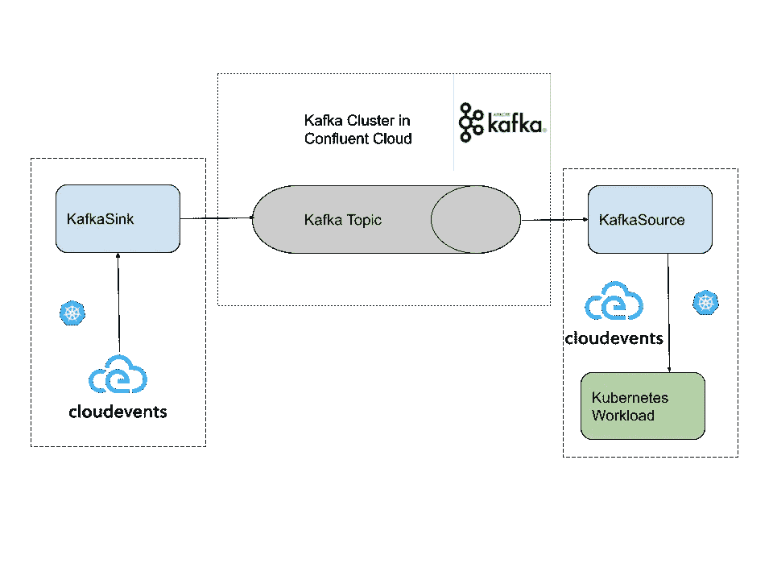

# 给库伯内特斯的卡夫卡发信息

> 原文：<https://itnext.io/sending-messages-to-kafka-cfb5a246f5eb?source=collection_archive---------0----------------------->

在之前的博客中，我展示了如何声明性地使用来自卡夫卡的信息。今天，我将向你们展示如何反其道而行之，如何将消息生成到 Kafka，也就是如何以声明的方式将消息发送到 Kafka 主题。



去上一篇博客了解一下背景。基本上，我们试图编写 Kubernetes 清单来声明我们如何发送和接收或生成/消费 Kafka 主题的消息。上图显示了这一切。对于这篇博客的混乱部分，请注意，`KafkaSink`产生了 Kafka 主题的事件，因此是 Kafka 集群的 POV 的 Kafka 源:)，因此`KafkaSource`消费了 Kafka 主题的事件，因此是 Kafka 集群的 POV 的 Kafka 接收器，否则就太容易了！！！

# 为什么？

因为这比我自己编写 Kafka 客户端、编译、打包、部署等要容易得多。如果我能写一点配置，让一个像 Kubernetes 这样的系统为我管理它，那就太好了。

# **如何？**

我们为一种叫做`KafkaSink`的新类型安装了两个控制器和一个 CRD，并且为了更好的度量(否则狗屎会砸到风扇)，我们安装了 knative eventing CRD(我们将修复它，因为它将很好地避免必须做的那一步……)。

```
kubectl apply -f [https://github.com/knative/eventing/releases/download/v0.23.0/eventing-crds.yaml](https://github.com/knative/eventing/releases/download/v0.23.0/eventing-crds.yaml)kubectl apply --filename [https://github.com/knative-sandbox/eventing-kafka-broker/releases/download/v0.23.0/eventing-kafka-controller.yaml](https://github.com/knative-sandbox/eventing-kafka-broker/releases/download/v0.23.0/eventing-kafka-controller.yaml)kubectl apply --filename https://github.com/knative-sandbox/eventing-kafka-broker/releases/download/v0.23.0/eventing-kafka-sink.yaml
```

在应用后不久，pod 正在运行。请注意，下面的示例还显示了`KafkaSource`的控制器

```
kubectl get pods -n knative-eventing
NAME READY STATUS RESTARTS AGE
kafka-controller-86948cddc6-g5mnn 1/1 Running 0 2m18s
kafka-controller-manager-78c5588947-wt5bj 1/1 Running 0 5h29m
kafka-sink-receiver-7dcb7b9b44–5w6j7 1/1 Running 0 115s
kafka-webhook-eventing-fb6ddfd9d-jsmzm 1/1 Running 0 2m18s
```

我们新的花式 CRD `KafkaSink`已经就位

```
kubectl get crd | grep kafka
kafkabindings.bindings.knative.dev 2021–06–18T08:44:51Z
kafkasinks.eventing.knative.dev 2021–06–18T14:12:12Z
kafkasources.sources.knative.dev 2021–06–18T08:44:52Z
```

# 卡夫卡在行动

使用与前一篇博客中相同的秘密，允许我们在合流云中与我们的 Kafka 集群对话，我们现在可以像这样声明性地设置 Kafka sink:

```
apiVersion: eventing.knative.dev/v1alpha1
kind: KafkaSink
metadata:
  name: my-kafka-topic
spec:
  auth:
    secret:
      ref:
        name: kafkahackathon
  bootstrapServers:
  - pkc-456q9.us-east4.gcp.confluent.cloud:9092
  topic: hackathon
```

这将在我的 Kubernetes 集群中设置一个 HTTP 端点，我可以在这里发布 CloudEvents。这些 CloudEvents 随后将被生成到我的 Kafka 集群中。`KafkaSink`看起来像是:

```
kubectl get kafkasink
NAME URL AGE READY REASON
my-kafka-topic [http://kafka-sink-ingress.knative-eventing.svc.cluster.local/default/my-kafka-topic](http://kafka-sink-ingress.knative-eventing.svc.cluster.local/default/my-kafka-topic) 12m True
```

现在我们有了一个 HTTP 端点作为 Kafka 主题的 HTTP 代理，我们可以简单地将 CloudEvent 发布到这个端点，接收器将为主题“产生”事件。为此，我们可以在集群中获得一个快速 shell，并使用 curl 手工创建一个 CloudEvent，如下所示:

```
curl -v “[http://kafka-sink-ingress.knative-eventing.svc.cluster.local/default/my-kafka-topic](http://kafka-sink-ingress.knative-eventing.svc.cluster.local/default/my-kafka-topic)" \
> -X POST \
> -H “Ce-Id: 536808d3–88be-4077–9d7a-a3f162705f79” \
> -H “Ce-Specversion: 1.0” \
> -H “Ce-Type: dev.knative.samples.helloworld” \
> -H “Ce-Source: dev.knative.samples/helloworldsource” \
> -H “Content-Type: application/json” \
> -d ‘{“msg”:”Hello World from the curl pod.”}’
```

检查显示窗格中的日志，我们看到我们的 CloudEvent 被我们在之前的博客[中设置的`KafkaSource`接收。](https://sebgoa.medium.com/consuming-kafka-messages-in-kubernetes-9e43050d6eb4)

```
☁️ cloudevents.Event
Context Attributes,
 specversion: 1.0
 type: dev.knative.samples.helloworld
 source: dev.knative.samples/helloworldsource
 id: 536808d3–88be-4077–9d7a-a3f162705f79
 datacontenttype: application/json
Data,
 {
 “msg”: “Hello World from the curl pod.”
 }
```

流程结束后，我们可以在任何地方以 CloudEvents 的形式生成事件，并将它们放入 Kafka 主题中，然后消费该事件并将其发送到 Kubernetes 工作负载，所有这些都是以声明方式定义的。

这为……鼓声……一种配置 Kafka 源和汇的声明式/kubernetes 方式打开了大门。这将是下一篇博客。