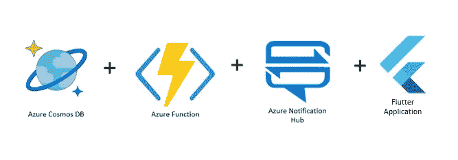
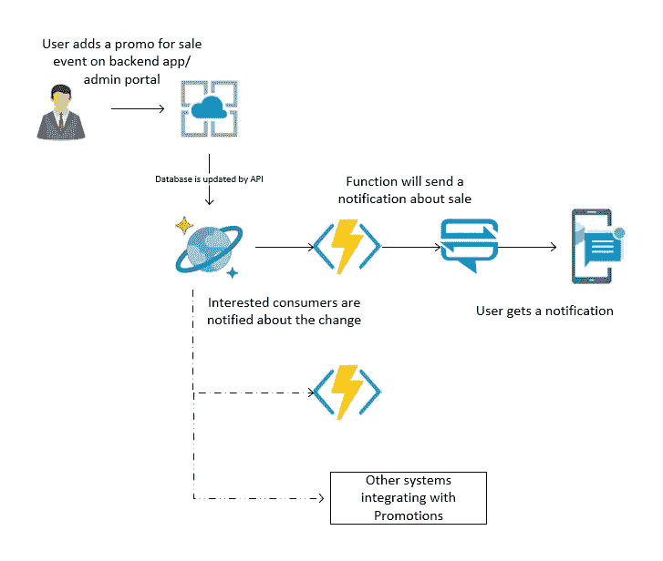
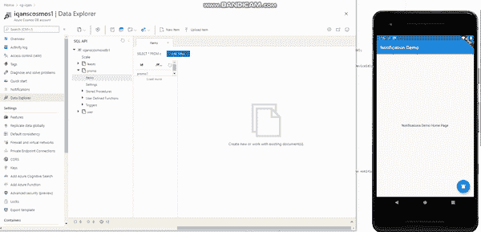
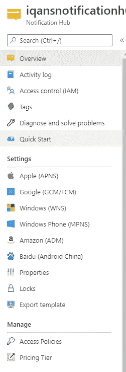
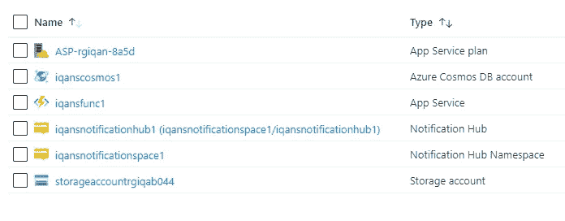

# 使用 Azure 功能向移动设备发送通知

> 原文：<https://itnext.io/sending-notifications-to-mobile-devices-using-azure-functions-4322771ee6e1?source=collection_archive---------3----------------------->

在本文中，我们将了解 Azure Cosmos 数据库、Azure 函数、Azure Notification Hub 以及如何在各种用例中利用这些服务来通知用户。

推送通知:通知中心+ Azure 功能+ Cosmos 数据库

# 介绍

这篇文章是关于建立一个 azure 函数，它将监听 Azure Cosmos 数据库中发生的事件，并使用 Azure Notification Hub 向用户发送通知。

这篇文章不仅仅是关于发送通知，还涵盖了一个企业级的集成方法，即处理 Azure Cosmos 数据库的更改，并使用 Notification Hub 将更改通知给消费者。

当我们使用 Flutter 开发应用程序或原型时，首选的云服务是 Firebase。我们可以设置 Firestore 数据库、Firebase 云功能和 Firebase 云消息来实现我们将在本文中讨论的完全相同的功能。

这里有一个场景。假设有一家电子商务公司，他们在网上销售一些产品。他们希望开展促销活动，并为此向用户发送销售通知。在本例中，假设有一个后端应用程序，营销经理或业务用户将介绍一个促销活动。通过 API 和数据将被存储在数据库中的代表。从这里，相关系统可以得到通知，如定价或产品服务，用户也将获得有关销售的通知。

示例场景:促销通知

# 最后结局

每当数据保存在宇宙数据库，用户将得到通知。

基于数据库中的更改通知用户

# 先决条件

要实现这种集成，你需要一个 Azure 订阅，你可以[注册](https://azure.microsoft.com/en-gb/free/)并获得免费积分来学习和体验 Azure 的各种产品。

# 步骤 1:设置通知中心

您需要从 Azure 门户创建一个通知中心组件，或者您可以使用 Azure cli 或 ARM 模板来完成。创建中心后，需要设置要使用的 notification services。

正如您在这里看到的，有许多提供者可用。我们可以根据目标受众来配置它们。

一般我们为 iOS 设备配置苹果(APNs)，为安卓设备配置谷歌(FCM)。

对于苹果 APN，你需要一个开发者账户。您可以从开发人员控制台创建证书或密钥。

对于谷歌 FCM，你需要有一个新的 Firebase 项目。转到 Firebase Cloud messaging 并进行设置。

# 步骤 2:设置 Azure Cosmos 数据库

在这里，我们将只使用一个容器来设置 cosmos 数据库。我们将使用它来存储促销或优惠数据。为简单起见，这将包含只有两个字段 ID 和 Text 的文档。

# 步骤 3:设置 Azure 功能

您可以从 visual studio 创建 Azure 函数，也可以从 azure portal 创建它。Cosmos 数据库中也有一个选项，它将创建具有所有必要的连接字符串和设置的函数。

设置好这些资源后，您应该拥有类似下图的资源组结构。

# 步骤 4:实现 Azure 函数来发送通知

在 Azure Cosmos 数据库中，您可以选择创建一个由数据库中发生的任何事件触发的函数。或者您可以使用 Visual Studio 创建一个函数。

为 azure functions 创建一个新项目，并选择 CosmosDb trigger。一旦设置好，我们将有一个类，我们将添加代码发送通知。

对于通知中心，我们需要安装一个 nuget 包。

> 安装包微软。azure . notification hubs-版本 3.3.0

出于演示目的，我们将编写非常简单的代码，为通知中心创建一个客户端，生成通知负载并将其发送到 android 设备。

一旦代码准备就绪，我们就可以使用 cli 或从 Visual Studio 将其部署到 Azure。

# 步骤 5:集成 Flutter 移动应用程序以接收来自 Azure Notification Hub 的通知

现在我们已经准备好了所有的基础设施。接下来是创建一个接收通知的移动应用程序。我们正在使用 flutter 创建 android 和 ios 应用程序。

对于通知中心，您需要按照这里的说明设置一个包:[https://pub.dev/packages/azure_notificationhubs_flutter](https://pub.dev/packages/azure_notificationhubs_flutter)

在这个应用程序中，我们将创建一个主页和一个按钮来订阅 Azure Notification Hub。订阅后，我们可以在通知中心查看已注册的设备。

做完这些，接下来是测试。

为了模拟用户添加促销的场景，现在，我们将在 azure cosmos 数据库中手动创建一个新文档。一旦我们更新了文档，它将触发功能，向通知中心发送请求，移动设备将收到通知。

# 包扎

在本文中，我们看到了促销通知的一个简单用例。这里我们已经介绍了 azure 提供的服务，以实现我们需要的功能。当您在 azure 中设置了所有基础设施，并且不想为一个需求使用不同的提供者时，这可能会很有用。

如果您想参考本文中使用的代码，请随意查看这个资源库。

 [## iqans/push notifications-演示

### 此时您不能执行该操作。您已使用另一个标签页或窗口登录。您已在另一个选项卡中注销，或者…

github.com](https://github.com/iqans/pushnotifications-demo) 

# 参考

 [## 创建由 Azure Cosmos DB 触发的函数

### 了解如何创建在 Azure Cosmos DB 中添加或更改数据时触发的函数。要了解有关 Azure 的更多信息…

docs.microsoft.com](https://docs.microsoft.com/en-us/azure/azure-functions/functions-create-cosmos-db-triggered-function)  [## 使用 Azure 通知中心和 Firebase SDK 版本向 Android 发送推送通知…

### 本教程展示了如何使用 Azure 通知中心和 Firebase 云消息(FCM)的更新版本…

docs.microsoft.com](https://docs.microsoft.com/en-us/azure/notification-hubs/android-sdk) 

感谢您的阅读。

祝你有美好的一天:)