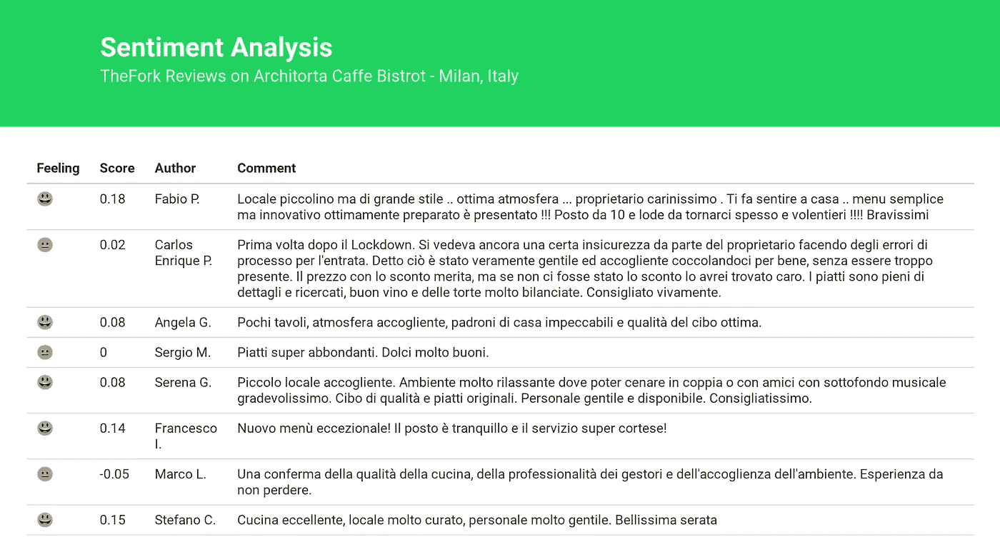

# 餐馆评论的情感分析

> 原文：<https://itnext.io/sentiment-analysis-of-restaurant-reviews-542727dc24e2?source=collection_archive---------2----------------------->

用叉子进行情感分析

## 介绍

在本教程中，我们将使用情感分析来分析一家餐馆的点评。为了避免获取 API 键的复杂性，也为了避免实现 HTTP 请求(因为本教程的范围是情感分析，而不是 HTTP 请求)，我将提供 JSON 文件供您分析。它基本上是来自 RapidAPI 的 Fork List Reviews 端点的响应，而没有前面所说的生成 API 密钥的麻烦。我们将建立一个小网页，提供来自 TheFork 的一些评论(以意大利米兰的 Architora Caffe Bistrot 为例),并使用情感分析器对任何评论进行评级。

简而言之，**情感分析**就是从给定的文本中提取关键短语，去除冗余，获取词语，从而理解作者的态度和情绪的过程。专业是用来分析客户的个人资料，并根据他们作出决定，或检测质量差的内容。

## 开始努力吧

我们将从基础开始。首先，我们将构建一个 Express.js 服务器，以 JSON 的形式提供数据(如介绍中所述，正确的做法是请求 RapidAPI TheFork，但是为了本教程的缘故，我们将只关注情感分析方面)

我们安装通常的初始库:

> *npm 安装快速主体解析器—保存*

用下面的代码创建一个 index.js。我们需要 express 和 bodyParser，我们创建了两个方法，一个用于重定向到 index.html(我们将很快创建)和 data.json，如下所示:

> const express = require(' express ')；
> const body parser = require(' body-parser ')；
> const app = express()；
> app . use(body parser . urlencoded({ extended:true })；
> 
> var data = require("。/data.json”)、data.collection
> 
> app.get("/data "，(req，RES)= > {
> return RES . JSON(data)；
> })；
> 
> app.get("/"，function(req，RES){
> RES . sendfile(_ _ dirname+"/index . html ")；
> })；
> 
> app.listen(3000，function() {
> console.log('服务器在线')；
> })；

在同一个目录中创建 data.json:

创造了一个现在还是空白的 index.html。

## Node.js 实践:情感分析

在开始编写疯狂的代码之前，我们需要导入几个库来帮助我们完成**标记化**的过程，也就是——简而言之——从短语中提取干净的单词。我们将需要经历类似于**转换缩写**(例如:我是，他是，他们是)**到标准词典**(我是，他是，他们是)**排版修正**，**过滤我们在此分析中不使用的单词**(额外的单词，如**而是**， **a** ，**或**， **what** )。

我们要使用的库是:

[natural](https://github.com/NaturalNode/natural):node . js 的一个通用自然语言工具，它不仅包括一个情感分析器模块，还包括多个用于标记化和**词干化**的工具(NLP 中的单词规范化过程，用于将派生或变形的单词转换为它们的基本或词根形式，如 give、give 或 giver to the root word:give—)。

[apos-to-lex-form](https://github.com/ebenezerdon/apos-to-lex-form) :将撇号连接的单词转换成它们的标准词典形式

[拼写校正器](https://github.com/loretoparisi/spelling-corrector):在浏览器中运行的概率拼写校正器，允许在浏览器中训练、纠正文本并区分结果。

[停用词](https://www.npmjs.com/package/stopword):用于节点和浏览器的模块，允许您从输入文本中删除停用词。(对于停用词，我们理解那些频繁出现的词，它们可以安全地从文本中删除，而不会改变其含义)。

> npm 安装自然 apos-to-lex-form 拼写纠正停用词-保存

在 var data = …下面，我们导入刚刚添加的库:

> const aposToLexForm = require(' apos-to-lex-form ')；
> const natural = require(' natural ')；
> 
> const spell corrector = require(' spelling-corrector ')；
> const spell corrector = new spell corrector()；
> spell corrector . load dictionary()；
> 
> const SW = require(' stop word ')；

下面我们添加情感分析部分，这是本文的核心。然后我们将逐行解释代码:

现在，让我们说说这一行:

> const analyzer = new sensitive analyzer('意大利语'，PorterStemmerIt，'模式')；

因为我们正在分析意大利文本，所以我们需要将分析器设置为意大利语。幸运的是，natural.js 库支持多种语言，每种语言都使用特定的算法对给定的词汇模块进行词干提取。
情感分析构造器有三个参数:

1.  语言和斯特梅尔
    根据使用的语言，我们导入相关的模块:
    英语:PorterStemmer
    荷兰语:PorterStemmerNl
    法语:porterstemmerr
    意大利语:PorterStemmerIt
    西班牙语:PorterStemmerEs
2.  词汇
    设置词汇的类型(AFINN，Senticon，Pattern 或 Negations)
    英语:AFINN，Senticon，Pattern，Negations
    法语:Pattern
    意大利语:Pattern
    西班牙语:AFINN，Senticon，Negations
    荷兰语:Pattern，Negations

## 正在完成…

现在我们需要完成 index.html 文件，我们调用我们的 JSON 文件并显示结果。

# 决赛成绩

# 结论

现在，我们有了一个表格，显示 JSON 文件中呈现的每个评论以及相应的(四舍五入)分数，还有一个表情符号来区分情绪值。从这里，我们可以向 Fork API 请求最近的评论，而不是提供一个 JSON 文件，并在感觉分数低于某个特定点时得到提醒。可能性是巨大的，在技术进步的同时，开发人员发现了使用数据的新方法，使每个人的生活变得更好。