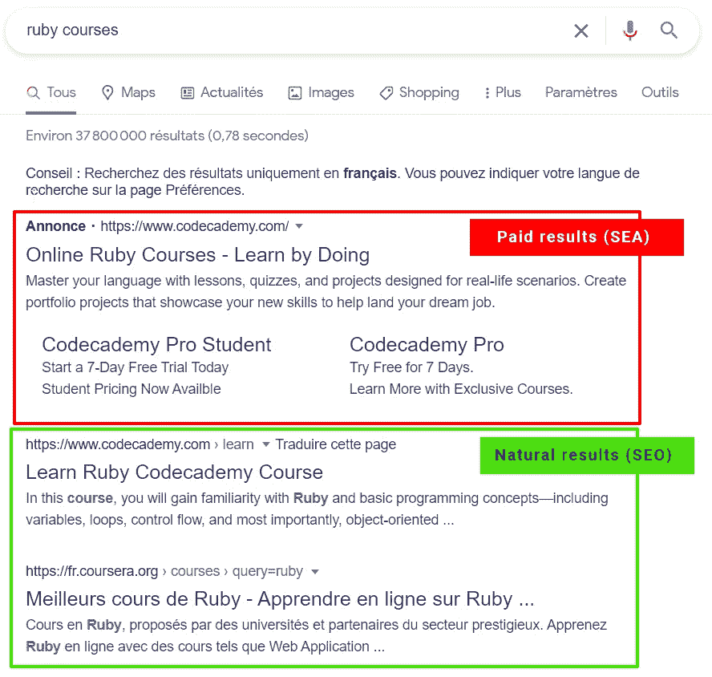

# 是的，这是 2021 年开发者的终极 SEO 指南

> 原文：<https://itnext.io/seo-for-developers-in-2021-the-ultimate-guide-bc11fb4d826b?source=collection_archive---------0----------------------->

这些年来，我和很多创业公司和中小企业合作过，他们中的很多人一开始都忽略了 SEO。

那是在我开始用**简单的动作**向他们展示**好的结果**之前。

**在搜索引擎优化中，内容为王，但技术无疑是幕后的女王。**

在脸书集团和 slack 频道上，我看到很多开发者说:

*   SEO 很难
*   SEO 是给营销人员的，不是给开发者的

**没有！不是当你明白 SEO 其实就是:写好代码。**

*   作为一名网络开发人员，了解 SEO 将会提高你的技能，让你在市场上更有竞争力
*   作为一个**开发者*** ，从长远来看，知道 SEO 可以创造一个很好的流量收入来源

**所以，事不宜迟，让我们开始吧！**

*(*devpreneur =同时也是企业家的开发者)。*

# 什么是 SEO？快速提醒

**搜索引擎优化** (SEO)就是**让你的内容尽可能匹配某人的研究**的事实(免费)。

没错，我说的是“**内容**，而不是“**网站**，因为 **SEO 是关于搜索引擎**的总称，**不仅仅是“网站搜索引擎”**。

当有人在招聘板上输入“ **vue js developer** ”时，优化你的个人资料使其在招聘板上排名第一也是 SEO。

但是今天，我们要讨论的是**如何在谷歌的搜索引擎上排名**。

别担心，你将学到的很多东西对其他搜索引擎也是有效的。

# 好的，首先，SEO 是如何工作的？

有很多东西要知道，但你不需要知道全部。

基本上，你将把你的网页提交给谷歌搜索控制台，谷歌将抓取它，T42 索引它，排名它。

*   抓取=检查页面中的内容和链接
*   索引=将它保存在一个大数据库中
*   排名=根据一些关键词给它打分

作为开发者，你需要主要关注 **CURI** 的“**U**”&”**I**🍛。

**CURI？CURI 到底是什么？**

CURI 是我编造出来的，用来记住在 SEO 中什么是重要的。
代表:**内容、用户体验、关系&内部**。

内容是 SEO 中最重要的东西，但大部分是由营销团队完成的。

作为一名开发者，你的目标是确保内容通过出色的**用户体验**和完美的**内部**而闪耀。

谷歌在 2021 年公布的“ [**核心网络生命指标**](https://web.dev/vitals/) ”证实了这一点。

不要把 **SEO** 和**海**混为一谈，后者是**先落地**为“**赞助**”。

SEA(付费结果)与 SEO(自然结果)

让我们看看在 2021 年，作为一名开发者，你能做些什么来提高 SEO。

# 1.内容搜索引擎优化又名“网页”搜索引擎优化(技术部分)

## a.永远奉上独一无二的**头衔<标签>标签**

大多数时候，网页开发者倾向于在每个页面上放置相同的 **<标题>** 标签，这是一个**巨大的错误**。

**<标题>** 是 Google 展示给用户的第一件东西，Google 总是试图将页面与最佳标题匹配。

想象一下搜索这两样东西:

*   如何学习 ruby on rails
*   如何用 ruby on rails 创建控制器

如果你有一个关于 Ruby 的网站，并且你所有的页面都有相同的 **<标题>** ，类似于“**我的 Ruby 课程**”，你的标题相关吗？不要！

始终尝试使用主数据的标题、名称或任何能够最好地描述将要显示的内容的文本来生成唯一的标题。

**建议的最大长度** : 50 到 60 个字符。

## b.尽可能在您的<title>标签中添加数字</title>

数字用在标题中更好，因为数字是事实。

编码的好处是，当你呈现一个列表页面时，你可以根据结果的数量生成一个动态的标题。

让我们继续“**我的 Ruby 课程**”。

在首页，不要有像“**用神奇教程**学习 Ruby”这样的基本标题，“你可以动态生成”**用{$nb}神奇教程**学习 Ruby”，其中$nb 是一个变量。

## c.始终提供独特的描述标签

和标题一样，这是谷歌向用户展示的第二个东西。不要忘记这个 HTML 标签，否则谷歌会从你的页面中随机抽取内容。

## d.始终提供唯一的开放图形标签

社交媒体越来越多，有一个特定的标题，描述和图片，可以提高你的搜索引擎优化。

怎么会？SEO 可以通过流量和反向链接来改善，流量和反向链接越多，SEO 改善越多。

**重要提示:**在创建 **SPAs aka 客户端渲染网站**(带 Vue，React，Angular……)时，你不会有打开的图形 **< meta >** 显示，因为**社交媒体爬虫不执行 JavaScript** 。

***我写了一篇关于那个*** [***这里***](/yes-here-are-4-ways-to-handle-seo-with-vue-even-without-node-ssr-719f7d8b02bb) ***如果你想看的话。它使用 Vue 作为一个例子，但我所说的仍然有效，无论你使用什么技术。*** [https://it next . io/yes-here-are-4-ways-to-handle-SEO-with-vue-even-with-no-node-SSR-719 F7 D8 b 02 bb](/yes-here-are-4-ways-to-handle-seo-with-vue-even-without-node-ssr-719f7d8b02bb)

## e.明智地选择标题标签(H1、H2、H3……)

标题中的内容至关重要，所以除非别无选择，否则不要在基本文本中添加标题标签。

通常，你的 **H1** 会类似于**标题>标签，但还是有所不同，因为它可以有更多的字符。所以，你可以针对更多的关键词。**

## f.写好&语义 HTML(求求你，我求求你)

作为一名一开始就学习 HTML 和 CSS 的 web 开发人员，我学到了语义，如果我不学的话，地狱会等着我😂。

我遇到的许多开发人员，尤其是后端人员，不关心 HTML 语义，这很糟糕！

**HTML 语义对 SEO 和可访问性都有好处(a11y)** ，a11y 也提高了 SEO，所以请不要他妈的每件事都用 DIV/SPAN！

基本语义回忆:

*   **<导航>** :对于内部链接，当你只有外部链接的时候就没用了
*   **< ul >** :通用列表(链接列表，Q & A…)
*   **< ol >** :用于有序列表(目录、步骤……)
*   **<页脚** >:改编上下文
    ( <正文>、<小节>、<文章>)中的元信息
*   **<页眉>** :用于改编上下文中的介绍信息(如页脚)
*   **<文章>** :针对可能在其他页面上的独立内容
*   **<地址>** :用于联系内容
*   **<时间 datetime="…" >** :用于日期或时间内容
*   **< main >** :针对页面的主要内容，所以避免像全局<页眉>、<页脚>或者<导航>之类的东西在里面。
*   **<引用>&<block quote>**:为引号
*   **< strong >** :对于重要的单词，不要过度使用它，当你只需要一个加粗的字体粗细，但这个单词不是那么重要的时候，就使用 CSS
*   **<图> & <图标题>** :给媒体或嵌入元素上下文

## g.在 alt 属性中使用 SEO 关键字

谷歌图像也广泛用于搜索内容。你认为 Google know 如何对每张图片进行分类？当然是用 alt！

**加成**:也有利于无障碍。

使用 **<图> & <图标题>** 也会有所帮助。

## h.在文件名中使用 SEO 关键字、、 …

文件名也很重要，谷歌也会根据你的文件名中的关键词进行图片搜索和其他搜索(pdf，doc…)。

## 在你的 URL 中使用搜索引擎优化关键字…

就像 **<标题> & < meta >** 一样，网址也是大部分时间在搜索结果页面看到的。你的网址越靠近你的 **<标题>** 和你的**关键词目标**越好。

对于像“用 23 个教程学习 Ruby”这样的标题，一个好的 URL 应该是:
**/Learn-Ruby-23-tutorials**

即使你想在 URL 中使用 id 或 UUIDs 进行快速索引搜索，也要尽可能使用 slug 部分。

你可以有:**/learn-ruby-23-tutorials-d758** 其中“ **d755** ”是一个技术 ID 或者你可以提取的任何东西。

backlinko 的一项研究也指出短网址效果更好，所以尽可能让你的网址短一些。

## j.在您不信任的标签上使用 rel="nofollow "属性

信任在这里可能是一个很强的词，但简单来说，当你有指向外部网页的链接时，你是在告诉谷歌你“信任”那个网站，因此增加了该网站的 SEO。

要告诉 Google 不要去那里，使用 **rel="nofollow"** 属性。

## k.尽可能使用相关关键字作为内容

不要使用类似**<a>read more</a>**的链接，只要有可能，就使用与你所指向的 URL 相关的关键词。

**<a href = "/how-to-create-controllers ">
了解更多关于控制器的信息
< /a >**

谷歌将提前知道与该链接相关的“主题”。

## 长度始终在标签和其他标签上添加“lang”属性

谷歌会根据浏览者的国家和语言显示结果，所以你的网站越容易让谷歌知道位置和语言越好！

你可以在 **< html >** 标签上设置 **lang 属性**来告诉 Google**整个文档**是某种语言的，但是你也可以在**特定的 html 标签**上使用它，比如< p > ou < section >来表示，某段**内容是另一种语言的**。

要了解 **lang** 属性的允许值:[https://www.w3schools.com/tags/ref_language_codes.asp](https://www.w3schools.com/tags/ref_language_codes.asp)或列“**639–1**”[https://en.wikipedia.org/wiki/List_of_ISO_639-1_codes](https://en.wikipedia.org/wiki/List_of_ISO_639-1_codes)。

# 2.搜索引擎优化的用户体验(也是页面搜索引擎优化)

已经累了？我告诉过你这是给开发者的终极 SEO 指南！

不要担心，与第 1 部分相比，这一部分非常短。

## a.尽可能快地加载你的页面

即使互联网网络越来越快，你仍然需要创建快速的网站来让用户开心。

一个需要等待太长时间才能看到自己内容的用户是不好的，因为他会回到谷歌，如果这种情况发生太多次，谷歌会把你的网站列为不相关的 T21。

有很多方法可以提高你的网站速度:

*   为您的资产使用 CDN
*   优化/压缩您的图像
*   使用像 WebM 这样的现代的轻量级文件格式(带后备)
*   使用媒体查询(srcset)和惰性加载来**仅在当前视窗中加载必要的图像、iframes et 媒体元素**
*   在服务器上缓存你的页面(Redis，Memcached，File，LiteSpeed…)
*   尽可能提供静态页面(JAMStack、预渲染等)
*   限制 HTTP 请求的数量(合并 JS 和 CSS 文件)
*   对 JS 捆绑器使用代码分割和树抖动
*   相关内容使用 AMP 版本

当然，根据你的预算和流量，使用一个强大的服务器来增加你的服务器响应时间，也称为 TTFB。

## b.让你的页面反应灵敏

普通人使用智能手机的次数超过了台式机或笔记本电脑。

因此，移动体验比以往任何时候都更加重要。

实际上，谷歌对同一个搜索查询有不同的页面排名，这取决于你是在平板电脑/移动设备上还是在桌面上浏览。

拥有一个合适的布局会让你的用户停留更长时间，而不是因为你的页面没有响应而不得不一直缩放。

## c.使您的页面可访问

易访问性是 web 上不太受关注的事情之一，远远落后于 SEO。

但这很重要。让残疾人也能访问网络(视力问题，motricity…)是如此重要，以至于谷歌把它作为搜索引擎优化的一个因素。

有一些简单的方法可以制作可访问的页面(有些已经说过了):

*   使用**好的&语义 HTML** 标签
*   在你的图片中使用 **alt 属性**
*   尽可能使用**咏叹调属性**
*   不要留下没有标题或 aria 标签的空标签(图标、链接……)
*   在你的网页设计中使用**良好的色彩对比度**
*   使**可点击的东西容易点击**，避免微小链接&按钮
    (确保有足够的填充)

## d.尽可能快地进行互动

到处添加动画和过渡可能很诱人，但它并不总是有用的，有时甚至很烦人。

作为新的谷歌核心网站的一部分，现在有一个“首次输入延迟”的标准。

它是用户交互和浏览器给出反馈之间的时间。越短越好。

一个简单的方法是确保浏览器在第一次加载时不会在后台做太多的事情。

## d.尽可能避免布局变化

什么是布局转移？

当你的页面中的元素改变位置时，因为一些东西正在加载，突然出现，导致用户不得不改变他的指针位置。

由于负载导致布局偏移

常见的场景是图像加载。你阅读一段文字，突然出现一个已经完成加载的图像，你必须向下滚动才能继续阅读你的文字…

避免这种情况的最常见方法是通过预测未来元素的大小来创建占位符。

## e.避免点击诱饵标题

这是**用户体验**的一部分，而不是**内容**，因为我们称之为“反弹率”。

一个糟糕的“反弹率”是当有人来到你的网站，仅仅看了一页就离开了。

通常，这是你的页面没有回答他/她最初想要的结果。

谷歌可以看到这一点，点击诱饵标题通常不友好的反弹率。

## f.尽可能多地使用相关列表来总结信息

列表很容易理解，它们就像要遵循的步骤。

## g.对于数据，尽可能使用表格

数据可视化通常比文本更容易阅读。

## h.避免过长的段落，让你的文本“易于阅读”

你的内容看起来越“可读”，用户就越会留下来阅读。

# 3.搜索引擎优化的关系(离页搜索引擎优化)

所以这对于作为开发者的你来说不是最重要的部分，但是这里有一点解释。

对 SEO 也有很大影响的一件事是拥有**质量的反向链接**。

简而言之，反向链接是指向你的页面的链接，来自外部网站的其他页面。你的主域的所有子域也是外部的。

**反向链接的质量取决于两个因素:**

*   你的网页和指向你的网页之间的主题相似性
*   指向你的页面的流行度/权威性

看到像“**推荐**这样的反向链接，像“**你**这样的人给你的推荐越多越好。

让我们举一个实际的例子:

*   **你的网站代表**:迈克，一个正在找工作的开发人员
*   谷歌代表迈克想去的公司——Dev&公司
*   **反向链接代表**:其他开发者推荐 Mike

让 10 个开发人员推荐 mike，比让 10 个管道工推荐 Mike 要好。

此外，让 10 个不同的开发人员推荐 Mike 1 次，比只有一个开发人员推荐 Mike 10 次或 20 次要好。

就像在现实生活中，你重视来自不同人的相关推荐，谷歌对反向链接也是如此。

# 4.**SEO 内部**又名“技术-SEO”

这是开发者 SEO 终极指南的最后一部分。如果你喜欢它到目前为止，请记得分享给别人:)

在这里，它非常简单明了。

## a.在您的网站上启用 SSL (https)

拥有一个安全的网站也有利于用户体验，因为人们感到安全，但这主要是谷歌良好 SEO 的“技术”标准之一。

## b.在您的<link>、

在你的网页上有一致的协议是非常重要的，要么你总是使用中继路径，要么你总是使用屏蔽路径，不要试图两者都用，否则你肯定会在某个时候弄乱你的协议。

## c.创建 robots.txt

这是一个简单的文件，必须在你的网站的根告诉谷歌和其他人，他们应该和不应该抓取。

它必须位于根:https://mysite.com/robots.txt.

## d.添加 sitemap.xml

虽然这并没有“最大”的影响，但对于谷歌来说，简化抓取总是好的。

sitemap 是一个文件，它列出了你希望 Google 抓取的所有链接，包括你网站的所有未登录和公开的链接。

它通常也在 XML 的根:https://mysite.com/sitemap.xml.

但这不是强制性的。你可以在谷歌搜索控制台中指定网站地图的链接。

***Google 抓取你的网站越容易越好。***

## e.在你的页面之间建立相关的关系(内部链接)

这肯定是 SEO 中最重要的内部和技术问题。

你创建内部链接的方式会影响用户体验和抓取，这对 SEO 来说都是非常重要的。

这里有 3 个关键的事情需要知道，以创建良好的内部链接:

*   创建面包屑或非常简单的导航，以确保用户知道他/她在哪里
*   不要创建超过 3 层的深度来访问你网站的一个页面
*   在“父页面”中将相似的主题页面分组并链接在一起，或者在页脚中，如果它作为全局信息相关的话

不要期望你的页眉导航链接到所有的页面，它对用户不友好，而且会使每个页面的抓取非常慢。

**分组示例**

*   主页(x1) : /
*   功能页面(x8) : /feature/:名称
*   关于您的功能的操作指南(x20) : /howto/:name

这里最好的事情是

*   **主页**链接**到所有专题页面**
*   **每个功能**页面链接**到所有其他功能页面**
*   **每个功能**页面将**链接到其相关的操作页面**
*   **每个操作页面**链接**到所有其他操作页面**
*   **每个操作指南**页面都将**链接到相关的其他页面**

# 结论

这就是我所知道的，也是我作为一名开发人员已经在许多项目中为提高我的 SEO 所做的一切。

在一天结束时，内容将占作品的 60%到 70%,但要让内容发光并发挥其 100%的潜力，你需要使用技术。

此外，技术可以使内容规模很大。但是在这里解释太长了，所以…我有 3 个奖励给你。

# 好处 SEO 的模式标记

因为搜索引擎机器人是…机器人！Google、Yahoo、Bing 和其他公司都有一些东西，可以更好地为机器人构建重要的数据。

这叫做模式标记。

这是纯技术的，因为它实际上只是一个对象定义，你可以在你的网页上用 JSON 生成它。

**下面介绍如何在你的网页中生成:** [https://developers . Google . com/search/docs/guides/intro-structured-data？hl=en](https://developers.google.com/search/docs/guides/intro-structured-data?hl=en)

**以下是所有存在的模式类型:** [https://schema.org/docs/schemas.html](https://schema.org/docs/schemas.html)

# 额外收获 2:内容提示

虽然这个中型故事是关于开发人员的搜索引擎优化，我认为它对你有一些搜索引擎优化的内容提示是有好处的，因为它会让你更好地了解营销团队和搜索引擎优化。

内容最重要的是点击率。

点击率是点击你标题的**人数除以看到你标题**的**人数。**

*   在结果中看到您的标题的人:40
*   在结果中点击你的标题的人:4

**CTR = 4/40 = 0.1 = 10%。**

你的点击率越高，你的搜索引擎优化增长越多。

***要有一个好的点击率你需要完成用户的搜索查询:***

1.  **在你的<题目> & < h1 >中尽可能多地使用提问**。以**谁**、**什么**、**如何**、**何时**、**何处** & **为什么**开头的句子，排名最好。
2.  **直接回答内容中的问题**
3.  在标题中添加**上下文数字**(当前年份、数据计数、价格……)
4.  在标题中增加**上下文位置**:“巴黎的好面包店
5.  **使用“**顶级**”、“**最佳**”、“**秘密**”或类似这些的同义词作为病毒内容**

**我希望你欣赏这个中等的故事。
**如果你做了“拍拍拍”分享一下！****

**你也可以在下面查看我的课程，为你提供特别优惠:
[https://courses.maisonfutari.com/?coupon=medium](https://courses.maisonfutari.com/?coupon=medium)**

**回头见。**