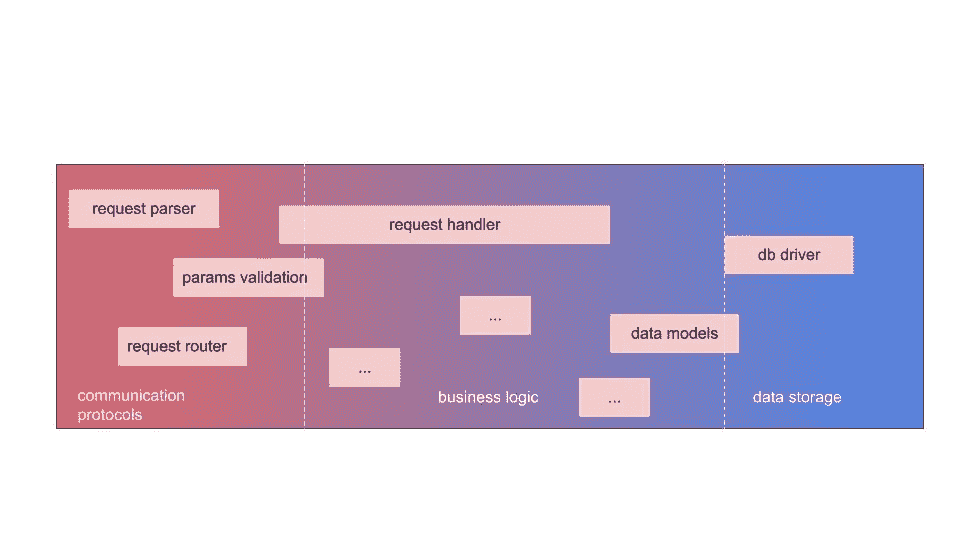

# 关注点分离:Nodejs-Fastify-MongoDB 栈的例子

> 原文：<https://itnext.io/separation-of-concerns-example-with-a-nodejs-fastify-mongodb-stack-2158577a8875?source=collection_archive---------2----------------------->


照片由[金奎大·穆伊吉](https://unsplash.com/@daanmooij?utm_source=unsplash&utm_medium=referral&utm_content=creditCopyText)在 [Unsplash](https://unsplash.com/s/photos/leak?utm_source=unsplash&utm_medium=referral&utm_content=creditCopyText) 上拍摄

构建有效的软件是一回事，构建**持续**的软件是另一回事，尤其是当代码规模和参与开发的人数一起快速增长的时候。

在本文中，我们将讨论一些可维护性问题和避免这些问题的技术，以使用 [Fastify](https://www.fastify.io/) (web 框架)和 [Mongodb](https://www.mongodb.com/) (数据库)构建的 [nodejs](https://nodejs.org/en/) web 服务器为例。

## web 服务的定义。

这个特定的服务是一个简单的电影存储库，但是对于许多 web 服务来说，你可以用同样的方式将它们的各种组件分布在一条线上的某个地方:



左边的位很常见，对于您的特定应用可能没有什么附加值。你的服务的相对价值在于你拥有/收集的数据以及你用这些数据做了什么(业务逻辑)。

需要注意的是，各层之间的边界并不严格，可能会因不同的项目而异。
例如，一个在 [RDMS](https://en.wikipedia.org/wiki/Relational_database#RDBMS) 拥有高技能的团队可以在一个 SQL 查询/函数中进行数据聚合和统计计算，而另一个团队会选择在应用程序代码中做同样的事情，发现这样更容易维护和测试。

然而，分离不同的关注点会减轻代码库的可维护性，这就是我们在这里要讨论的。

## Fastify 简介。

*如果您已经熟悉该框架，您可以跳过这一部分。*

Fastify 是一个 web 框架，它可以为您处理几乎所有开箱即用的事情(日志、解析、验证等)。然后，在定义路由的请求处理程序之前，您可以插入代码来*修饰*服务器实例，并*将*自己挂接到各种请求/响应生命周期中。
有趣的是，你可以将你的*插件*限制在服务器路由的一个子树中，提供了一种基于[控制反转](https://levelup.gitconnected.com/ui-composition-and-inversion-of-control-d65e04eaddf9)原则实现模式的简洁方法:

例如，如果您定义一个插件来注册一个 Fastify 路由，如下所示:

```
const routes = async (instance) => {
    const {greet} = instance; instance.route({
        method: 'GET',
        *// validation with JSONSchema* schema: {
            querystring: {
                type: 'object',
                properties: {
                    name: {
                        type: 'string'
                    }
                },
                required: ['name']
            }
        },
        url:'/greetings',
        async handler(req, res){
            const {name} = req.query
            return greet(name);
        }
    });
};
```

*注意处理程序依赖于实例提供的问候函数。*

然后，您可以在不同的地方安装路线，同时提供不同的 *greet* 实现:

```
const app = *fastify*();

app.register(async (instance) =>{
    instance.decorate('greet', (name) => `Hello ${name}`);
    instance.register(routes, {
        prefix:'/en'
    })
});

app.register(async (instance) =>{
    instance.decorate('greet', (name) => `Salut ${name}`);
    instance.register(routes, {
        prefix:'/fr'
    })
});

app.listen();
```

打*/en/问候语？name=laurent* 将返回" *Hello laurent"* 而点击 */fr/greetings？name=laurent* ，你会得到“*Salut Laurent”*。

## Mongoose 作为 Mongodb 的 ODM

Mongodb 是一个 [nosql](https://en.wikipedia.org/wiki/NoSQL) 数据库，它以类似 JSON 的格式存储*文档*。这看起来很方便，因为与如何将业务领域的对象存储在数据库中相比，不需要过多考虑如何在代码中建模这些对象。在关系数据库中，表的设计与您将在代码中操作的对象相比可能会有很大的不同，但在 mongodb 这样的文档存储中，起初似乎没有这种差异。
但这不是真的，存储层缺乏抽象实际上可能会成为负担并失去控制。

## 模型模式

尽管您可以在数据库级别获得[验证模式](https://www.mongodb.com/blog/post/json-schema-validation--locking-down-your-model-the-smart-way)，但通常使用像[mongose](https://mongoosejs.com/)这样的对象文档映射器库(ODM)来在应用程序代码级别添加一些约束(以及其他特性)，而数据库不一定能保证这些约束。

如果对象关系映射器库对于关系数据库来说是有争议的，那么 ODM 似乎更适合具有一对一关系的 nosql 范例。

对于我们的电影商店，我们为电影集合定义了一个基本模式:

```
import *slug* from 'slug';
import mongoose from 'mongoose';

export const MovieSchema = new mongoose.Schema({
    title: {
        type: String,
        required: true
    },
    slug: {
        type: String,
        unique: true,
        required: true,
        default: function () {
            return *slug*(this.title);
        }
    },
    likes: {
        type: Number,
        default: 0
    },
    description:{
        type:String
    },
    // etc
}, {
    versionKey: false
});
```

## 网络服务

现在我们的应用是:

```
import fastify from 'fastify';
import fastifySensible from 'fastify-sensible';
import mongoose from 'mongoose';
import {*createDBPlugin*} from './db-plugin.js';
import conf from './conf.js';
import *api* from './api.js';// create a connection pool
const db = new mongoose.Mongoose();// create the server
const app = *fastify*({
    logger: true
});// start adding middleware and plugins
app.register(fastifySensible);

*// ... eventually other middleware: auth, etc*// this one will establish the db connection and decorate the instance with the mongoose models
app.register(*createDBPlugin*({db}), conf);// our API routes
app.register(*api*, {...conf, prefix:'/movies'})

app.listen(conf.server.port);
```

API 插件将保存我们的业务逻辑:

```
// api.js
export default async (instance) => { const {Movie} = instance; // mongoose model provided by the db plugin

    // CREATE instance.route({
        method:'POST',
        url:'/',
        schema:{ /* ... */ } // validation schema
        async handler(req, res){
            const newMovie = new Movie(req.body);
            const existingMovie = await Movie.findOne({
                title:newMovie.title
            });
            instance.*assert*(!existingMovie, 409, 'Movie already exists');
            res.statusCode = 201;
            return newMovie.save();
        }
    }); // FETCH ONE instance.route({
        method: 'GET',
        url: '/:movieSlug',
        async handler(req, res) {
            const movie = await Movie.findOne({
                slug: req.params.movieSlug
            });
            instance.*assert*(movie, 404);
            return movie;
        }
    });

    // DELETE ONE

    instance.route({
        method: 'DELETE',
        url: '/:movieSlug',
        async handler(req, res) {
            const movie = await Movie.findOne({
                slug: req.params.movieSlug
            });
            instance.*assert*(movie, 404);
            await movie.delete();
        }
    }); // ETC}
```

这是非常简单的代码，但是我们已经通过混合请求处理器的逻辑和数据库*低级*访问引入了一些技术债务。

如果 Mongoose 模型抽象了一点数据库，它仍然非常接近 mongodb 查询语言，允许业务层在数据库上做几乎任何事情。这也意味着业务层知道我们决定如何存储文档。

## 当实施细节泄露时

现在让我们说，不是在*删除*操作中从 DB 中删除文档，我们想用一个标志 *isDeleted* 来标记文档，以确保文档不会永远消失。

删除路由的新处理程序如下所示:

```
instance.route({
    method: 'DELETE',
    url: '/:movieSlug',
    async handler(req, res) {
        const movie = await Movie.findOne({
            slug: req.params.movieSlug,
            isDeleted: false
        });
        instance.*assert*(movie, 404);
        movie.isDeleted = true;
        await movie.save();
        res.statusCode = 204;
    }
});
```

有趣的是，处理程序现在有了一个*保存*语义。我们还必须确保 *findOne* 过滤掉已经被标记为删除的文档，这是有问题的。我们不仅要更新这个路径的处理程序，还要更新几乎所有处理*电影*模型的代码:例如，我们必须更新所有的路径，以过滤掉已经标记为删除的文档。

那是因为关于**如何**存储文档的**技术细节**已经泄露给了应用程序代码。想象一下，稍后我们想要使用时间戳而不是布尔标志:然而我们又不得不更新整个**代码库。**

## 在数据库和应用程序代码之间添加一个抽象层

让我们考虑以下组件:

```
export const *createService* = ({model}) => {
    return {
        getOneBySlug(slug) {
            return model.findOne({
                slug,
                isDeleted: {$ne: true}
            }).select({
                isDeleted: 0
            });
        },
        getOneByTitle(title) {
            return model.findOne({
                title,
                isDeleted: {$ne: true}
            }).select({
                isDeleted: 0
            });
        },
        listAll() {
            return model.find({
                isDeleted: {$ne: true}
            }).select({
                isDeleted: 0
            });
        },
        async create(movie) {
            return new model(movie).save();
        },
        async delete(slug) {
            await model.findOneAndUpdate({
                slug
            }, {
                $set: {
                    isDeleted: true
                }
            });
        }
    };
};
```

该服务为调用者包装和隐藏数据库细节。

1.  如果你看看它的 API 和参数，一切都要简单得多:大多数时候参数都是简单的文字。
2.  调用代码没有办法超越它所调用的函数的范围:我们有一个更高级别的 API。
3.  *isDeleted* 标志(一个技术键)没有暴露。
4.  只看接口，根本看不出底层数据库引擎是 mongodb。

现在，我们可以将服务注入路由处理程序，而不是注入电影模型:

```
import {*createService*} from './movies-service.js';

export default async (instance) => {
    const {Movie} = instance; *// mongoose model injected* instance.register(async (instance) => {
        *// (1) we overwrite Movie for the current scope* instance.decorate('Movie', *createService*({model: Movie}));
        instance.register(*routesPlugin*);
    });
}

export const *routesPlugin* = async (instance) => {
    const {Movie} = instance; *// this one will then be the service* instance.route({
        method: 'GET',
        url: '/:movieSlug',
        async handler(req, res) {
            const {params} = req;
            const movie = await Movie.getOneBySlug(params.movieSlug);
            instance.*assert*(movie, 404);
            return movie;
        }
    });

    instance.route({
        method: 'DELETE',
        url: '/:movieSlug',
        async handler(req, res) {
            const slug = req.params.movieSlug;
            const movie = await Movie.getOneBySlug(slug);
            instance.*assert*(movie, 404);
            await Movie.delete(slug);
            res.statusCode = 204;
        }
    }); // etc };
```

(1)由于 Fastify 插件封装，我们能够为 routes 作用域覆盖注入的 *Movie* 名称空间，防止业务层直接访问数据库！

当然，处理程序现在必须使用服务 API，但是这种契约更紧密，更不容易中断更改。如果我们决定将布尔标志换成时间戳，就不再需要修改处理程序代码，从而使代码库更容易维护。

## 测试不同的堆栈组件

正如我前面说过的，从处理程序的角度来看，没有任何线索表明我们在服务接口后面使用了 mongodb。我们可以用任何其他 DB 引擎来代替它，只要服务 API 接口不变，这在处理程序代码中不会被注意到。因此，为了测试，我们实际上可以使用服务的模拟实现，以便孤立地测试处理程序。

```
import fastify from 'fastify';
import fastifySensible from 'fastify-sensible';
import {*routesPlugin*} from './api.js';
import stub from 'sbuts';

export default (t) => {
    const createTestApp = ({getOneBySlug}) => {
        const app = *fastify*();
        app.register(fastifySensible);
        *// inject mock* app.decorate('Movie', {
            getOneBySlug
        });
        app.register(*routesPlugin*);
        return app;
    };

    t.test(`GET /:movieSlug should return 200 with the matching movie`, async (t) => {
        const forestGump = {
            likes: 0,
            _id: '6071d76a0d5f31cb3e7e8a31',
            title: 'Forest Gump',
            description: 'foo bar bim',
            slug: 'forest-gump'
        };
        const getOneBySlug = *stub*().resolve(forestGump);
        const app = createTestApp({getOneBySlug});
        const response = await app.inject({
            method: 'GET',
            url: '/forest-gump'
        });

        t.eq(response.statusCode, 200);
        const json = await response.json();
        t.eq(json, forestGump);
        t.eq(getOneBySlug.calls, [['forest-gump']])
    });

    t.test(`GET /:movieSlug should return 404 if no movie matches`, async (t) => {
        const getOneBySlug = *stub*().resolve(null);
        const app = createTestApp({getOneBySlug});
        const response = await app.inject({
            method: 'GET',
            url: '/forest-gump'
        });

        t.eq(response.statusCode, 404);
        t.eq(getOneBySlug.calls, [['forest-gump']])
    });
}
```

测试服务本身没有多大意义，除非您针对真实的数据库进行测试(集成测试)，以实际评估数据库查询的相关性。它的唯一目的是对应用程序堆栈的其余部分隐藏技术细节。

因此，上面的测试套件通过对服务 API 的高级调用，在测试我们的业务代码及其与数据库的交互方面非常有效。

## 结论

在本文中，我们已经看到了泄漏存储细节如何损害软件的可维护性。然后，我们概述了正确的抽象如何能够减少堆栈的各个组件之间的耦合。

你可以在后面的[中找到代码。](https://gist.github.com/lorenzofox3/ca79210d8cf49d44473e89db4616f4e4)