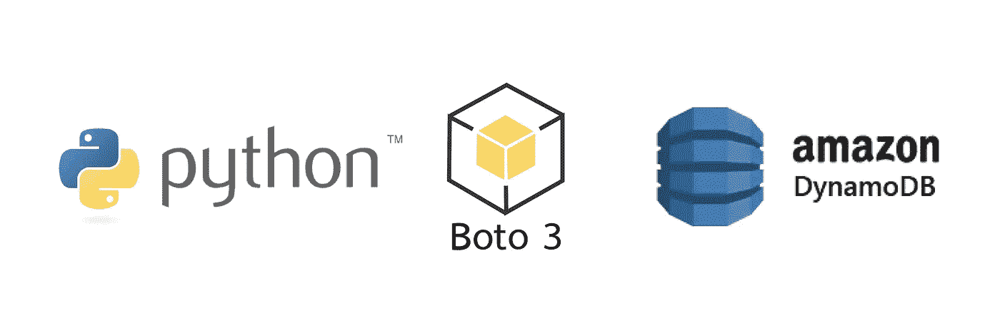
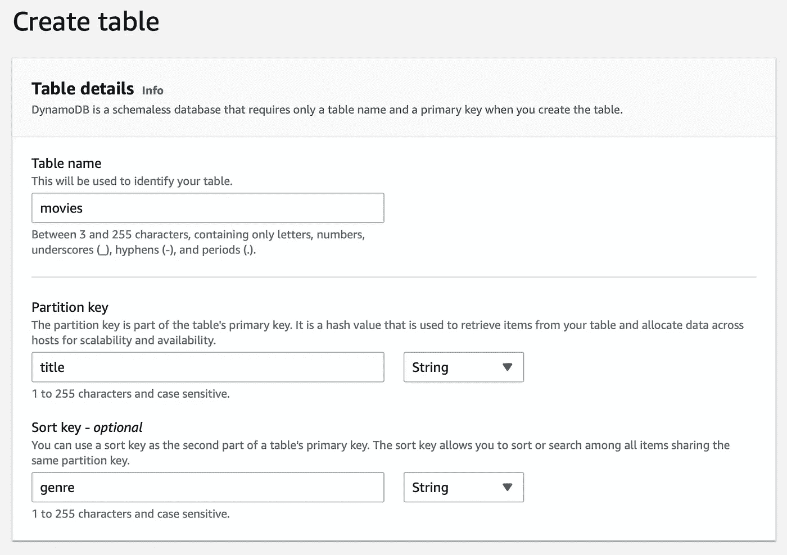
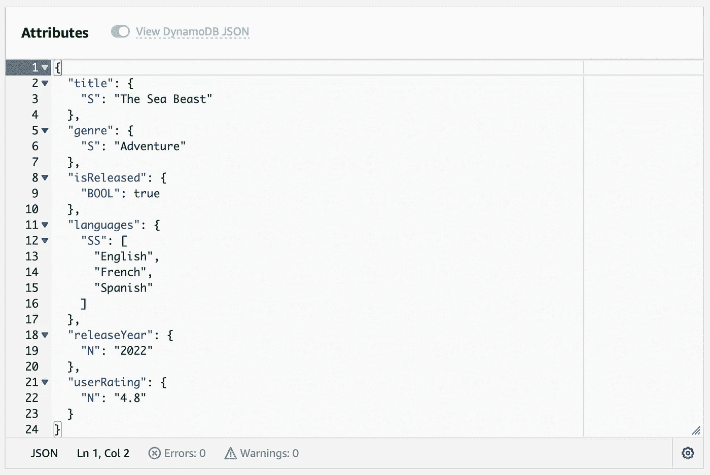
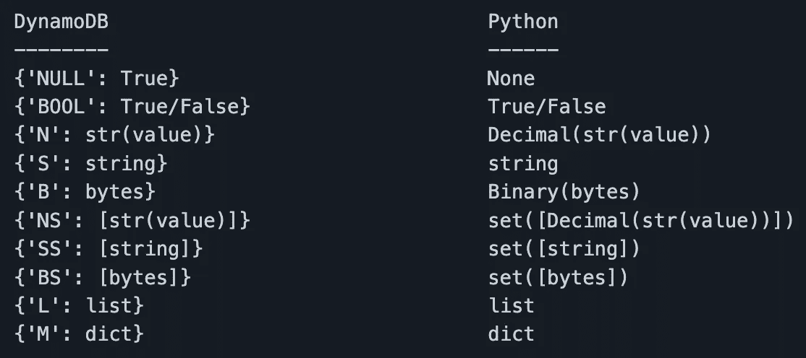

# 用 CerealBox 将 AWS DynamoDB JSON 序列化为 Python dict

> 原文：<https://itnext.io/serialise-aws-dynamodb-json-into-python-dict-with-cerealbox-63c62bd5ba1a?source=collection_archive---------4----------------------->

在这里，我们讨论一个快速演练和参考代码，为您的下一个 AWS 应用程序简化 DynamoDB JSON 序列化过程。

# 绒毛在哪里？

当我开始使用 DynamoDB 时，我很喜欢它的设置和使用非常简单，不用担心可伸缩性、可扩展性或可用性。一切似乎都很有序，直到我在客户端应用程序上创建数据模型时遇到了这个 JSON 序列化的麻烦。

“如果你坚持使用 commons，事情会变得很简单，不是吗？”

当谈到我们最喜欢的 AWS 解决方案之一 DynamoDB 数据库时，情况就不一样了，这就是它模糊的地方。

## 数据类型

DynamoDB 固有地支持 3 种数据类型——字符串、数字和二进制——其余的通用数据类型是这些基本类型的简单派生。如果我们尝试将它们与通用的 Java 数据类型进行映射，我们会得到如下的映射

> **Java 类型** vs **DynamoDB 类型**
> *所有数字类型- >* `*N*` *(数字类型)
> 字符串- >* `*S*` *(字符串类型)
> 布尔- >* `*BOOL*` *(布尔类型)，0 或 1
> byte buffer->*`*B*`*(二进制类型)
> 日期-【日期*

Java mapper 参考:[亚马逊 DynamoDB 开发者指南](https://docs.aws.amazon.com/amazondynamodb/latest/developerguide/DynamoDBMapper.DataTypes.html)

# 我们的设置

为了理解这个问题并演示解决方案，让我们用一些关于动画电影的随机数据建立一个 DynamoDB 表(只是因为我喜欢它们)。

**步骤 1** :创建 dynamodb 表格“电影”

创建 dynamodb 表' **movies** '，以' **title** '为分区键，以' **genre** '为排序键

**第二步**:添加不同数据类型的样本记录

> 这可以用两种方法中的任何一种来完成——使用 Form 视图或 DynamoDB 表的 Create item 选项下提供的 JSON 视图

例如，让我们在某些假设下为电影“海兽”添加一个记录-

电影表项目成分的数据类型

添加了多种数据类型的示例电影记录

**第三步**:客户端代码设置

现在是 Python 客户端——让我们把它设置成一个由 3 个类组成的结构，这个结构可以进一步扩展，以便在将来提供额外的功能

*   database helper——dynamo db 查询的处理程序

*   MovieModel —数据库调用和响应格式管理器

*   Main —这是管理执行流的地方，可以把它想象成请求电影细节的用户界面

# 问题是

一般来说，要将任何响应对象转换为 Python 中可管理的 json 格式的流，我们使用 json.dumps()，这就是我们在 MovieModel 类内注释的*常规方法*中对 DynamoDB 响应所做的尝试。

## 去军事化企图

要理解 DynamoDB json 的类型转换问题，请取消注释 MovieModel 类中的*常规方法*，并注释 *CerealBox 方法*。现在运行主文件—

$ python 3 main _ movie _ dynamo db _ example _ runner . py

## 观察和例外

这导致在*语言*字段出现错误—

TypeError:类型集的对象不是 JSON 可序列化的

出现此问题是因为 StringSet 的输入数据类型无法识别为常规 Java 数据类型，从而导致序列化失败。

# 解决方案

这个序列化问题由 CerealBox 库管理，它提供了对 DynamoDB JSON 的现成支持。😎

根据他们的官方简报—

> CerealBox 是一个用于 python 字典的速度极快的零依赖通用序列化器/反序列化器。它有一个可扩展的体系结构，允许通过配置构建自定义序列化程序。该模块还包括将通用数据类型序列化为 JSON 兼容字典或 DynamoDB JSON 的内置实现。

参考图书馆:[https://github.com/a2d24/cerealbox](https://github.com/a2d24/cerealbox)

## 使用 CerealBox 库的电子监管

现在，在上面的同一个例子中，当 *CerealBox 方法*未被注释并且*常规方法*在 MovieModel 类中被注释时，尝试运行主程序。这将会以正确的格式序列化响应，并在控制台上打印电影的详细信息——

> > {'languages': ['西班牙语'，'法语'，'英语']，' userRating': '4.8 '，' is release ':True，' releaseYear': '2022 '，' genre': 'Adventure '，' title ':' The Sea Beast ' }
>>在数据库中找不到电影。

我们现在可以从这些序列化的响应数据中构建数据模型，并在我们的应用程序中像使用常规 JSON 一样使用它。

CerealBox 使用下面的映射将 DynamoDB json 序列化为 Python dict——

CerealBox 完成 DynamoDB JSON 到 Python Dict 的映射

# 结论

因此，虽然使用 AWS DynamoDB 有其优点和缺点，但在迁移/采用云的过程中，使用 CerealBox 可以非常容易地处理复杂的应用程序数据。❤️

# 包装它

请在评论中分享💬你遇到如此低级的设计问题，当大象通过的时候，你被卡住了，你的头痒着去推动它的尾部。😄

*   👏—如果这个快速的总结在某些方面对你有所帮助，请鼓掌
*   🔗—请与好奇的人们分享这篇文章，寻找答案
*   ➕——按下**跟随**关注更多关于*云*、*移动应用开发*和*系统*的简化内容

 [## 汉堡类比:命令式与声明式编程风格

### 理解历史评估系统设计范例的基本方法

better 编程. pub](https://betterprogramming.pub/the-burger-analogy-for-imperative-vs-declarative-styles-of-programming-3caf026fd553)  [## 使用 Mosquitto MQTT 代理的流媒体颤振事件

### 通过 counter app 示例程序探索 MQTT 消息传递协议在 Flutter 中的强大功能

better 编程. pub](https://betterprogramming.pub/streaming-flutter-events-with-mosquitto-mqtt-broker-28998a3b81c2)