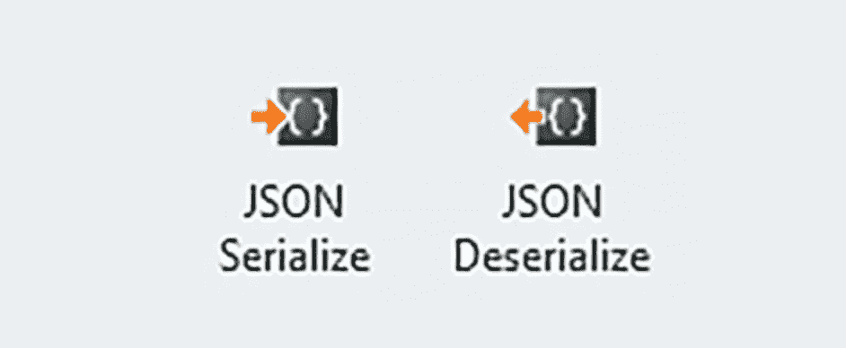
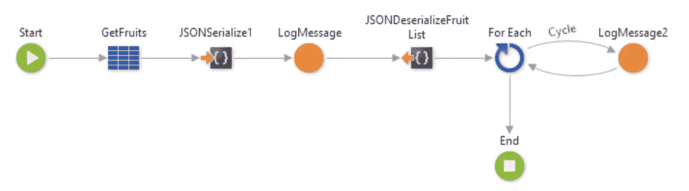
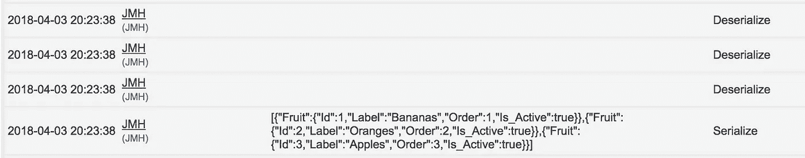
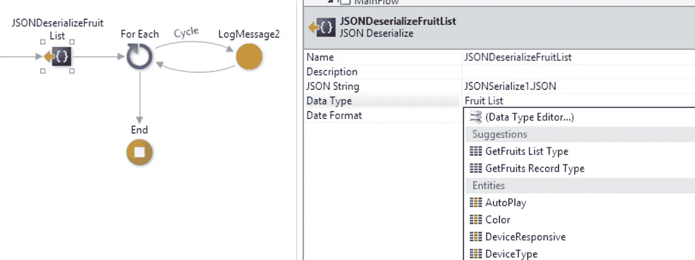
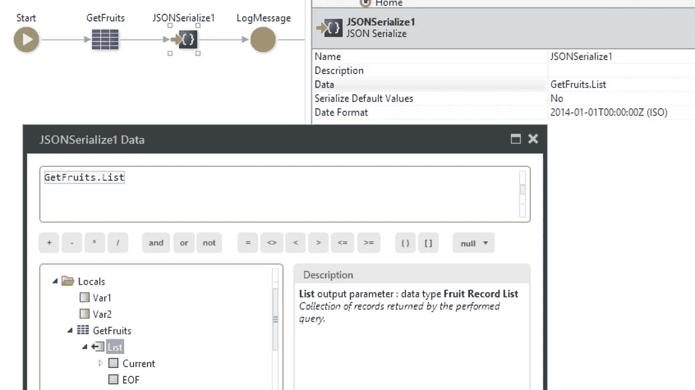
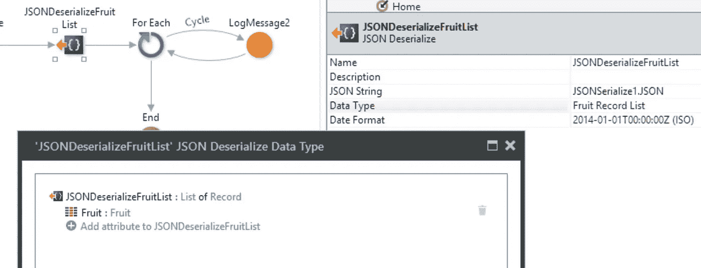
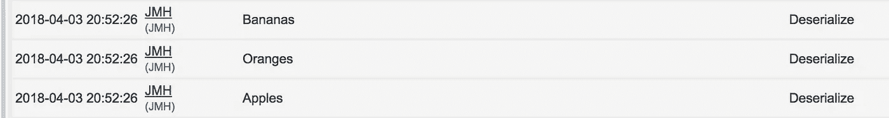

# 在外部系统平台中序列化/反序列化 JSON

> 原文：<https://itnext.io/serializing-deserializing-json-in-the-outsystems-platform-ae08f2f6b5b4?source=collection_archive---------2----------------------->

从版本 10 开始， [OutSystems](https://www.outsystems.com/) 平台现在在 visual IDE (Service Studio)中提供内置的 JSON 序列化/反序列化。与以前的版本相比，这是一个很大的改进，在以前的版本中，您必须自己进行序列化/反序列化操作，或者从外部系统 [Forge](https://www.outsystems.com/forge/) (一个免费的社区模块库，用于加速应用交付)安装现有的操作。

最近我试图在 OutSystems 论坛上帮助某人，我自己在尝试使用这些新的内置动作时也遇到了一些问题。



可用的新操作是 JSON Serialize 和 JSON Deserialize。您可以在 Service Studio 的工具箱中找到它们。

回到我提到的问题…这个案例很简单。有人试图反序列化 serialize 的输出(困惑了吗？😕)但是没有价值出来。



流程大概是这样的:

1.  从实体获取一些记录(水果)
2.  将水果列表序列化为 JSON
3.  将所述 JSON 反序列化回一个列表

因此，在第一个 LogMessage 之前，一切都很好。您将获得以下 JSON:

```
[{"Fruit":{"Id":1,"Label":"Bananas","Order":1,"Is_Active":true}},{"Fruit":{"Id":2,"Label":"Oranges","Order":2,"Is_Active":true}},{"Fruit":{"Id":3,"Label":"Apples","Order":3,"Is_Active":true}}]
```

但是，在反序列化上述 JSON 之后，没有记录任何内容。



空行反序列化。

建议:试着给自己做同样的例子，看看是否得到同样的结果。😁

问题出在一个小细节上。在选择反序列化的数据类型时，Service Studio 建议使用 GetFruits " **List** "类型，这在这个场景中不适用。



注意，数据类型是“**水果列表**”。

事情是这样的，你连载了一个“**记录列表**”(又糊涂了？😆).



注意，查询的输出是一个“**水果记录列表**”。

因此，为了从反序列化中得到一些东西，您必须“纠正”IDE 的建议，并说您想要反序列化的是“水果”的“**记录列表**”(而不是水果的“**列表**)。



注意，数据类型现在是“**水果记录列表**”。

经过这个小的大的变化，你现在得到你的美味水果记录！

这一切都是为了匹配被序列化/反序列化的类型。



一头雾水的“**列表**”和“**记录列表**”？别担心。一切都在 [**这个**](https://www.outsystems.com/forums/discussion/14342/from-record-lists-to-lists/) 帖子里解释。

我希望你不要(像我一样)在想为什么反序列化不起作用的时候纠结…

献给日本🤘