# 通过 OutSystems、AWS S3 和 CloudFront 大规模提供文件服务

> 原文：<https://itnext.io/serve-files-at-scale-with-outsystems-and-aws-s3-and-cloudfront-6f0b11a37866?source=collection_archive---------1----------------------->

在本文中，我将介绍如何将系统外的文件存储卸载到 AWS S3，并使用 AWS CloudFront 大规模提供私有 S3 存储桶对象。


在外部系统应用程序中存储和检索文件的最简单方法是在数据模型中使用二进制数据类型。文件在数据库中存储为 BLOB(二进制大对象),可以使用聚合进行查询。

从我的角度来看，对于较小的文件和较小的数量完全足够了。然而，超过一定的容量，外部系统数据库中的文件存储就不再足够或有用。

提供文件的二进制数据属性的主要缺点是:

*   不支持**文件流**和**字节范围请求** —当通过聚合进行查询时，必须从数据库中读取二进制数据属性的完整内容，并在外部系统前端服务器上进行处理。之后，向客户端应用程序的传输又是一次完整的下载。对于流媒体来说，这是不合适的，因为例如不可能直接跳到视频的某个时间点。此外，这会造成延迟，对用户体验有负面影响。

字节范围支持不仅与流媒体相关，还与通过下载管理器的多个连接(多部分下载)或中断下载的恢复相关。

流媒体还包括 web 优化的 PDF 文档—线性化 PDF —可以直接在应用程序中显示，例如，使用 Adobe PDF Embed。

Microsoft SQL Server 具有 FILESTREAM 功能，非结构化数据存储在文件系统中，可以通过 API 作为流再次提供给应用程序。但是，OutSystems 不支持 FILESTREAM 特性。

*   **内存使用** —前端服务器从外部系统数据库中检索数据，并缓存在主内存中。随着大量大文件的同时读取，这很快会导致内存溢出和内存交换，从而大大降低性能，甚至会导致超时。

Microsoft SQL Server 还处理主内存中的数据，如果有许多文件检索，则必须相应地确定主内存使用的优先级，从而导致整体数据查询速度变慢。

**总之**

*   不支持流媒体
*   外部系统前端服务器上的高主存要求
*   Microsoft SQL Server 实例上的高主内存要求
*   较慢的数据查询和总体较差的外部系统环境性能
*   文件查询和资源调配之间的延迟更长

最后，所有文件都集中存放。例如，如果您的 OutSystems 环境部署在欧洲(无论是作为云实例还是在您自己的数据中心)，所有其他地区都会由于距离而自动具有更高的延迟。

总的来说，通过外部系统数据库提供文件有许多缺点。因此，对于大容量配置，建议切换到第三方技术，如 **AWS 简单存储服务(S3)** 。

OutSystems 与 Amazon Web Services 有着紧密的合作关系，并通过 Forge marketplace 为 AWS 服务提供了几个连接器。其中包括对象存储服务 S3。

# AWS 简单存储服务(S3)

AWS 简单存储服务(简称 S3)是一种对象级存储，可以存储任何数据，包括文档、视频、图像、完整的网站等等。S3 不将数据作为文件存储在文件系统中，而是将它们转换成数字对象。这些对象可以用进一步的信息(元数据)来丰富，这对自动化的后续处理特别有帮助。

S3 将存储的对象组织到桶中，单个 AWS 帐户最多可以包含 100 个桶。如果需要，在向 AWS 请求扩展后，该数量可以扩展到 1000 个桶。虽然可以从 AWS S3 控制台创建文件夹，但 S3 没有分层存储。虚拟分层存储是通过对象标识符的前缀实现的，对象标识符是由正斜杠分隔的字符串。

S3，或 S3 API，已经成为市场上的一个标准。除了 AWS S3，还有一些免费和商业产品完全或部分实现了该标准。其中包括戴尔等存储解决方案提供商。我个人最喜欢的 S3 兼容商店是 MinIO。

S3 被其他一些 AWS 服务使用，例如用于存储快照，或者 S3 桶可以作为 AWS 内容交付服务 Cloudfront 的源。

Forge Marketplace 包含几个提供 AWS S3 访问的组件。OutSystems 本身提供了一个受支持的连接器，名为**亚马逊简单存储服务(S3)**

[](https://www.outsystems.com/forge/component-overview/11172/amazon-simple-storage-service-s3) [## 亚马逊简单存储服务(S3)

### 将您的 Amazon 简单存储帐户与 OutSystems 连接起来，以备份关键数据，减轻您的运营负担…

www.outsystems.com](https://www.outsystems.com/forge/component-overview/11172/amazon-simple-storage-service-s3) 

要在 OutSystems 应用程序中从 S3 存储中检索文件，我们有两个选项:

## 通过外部系统服务器操作检索 S3 对象

在 OutSystems 服务器操作中，根据 id 从存储中检索所需的 S3 对象。为此，亚马逊简单存储服务(S3)连接器提供了服务器动作 **Object_Get** 。授权给 S3 存储桶的 IAM 凭据和对象是必需的。

从 S3 存储中完整地检索该对象，并使其作为二进制数据可用。然后，它可以通过小部件显示在应用程序中，或者可供下载。

如果我们使用服务器动作 **Object_Get** 来检索 S3 对象，我们实际上并没有得到多少。和以前一样，首先从 S3 存储中检索完整的对象，然后传递给我们的客户端应用程序。这意味着

*   不支持流媒体(支持字节范围)
*   前端服务器上的高内存需求
*   检索和交付之间的等待时间

我们唯一取得的成就是文件不再在数据库中，因此 Microsoft SQL Server 的负载有所减轻。至少有所进步，但不是真正的进步。

最重要的是，我们仍然集中检索文件(通过我们的前端服务器)。

## 在客户端应用程序中使用预先指定的 URL 检索 S3 对象

我们的目标是让我们的前端服务器不处理实际的文件。客户端应用程序应该只获取对象的 URL，然后从 S3 存储本身检索文件。

默认情况下，S3 存储桶是私有的，只有具有适当策略的 AWS IAM 帐户(或假定角色)才能访问该存储桶和存储在其中的对象。人们可以让一个桶公开访问，但这几乎是不可能的。

AWS S3 提供了为文件或对象创建 S3 预签名 URL 的能力。预先指定的 URL 允许在规定的时间内(例如 60 分钟)访问一个对象。预先设计的 URL 也可用于替换现有对象或在 S3 对象库中创建新对象。

S3 连接器允许通过服务器动作 **Object_GetPresignedUrl** 生成预先指定的 Url。

预先设计的 URL 包含对象的路径以及访问方法——HTTP 动词(GET、HEAD、PUT 等)。)—用于访问。包括 HTTP 动词在内的完整 URL 是经过签名的，因此不可能通过 S3 预先签名的 URL 同时执行 GET 和 HEAD 请求。对于每种访问类型，需要一个单独的 S3 预先指定的 URL。

通过使用 AWS S3 控制台为一个对象生成一个预先指定的 URL(您总是在控制台中为 GET 请求创建预先指定的 URL)，可以很容易地重现这种情况。

将 URL 复制到 Postman GET 请求中，并提交该请求。请求被成功执行，并以状态码 200 确认。

现在将 HTTP 动词改为 HEAD，并再次提交请求，这将得到确认，并显示错误代码 403 禁止。

可以将预先设计的 URL 传递给客户端应用程序，客户端应用程序从存储中检索相应的 S3 对象。而不需要通过外部系统下载，这减少了延迟。

对 S3 对象的直接访问还支持字节范围请求，从而支持流媒体。

> **异常**:一些 JavaScript 库比如视频播放器或者 PDF 查看器首先通过 HEAD 请求查询 URL，判断对象是否存在，是否支持字节范围。只有这样，它们才能通过 GET 请求在同一个 URL 上检索实际的对象。由于 S3 预先指定的 URL 只适用于一种类型的访问，这自动失败，然后库使用没有字节范围支持的对象。

S3 预先指定的 URL 仅对一个对象有效，并且不可能一次访问多个 S3 对象，例如，具有特定前缀的所有对象(S3 控制台中的文件夹)。

使用预先设计的 URL(并在我们支持 URL 的客户端应用程序中使用小部件),我们已经实现了几件事情

*   文件的处理不再在我们的前端服务器上完成
*   更低的延迟，因为客户端不再需要等待处理，而是直接访问文件
*   S3 支持字节范围请求，从而支持流媒体

然而，还有一点。S3 存储桶在 AWS 区域提供，因此来自其他区域的访问具有更高的延迟。为了解决这个问题，我们可以使用我们的 S3 桶作为 AWS 内容交付网络服务 **CloudFront** 的来源，并以低延迟在全球范围内提供文件。

> S3 存储桶内容可以复制到其他存储桶，甚至跨地区复制。然后，可以通过多区域接入点访问内容，AWS 确保最靠近客户端的 S3 存储桶始终响应。然而，OutSystems S3 连接器不支持多区域端点(或一般的自定义端点),无论如何跨区域提供存储桶(另请参见帐户存储桶限制)并相应地为内容付费是没有意义的，即使它没有被使用。

# AWS 云锋

CloudFront 是一种内容交付网络(CDN)服务。cdn 是在地理上分布的服务器组，可以高效、低延迟地提供任何互联网内容。这是通过确保 CDN 中的内容总是从最靠近客户端(存在点)的服务器组(边缘服务器)中检索来实现的。

CDN 中的内容可以是视频、音频文件、图像和文档，也可以是 HTML、JavaScript 和 CSS。完整的网络存在可以存储和分布在 CDN 上，这对于静态网站或通过静态站点生成器框架(如 Gatsby)生成的网站特别有意义。

内容不会自动分发到所有 CloudFront Edge 服务器组。相反，内容最初是从一个定义的源(源)中检索的，例如，一个 S3 存储桶，并缓存一段定义的时间。然后直接从缓存中处理后续请求。这意味着第一次检索花费的时间稍长，因为必须首先从源中检索内容。

对于 CDN 内容，首先想到的是内容是公开的。有了 CloudFront，就有可能使**的私有内容**变得可用，这些内容应该只有在授权后才能访问。这是通过使用**签名的 URL**或**cookie**来实现的。签名是在您的外部系统应用程序中使用私钥生成的。

**S3 预签名网址和 CloudFront 签名网址的区别**

S3 预先签名的 URL 和 T2 CloudFront 签名的 URL 都允许访问私人内容。在这两种情况下，都会对 URL 进行签名，并将签名附加到相应的 URL 上。在访问时，验证签名，如果成功，则准许访问所请求的资源。
然而，还是有一些显著的不同

*   **S3 预签名**URL 使用 IAM 凭证签名。访问资源时，授予的权限由分配给该 IAM 用户的策略定义(或在存储桶策略中授予)。
*   **CloudFront signed**URL 使用自己生成的私钥进行签名。相关的公钥被上传到 CloudFront，用于验证签名。用户是否被授权访问资源是由 URL 和签名的有效性决定的。如果签名对 URL 有效，则无论如何都会授予访问权限。
*   **S3 预先设计的**URL 仅适用于商店中的一个对象，包括访问方法(GET、POST 等)。). **CloudFront 签名的**URL 也可以包含通配符，因此可以访问多个对象(例如，路径下的所有文件)。 **CloudFront 签名的**URL 总是适用于 CloudFront 发行版的所有允许的访问方法，因此 GET 和 HEAD 请求可以使用同一个签名的 URL。

> CloudFront 不仅允许通过 GET 和 HEAD 检索对象。您还可以允许上传、发布、修补、删除和选项请求。GET 和 HEAD 请求被缓存，而所有其他请求被直接传递到源端——在我们的例子中是 S3 存储。然后可以使用 CloudFront 发行版 ARN 的 S3 桶策略来限制实际的权限。

# 履行

现在让我们结束理论部分，看看这些是如何在一个 OutSystems 应用程序中结合在一起的。

我们会的

*   创建一个 **S3 桶**来存储我们的文件。
*   创建一个 **IAM 帐户**，该帐户有权访问我们的 S3 存储桶。此帐户的目的是使用亚马逊简单存储服务(S3)连接器组件上传文件。
*   使用 openssl 创建一个**公钥/私钥对**。我们将使用**私钥**来签署 CloudFront URLs 和 Cookies。
*   将**公钥**上传到 CloudFront，并创建一个 CloudFront 密钥组。CloudFront 将使用公钥来验证签名的 URL 和 cookies。
*   以我们的 S3 桶为原点创建一个**云锋分布**。
*   使用亚马逊简单存储服务(S3)连接器将一些文件上传到 bucket
*   创建**签名的 URL**来直接从我们应用程序的前端访问私有文件。

# 先决条件

跟随你将需要以下

*   访问 AWS 帐户，该帐户有权创建 S3 Bucket 和 CloudFront 发行版。
*   访问 AWS 身份和访问管理(IAM ),为我们的 OutSystems 应用程序创建 IAM 用户。
*   OpenSSL 来创建密钥对。

> 你可以从 [Shining Light Productions](https://slproweb.com/products/Win32OpenSSL.html#) 下载一个微软 Windows 版本，或者使用 Linux 发行版的 WSL 安装中的 openssl 命令。

*   [亚马逊简单存储服务(S3)](https://www.outsystems.com/forge/component-overview/11172/amazon-simple-storage-service-s3) 伪造组件。我们只使用这个上传文件到我们的 S3 桶。

# 创建一个 S3 桶

创建新的 S3 存储桶时，默认情况下其内容是私有的。这意味着如果没有通过 IAM 或 Bucket 策略授予的权限，就不能访问对象。在本演练中，我们将使用默认设置创建一个存储桶。

*   去 AWS 控制台，切换到亚马逊 S3 服务
*   在您选择的区域和名称中创建新的存储桶

> 返回到您的存储桶列表后，请注意您创建的存储桶以及“访问”列中的**存储桶和非公共对象**设置。

# 创建 IAM 用户帐户

接下来，我们将创建一个具有编程访问权限的新 IAM 用户帐户。这将给我们以**访问密钥**和**访问秘密**形式的凭证，我们将使用这些凭证通过**亚马逊简单存储服务(S3)** 组件将新文件上传到我们的 bucket。

在将用户添加到 IAM 之前，我们首先创建一个权限策略，该策略只授予向 s3 存储桶添加新文件的权限

*   切换到 IAM 服务
*   在“策略”下，单击“创建策略”

**使用可视化编辑器创建策略**

*   选择 S3 服务
*   在**动作**下，从**写**权限树中仅选择**放置对象**
*   在 Resources 下，为您创建的 **bucket name** 添加对象 arn，并为对象选择 **Any** 。

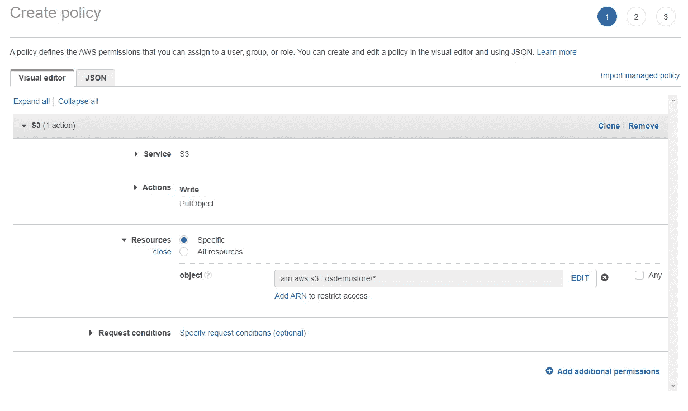

*   在向导中单击，直到您可以提供策略名称并保存新策略。

保存策略后，我们现在可以创建一个 IAM 用户，并将新策略附加到该帐户。

*   在 IAM 用户界面，点击**添加用户**。
*   输入用户名，确保选中**访问键—编程访问**选项，然后点击**下一步**。

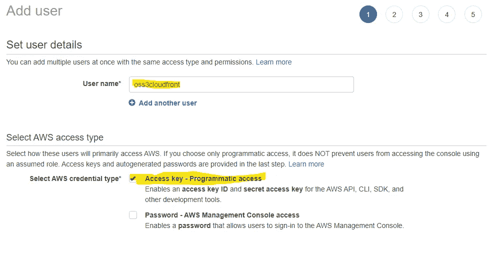

*   在**权限**屏幕中，点击直接附加现有策略，搜索您之前创建的策略并选中其旁边的复选框。然后浏览向导，直到点击**创建用户**按钮。

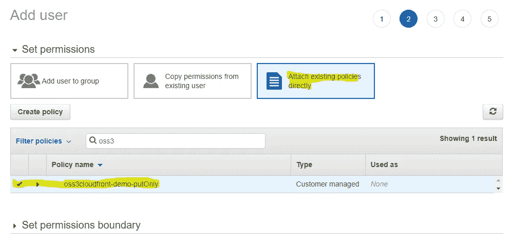

*   点击创建用户按钮后，您将看到帐户凭证页面。确保复制**访问密钥**和**秘密访问密钥**或下载 CSV。

# 创建密钥对

如上所述，我们在 OutSystems 应用程序中需要一个私钥来签署 URL 和/或 Cookies，以便通过 CloudFront 访问我们的私有 S3 文件。CloudFront 需要公钥来验证签名。

**创建私钥**

```
openssl genrsa -out aws_cloudfront_privatekey.pem 2048
```

**创建公钥**

```
openssl rsa -pubout -in aws_cloudfront_privatekey.pem -out aws_cloudfront_publickey.pem
```

**向 CloudFront 添加公钥**

*   用文本编辑器打开公钥 pem 文件，并将内容复制到剪贴板
*   在 AWS 控制台切换到 CloudFront 服务
*   在**密钥管理**下的左侧菜单中，选择**公钥**并点击**创建公钥**。
*   为公钥命名，并将 pem 文件的内容粘贴到密钥字段。然后点击**创建公钥**。

请注意您创建的公钥的 ID，我们稍后会用到它。

**创建关键组**

键被分组到键组中，以后会被 CloudFront 发行版引用。如果相关密钥组中的任何可用公钥都可以验证签名，则签名是有效的。

*   在密钥管理下选择密钥组，点击**创建密钥组**。
*   给它一个名称，并从可用公钥列表中选择您添加的公钥。然后点击**创建按键组**。

# 创建一个 CloudFront 发行版

现在是时候使用我们的 S3 桶作为原点来创建 CloudFront 发行版了。

*   在 CloudFront 菜单中选择**发行版**并点击**创建发行版**。
*   从**源域**列表中选择您的 S3 存储桶，并为这个新发行版提供一个**名称**。
*   在**原点访问**下选择**原点访问控制设置(推荐)**
*   点击**创建控制设置**按钮，使用默认选项创建新设置。

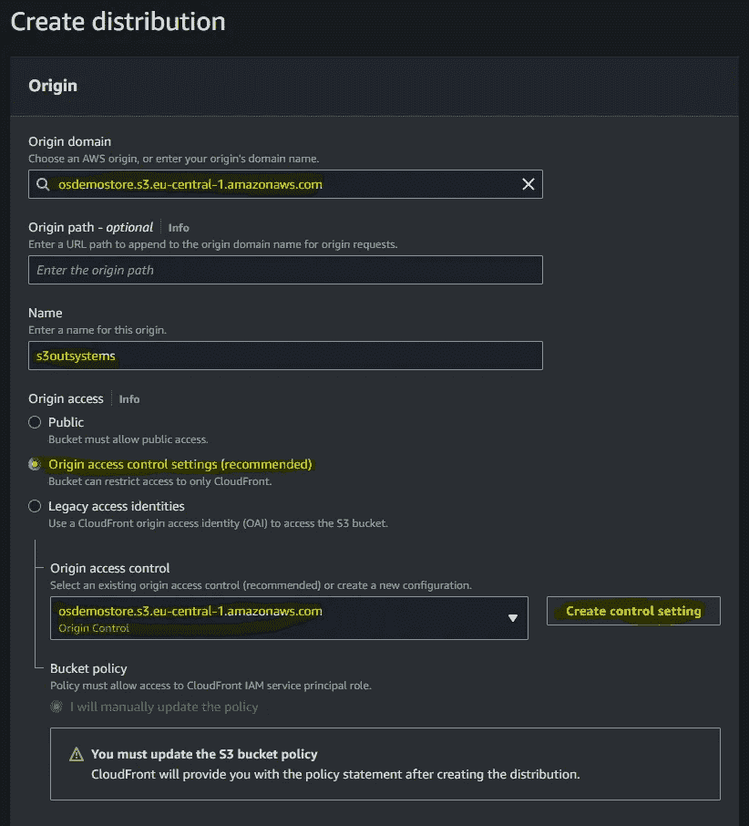

*   确保在**默认缓存行为**下的**限制查看者访问**设置上点击**是**。
*   然后从可用键组列表中选择您创建的**键组**。

> 这是**最重要的设置**。如果不限制查看者的访问，那么 CloudFront 中的所有缓存对象都将是公开的。如果设置为 Yes，那么 CloudFront 发行版将只处理带有有效签名 URL 或 cookie 的请求。

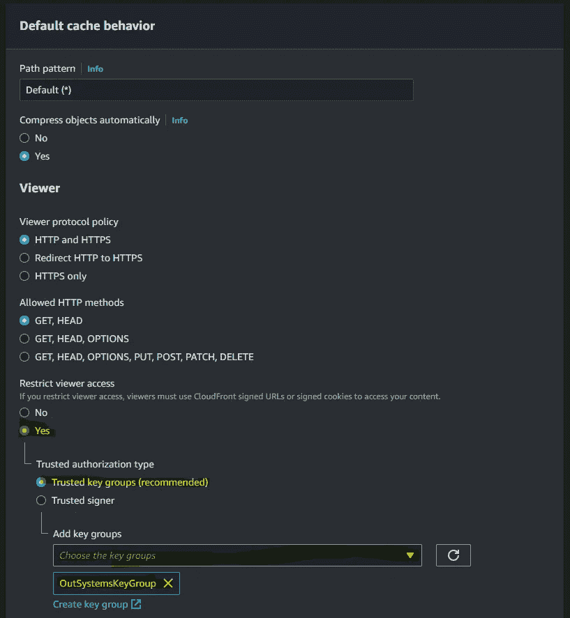

检索查看者访问和可信密钥组

*   保持其余设置不变，并点击**创建分布**。

在你创建了你的 CloudFront 发行版之后，从 General 选项卡中记下你的**发行版域名**(例如 gfds76768das.cloudfront.net)。我们稍后将需要它来访问文件。

尝试使用浏览器访问您的分发域名。您应该会收到以下形式的错误

```
<Error>
  <Code>MissingKey</Code>
  <Message>Missing Key-Pair-Id query parameter or cookie value</Message>
</Error>
```

这表明只有使用签名的 URL 或 cookie 才能访问这个 CloudFront 发行版。

# 允许 CloudFront 访问 S3 存储桶

我们需要授权 CloudFront——更具体地说是我们的 CloudFront 发行版——访问我们的 S3 桶。和其他资源或用户一样，CloudFront 需要权限来从存储中检索对象，并将它们放入缓存中。我们通过在 S3 存储桶中应用存储桶策略来做到这一点。幸运的是，CloudFront 为我们提供了一个模板桶策略。

*   在你创建的 CloudFront 发行版中选择**源**头。然后从列表中选择您的 S3 产地，并点击**编辑**。

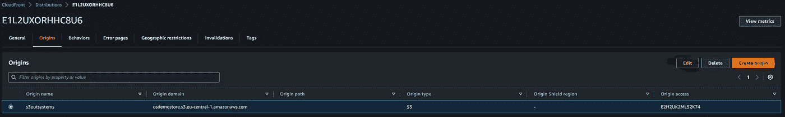

*   点击**复制策略**按钮，将预先创建的存储桶策略复制到剪贴板。
*   切换到 **S3 服务**并从桶列表中点击您的 S3 桶。
*   选择**权限**选项卡
*   在**Bucket policies**下点击 **Edit** ，然后粘贴复制的策略**保存修改**。

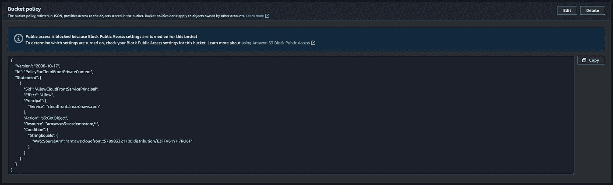

木桶策略

好的。到目前为止，这是一段艰难的旅程，但是现在我们已经创建并配置了在我们的应用程序中使用它的所有先决条件。

对于下一步，您需要在整个配置步骤中创建的以下信息。

*   **S3 桶名**和**桶区域** —来自 AWS S3 控制台的桶列表
*   **CloudFront 分发名称** —来自 AWS CloudFront 控制台—分发详细信息屏幕。
*   **CloudFront Key Id** —您上传的公钥 Id—CloudFront 控制台密钥管理菜单—公钥
*   **私钥** —您创建的私钥的 pem 文件，该文件与您上传到 CloudFront 的公钥相对应
*   **IAM 用户访问密钥和秘密密钥** —您在创建 IAM 用户帐户时创建的凭证，该帐户具有将对象放入 S3 商店的相关策略。

# 外部系统演示应用程序

出于演示目的，我创建了一个示例应用程序，您可以从 OutSystems Forge 下载。

[](https://www.outsystems.com/forge/component-overview/14291/serve-files-at-scale-demo-application) [## 大规模提供文件演示应用程序

### 这个应用程序是我发表的一篇关于 medium.com 的文章的姊妹篇。它演示了如何访问私人内容…

www.outsystems.com](https://www.outsystems.com/forge/component-overview/14291/serve-files-at-scale-demo-application) 

该应用程序允许您上传图像，这些图像直接上传到您的 S3 桶。对于您上传的每个图像，都会在图像实体中创建一条记录。这模拟了一个真实的场景，您将在文档中存储文件的附加数据和关系，同时在 S3 存储桶中存储二进制数据。

上传一些图像后，会显示一个图库。这些图片是使用一个签名的 URL 从 CloudFront CDN 加载的。

服务器 action Gallery_GetImages 查询数据库中的所有图像，并返回每个图像的签名 URL。

为了构建和签名 URL，我创建了一个组件 **AWS CloudFront Signer** ，并将其发布在 OutSystems Forge 上。它使用 AWS CloudFront C# SDK。

[](https://www.outsystems.com/forge/component-overview/14289/aws-cloudfront-signer) [## AWS CloudFront 签名者

### 基于 AWS CloudFront SDK 的实用服务，用于创建带有预设和自定义策略的签名 CloudFront URLs

www.outsystems.com](https://www.outsystems.com/forge/component-overview/14289/aws-cloudfront-signer) 

AWS CloudFront Signer 组件公开了两种不同的服务器操作来创建已签名的 CloudFront URL。

*   CloudFront_GetCannedSignedUrl —用于创建带有固定策略的签名 Url。
*   CloudFront_GetCustomSignedUrl —用于创建带有自定义策略的签名 Url。

[](https://docs.aws.amazon.com/AmazonCloudFront/latest/DeveloperGuide/private-content-signed-urls.html) [## 使用签名的 URL

### 已签名的 URL 包含附加信息，例如，到期日期和时间，这使您可以更好地控制…

docs.aws.amazon.com](https://docs.aws.amazon.com/AmazonCloudFront/latest/DeveloperGuide/private-content-signed-urls.html) 

固定和自定义策略签名 URL 之间最关键的区别是

*   对于固定策略，您不能在资源 URL 路径中使用通配符。您必须为每个资源创建一个签名的 URL。
*   使用预设策略，您不能为 URL 指定开始日期时间。在到达到期日期之前，可以立即访问预设策略 URL。
*   自定义策略 URL 较长，因为策略文件包含在 base64 编码的查询字符串中。

**配置演示应用**

在尝试演示应用程序之前，您必须设置一些配置站点属性。在“服务中心”中打开模块 ServeFilesAtScale _ CS，然后单击“站点属性”选项卡。

根据您的 AWS 配置相应地设置站点属性。

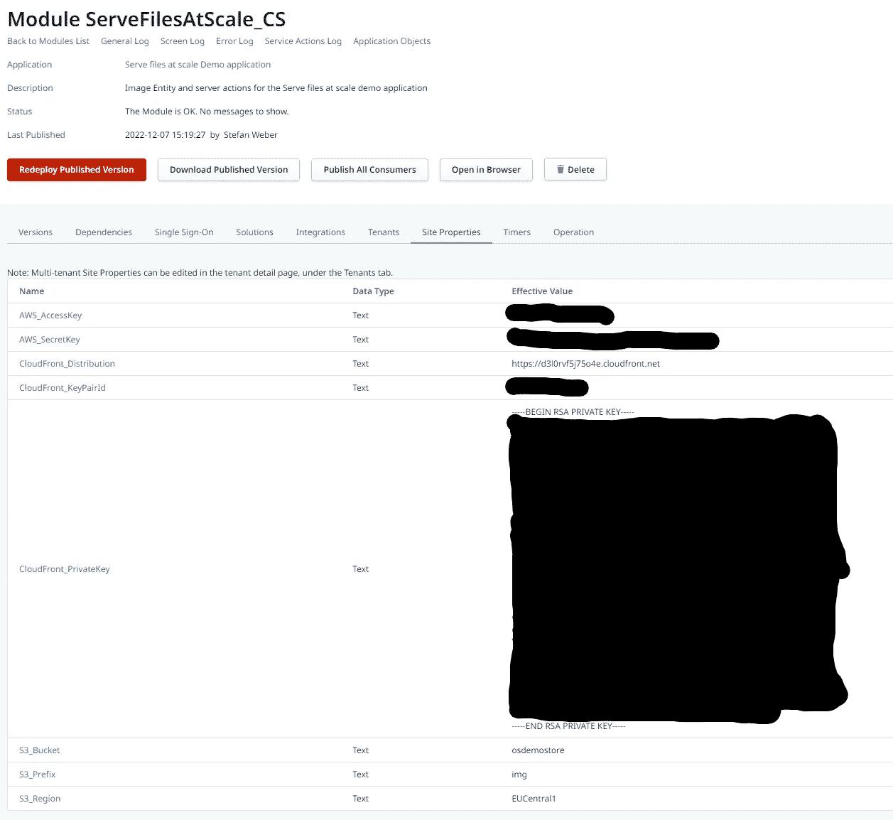

*   **AWS_AccessKey** —将其设置为您创建的 IAM 用户帐户的访问密钥
*   **AWS_SecretKey** —将其设置为您创建的 IAM 用户帐户的密钥。
*   **CloudFront _ Distribution**—包含协议 https 的分发名称，如上图所示。
*   **CloudFront_KeyPairId** —您在 AWS CloudFront 控制台中创建的公钥的 Id。
*   **CloudFront _ private key**—您用私钥创建的 PEM 文件的内容
*   **S3 _ 存储桶** —您创建的 S3 存储桶的名称
*   **S3 _ 前缀** —已经用 img 预定义。这是上传图片的默认前缀(文件夹)。
*   **S3 地区** —您创建了 S3 存储桶的 AWS 地区。

> **注意**:必须用 C#枚举格式指定区域。所以 eu-central-1 就是 EUCentral1。在这里你可以找到所有可能值的列表 [AWS SDK。NET V3 API 文档(Amazon.com)](https://docs.aws.amazon.com/sdkfornet/v3/apidocs/items/Amazon/TRegionEndpoint.html)

现在尝试一下，上传一些图片。在浏览器中打开开发者工具(F12)并点击网络标签。如果你已经正确配置了所有的东西，你会注意到所有的图片都是由 CloudFront 提供的，带有一个很长的包含 URL 签名的 URL。

**上传图片到 S3 桶**

打开**servefileatscale _ CS**模块和服务器动作 **Gallery_AddImage** 。

这个服务器动作获取一个图像，并将其放入您的 S3 桶中。它使用配置的 S3 前缀和提供的文件名作为标识符。

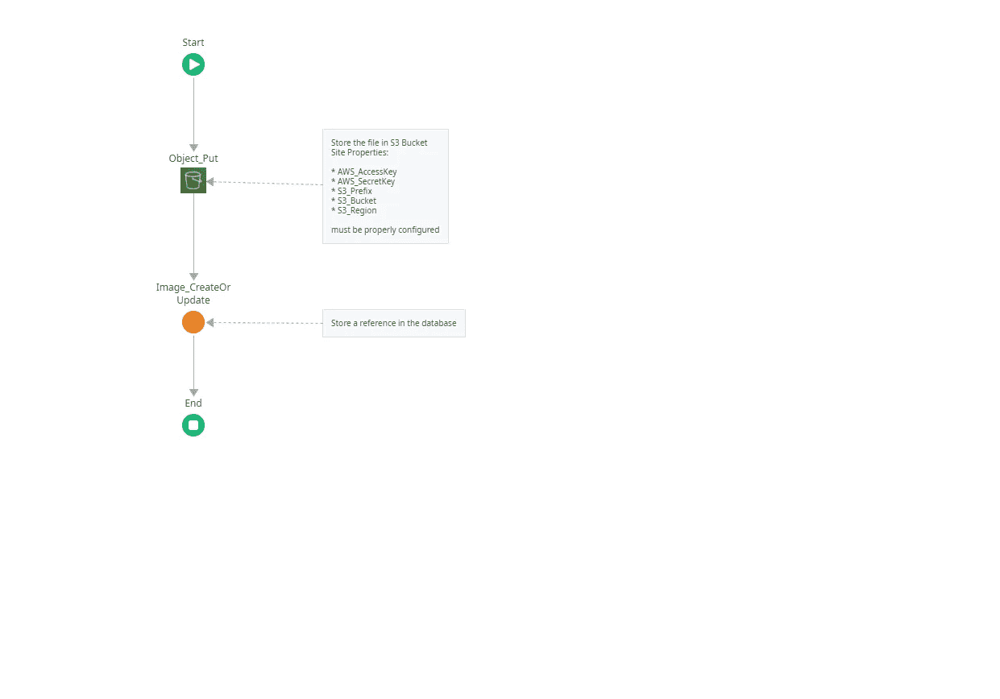

图库 _AddImage

> **记住**:当我们为 IAM 用户帐户配置策略时，我们只允许将对象放入您的存储桶。使用最小特权总是好的。

将文件放入存储桶后，将在图像实体中创建一条记录。这可能是您在实际应用程序中要做的事情。将二进制数据的存储卸载到 S3，并在数据库中保留二进制数据的引用。

> **注意**:将存储卸载到 S3 时，您需要注意数据库中的图像记录与存储在 S3 的文件之间的一致性。S3 能够在文件删除或修改等情况下引发数据事件。您可以通过订阅 webhooks 来使用这些事件，并采取适当的措施。

**检索图像和已签名的 URL**

打开 **Gallery_GetImages** 服务器动作。第一个流动作是**CloudFront _ GetCustomSignedUrl**。

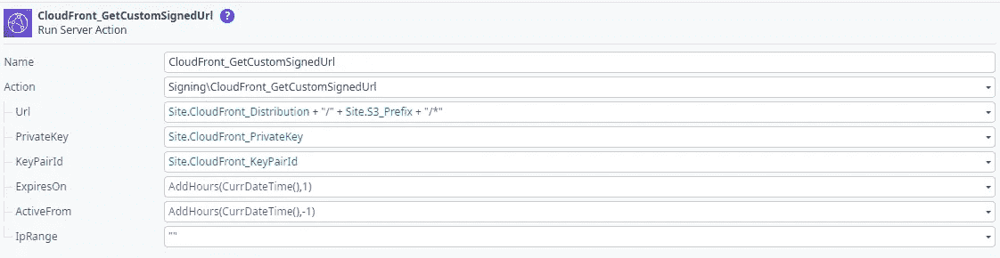

CloudFront_GetCustomSignedUrl

**Url** 参数被设置为我们的 CloudFront 发行版名称，后跟已配置的前缀(文件夹),后跟通配符*。这将生成一个对前缀之后的所有内容都有效的签名。

**ExpiresOn** 是签名的 URL 有效之前的未来日期。过期后，当您尝试使用已签名的 URL 访问资源时，将会出现错误 403 FORBIDDEN。

**ActiveFrom** 指定可访问该资源的开始日期时间。如果您想直接访问它，那么您应该将 ActiveFrom 日期时间设置为至少比当前日期时间早 5 分钟(CurrDateTime())，以补偿您的外部系统环境和 AWS 之间的时差。

接下来，从数据库中读取所有图像。

对于数据库中的每个图像，使用 list append(**construct result**)填充结果结构。

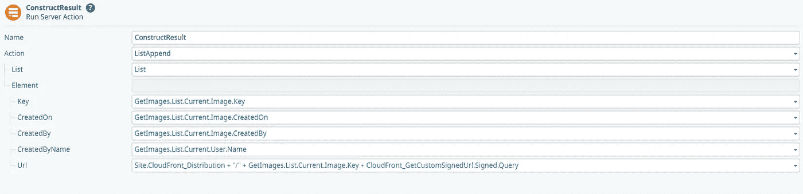

ListAppend —构造结果

结果结构的 Url 属性设置为 CloudFront 分发名称，后面是存储在数据库中的键(即前缀+文件名)，后面是查询属性**CloudFront _ GetCustomSignedUrl**结果。

因为我们使用了通配符，所以我们不能使用服务器动作的**absolute uri**属性，我们必须手动连接文件资源路径，然后只追加**查询**字符串。**查询**保存 URL 的签名信息。

此 URL 在 UI 模块的图库中用作外部 URL。

仅此而已。我希望您能够重现所有的步骤，并对本文中概述的主题有一点熟悉。

当然，总是有更多的…

# 注意

我们用默认选项配置了 S3 和 CloudFront。在生产环境中，可能需要额外的配置。对 S3 和 CloudFront 的良好理解是关键。

OutSystems 演示应用程序将凭证(AWS 和 Private)存储为站点属性。在我的项目中，我使用 [HashiCorp Vault](https://www.vaultproject.io/) 来存储和检索凭证和其他敏感的配置设置。你也可以看看 [AWS SecretsManager](https://docs.aws.amazon.com/secretsmanager/latest/userguide/intro.html) ，它是即将推出的 OutSystems 开发者云中的默认安全配置存储。

感谢您的阅读。我希望你喜欢它，并且我已经很好地解释了重要的部分。如果没有，请告诉我😊

如果您在启动和运行时遇到困难，请使用 [OutSystems 论坛](https://www.outsystems.com/forums)获得帮助。非常欢迎对如何改进这篇文章提出建议。通过我的 [OutSystems Profile](https://www.outsystems.com/profile/0qginuc0j5/overview) 给我发消息，或者直接在 medium 上回复。

如果你喜欢我的文章，请留下一些掌声。关注我并订阅，以便在我发布新文章时收到通知。低编码快乐！