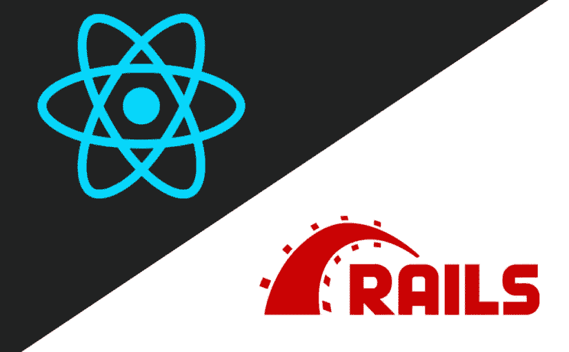

# 为反应元件提供导轨

> 原文：<https://itnext.io/serve-react-component-with-rails-67efa4b5785d?source=collection_archive---------4----------------------->



webgrinder.pl

使用 React 作为前端和 Rails 后端是一个惊人的组合。为此我使用了 [**react-rails**](https://github.com/reactjs/react-rails#use-with-asset-pipeline) gem，这是一个使用 react 和 rails 的灵活工具。

[*点击这里在 LinkedIn 上分享这篇文章*](https://www.linkedin.com/cws/share?url=https%3A%2F%2Fitnext.io%2Fserve-react-component-with-rails-67efa4b5785d)

# 与链轮资产管线一起使用

将`react-rails`添加到 gem 文件。

```
gem 'react-rails'
```

随后是以下命令

```
$ bundle install
$ rails g react:install
```

`react:install`生成器将自动在您的资产管道中包含 react JavaScript 库

```
**create** app/assets/javascripts/components 
**insert** app/assets/javascripts/application.js 
**create** app/assets/javascripts/components.js
**create** app/assets/javascripts/server_rendering.js
**create** config/initializers/react_server_rendering.rb
```

安装完成！

# 第一部分

我们需要做的第一件事是在 components 文件夹中建立一个 **jsx** 文件。

```
*// app/assets/javascripts/components/first.es6.jsx* class **FirstComponent** extends **React**.**Component**{ **constructor**(props, context) {
      super(props, context);
      this.state = { 
         name: props.name,
      };
   } **componentDidMount**(){} **render**() {
      return (
         <div>
            <h1>Hello: {this.state.name}</h1>
         </div>
      )
   }
}
```

> **阅读** : [反应组件生命周期](https://reactjs.org/docs/react-component.html#the-component-lifecycle)

# 服务器端渲染

要让 Rails 渲染 React 组件，有两种方法。

## 使用反应组件视图助手

在你的视图中使用`react_component`助手方法，即 *index.html.erb*

```
<%= react_component('FirstComponent', {name: 'John'}, {prerender: true}) %>
```

`react_component`是反应轨道的一部分。在本例中，它用于将 assets 目录下 components 文件夹中名为`FirstComponent`的组件放到视图中。

## 使用控制器动作

react-rails gem 允许我们创建一个呈现 react 组件的控制器动作。这消除了对 *html.erb* 模板的需要。

```
*# app/controllers/some_controller.rb*
**class** **SomeController** **<** ApplicationController
  **def** **index**
    render component: 'FirstComponent', props: { name: 'Jhon' }
  **end**
**end**
```

太好了！我们只是渲染我们的第一个组件。

# **结论**

使用 react-rails 可以使用嵌入式 ruby HTML 创建页面的一部分，使用 react 组件创建页面的另一部分。世界林业人员协会(Woodmen of the World)..

*(通过给别人*帮助别人找到我在 Medium 上的文章👏🏽*下图。)*