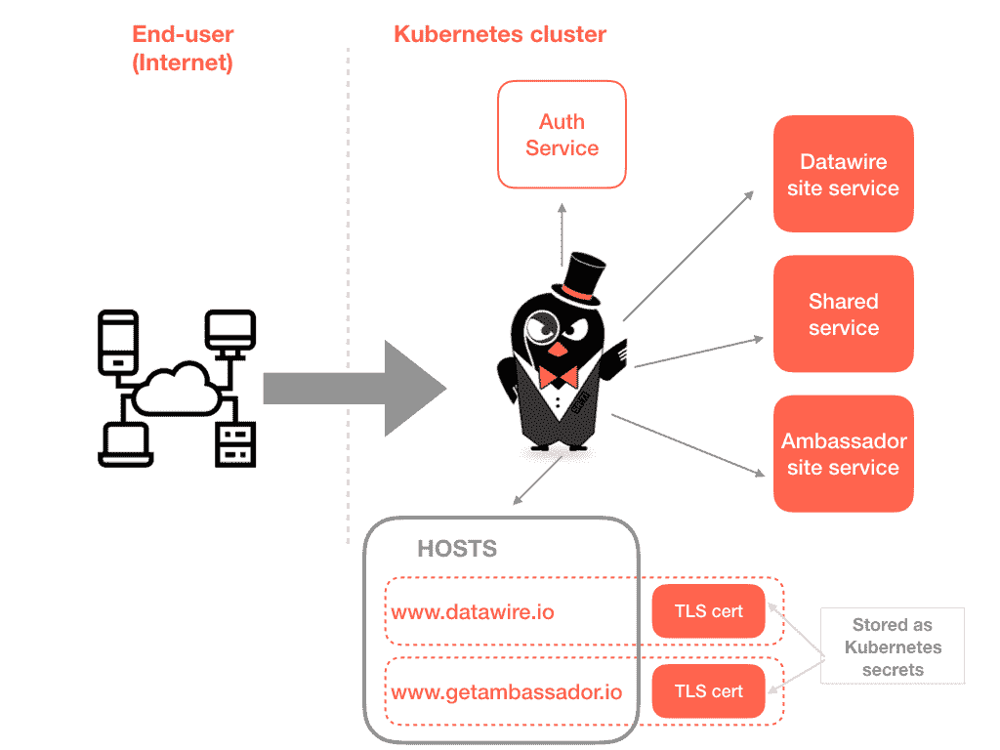

# 带大使的 Kubernetes 中的服务器名称指示(SNI)和入口 TLS

> 原文：<https://itnext.io/server-name-indication-sni-and-ingress-tls-in-kubernetes-with-ambassador-d3d796835ebe?source=collection_archive---------3----------------------->

开源大使 0.50 API 网关增加了对[服务器名称指示(SNI)](https://www.getambassador.io/user-guide/sni/) 的支持，这是一个社区非常需要的功能，允许从单个入口 IP 地址提供多个 TLS 证书的配置。在本教程中，我们将探讨多个安全域(例如， [https://www.datawire.io](https://www.datawire.io) 和[https://www . getambassador . io](https://www.getambassador.io))是如何实现的。)可以由 Kubernetes 集群中运行的单个或负载平衡的大使提供。

# SNI 用例

简而言之(感谢维基百科)， [SNI](https://en.wikipedia.org/wiki/Server_Name_Indication) 是 TLS 协议的一个扩展，它允许客户端在 TCP 握手过程开始时指出它试图连接到哪个主机名。这允许服务器在相同的 IP 地址和 TCP 端口号上呈现多个证书，这又使得能够提供多个安全网站或 API 服务，而不需要所有这些站点使用相同的证书。

对于那些过去配置过边缘代理和 API 网关的人来说，SNI 在概念上相当于 HTTP/1.1 基于名称的虚拟主机，但是对于 HTTPS 来说。

我们已经在 edge 代理/网关中讨论了许多有趣的 SNI 支持用例，其中既有开源的[用户，也有商业支持的](https://www.getambassador.io/)和[用户。](https://www.getambassador.io/pro/)

许多工程师正在运行 Kubernetes 集群，这些集群为最终用户提供多种后端服务，他们经常希望在提供多个主机名的同时提供安全的流量，例如，这允许轻松区分所提供的服务(如 www.datawire.io 和 api.dw.io)，并支持多个内部(web 可寻址)品牌的曝光，这些品牌共享来自单个集群的后端服务(如[www.fashion-brand-one.com](http://www.fashion-brand-one.com)和 [www.fashion-brand-two.com)。](http://www.fashion-brand-two.com).)



# 在大使中配置 SNI

[大使 SNI 文档](https://www.getambassador.io/user-guide/sni/)提供了一步一步的配置指南，还深入介绍了[入口 TLS 端接](https://www.getambassador.io/user-guide/tls-termination/)，但我在这里也提供了一个总结。

第一步是为每个所需的安全传输上下文创建一个 TLS 证书——通常这将涉及为每个顶级域生成一个证书——并将这些证书添加为 Kubernetes 机密(例如`datawire-site-secret`和`getambassador-site-secret`)。

接下来，创建一个`TLSContext`资源，并将这个配置应用到集群中:

```
---
apiVersion: v1
kind: Service
metadata:
  annotations:
    getambassador.io/config: |
    ---
    apiVersion: ambassador/v0
    kind: TLSContext
    name: datawire-site-context
    hosts:
    - [www.datawire.io](http://www.datawire.io)
    secret: datawire-site-secret
    ---
    apiVersion: ambassador/v0
    kind: TLSContext
    name: getambassador-site-context
    hosts:
    - [www.getambassador.io](http://www.getambassador.io)
    secret: getambassador-site-secret
  <snip>
```

请注意，如 [Ambassador TLS 文档](https://www.getambassador.io/reference/core/tls/)中所述，全局 TLS 配置可能需要在`tls`模块中更新，以便[将不安全的明文请求](https://www.getambassador.io/reference/core/tls/#redirecting-from-cleartext-to-tls)从端口 80 重定向到端口 443(其他功能，如[客户端认证](https://www.getambassador.io/reference/core/tls/#authentication-with-tls-client-certificates)也可以在此配置)。

TLS contexts 就绪后，现在可以指定主机和路由的大使映射，并通过主机链接到 TLS 上下文:

```
---
apiVersion: v1
kind: Service
metadata:
  annotations:
    getambassador.io/config: |
      ---
      apiVersion: ambassador/v0
      kind:  Mapping
      name:  datawire-website-mapping
      prefix: /
      service: datawire-site-service:80
      host: [www.datawire.io](http://www.datawire.io)
      ---
      apiVersion: ambassador/v0
      kind:  Mapping
      name:  getambassador-website-mapping
      prefix: /
      service: getambassador-site-service.org:80
      host: [www.getambassador.io](http://www.getambassador.io)
 <snip>
```

# 升级到大使 0.50 GA 和 SNI

Ambassador 0.50 GA 即将推出，一些额外的功能和架构变化(如支持 Envoy v2 APIs 和 ADS)需要进行一些与旧版本 Ambassador 不向后兼容的更改。我们鼓励您测试[发布候选版本](https://blog.getambassador.io/ambassador-0-50-rc5-available-9901d01c7a46)，阅读[发布文档](https://github.com/datawire/ambassador/blob/master/CHANGELOG.md)，并在将该版本部署到生产中之前验证您的用例(例如，通过冒烟测试和流量阴影)。

我们很高兴看到大使中包含 SNI 功能，因为这是一个受欢迎的功能请求。我们要感谢所有的贡献者和在 Datawire Slack 和 GitHub 库上讨论过这个特性的人。

[加入大使休闲频道](http://d6e.co/slack)了解 0.50 GA 发布的最新消息！