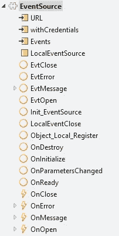
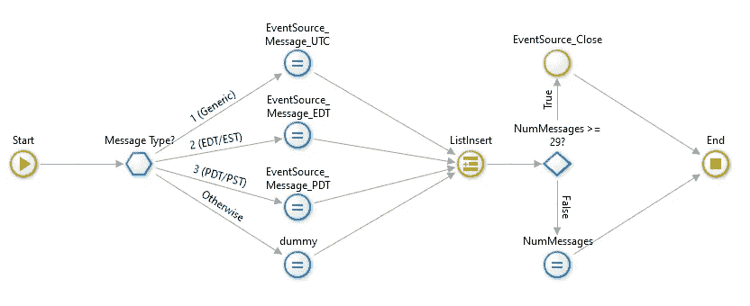
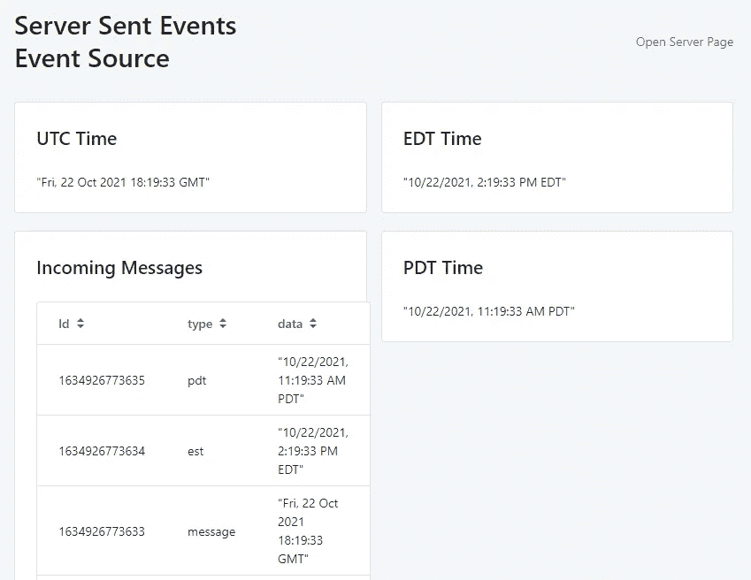
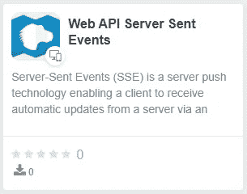
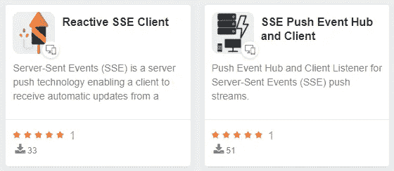
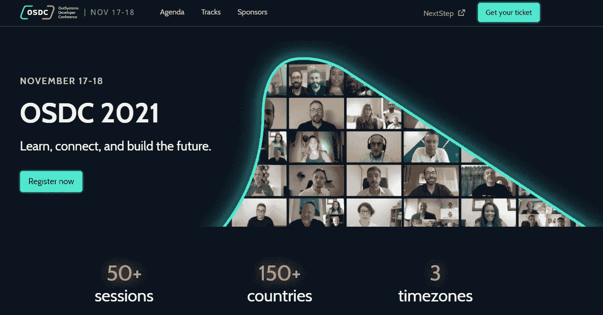

# 服务器发送的事件

> 原文：<https://itnext.io/server-sent-events-45b8da8f0d89?source=collection_archive---------1----------------------->

帕万·特里库塔姆在 [Unsplash](https://unsplash.com/s/photos/old-phone?utm_source=unsplash&utm_medium=referral&utm_content=creditCopyText) 上的照片

我们如何保持应用程序上的信息实时更新，而不需要不断轮询服务器？

围绕这个概念有几种技术，包括 WebSockets 或更复杂的协议，如 MQTT。

在这篇文章中，我们将探索一些已经在你的浏览器上可用的更简单的东西。

# 服务器发送的事件

浏览器 [Web API 服务器发送事件](https://developer.mozilla.org/en-US/docs/Web/API/Server-sent_events)有一个 EventSource JavaScript 接口，允许你订阅一个*文本/事件流*并将这些事件冒泡到你的 Web 应用中。

> 传统上，网页必须向服务器发送请求以接收新数据；也就是说，页面从服务器请求数据。使用服务器发送的事件，服务器可以通过向网页推送消息，随时向网页发送新数据。这些传入的消息可以被视为网页内的 [*事件*](https://developer.mozilla.org/en-US/docs/Web/API/Event) *+数据*。

## 接收事件

为了接收事件，您需要做的就是将 EventSource 对象指向*文本/事件流*页面的 URL，并为您感兴趣的事件类型实现监听器。

> **警告:**当**不在 HTTP/2** 上使用时，SSE 受到最大打开连接数的限制，这在打开多个标签页时会特别痛苦，因为每个浏览器的限制是*并且被设置为一个非常低的数字(6)。该问题在 [Chrome](https://bugs.chromium.org/p/chromium/issues/detail?id=275955) 和 [Firefox](https://bugzilla.mozilla.org/show_bug.cgi?id=906896) 中已被标记为“不会修复”。这个限制是针对每个浏览器+域的，这意味着您可以打开 6 个跨越所有选项卡到`www.example1.com`的 SSE 连接，以及另外 6 个到`www.example2.com`的 SSE 连接(根据 [Stackoverflow](https://stackoverflow.com/a/5326159/1905229) )。当使用 HTTP/2 时，服务器和客户端之间协商最大并发 *HTTP 流数量*(默认为 100)。*

## *发送事件*

*只有服务器可以发送事件，这不是双向的。*

*不仅 MIME 类型必须是 *text/event-stream* ，而且每个通知都是以一对换行符结束的文本块的形式发送的。*

*生成消息的 NodeJs 代码的简单示例如下所示:*

*如果你将浏览器直接指向这样一个页面，你会看到这样一个例子:*

*“事件:消息”或“事件:”代表相同的概念。如果您没有指定要订阅的内容，您将获得这些类型的消息，即没有事件或事件设置为“消息”的消息。*

*您可以订阅多个事件，例如示例中的“est”或“pdt”或两者。*

*不管你订阅什么，你总是会收到“消息”或未指定的事件。*

# *外部系统实现*

*在外部系统中实现这一点非常困难。*

*我们有一个带有几个参数的块，作为事件的源，以及订阅什么类型的事件，几个块事件将我们从 EventSource 收到的内容冒泡到我们的应用程序中。*

**

## *处理 JavaScript*

*我们实例化 EventSource，将事件侦听器映射到应用程序上的事件触发方法:*

*我们在 OnDestroy 上发布这些事件:*

# *演示应用程序*

*我想出了一个最简单但最没用的演示。*

*对于未指定的事件，服务器端将每秒发送一个 UTC 日期，还将发送一个“est”事件，日期为东部夏令时，最后发送一个“pdt”事件，日期为太平洋夏令时。*

*EventSource 块被设置为订阅我在 NodeJs 中完成的*文本/事件流*页面，我还想订阅“est”和“pdt”。*

**

*然后我们实现事件处理程序:*

**

*在消息处理程序上*

*结果是一个网页，实时显示服务器发送的日期事件。*

**

*[查看本页直播](https://rb-demos-dev.outsystemscloud.com/WebAPIServerSentEventsTDD/)*

# *应用程序*

*那么我们可以或应该在哪里使用它呢？*

*首先记住，这是一个单向的通信系统，从服务器到客户端，所以如果你需要两种方式，你最好使用 WebSockets，MQTT 或类似的。*

*QOS 无法控制客户端是否真的收到了消息，这基本上是一发了之的事情。*

*我确实看到了很多使用案例，在这些案例中，你希望你的网络应用程序实时获取绝对最新的信息。*

*你甚至可以只发送一个 ping，告诉应用程序有一些新的信息，所以去获取最新的。您可以在 ping 上发送足够的信息，以便应用程序只刷新发生了变化的内容(请记住 QOS)。*

*像往常一样，[组件](https://www.outsystems.com/forge/component-overview/11783/web-api-server-sent-events)和[演示](https://rb-demos.outsystemscloud.com/WebAPIServerSentEventsTDD/)可以在铁匠铺上找到，还有更多关于这个主题的内容。*

****

*现在您需要做的就是注册参加 OutSystems 开发者大会。*

**

*在这里注册[的](https://www.outsystems.com/nextstep/osdc/)*

*很明显，去开发一些应用程序。*